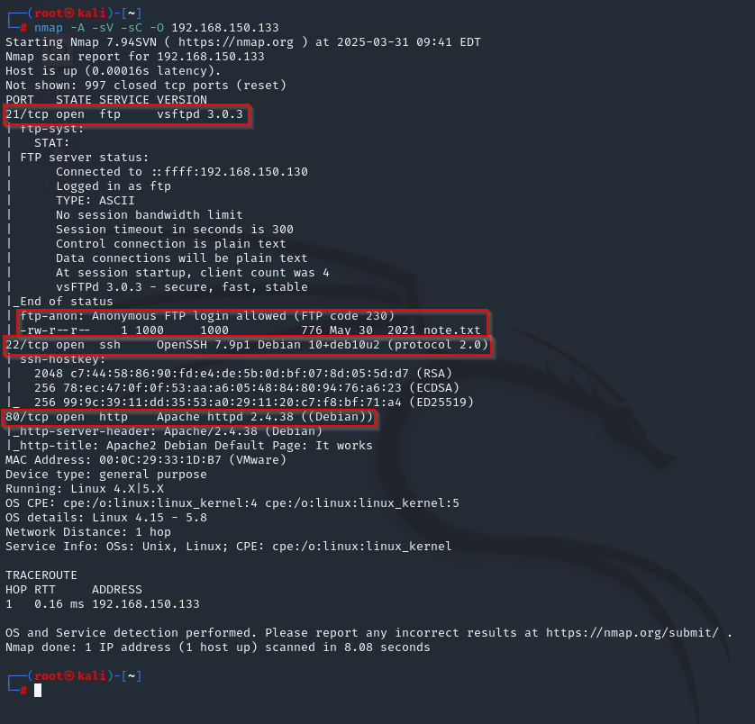
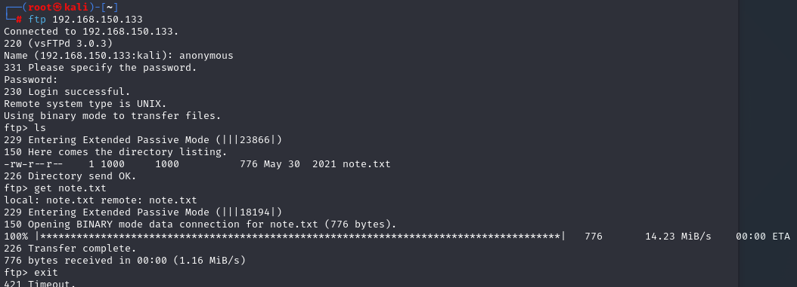
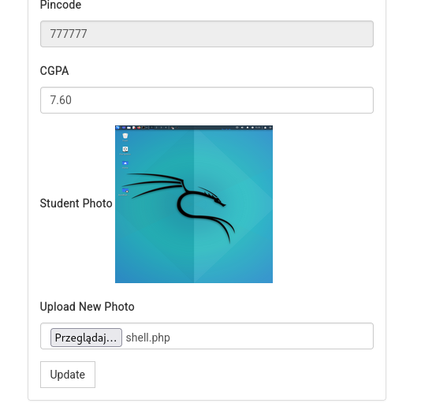
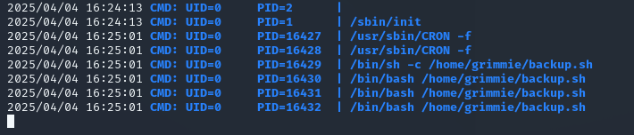

# Academy — Hack The Box

| | |
|---|---|
| **Platform** | Hack The Box |
| **Difficulty** | Easy |
| **OS** | Linux |
| **Status** | ✅ Retired |
| **Key techniques** | Anonymous FTP credential leak, unrestricted file upload, cron job hijacking |

---

## TL;DR

Academy's foothold comes from a file left on an anonymous FTP server that
hands over working application credentials outright. From there, a student
records app accepts a profile picture upload with no server-side validation
beyond the browser, giving code execution. Root comes from a classic
misconfiguration: a periodic backup script owned by an administrative user,
world-writable and runnable — replacing its contents is enough.

---

## Recon & Enumeration

```bash
nmap -A -sV -sC -O <TARGET_IP>
```



FTP (21, anonymous login allowed), SSH (22), HTTP (80). Anonymous FTP is
always worth checking first — it costs nothing and regularly holds exactly
this kind of leftover file:

```bash
ftp <TARGET_IP>
# anonymous / anonymous
get note.txt
```



`note.txt` contained a student registration number and a password hash.
Directory fuzzing on the web app in parallel confirmed an `/academy` login
page tied to that same registration-number field.

---

## Foothold / Initial Access

The hash from FTP identified as MD5 and cracked quickly:

```bash
hashcat -m 0 -a 0 -o cracked.txt hash.txt /usr/share/wordlists/rockyou.txt
```

That gave a working login to the student portal. The portal let a student
update their own record, including uploading a profile picture — a feature
that only enforced a `.jpg`-style check client-side. Uploading a PHP reverse
shell instead of an image executed on upload, landing a `www-data` shell.



```bash
nc -nvlp 1234
```

---

## Privilege Escalation

Ran `linpeas.sh` (served over a local HTTP server, pulled with `wget`) to
surface anything obviously misconfigured rather than manually walking every
possible vector. It flagged `/var/www/html/academy/includes/config.php` as
containing database credentials:

```bash
cat /var/www/html/academy/includes/config.php
```

That file held a plaintext password for a SQL account, `grimmie` — and
password reuse meant it also worked over SSH:

```bash
ssh grimmie@<TARGET_IP>
```

`grimmie` had no direct `sudo` rights, but their home directory contained
`backup.sh`. Checking `crontab -l` showed nothing for the user directly, but
running **pspy** (to watch scheduled activity without needing root) revealed
the script was being executed periodically as a higher-privileged user
regardless. Since I could write the script myself, replacing its contents
with a reverse shell one-liner and waiting for the next execution window


delivered a shell in the target account's context. Root flag retrieved.

---

## Lessons Learned

- **Anonymous FTP deserves a full listing check on every box** — a leftover
  `note.txt` here was the entire foothold, no exploit needed.
- **Client-side-only upload validation is not validation** — any "only
  images allowed" check needs verification server-side, ideally by content
  inspection, not just an extension check.
- **A world-writable script executed by cron is root**, regardless of how
  ordinary it looks — `backup.sh` was never meant to be an attack vector, but
  its permissions made it one.
- **`pspy` is the right tool when `crontab -l` shows nothing** — a user's own
  crontab isn't the only place scheduled execution can hide.

---

## Remediation

- Disable anonymous FTP unless there's a specific, reviewed reason to allow
  it, and never leave credential-bearing files reachable through it.
- Validate uploads server-side by content (magic bytes/MIME), not by
  filename extension, and store uploads outside the web root when possible.
- Audit script permissions for anything invoked by cron or a scheduled task —
  the invoking user's identity is only as safe as the script's write
  permissions.

---

**Machine:** [Hack The Box — Academy](https://www.hackthebox.com/machines/academy)
