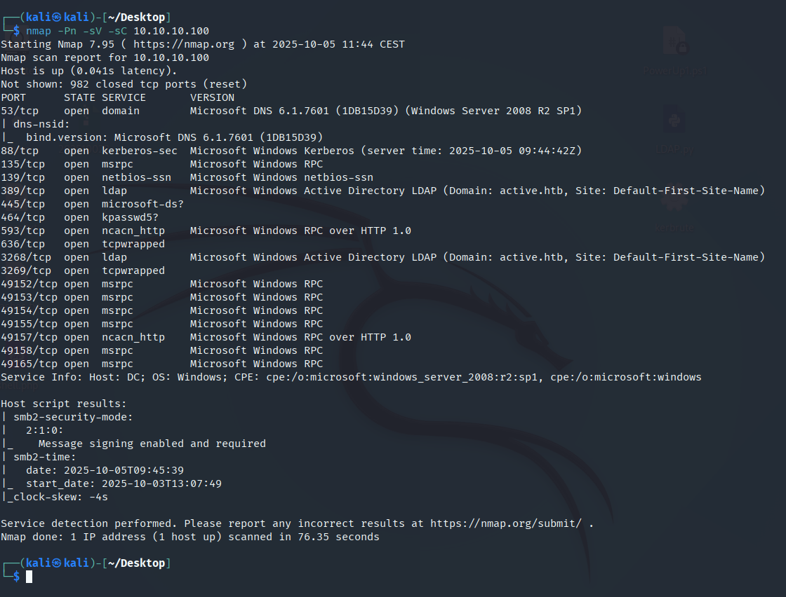
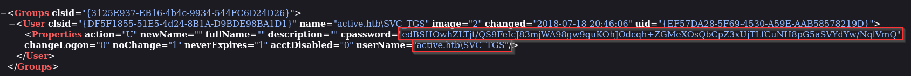
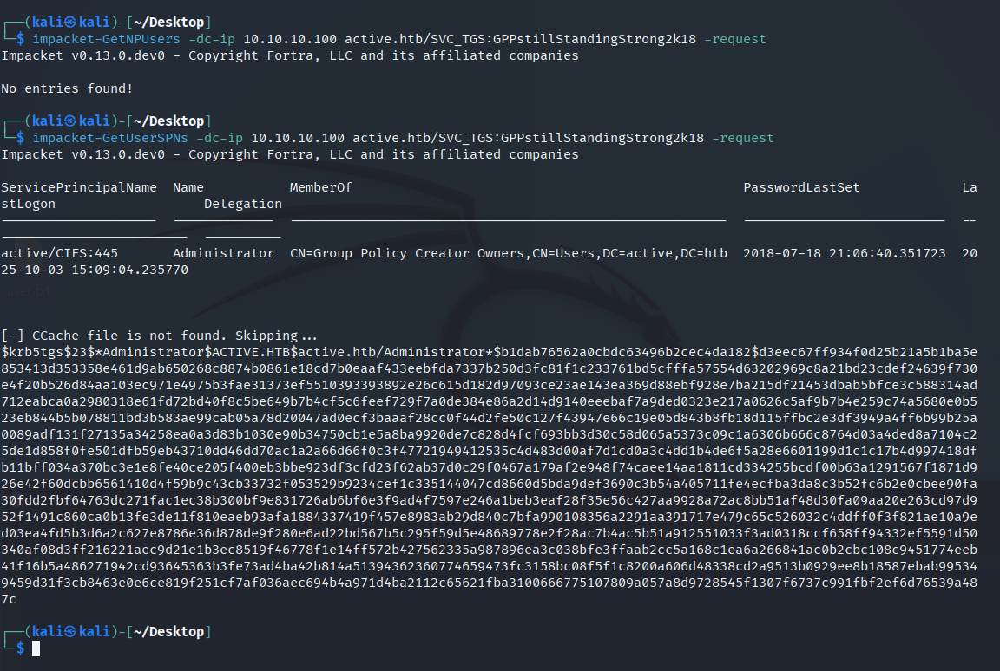

# Active — Hack The Box

| | |
|---|---|
| **Platform** | Hack The Box |
| **Difficulty** | Easy |
| **OS** | Windows (Active Directory) |
| **Status** | ✅ Retired |
| **Key techniques** | GPP `cpassword` decryption, Kerberoasting |

---

## TL;DR

Active demonstrates two credential-storage mistakes from very different eras of
Windows administration. An anonymously-readable SMB share exposes a Group
Policy Preferences file whose encrypted `cpassword` field has a publicly known
decryption key — instant credentials. Those credentials are just strong enough
to reach a Kerberoastable service account, whose weak password cracks offline
and hands over Domain Admin.

---

## Recon & Enumeration

```bash
nmap -Pn -sV -sC 10.10.10.100
```



LDAP (389) and SMB (445) — an Active Directory box. SMB allowed an anonymous
connection, and enumerating shares turned up a `Replication` share with
read-only anonymous access. A `Replication` share is a strong signal on its
own: it's how SYSVOL replication data gets exposed, and SYSVOL is exactly
where Group Policy configuration — including Group Policy Preferences — lives.

---

## Foothold / Initial Access

Browsing the share turned up a `Groups.xml` file — a Group Policy Preferences
artifact. GPP files can define local accounts, and older configurations often
embedded a password in a `cpassword` attribute. Microsoft intended this to be
"encrypted," but published the AES key needed to decrypt it back in 2012 once
the design flaw was disclosed — meaning any `cpassword` anyone finds today is
just as good as plaintext:

```bash
gpp-decrypt <cpassword-blob>
```



This recovered credentials for `SVC_TGS`. Rechecking shares with that account
opened up a `Users` share containing the user flag.

---

## Privilege Escalation

With a real domain account, the next question is always the same: what can it
reach? I checked for AS-REP Roastable accounts first (`GetNPUsers` — no
account required to guess a password), but none were vulnerable. Kerberoasting
was next:

```bash
impacket-GetUserSPNs -dc-ip 10.10.10.100 active.htb/SVC_TGS:<PASSWORD> -request
```

The **Administrator** account itself had a registered SPN — meaning it was
Kerberoastable — and returned a TGS hash for offline cracking:

```bash
hashcat -m 13100 hash.txt /usr/share/wordlists/rockyou.txt
```



The password fell to the wordlist, giving Administrator credentials directly.
From there, SMB access to `C$` and an Impacket `psexec` session confirmed full
compromise and retrieved the root flag.

---

## Lessons Learned

- **GPP `cpassword` is not encryption** — the decryption key has been public
  since 2012. Any GPP-managed password should be treated as compromised the
  moment it's found on a share.
- **A readable `Replication` share is worth checking on every AD box** — it's
  a direct line into SYSVOL and anything GPP has ever stored there.
- **Kerberoasting the Administrator account itself is a real possibility** —
  service accounts aren't the only Kerberoastable targets; check every
  account with a registered SPN.

---

## Remediation

- Remove all GPP-based password configurations; Microsoft deprecated this
  feature for exactly this reason (MS14-025). Rotate any credential ever
  distributed this way.
- Restrict anonymous access to SYSVOL/replication-related shares.
- Set long, random passwords on any account with an SPN, and monitor for
  Kerberoasting activity (a burst of TGS requests for multiple SPNs).

---

**Machine:** [Hack The Box — Active](https://www.hackthebox.com/machines/active)
