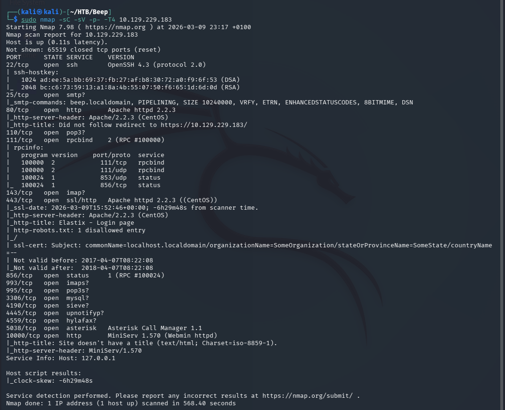
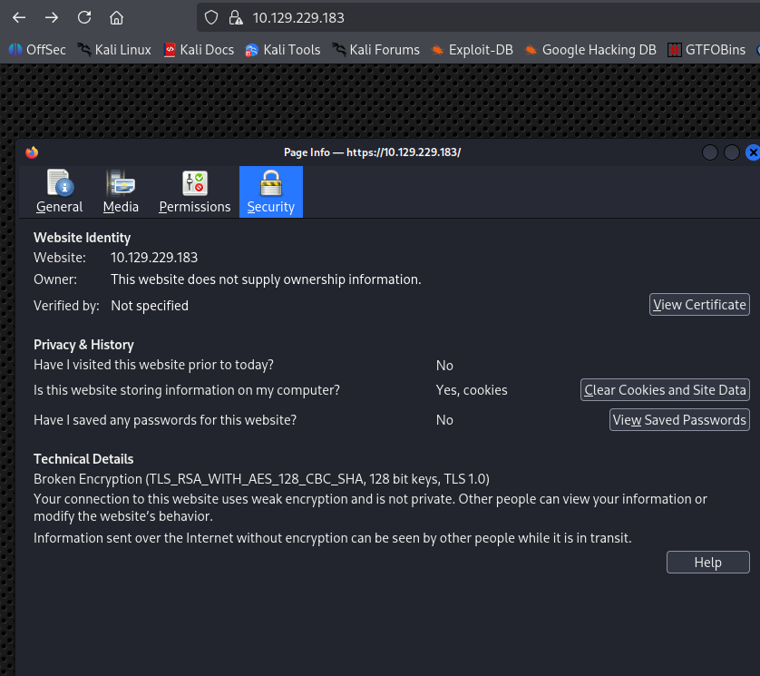
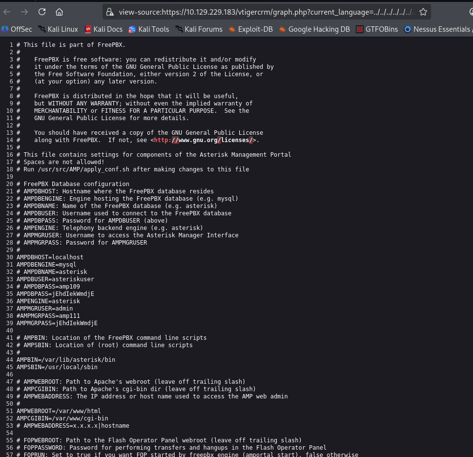

# Beep — Hack The Box

| | |
|---|---|
| **Platform** | Hack The Box |
| **Difficulty** | Easy |
| **OS** | Linux |
| **Status** | ✅ Retired |
| **Key techniques** | TLS downgrade to reach a legacy web app, Elastix LFI (config disclosure), credential reuse |

---

## TL;DR

Beep exposes a large VoIP/PBX (Elastix) stack, and the actual attack surface
only becomes reachable after working around a browser-side TLS restriction.
A known LFI in Elastix leaks a configuration file containing the system's
administrative password directly, and that single password turns out to be
reused across the web admin panel, the SSH root account, and effectively the
whole box.

---

## Recon & Enumeration

```bash
nmap -sC -sV -p- -T4 10.129.229.183
```



A wide service list: SSH, SMTP, HTTP, RPC, HTTPS, and a web-admin port
(10000). The HTTPS site initially refused to load — not a network issue, but
a modern browser's minimum TLS version rejecting the box's old TLS 1.0
configuration. Confirmed with a raw check:

```bash
openssl s_client -connect 10.129.229.183:443 -tls1
```



Lowering the browser's minimum accepted TLS version (`security.tls.version.min`
in Firefox) restored access to the site — a reminder that "the page won't
load" isn't always a dead end; sometimes the client is the thing being too
strict, not the target being unreachable.

---

## Foothold / Initial Access

The site was **Elastix**, and a version check matched a known **Local File
Inclusion** vulnerability (Exploit-DB 37637) in Elastix 5.3.0/5.4.0. The PoC
is a single crafted URL that path-traverses into `/etc/amportal.conf` — the
Elastix/Asterisk configuration file, which stores administrative credentials
in plaintext:

```
https://<TARGET_IP>/vtigercrm/graph.php?current_language=../../../../../../../..//etc/amportal.conf%00&module=Accounts&action
```



The leaked password worked immediately on the **Webmin** admin interface
(port 10000) as `root` — Webmin's root login is, by design on this box, tied
to the system root account. Since administrative passwords are so often
reused across every service on a box, the same password was tried directly
over SSH:

```bash
ssh -oKexAlgorithms=+diffie-hellman-group14-sha1 -oHostKeyAlgorithms=+ssh-rsa root@10.129.229.183
```

(The extra SSH options were needed purely because the box's SSH daemon is old
enough to have dropped algorithms modern clients no longer offer by default.)
This landed directly as root — both flags retrieved in the same step.

---

## Lessons Learned

- **A refused HTTPS connection can be a client-side TLS-version restriction,
  not a dead target** — checking with `openssl s_client` before giving up on
  a port is worth the ten seconds.
- **LFI vulnerabilities in VoIP/PBX suites like Elastix are a direct path to
  configuration files holding real credentials** — these systems store a
  surprising amount of plaintext secrets in predictable file locations.
  Credential reuse across a webmail login, an admin panel, and root SSH.
- **A password recovered once is worth trying everywhere** — it's often the
  fastest route past several "separate" barriers that turn out not to be
  separate at all.

---

## Remediation

- Retire outdated VoIP/PBX software (Elastix reached end-of-life years ago);
  where legacy systems must run, isolate them from general network access.
- Never store administrative credentials in a plaintext configuration file
  reachable via any web-facing path.
- Enforce unique passwords per service/account — a single leaked credential
  should not compromise an entire host.

---

## Tools used

- `nmap`
- `openssl s_client`
- Elastix LFI (Exploit-DB 37637)
- `ssh`

---

**Machine:** [Hack The Box — Beep](https://www.hackthebox.com/machines/beep)
