# Blackfield — Hack The Box

<p align="left">
  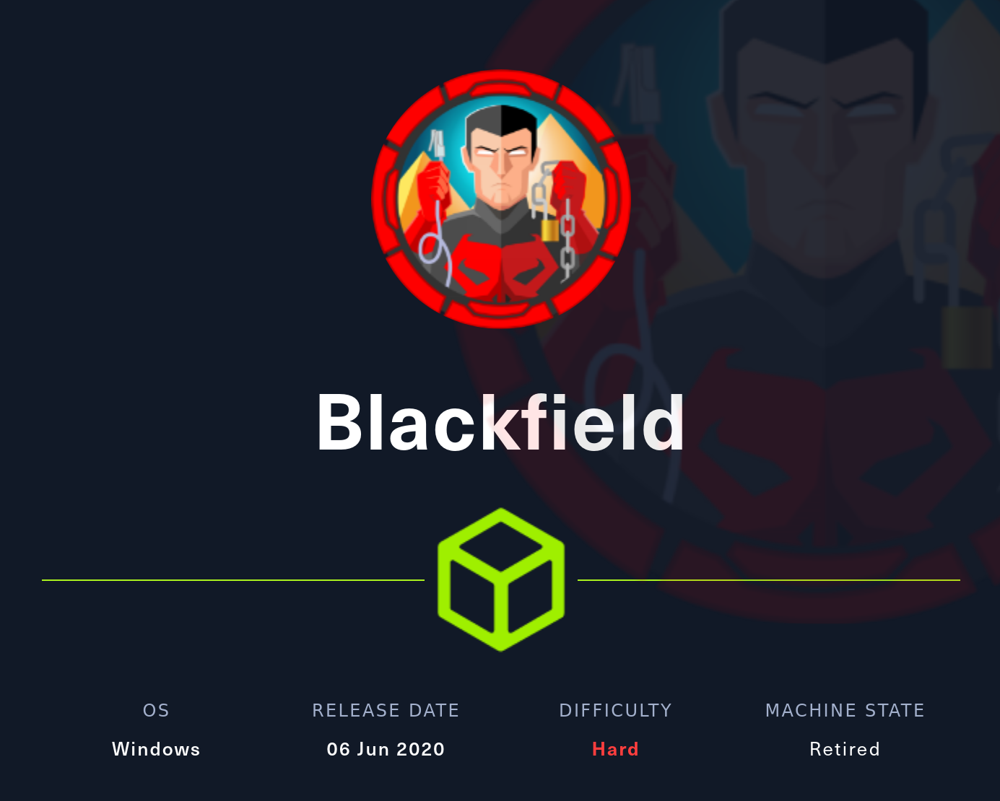
</p>

| | |
|---|---|
| **Platform** | Hack The Box |
| **Difficulty** | Hard |
| **OS** | Windows (Active Directory) |
| **Status** | ✅ Rooted |
| **Key techniques** | Anonymous SMB user enum, AS-REP Roasting, `ForceChangePassword` via `net rpc`, LSASS dump analysis with **pypykatz**, `SeBackupPrivilege` → NetExec `backup_operator` module |

---

## TL;DR

Blackfield gives up a full domain compromise through five clean AD
primitives stacked on top of each other:

1. Anonymous read of the `profiles$` SMB share leaks the user list from
   folder names.
2. That list feeds `GetNPUsers.py` — `support` has `DONT_REQ_PREAUTH`,
   so an AS-REP hash pops out and cracks in seconds.
3. BloodHound shows `support` has `ForceChangePassword` on `audit2020`,
   so `net rpc password` resets `audit2020` without ever knowing its
   old password.
4. `audit2020` unlocks the `forensic` share, which contains a zipped
   **`lsass.DMP`** memory dump. `pypykatz` parses it offline and
   returns NT hashes for `svc_backup` and (misleadingly) the local
   **DSRM** `Administrator`.
5. `svc_backup` is a Backup Operator with `SeBackupPrivilege`. Instead
   of the manual `reg save` dance, NetExec's `backup_operator` module
   dumps `SAM`/`SYSTEM`/`SECURITY` remotely and pulls the **domain**
   Administrator's cleartext password straight out of it.

Along the way the box hands out three different Administrator
credentials — a great illustration of why "I have an Administrator
hash" is not the same as "I have Domain Admin".

---

## Recon

```bash
nmap -p- --min-rate=5000 -oA blackfield 10.10.10.192
nmap -p 53,88,135,389,445,593,3268,5985 -sCV -oA blackfield-scripts 10.10.10.192
```

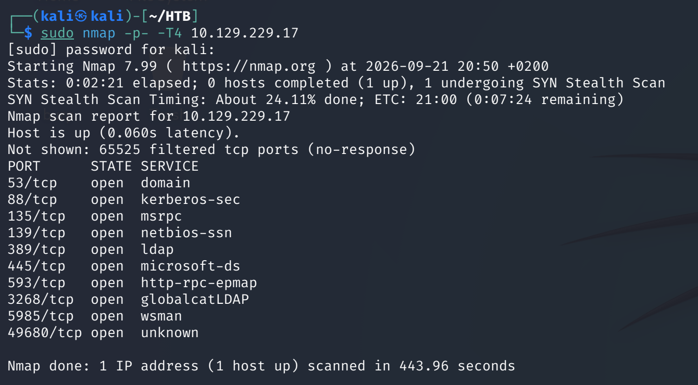
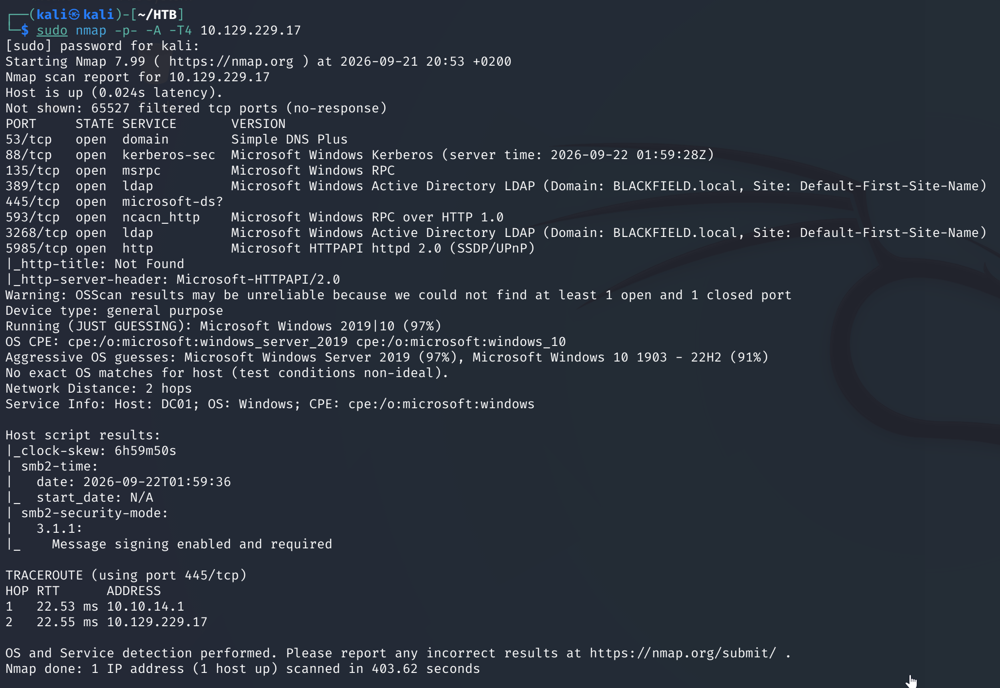

Domain controller for `BLACKFIELD.local` — SMB, LDAP, Kerberos and
WinRM. Textbook AD attack surface.

---

## Anonymous SMB — the user list

Guest / null SMB enumeration exposes `profiles$`:

```bash
smbclient -N -L //10.10.10.192
smbclient -N //10.10.10.192/profiles$
```

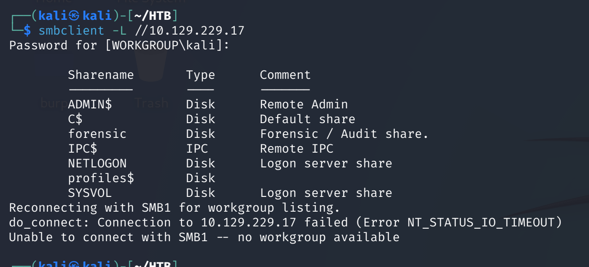

Inside `profiles$`, every domain user has an empty folder named after
their SAM name — a **free user list**, no credentials required.

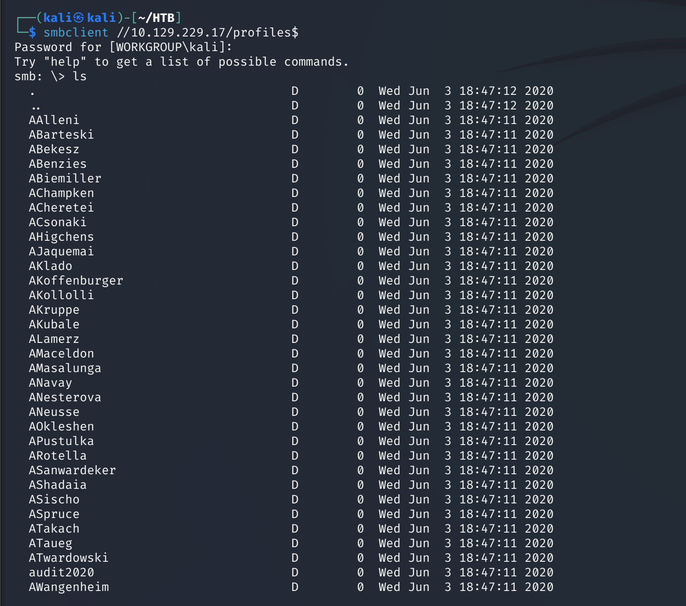

I dumped the listing and cleaned it into a plain wordlist:

```bash
smbclient -N //10.10.10.192/profiles$ -c 'ls' \
  | awk '{print $1}' | sed '/^\.$\|^\.\.$\|^$/d' > users.txt
wc -l users.txt
```

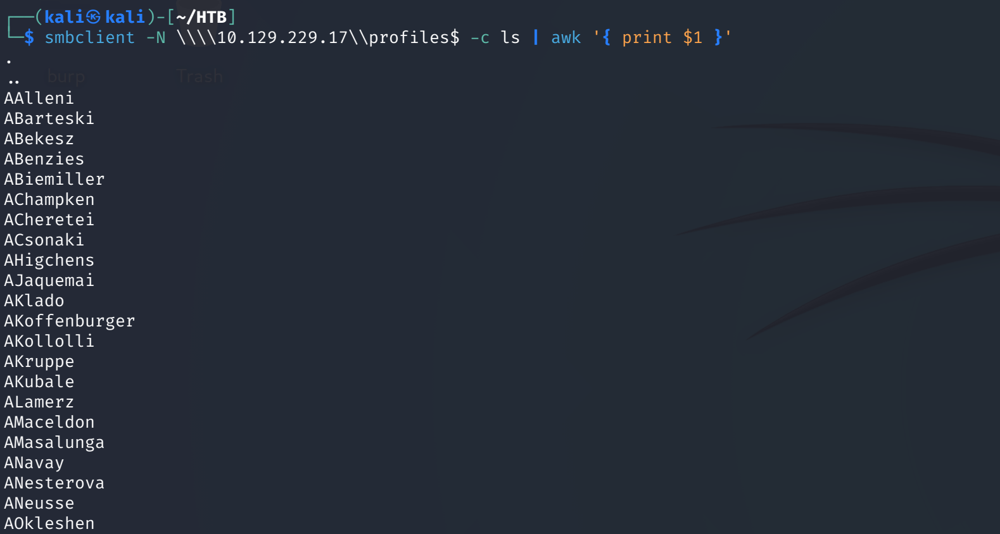

---

## AS-REP Roasting — `support`

With a real user list, the fastest first swing at a DC is
`GetNPUsers`: it asks the KDC for an AS-REP for each user, and any
account with **`DONT_REQ_PREAUTH`** gives back a `krb5asrep$23$...`
hash that's crackable offline.

```bash
impacket-GetNPUsers blackfield.local/ -no-pass \
  -usersfile users.txt -format hashcat -outputfile asrep.hash
```

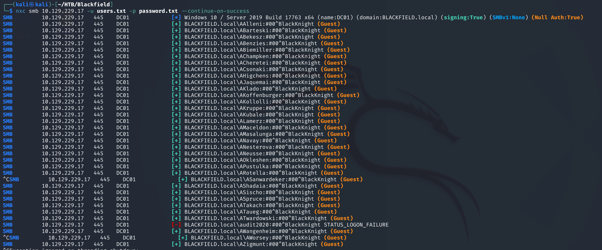

One user — **`support`** — coughs up a hash:

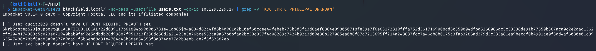

Hashcat mode `18200` + `rockyou`:

```bash
hashcat -m 18200 asrep.hash /usr/share/wordlists/rockyou.txt
```

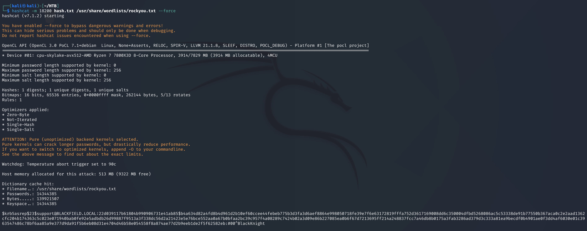

Password: `#00^BlackKnight`. Confirmed with `nxc`:

```bash
nxc smb 10.10.10.192 -u support -p '#00^BlackKnight'
```

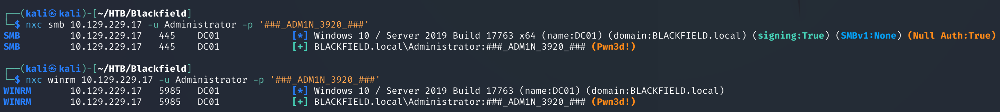

---

## BloodHound — `ForceChangePassword` on `audit2020`

Now that I can authenticate, I collected with `bloodhound-python`:

```bash
bloodhound-python -u support -p '#00^BlackKnight' \
  -d blackfield.local -c All -ns 10.10.10.192
```

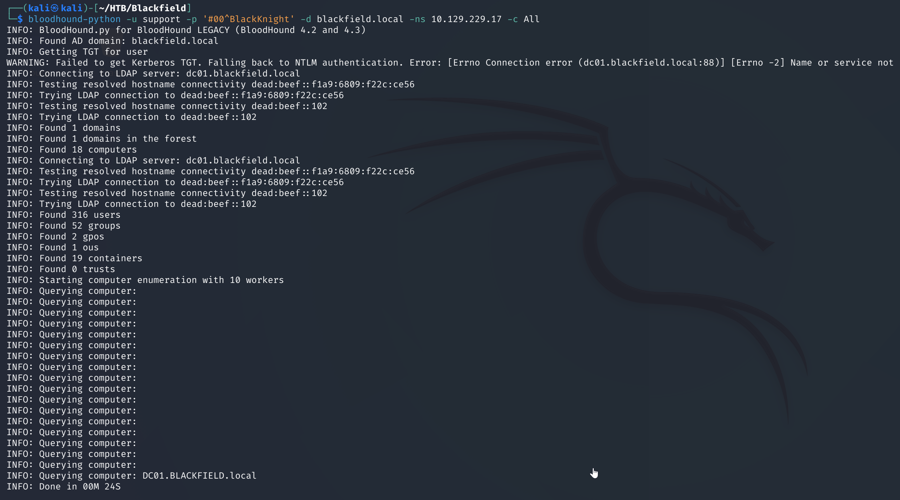

Marking `support` as owned and running "Shortest paths from owned"
lights up `SUPPORT@BLACKFIELD.LOCAL` → **`ForceChangePassword`** →
`AUDIT2020@BLACKFIELD.LOCAL`:


`ForceChangePassword` (aka "User-Force-Change-Password" extended
right) lets `support` **set** a new password for `audit2020` **without
knowing the current one**. `net rpc password` is the classic way to
abuse it from Linux:

```bash
net rpc password "audit2020" "NewPass123!" -U "blackfield.local"/"support"%'#00^BlackKnight' -S 10.10.10.192
```

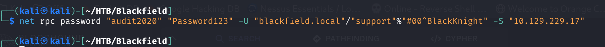


Ethical note: on a real engagement this is disruptive — you're
changing someone's password. Fine on retired HTB, but on client work
you'd coordinate a window and reset it back at the end.

---

## Forensic share — LSASS in a zip

With `audit2020` I can see a share that `support` couldn't:
**`forensic`**.

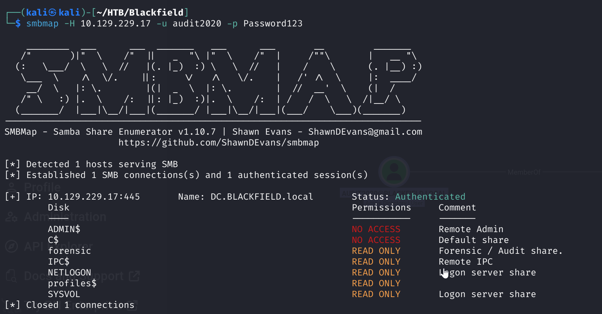
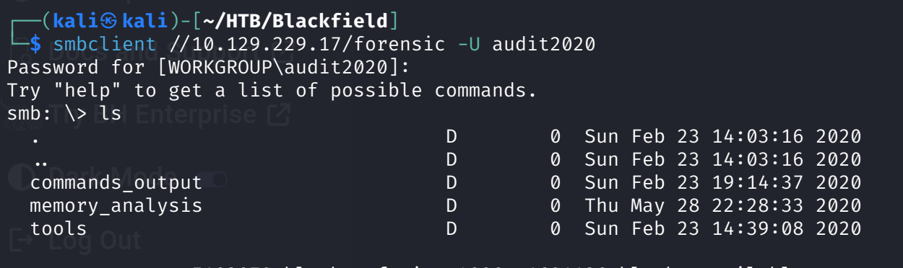

`memory_analysis/` contains a handful of `.zip` files, each a process
memory dump. The interesting one is obvious:

```bash
smbclient //10.10.10.192/forensic -U 'audit2020%NewPass123!' \
  -c 'cd memory_analysis; prompt OFF; recurse ON; mget *.zip'
```

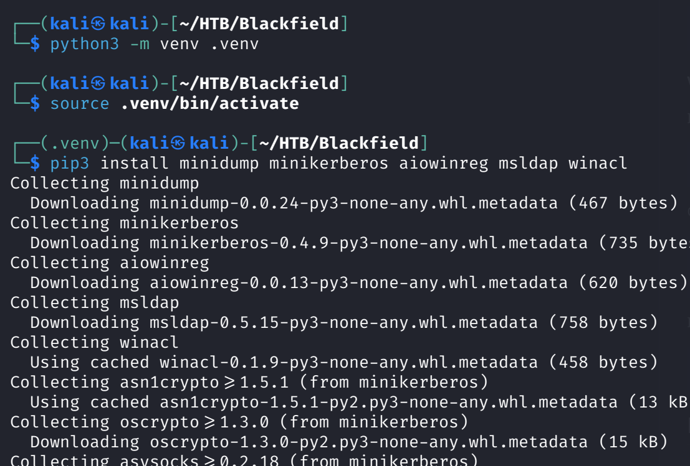
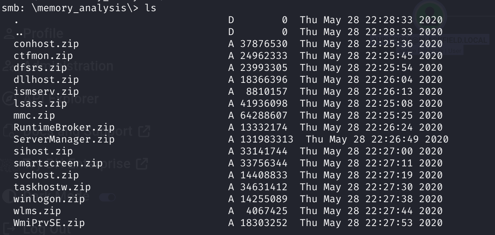

```bash
7z x lsass.zip
```

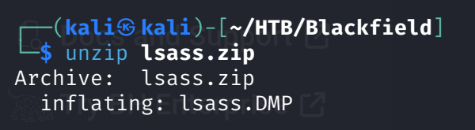

### pypykatz — mimikatz offline, in Python

I don't want to load Mimikatz on a live host if I don't have to.
`pypykatz` parses `lsass.DMP` **offline** in pure Python — same output,
no AV surface on the target:

```bash
pip install pypykatz
pypykatz lsa minidump lsass.DMP
```

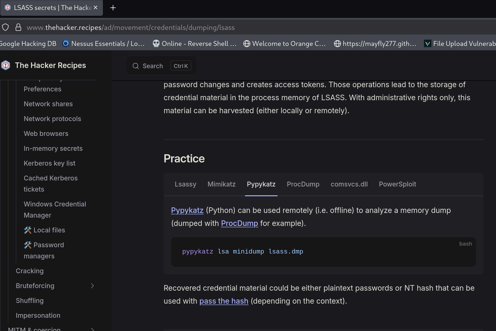
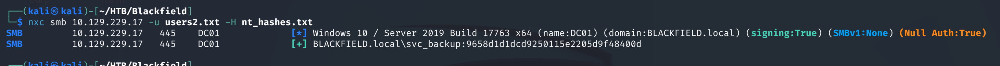
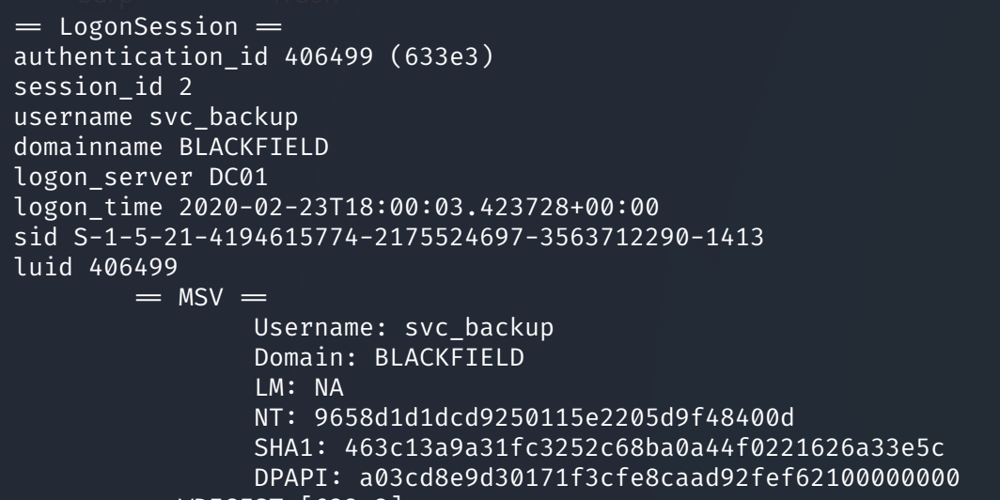

Two useful pieces of material fall out:

- **`svc_backup`** NT hash — a real domain service account.
- **`Administrator`** NT hash — but this is **the local DSRM
  Administrator**, not the domain one (see the "gotcha" section at
  the end). Don't waste time trying to PtH with it.

---

## Foothold as `svc_backup` (Pass-the-Hash)

`svc_backup` is in **Remote Management Users**, so evil-winrm accepts
its hash directly — no cracking needed:

```bash
evil-winrm -i 10.10.10.192 -u svc_backup -H <NT-hash>
```

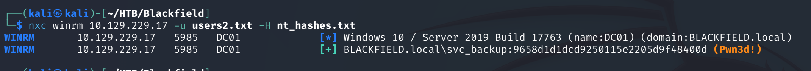
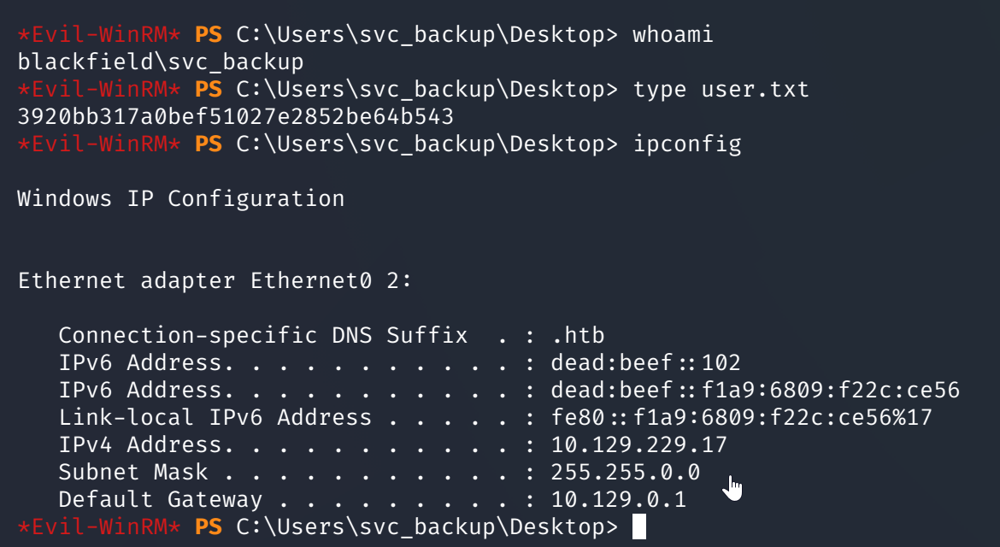

---

## Privilege Escalation — `SeBackupPrivilege`

`whoami /priv` on `svc_backup`:

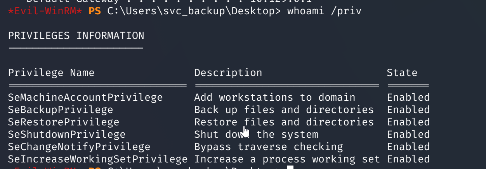

`SeBackupPrivilege` lets the holder read **any** file on the filesystem
regardless of ACLs — including the registry hives. That is enough to
walk off the DC with the SAM database and the LSA secrets.

### The manual way (works, but noisy)

For understanding, the canonical chain is:

```powershell
reg save hklm\sam  C:\Temp\sam
reg save hklm\system C:\Temp\system
reg save hklm\security C:\Temp\security
```

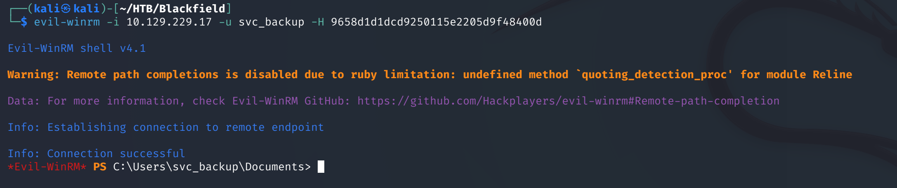
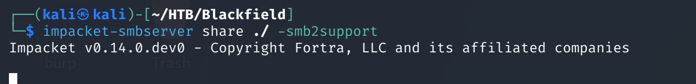
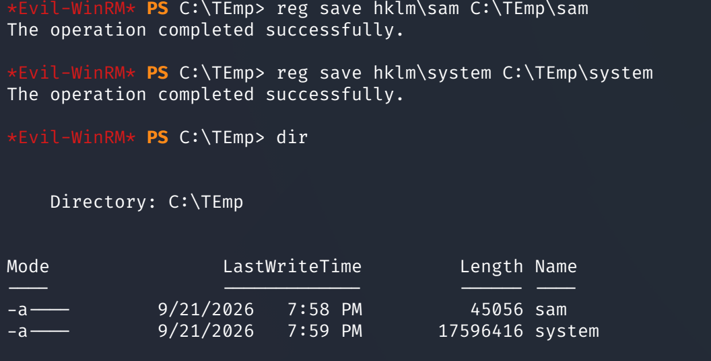
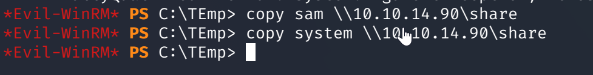

…then `impacket-secretsdump -sam sam -system system -security security LOCAL`
on my side. That returns local SAM hashes and cached LSA secrets — but
it's a lot of moving parts.

### The clean way — NetExec `backup_operator` module

NetExec has a **`backup_operator`** module that does the whole thing
remotely: it opens the WinReg service, saves `SAM`/`SYSTEM`/`SECURITY`
in memory, streams them back, and runs `secretsdump` against them —
one command, no files staged on the target:

```bash
nxc smb 10.10.10.192 -u svc_backup -H <NT-hash> -M backup_operator
```

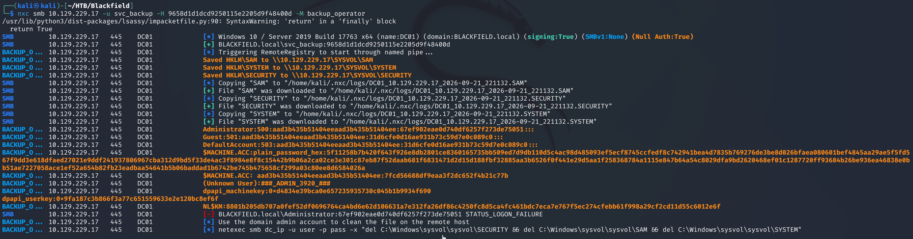

This is the "new for me" bit of the box, and it's what I'm keeping in
muscle memory. Same primitive (`SeBackupPrivilege` → registry hives),
one command instead of ten.

The dump surfaces the **domain** Administrator's **cleartext**
password (recovered from LSA secrets / cached credentials on the DC):

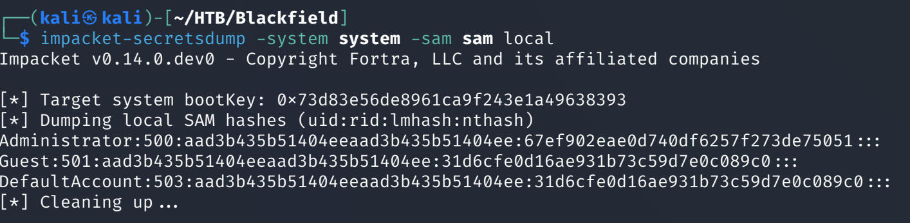
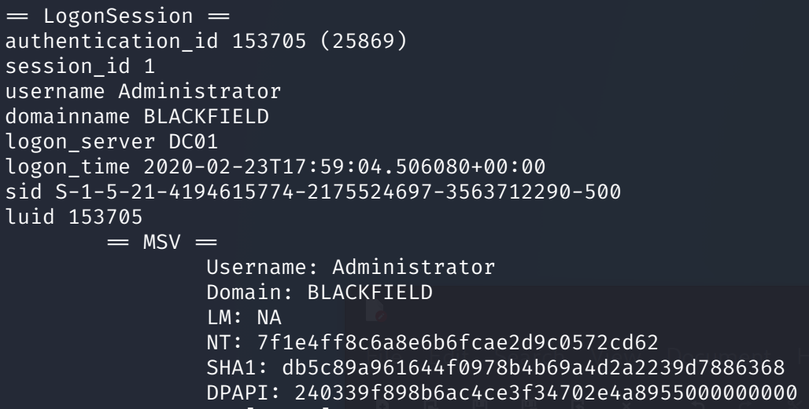

### Gotcha — three different Administrator credentials

Blackfield hands out three different "Administrator" credentials, and
this trips people up the first time they see it:

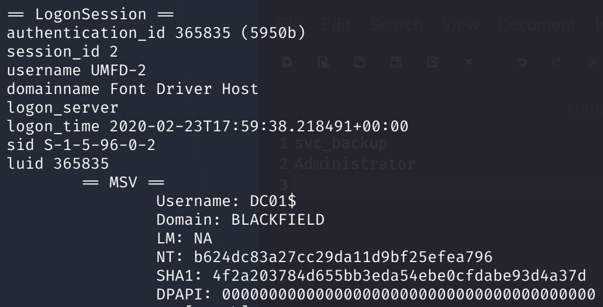

1. **Local DSRM `Administrator` NT hash** — from `pypykatz` on the
   LSASS dump. This is the Directory Services Restore Mode account
   baked into the DC's own SAM. It **only logs into the DC in DSRM /
   offline mode** by default — PtH against `\\dc01` as `Administrator`
   with this hash will fail against the domain.
2. **Domain `Administrator` NT hash** — from the LSA secrets dumped
   by `backup_operator`. This is the real Domain Admin.
3. **Domain `Administrator` cleartext password** — also surfaced by
   `backup_operator` (cached credential). Same account as #2.

The lesson: when a DC gives you an `Administrator` hash, always check
whether it came from the DC's local SAM (DSRM) or from the domain
account. They look identical in the output; only the source tells you
which one is which.

### Root

```bash
evil-winrm -i 10.10.10.192 -u Administrator -p '<cleartext>'
```

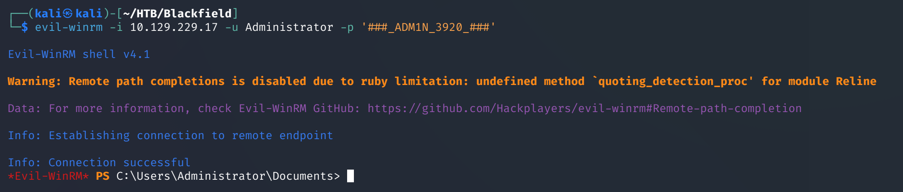
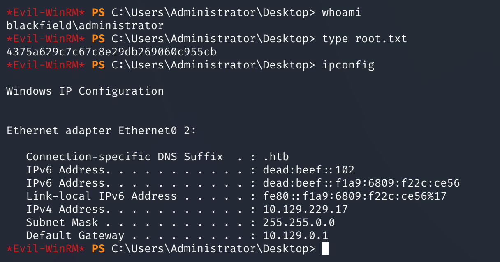

---

## Lessons Learned

- **Anonymous `profiles$` = free user list.** Any share with per-user
  folders is a wordlist waiting to be scraped; always try `smbclient
  -N` first, before you have any credentials.
- **AS-REP Roast the moment you have a user list.** It's cheap, it's
  passive from an auth point of view, and `DONT_REQ_PREAUTH` is still
  common on service and legacy accounts.
- **`ForceChangePassword` is an "instant" privilege escalation over
  the wire** — no old password needed. `net rpc password` (Linux) and
  `Set-DomainUserPassword` (PowerView) both work. Note the disruption
  on real engagements.
- **`pypykatz` beats loading Mimikatz on the box.** Downloaded
  `lsass.DMP` → offline analysis on Kali → zero AV noise on the
  target.
- **`SeBackupPrivilege` on a DC = domain compromise.** Learn the
  primitive (read any file), then automate the ceremony —
  **`nxc … -M backup_operator`** does the whole SAM/SYSTEM/SECURITY
  dance in one line.
- **DSRM ≠ Domain Administrator.** Always sanity-check where an
  `Administrator` hash came from before you burn time trying to PtH
  with it.

---

## Remediation

- Remove anonymous access to `profiles$` (and any share that leaks
  user, computer or group names by folder structure). Least
  privilege on file shares is not optional on a DC subnet.
- Disable `DONT_REQ_PREAUTH` on all accounts unless a legacy system
  genuinely requires it — treat it like `AS-REP roast me`.
- Audit `ForceChangePassword` / `User-Force-Change-Password` grants;
  any low-privilege account with this right over a higher-privilege
  account is a straight escalation path.
- Do not leave process memory dumps on network shares. LSASS in a zip
  on a Forensic share is a domain compromise waiting to happen.
- Restrict `SeBackupPrivilege` to Tier-0 accounts only; make Backup
  Operators effectively "Domain Admin" and treat them accordingly.

---

## Tools used

- `nmap`, `smbclient`
- `impacket-GetNPUsers`
- `hashcat` (mode 18200)
- `bloodhound-python` + BloodHound GUI
- `net rpc password`
- `7z`, **`pypykatz`**
- `evil-winrm`
- **NetExec** (`nxc smb -M backup_operator`)
- Impacket (`smbserver.py`, `secretsdump.py`) — for the manual walkthrough

---

**See also:** [Active Directory methodology](../../methodology/active-directory.md)

---

**Machine:** [Hack The Box — Blackfield](https://www.hackthebox.com/machines/blackfield)

**Also on GitHub:** [this write-up in my security portfolio (methodology & cheat sheets)](https://github.com/debasjan/security-portfolio/blob/main/writeups/hackthebox/blackfield.md)
