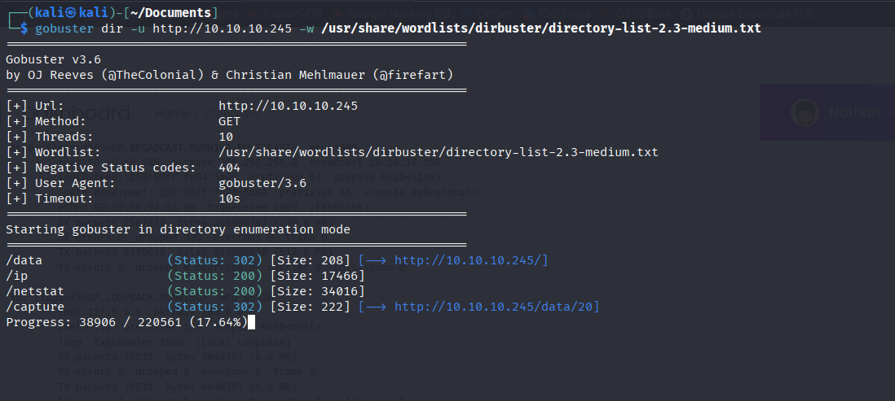
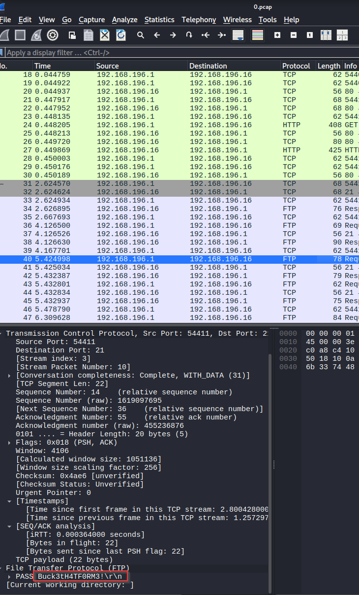
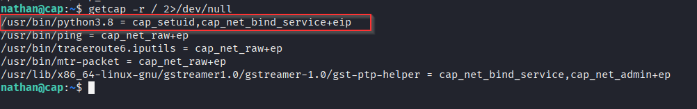

# Cap — Hack The Box

| | |
|---|---|
| **Platform** | Hack The Box |
| **Difficulty** | Easy |
| **OS** | Linux |
| **Status** | ✅ Retired |
| **Key techniques** | IDOR, packet-capture credential extraction, Linux capabilities (GTFOBins) |

---

## TL;DR

Cap runs a web app that lets users capture and download their own network
traffic — a feature that's only safe if access control actually checks whose
capture is being requested. It doesn't: an IDOR lets me pull another user's
`.pcap` file directly, and that capture contains a plaintext credential used
elsewhere on the box for SSH. From there, a misconfigured Linux capability on
the Python binary — instead of a SUID bit — provides a direct path to root.

---

## Recon & Enumeration

```bash
sudo nmap -A -Pn -p- -T4 10.10.10.245
```


Open: FTP (21), SSH (22), HTTP (80). Tried anonymous FTP first since it's
free to check — login failed, so attention shifted to the web app on port 80.

The site (served by Gunicorn) was a network-monitoring dashboard. Content
discovery surfaced two API-style endpoints:

```bash
gobuster dir -u http://10.10.10.245 -w <wordlist>
```



`/ip` and `/netstat` — both reflecting live system data back to the browser.
A dashboard that exposes raw system/network state is exactly the kind of app
worth checking for access-control gaps, since it implies some backend is
running privileged introspection commands on request.

---

## Foothold / Initial Access

The "Security Snapshots" section let a user download a capture of their own
traffic via a numbered `/data/<id>` path. Numbered, sequential resource IDs in
a URL are the textbook shape of an **IDOR** — if the app isn't checking that
the requesting user owns snapshot `N`, walking the ID space reads everyone's
data.

That was exactly the case here: requesting a different ID than the one just
generated returned another user's `.pcap` capture. Opening it in Wireshark
revealed a **plaintext credential for the user `nathan`**

 — someone had
captured (or been captured) authenticating in cleartext, and the "isolate
your own traffic" feature had just leaked it to me instead.

```bash
ssh nathan@10.10.10.245
```

The credential worked directly over SSH. Foothold as `nathan`, user flag
retrieved.

---

## Privilege Escalation

Skipped straight past SUID binaries to Linux **capabilities** — a
less-checked but increasingly common privesc vector, since capabilities give
a binary a specific elevated syscall permission without a full SUID bit:

```bash
getcap -r / 2>/dev/null
```



`python3.8` came back with an assigned capability that GTFOBins documents as
directly abusable — a capability that lets the binary set its own UID. That's
functionally a root shell one command away:

```bash
python3.8 -c 'import os; os.setuid(0); os.system("/bin/bash")'
```

Root shell obtained, root flag retrieved.

---

## Lessons Learned

- **Any endpoint that serves "your own" data by numeric ID needs an explicit
  ownership check** — otherwise it's an IDOR waiting to be walked.
- **A network capture *of the user logging in* is itself a credential leak.**
  If an app lets you capture traffic, cleartext-auth protocols anywhere on
  that network turn every capture into a potential credential dump.
- **`getcap -r /` deserves the same reflexive check as `find / -perm -4000`.**
  Capabilities are a quieter, less-audited SUID-equivalent, and GTFOBins
  covers them just as thoroughly.

---

## Remediation

- Enforce per-user authorization on every data-retrieval endpoint — never
  trust a client-supplied ID alone to scope access.
- Eliminate cleartext-credential protocols on any network segment where
  traffic capture is possible, and rotate any credential that may have
  traversed the wire unencrypted.
- Audit `getcap -r /` output as part of routine host hardening — remove
  capabilities from interpreters (Python, Perl, etc.) unless a specific,
  reviewed reason requires them.

---

**Machine:** [Hack The Box — Cap](https://app.hackthebox.com/machines/Cap/information)
