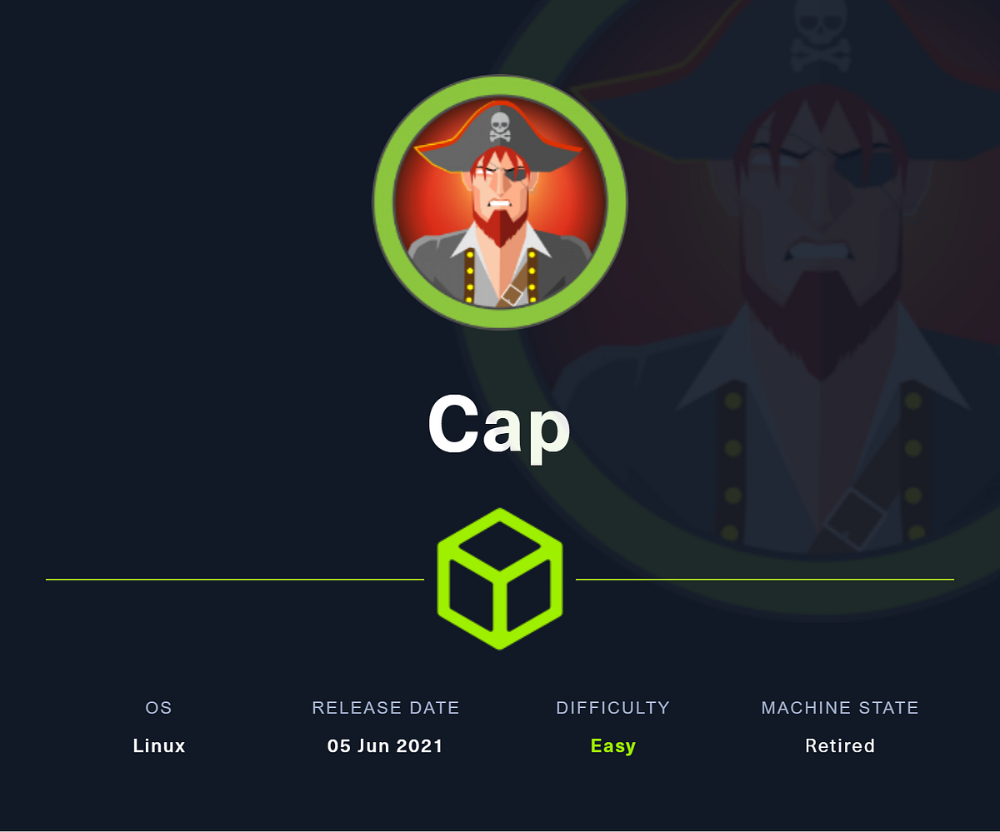
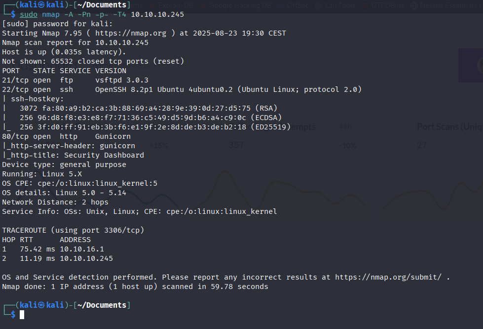
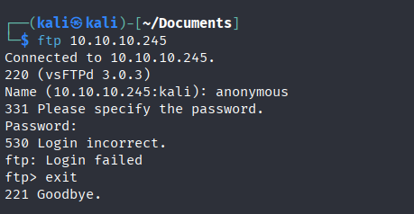
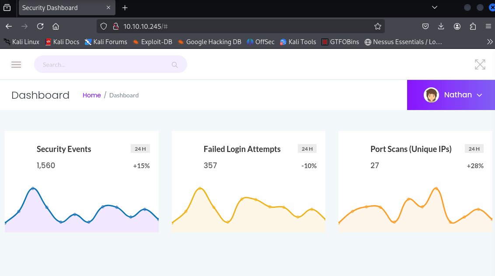
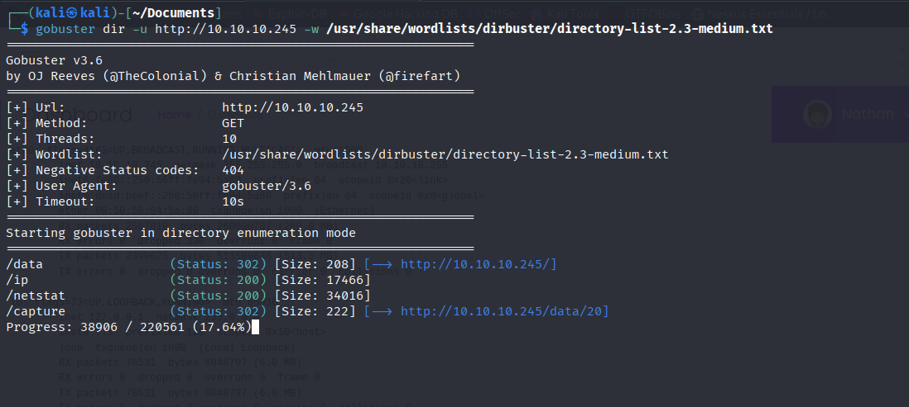
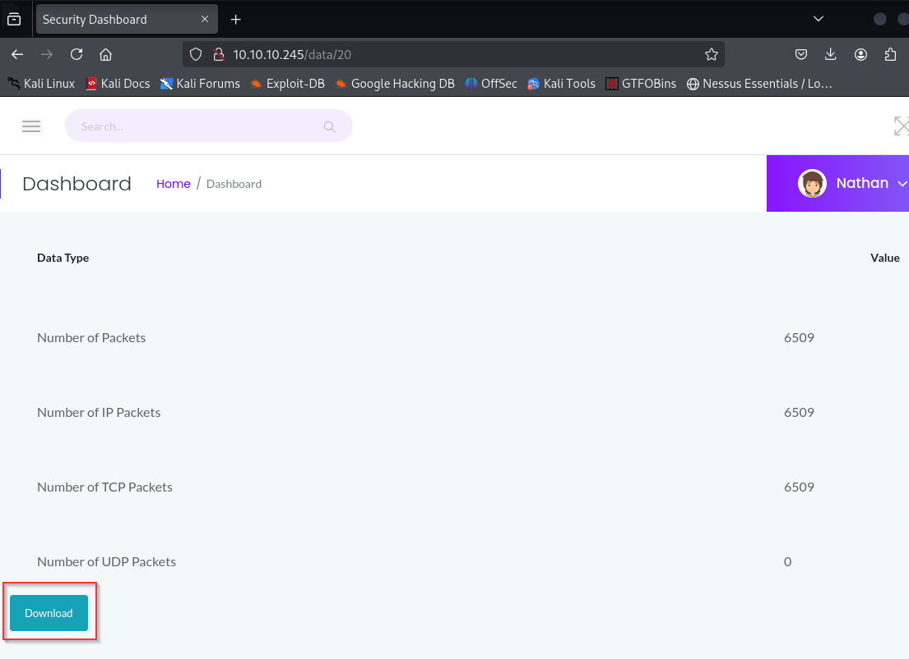
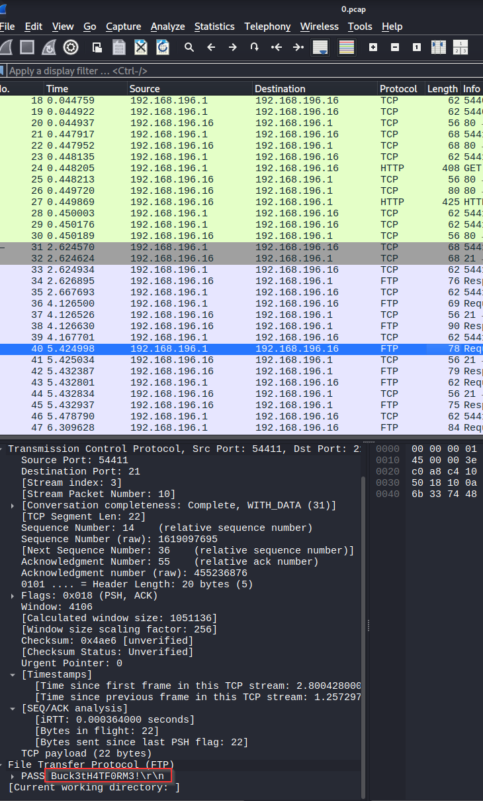
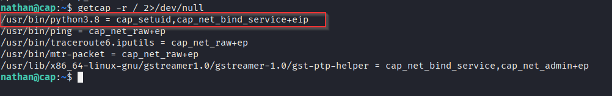
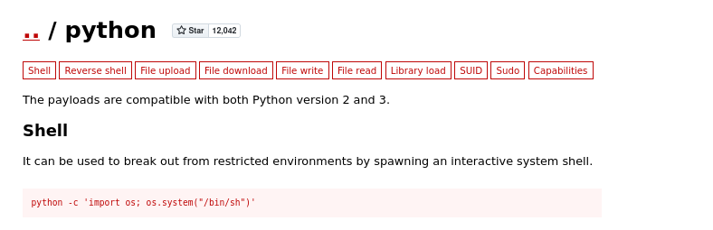

# Cap — Hack The Box

<p align="left">
  
</p>

| | |
|---|---|
| **Platform** | Hack The Box |
| **Difficulty** | Easy |
| **OS** | Linux |
| **Key techniques** | IDOR, packet-capture credential extraction, Linux capabilities (GTFOBins) |

---

## TL;DR

Cap runs a web app that lets users capture and download their own network
traffic — a feature that's only safe if access control actually checks
whose capture is being requested. It doesn't: an IDOR lets me pull
another user's `.pcap` file directly, and that capture contains a
plaintext credential used elsewhere on the box. A misconfigured Linux
capability on the Python binary — instead of a SUID bit — then provides a
direct path to root.

---

## Recon

```bash
sudo nmap -A -Pn -p- -T4 10.10.10.245
```



Open: FTP (21), SSH (22), HTTP (80). Started with FTP since it's free to
check:

```bash
ftp 10.10.10.245
```



Anonymous login failed, so moved on to the web app.

---

## HTTP

The site (served by Gunicorn) was a network-monitoring dashboard:



Ran gobuster for directory discovery:

```bash
gobuster dir -u http://10.10.10.245 -w /usr/share/wordlists/dirbuster/directory-list-2.3-medium.txt
```



`/ip` and `/netstat` reflected live system data back to the browser. In
the "Security Snapshots" section of the menu there was a `/data`
path with downloadable content — numbered captures a user could download
of their own traffic.

---

## Foothold / Initial Access

Numbered, sequential resource IDs in a URL are the textbook shape of an
**IDOR**. Requesting a different ID than the one just generated for me
returned someone else's capture instead of my own:



Opened the `.pcap` in Wireshark and found an FTP login captured in the
clear:



A plaintext credential for the user `nathan` — the "isolate your own
traffic" feature had just leaked someone else's login instead. Tried it
over SSH:

```bash
ssh nathan@10.10.10.245
```

Worked directly. Foothold as `nathan`, user flag retrieved.

---

## Privilege Escalation

Checked for SUID binaries first, nothing interesting. Moved on to Linux
**capabilities** — a less-checked but increasingly common privesc vector,
since capabilities give a binary a specific elevated syscall permission
without a full SUID bit:

```bash
getcap -r / 2>/dev/null
```



`/usr/bin/python3.8` had `cap_setuid,cap_net_bind_service+eip` assigned —
GTFOBins documents this exact capability as directly abusable, since a
binary that can freely call `setuid()` can just become root:



```bash
python3.8 -c 'import os; os.setuid(0); os.system("/bin/bash")'
```

Root shell obtained, root flag retrieved.

---

## Lessons Learned

- Any endpoint that serves "your own" data by numeric ID needs an
  explicit ownership check — otherwise it's an IDOR waiting to be walked.
- A network capture *of a user logging in* is itself a credential leak.
  If an app lets you capture traffic, cleartext-auth protocols anywhere
  on that network turn every capture into a potential credential dump.
- `getcap -r /` deserves the same reflexive check as `find / -perm
  -4000`. Capabilities are a quieter, less-audited SUID-equivalent, and
  GTFOBins covers them just as thoroughly.

---

## Remediation

- Enforce per-user authorization on every data-retrieval endpoint — never
  trust a client-supplied ID alone to scope access.
- Eliminate cleartext-credential protocols on any network segment where
  traffic capture is possible, and rotate any credential that may have
  traversed the wire unencrypted.
- Audit `getcap -r /` output as part of routine host hardening — remove
  capabilities from interpreters (Python, Perl, etc.) unless a specific,
  reviewed reason requires them.

---

## Tools used

- `nmap`
- `ftp`, `ssh`
- `gobuster`
- Wireshark
- `getcap`

---

**See also:** [Linux privilege escalation methodology](../../methodology/linux-privesc.md)

---

**Machine:** [Hack The Box — Cap](https://app.hackthebox.com/machines/Cap/information)

**Live version:** [read this write-up on my blog](https://debasjan.github.io/writeups/cap/)
