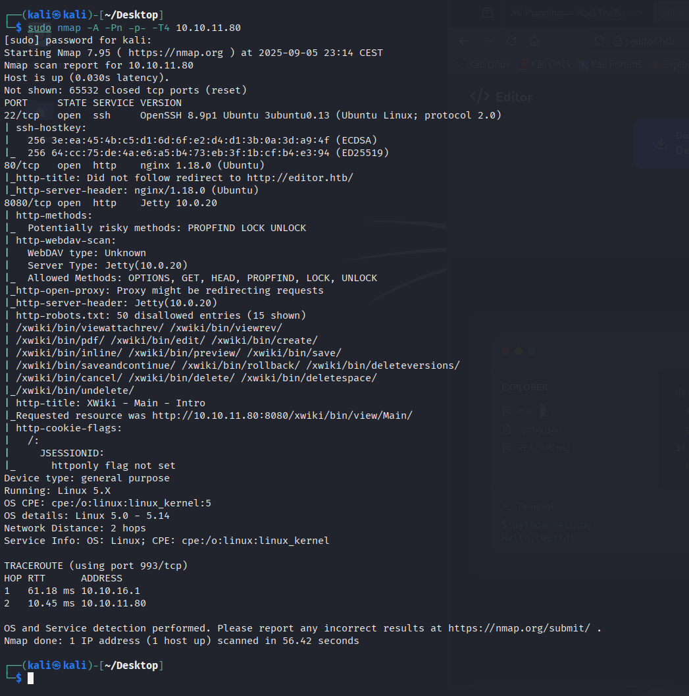
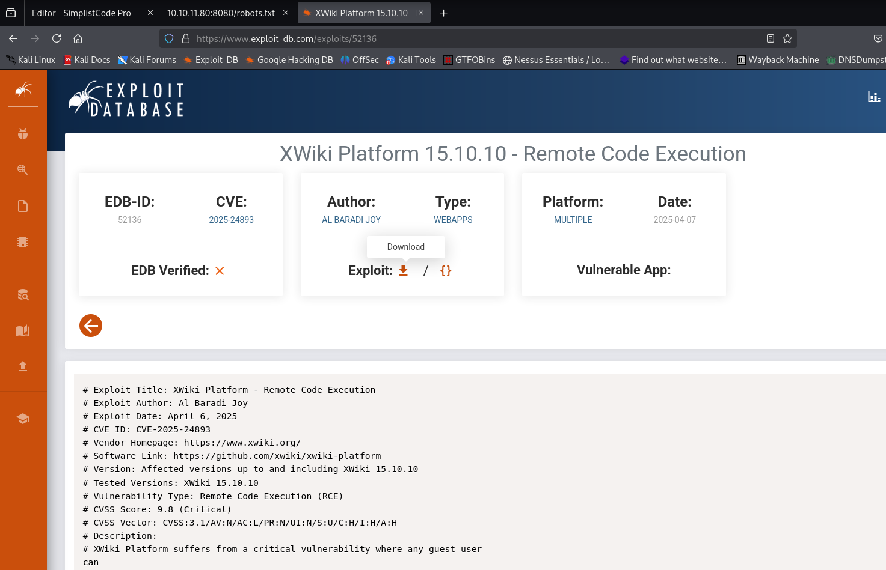
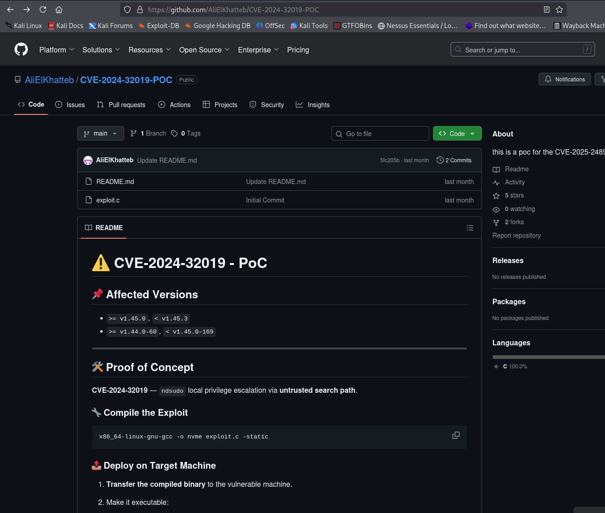

# Editor — Hack The Box

| | |
|---|---|
| **Platform** | Hack The Box |
| **Difficulty** | Easy |
| **OS** | Linux |
| **Status** | ✅ Retired |
| **Key techniques** | XWiki unauthenticated RCE (CVE-2025-24893), config-file credential leak, SUID monitoring-plugin abuse (CVE-2024-32019) |

---

## TL;DR

Editor is built around two real, recently-disclosed CVEs stacked back to
back: an unauthenticated RCE in XWiki, and a SUID-related privilege escalation
in a Netdata monitoring plugin. The path between them is a familiar one —
credentials found in an application's own configuration file, reused over SSH.

---

## Recon & Enumeration

```bash
sudo nmap -A -Pn -p- -T4 10.10.11.80
```



SSH and two HTTP ports (80, 8080). Port 80 was a static site with nothing of
interest. Port 8080 hosted **XWiki**, with WebDAV enabled and several
disallowed paths listed in `robots.txt` — worth checking, since a
`robots.txt` disallow list is effectively a map of paths someone considered
sensitive enough to hide from search engines, which often makes it worth
checking manually. The version banner read **XWiki 15.10.8**.

---

## Foothold / Initial Access



That version is affected by **CVE-2025-24893**, an unauthenticated remote
code execution vulnerability in XWiki. A public exploit for the CVE landed a
shell directly as the `xwiki` service user.

From there, checking `/home` showed a second user, `oliver`, whose directory
was inaccessible directly — a strong hint that credentials for that account
exist somewhere reachable from the current shell. XWiki's own database
configuration file, `hibernate.cfg.xml`, is exactly the kind of place an
application stores a database password, and in this case it also held a
password reused by the `oliver` system account:

```bash
cat hibernate.cfg.xml
ssh oliver@10.10.11.80
```

User flag retrieved.

---

## Privilege Escalation

A standard SUID sweep:

```bash
find / -type f -perm -4000 -user root 2>/dev/null
```

turned up a Netdata component:

```
/opt/netdata/usr/libexec/netdata/plugins.d/ndsudo
```



This binary is affected by **CVE-2024-32019**, a vulnerability in how the
`ndsudo` helper resolves the tools it shells out to — it can be tricked into
running an attacker-controlled binary instead of the intended system tool,
inheriting `ndsudo`'s elevated execution context in the process. Using a
public PoC: prepend a malicious binary (compiled locally, named to match what
`ndsudo` expects to find first on `PATH`) ahead of the real one, then trigger
the vulnerable code path:

```bash
export PATH=/tmp:$PATH
/opt/netdata/usr/libexec/netdata/plugins.d/ndsudo nvme-list
```

This executed the planted binary with root privileges, giving a root shell
and the root flag.

---

## Lessons Learned

- **`robots.txt` is a map of what someone wanted hidden, not a real access
  control** — always worth reading manually on any web target.
- **Application configuration files (`hibernate.cfg.xml` and equivalents) are
  a recurring source of both database and, via reuse, system credentials.**
- **Monitoring/observability tooling (Netdata here) runs with elevated
  helper binaries by design, which makes it a meaningful attack surface in
  its own right** — it's easy to treat monitoring agents as "just telemetry"
  and overlook their privilege footprint.

---

## Remediation

- Patch XWiki promptly; this was a critical, unauthenticated RCE.
- Never store database credentials in a configuration file also reused for
  system-account authentication — credential reuse across application and OS
  boundaries turns one leak into full compromise.
- Patch monitoring agents (Netdata and similar) with the same urgency as
  user-facing software — their helper binaries often run with elevated
  privileges specifically to collect system metrics.

---

**Machine:** [Hack The Box — Editor](https://www.hackthebox.com/machines/editor)
