# Heist — Hack The Box

<p align="left">
  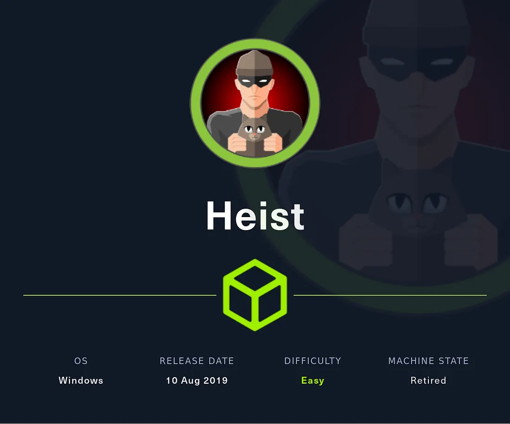
</p>

| | |
|---|---|
| **Platform** | Hack The Box |
| **Difficulty** | Easy |
| **OS** | Windows |
| **Key techniques** | Cisco type-5/type-7 password recovery, SMB RID brute, WinRM password spray, Procdump process memory dump, Pass-the-Password |

---

## TL;DR

Heist is built around a leaked Cisco router configuration linked from a
"Support" web login. The config holds a **type-7** (reversible) and a
**type-5** (crackable MD5) password. Recovering both and spraying them
across the local users — enumerated via an SMB **RID-brute** — lands valid
WinRM credentials for `Chase`. On the box, Chase has **Firefox running**;
dumping the process memory with **Procdump** and grepping the dump reveals
the Administrator's plaintext password inside a cached login URL, which I
reuse via Pass-the-Password with `psexec` for a SYSTEM shell.

---

## Recon

```bash
nmap -sVC -Pn 10.129.96.157
```

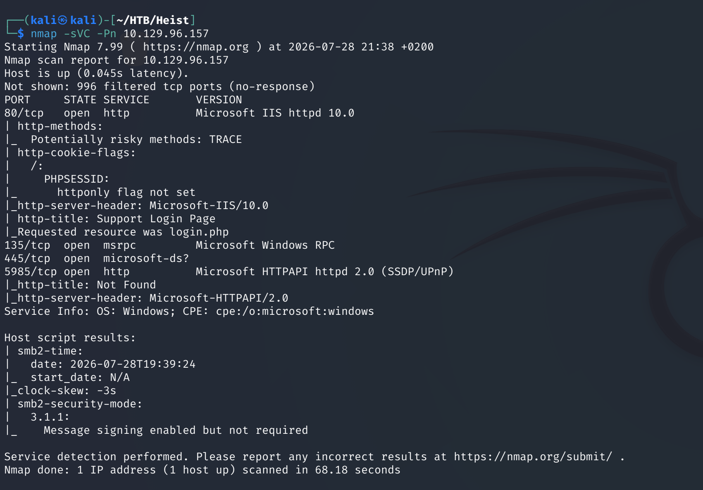

IIS (80, "Support Login Page"), msrpc (135), SMB (445) and WinRM (5985).

---

## Web Enumeration — leaked Cisco config

The support page links an "Issues" page which links a Cisco router
configuration file:

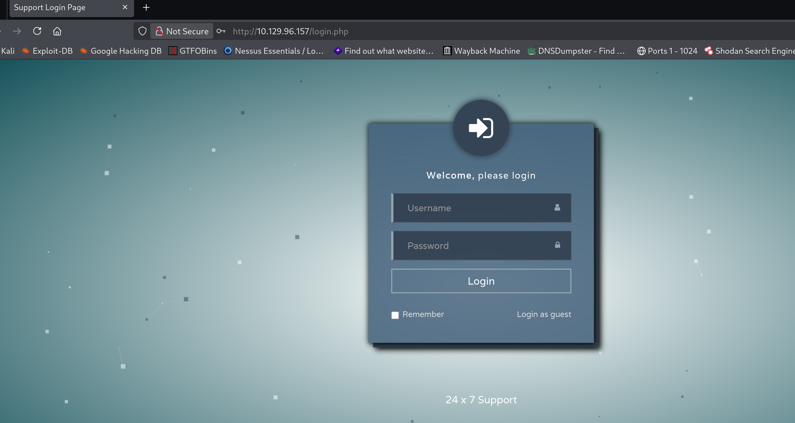

The config contains two credential types — a type-5 (MD5, crackable) and a
type-7 (reversible cipher):

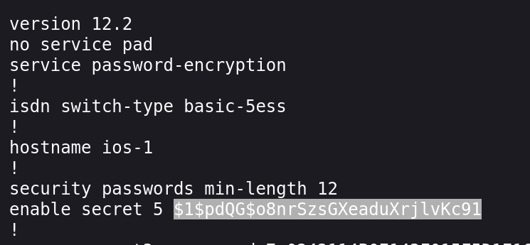

Decoded the **type-7** password directly with a Cisco type-7 decoder, and
cracked the **type-5** hash with hashcat:

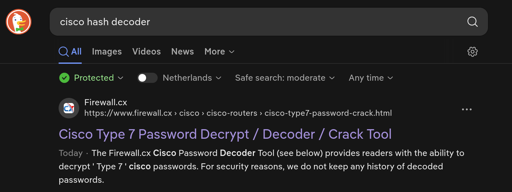
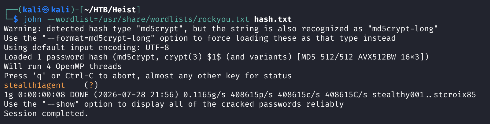


---

## Foothold — RID brute + password spray

One recovered password worked for a local login (`hazard`). I used it to
**RID-brute** SMB and enumerate every local user:

```bash
nxc smb 10.129.96.157 -u hazard -p stealth1agent --rid-brute
```

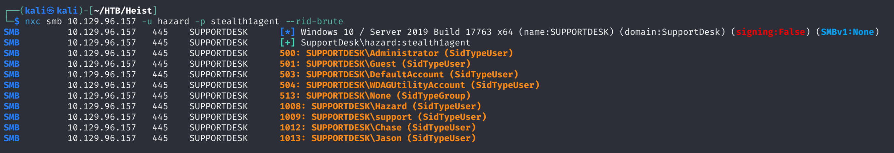

Users found: `Administrator, Guest, DefaultAccount, WDAGUtilityAccount,
Hazard, support, Chase, Jason`. Sprayed all recovered passwords against all
usernames over WinRM:

```bash
nxc winrm 10.129.96.157 -u usernames.txt -p passwords.txt
```

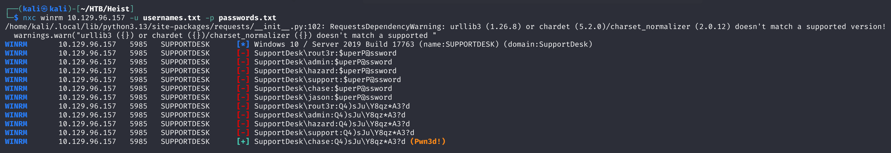

`chase` came back **Pwn3d!**. Logged in over WinRM and read the user flag:

```bash
evil-winrm -i 10.129.96.157 -u chase -p '<password>'
```

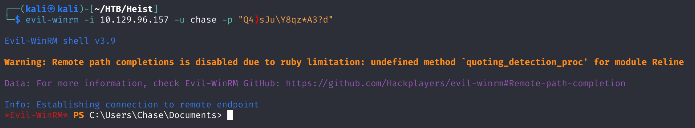
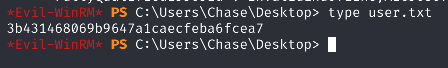

---

## Privilege Escalation — Firefox process memory dump

winPEAS didn't surface an obvious privesc path, but it flagged a Firefox
credentials store and pointed at dumping browser memory:

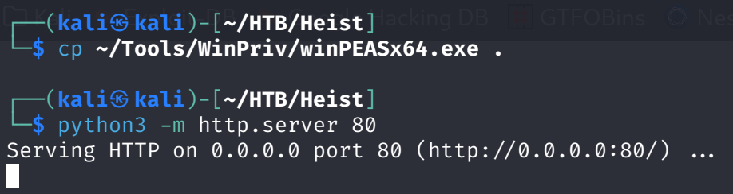
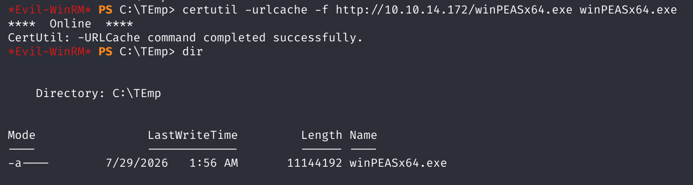
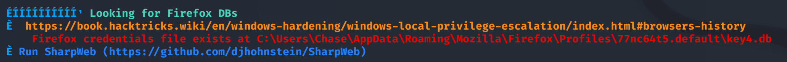

The key detail: Firefox was **actually running** — a live process can leak
more than the saved-logins DB on disk:

```powershell
tasklist | findstr /i firefox
```

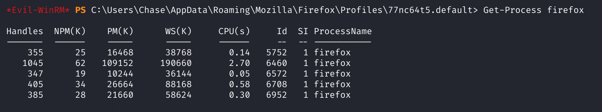

Uploaded **Procdump** (Sysinternals) and dumped the process by PID:

```powershell
.\procdump.exe -accepteula -ma <PID> C:\Users\chase\firefox.dmp
```

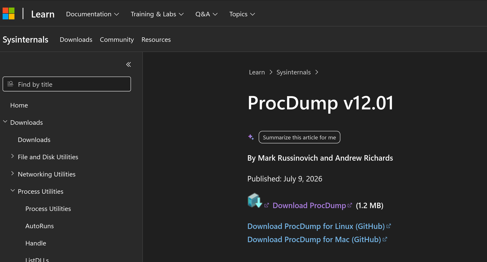
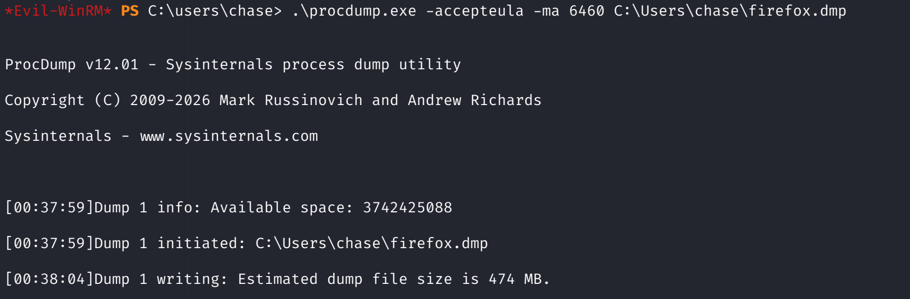

Exfiltrated the `.dmp` and grepped it for credentials — Firefox had cached
a leaked admin login **URL** with the password in plaintext:

```bash
strings firefox.dmp | grep -i "login_password"
```


---

## Root — Pass-the-Password

Reused the recovered Administrator password with `psexec`:

```bash
impacket-psexec 'administrator:<password>@10.129.62.207'
```

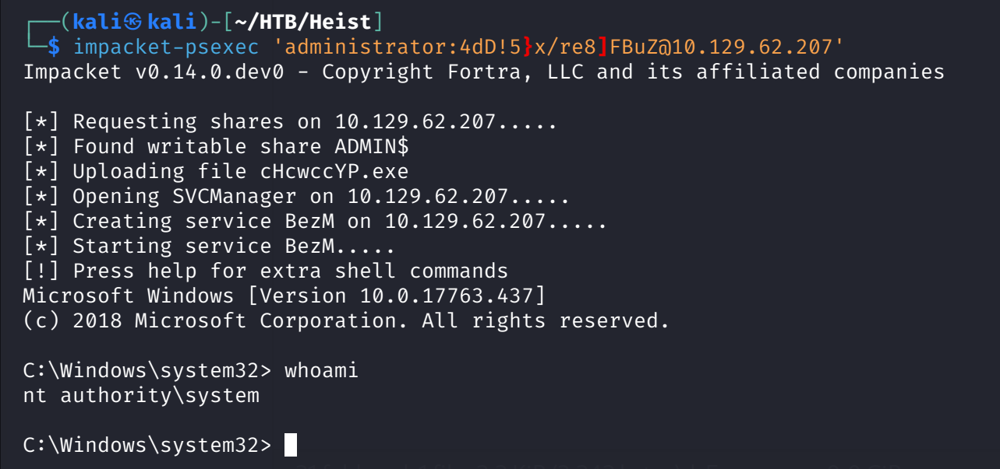

`NT AUTHORITY\SYSTEM`. Read the root flag:

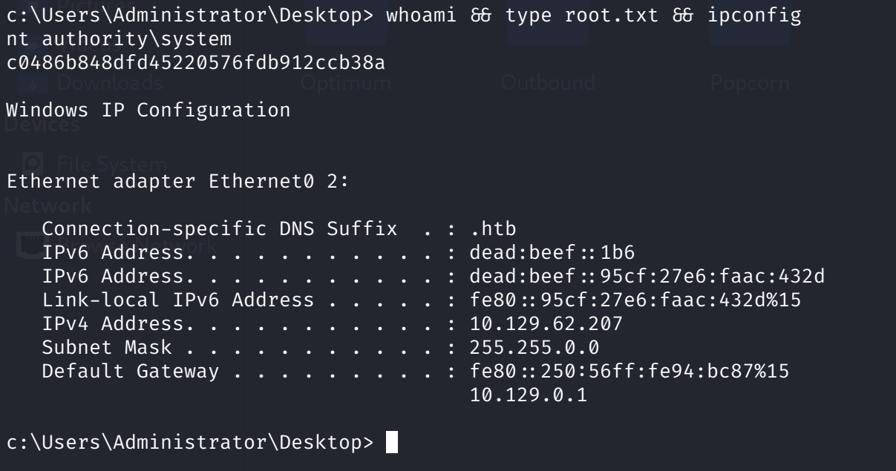

---

## Lessons Learned

- Leaked device configs (Cisco/network gear) often carry **both**
  reversible (type-7) and crackable (type-5) secrets — recover both, they
  get reused as real user passwords.
- An SMB RID-brute with any valid low-priv login enumerates the full local
  user list — feed it straight into a spray.
- Always check whether a juicy process (browser, password manager) is
  **running** before deciding on privesc; a live process can be dumped for
  secrets still in memory, beyond what's on disk.
- `procdump -ma <PID>` + `strings | grep` is the same idea as LSASS
  dumping — it generalizes to any process holding secrets.

---

## Remediation

- Never publish device configs with embedded secrets; rotate any exposed
  type-5/type-7 passwords.
- Enforce unique passwords so a single leaked one can't be sprayed.
- Restrict low-privileged users from dumping process memory, and don't
  leave privileged sessions open in a browser on a shared host.

---

## Tools used

- `nmap`
- Cisco type-7 decoder, `hashcat`
- NetExec (`nxc`)
- `evil-winrm`
- WinPEAS, Procdump (Sysinternals)
- Impacket (`psexec.py`)

---

**See also:** [Windows privilege escalation methodology](../../methodology/windows-privesc.md)

---

**Machine:** [Hack The Box — Heist](https://www.hackthebox.com/machines/heist)

**Live version:** [read this write-up on my blog](https://debasjan.github.io/writeups/heist/)
