# Jeeves — Hack The Box

<p align="left">
  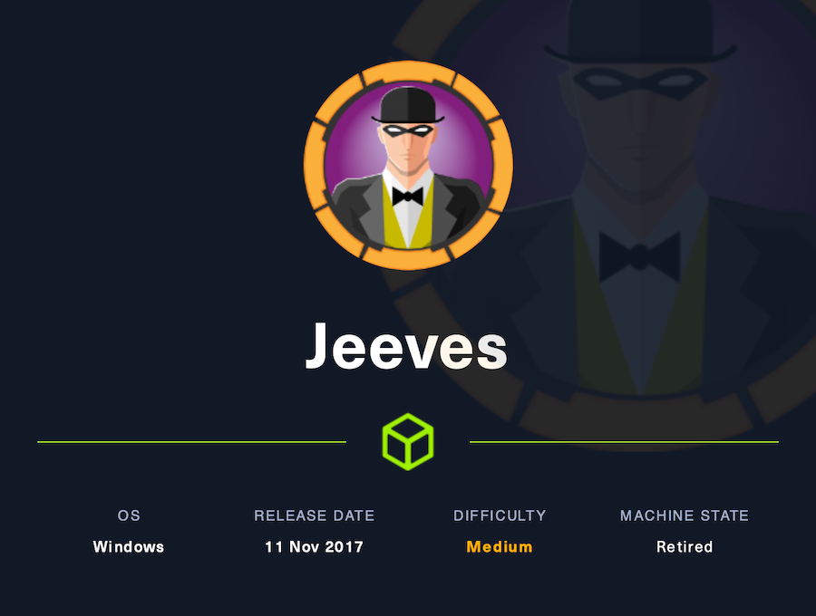
</p>

| | |
|---|---|
| **Platform** | Hack The Box |
| **Difficulty** | Medium |
| **OS** | Windows |
| **Key techniques** | Jenkins Script Console RCE (Groovy), KeePass cracking, Pass-the-Hash, NTFS alternate data stream |

---

## TL;DR

Jeeves runs an **unauthenticated Jenkins** instance hidden on a
non-standard path. Its Script Console runs arbitrary Groovy, so a reverse
shell gets me a foothold as `kohsuke`. In the user's files there's a
KeePass database (`CEH.kdbx`) — I exfiltrate it through a Jenkins job
workspace, crack it offline, and one entry holds the local
**Administrator's NTLM hash**. Pass-the-Hash with `psexec` gives SYSTEM,
and the root flag lives in an **NTFS alternate data stream**.

---

## Recon

```bash
sudo nmap -sCV -p- 10.129.228.112
```


Port 80 serves a fake "Ask Jeeves" search page. The interesting one is
**50000** (Jetty).

---

## Web Enumeration → Jenkins

Directory brute-forcing port 50000 revealed `/askjeeves`:

```bash
feroxbuster -u http://10.129.228.112:50000
```

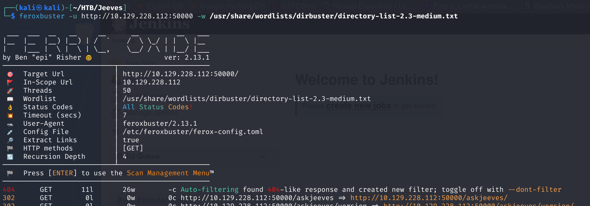

`/askjeeves` is an **unauthenticated Jenkins** instance — no login at all:


---

## Foothold — Jenkins Script Console (Groovy RCE)

**Manage Jenkins → Script Console** runs arbitrary Groovy on the server. I
pasted a Groovy reverse shell and ran it:

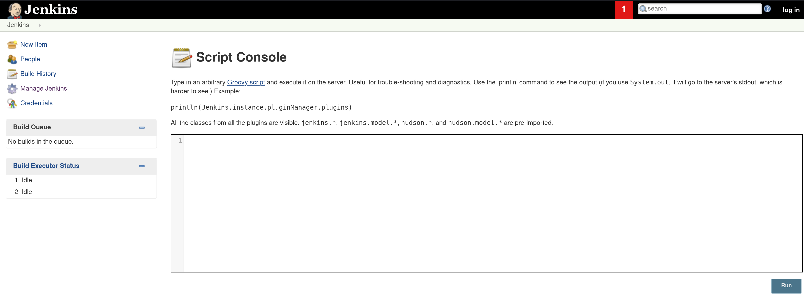
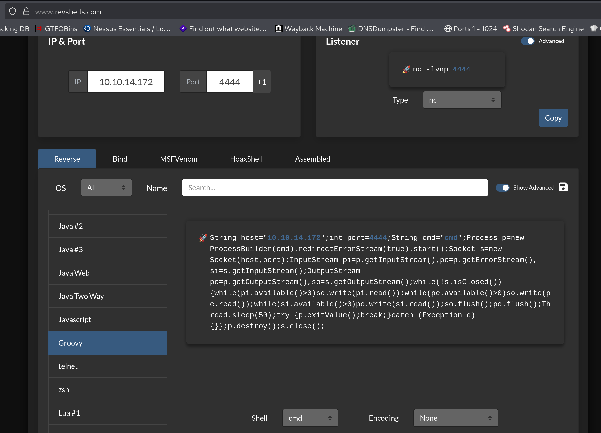
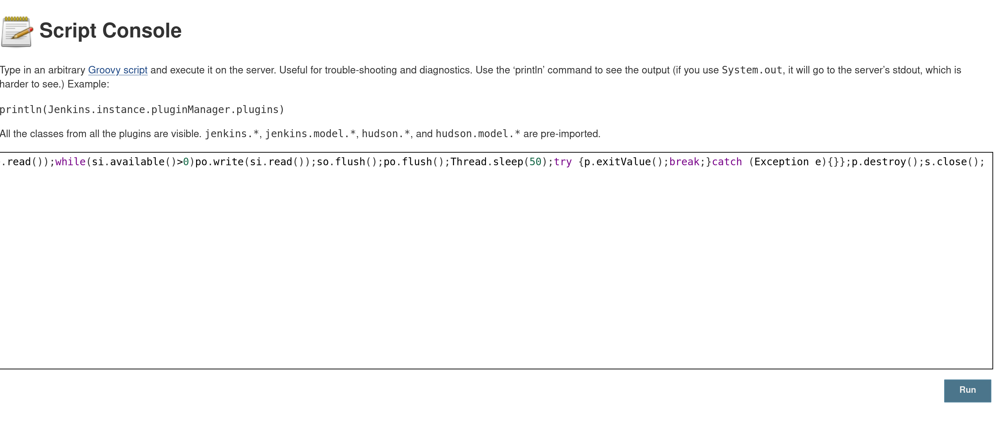

Caught a shell as `kohsuke` and read the user flag:

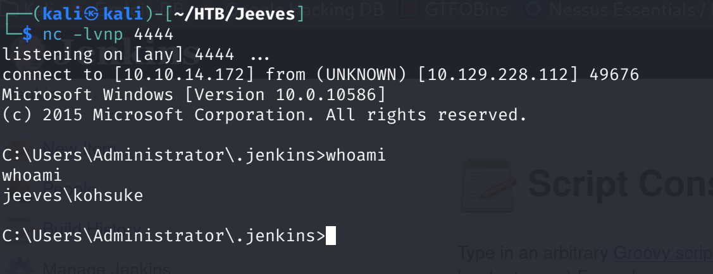
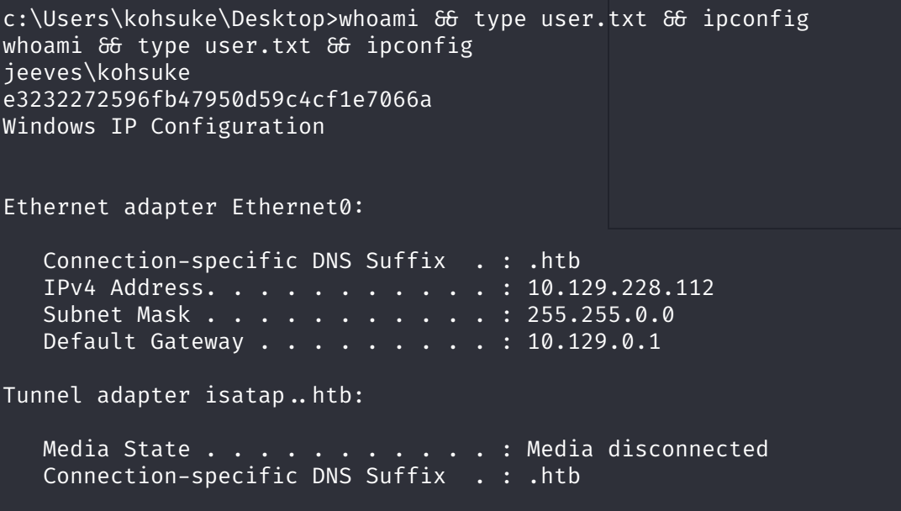

---

## Lateral Movement — KeePass → Administrator hash

Found a KeePass database `CEH.kdbx` in kohsuke's files. To get it off the
box I created a Jenkins job and copied the file into its workspace so it
could be downloaded over HTTP:


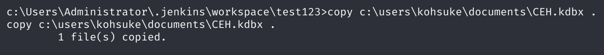


### Cracking the KeePass DB

```bash
keepass2john CEH.kdbx > keepass.hash
hashcat -m 13400 keepass.hash /usr/share/wordlists/rockyou.txt
```


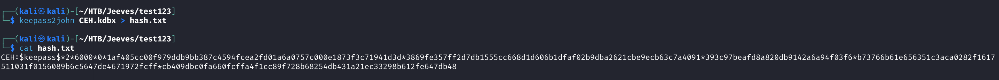


Opened the database with the cracked master password — one entry stores an
**NTLM hash** for the local Administrator, not a plaintext password:


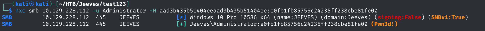

---

## Privilege Escalation — Pass-the-Hash

No need to crack the NTLM hash — I passed it directly with `psexec`:

```bash
impacket-psexec administrator@10.129.228.112 -hashes <LM>:<NT>
```

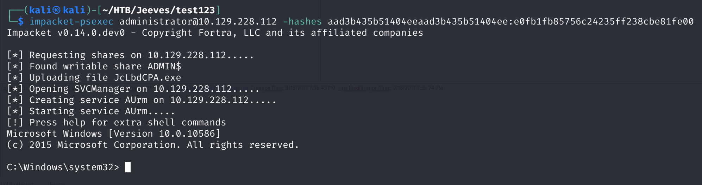

That gives a `NT AUTHORITY\SYSTEM` shell.

---

## Root flag — NTFS Alternate Data Stream

`root.txt` isn't a normal file — the Administrator desktop only has
`hm.txt`. `dir /r` reveals a hidden **ADS**, `hm.txt:root.txt:$DATA`:

```text
dir /r
#   hm.txt
#   hm.txt:root.txt:$DATA   <- the flag is in the stream
more < hm.txt:root.txt      # `type` can't read an ADS — use `more <`
```


---

## Lessons Learned

- Always dir-brute non-standard web ports — Jenkins was invisible behind
  the decoy on port 80 and only showed up on `50000/askjeeves`.
- An unauthenticated Jenkins Script Console is instant RCE via Groovy.
- KeePass databases crack with `keepass2john` + hashcat `-m 13400`; loot
  every entry — a stored NTLM hash is as good as a password.
- A hash found in loot means **Pass-the-Hash**, no cracking required.
- Flags/data can hide in NTFS alternate data streams: `dir /r` to spot
  them, `more <` to read them (`type` fails on streams).

---

## Remediation

- Never expose Jenkins unauthenticated; lock down the Script Console and
  place Jenkins behind authentication.
- Don't store credential databases on application servers.
- Rotate the Administrator password and don't stash its hash in a shared
  vault entry.

---

## Tools used

- `nmap`
- `feroxbuster`
- Jenkins Script Console (Groovy)
- `keepass2john`, `hashcat`
- Impacket (`psexec.py`)

---

**See also:** [Windows privilege escalation methodology](../../methodology/windows-privesc.md)

---

**Machine:** [Hack The Box — Jeeves](https://www.hackthebox.com/machines/jeeves)

---

**Live version:** [read this write-up on my blog](https://debasjan.github.io/writeups/jeeves/)
