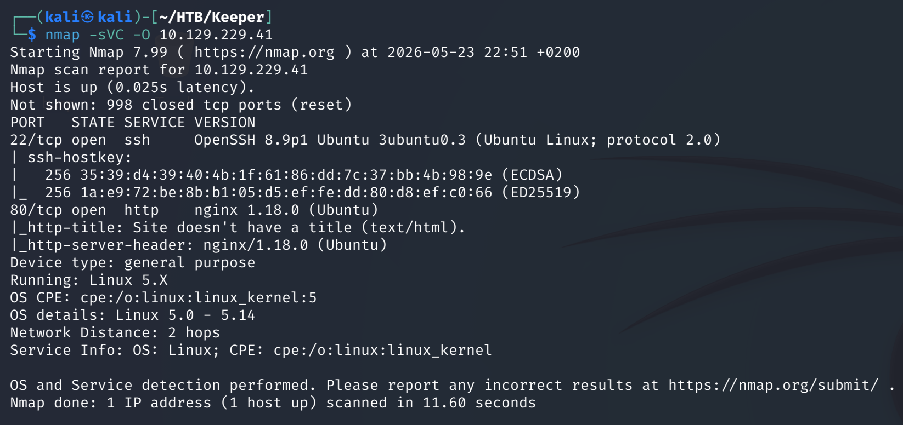
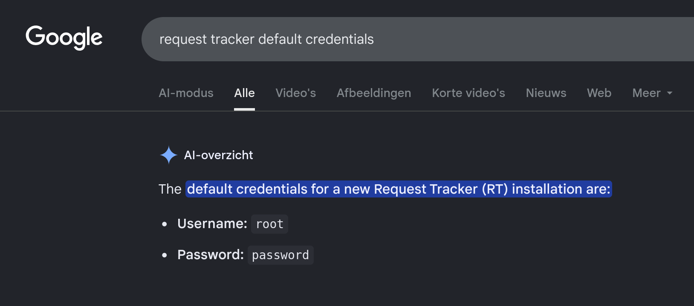
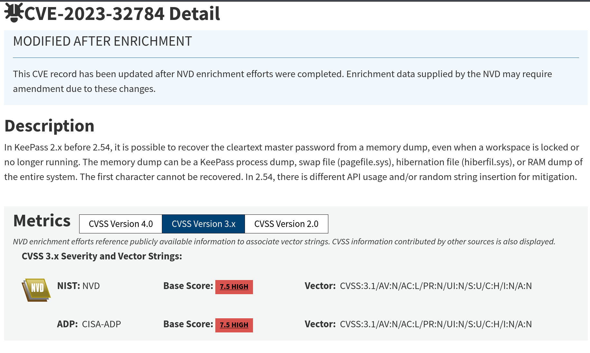
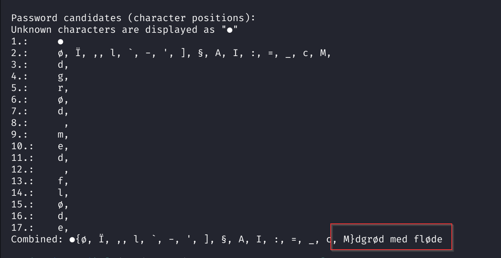

# Keeper — Hack The Box

| | |
|---|---|
| **Platform** | Hack The Box |
| **Difficulty** | Easy |
| **OS** | Linux |
| **Status** | ✅ Retired |
| **Key techniques** | Default application credentials, KeePass memory-dump attack (CVE-2023-32784), key-format conversion |

---

## TL;DR

Keeper's foothold is a support-ticketing system still running its documented
default credentials. From there, a leaked password gets an SSH account, whose
home directory holds an old KeePass memory dump — vulnerable to a real 2023
CVE that recovers most of the database's master password directly from the
dump. That unlocks the database, which stores an SSH private key formatted
for PuTTY rather than OpenSSH, needing one conversion step before it works.

---

## Recon & Enumeration

```bash
nmap -sVC -O 10.129.229.41
```



The web app was **Request Tracker**, a support-ticketing platform. Rather
than attack it, a quick search for its documented default credentials
(`root` / `password`) was worth trying first — a lot of ticketing/helpdesk
software ships with well-known defaults, easy to confirm with a quick search:



Default credentials are exactly the kind of thing administrators forget to
rotate, and checking documentation before brute-forcing is always the
cheaper move.

---

## Foothold / Initial Access

The default credentials worked immediately. Browsing the ticket system's user
list surfaced a user, and — echoing a pattern seen elsewhere in this set — a
password sitting directly in that user's account **description** field.

```bash
ssh lnogaard@10.129.229.41
```

User flag retrieved. The home directory contained a zip archive with two
files: `KeePassDumpFull.dmp` (a process memory dump of a running KeePass
instance) and `passcodes.kdbx` (the actual password database).

---

## Privilege Escalation



A `.dmp` file for KeePass sitting next to a `.kdbx` database is a strong
signal for **CVE-2023-32784** — a vulnerability where KeePass leaves
recoverable fragments of the master password in process memory, missing only
the first one or two characters, which a public PoC can brute-force back:

```bash
scp lnogaard@10.129.229.41:passcodes.kdbx .
scp lnogaard@10.129.229.41:KeePassDumpFull.dmp .
dotnet run KeePassDumpFull.dmp
```



This recovered the KeePass master password, unlocking the database. Inside,
one entry's description field held a private key in **PuTTY's proprietary
key format** rather than OpenSSH's — a format mismatch that's an easy trap if
you don't recognize the header, since it will simply fail to load as an
`id_rsa` file:

```bash
echo "<putty-key-contents>" > ssh_key_file
puttygen ssh_key_file -O private-openssh -o id_rsa
ssh -i id_rsa root@10.129.229.41
```

Root flag retrieved.

---

## Lessons Learned

- **Default credentials for support/ticketing platforms are worth checking
  before anything else** — Request Tracker's defaults, unchanged, were the
  entire foothold.
- **A KeePass memory dump sitting alongside its database is a strong,
  specific signal** — CVE-2023-32784 turns "I need the master password" into
  "I need a few CPU cycles."
- **Not every private key is OpenSSH-formatted** — recognizing a PuTTY key
  header and knowing `puttygen` converts it saved what would otherwise look
  like a dead end.

---

## Remediation

- Change default credentials on any third-party application immediately
  after installation, and audit periodically for unchanged defaults.
- Never store account passwords in description/notes fields — treat them
  with the same policy as any other credential store.
- Patch KeePass to a version unaffected by CVE-2023-32784, and avoid leaving
  memory dumps of credential-manager processes on disk at all.

---

**Machine:** [Hack The Box — Keeper](https://www.hackthebox.com/machines/keeper)
