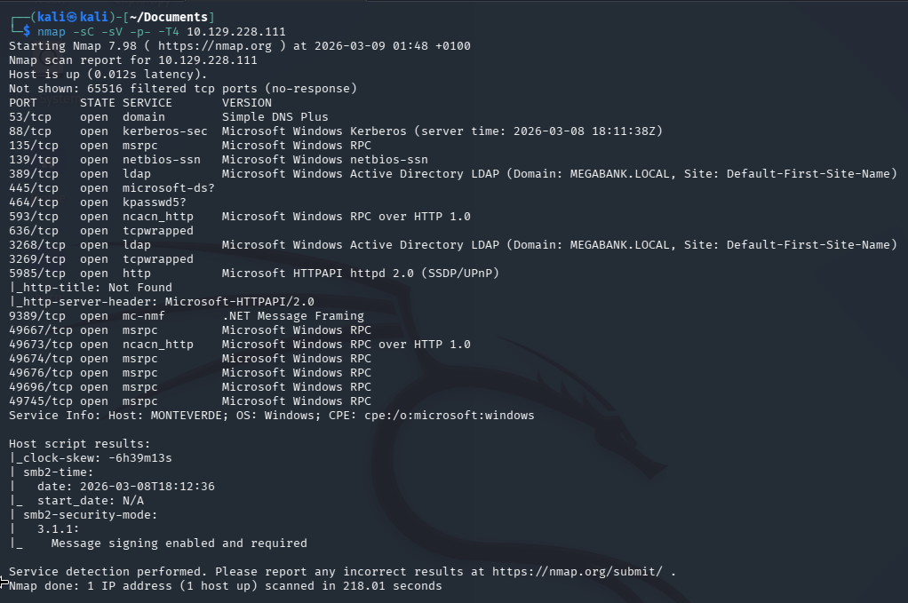
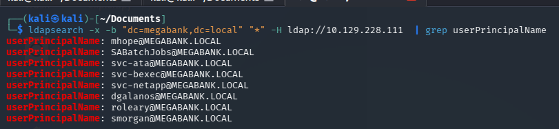
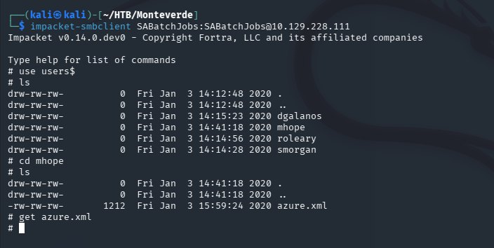
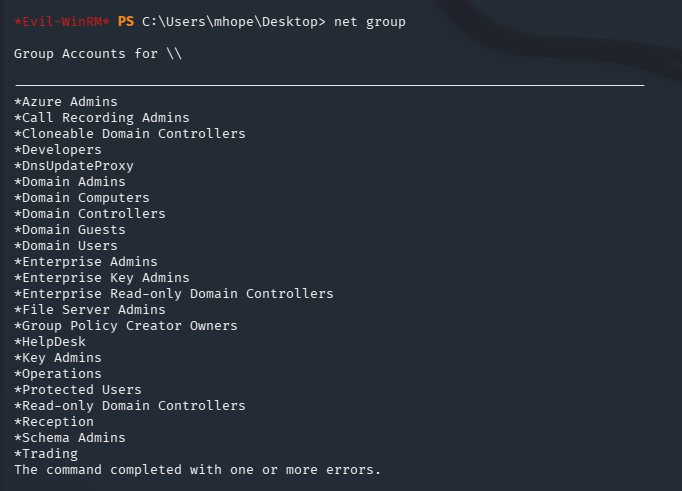
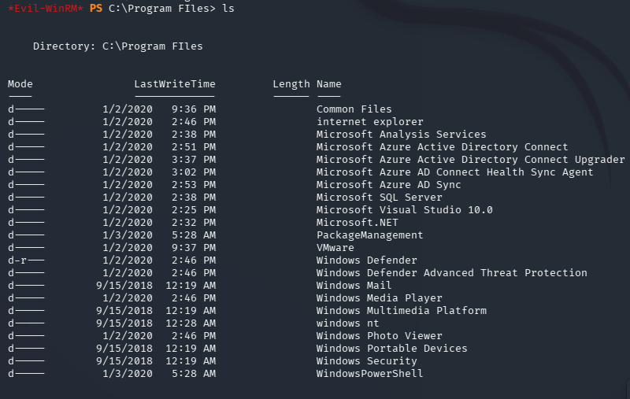
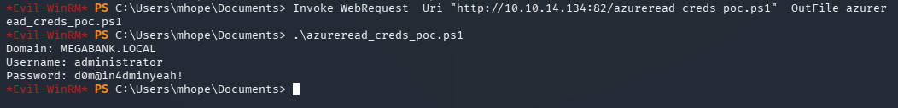

# Monteverde — Hack The Box


| | |
|---|---|
| **Platform** | Hack The Box |
| **Difficulty** | Medium |
| **OS** | Windows (Active Directory) |
| **Status** | ✅ Retired |
| **Key techniques** | Anonymous LDAP enumeration, password spraying, Azure AD Connect credential extraction |

---

## TL;DR

Monteverde starts with the same low-effort wins as most AD boxes —
anonymous LDAP, a username-as-password spray — but the privilege
escalation is what makes it worth including: the box runs **Azure AD
Connect**, the service that syncs an on-prem domain with Azure AD, and
its sync account credentials can be decrypted directly from the local
SQL database it depends on. That account happens to be the domain
administrator.

---

## Recon

```bash
nmap -sC -sV -p- -T4 10.129.228.111
```



DNS, Kerberos, RPC, LDAP (`MEGABANK.LOCAL`), SMB, WinRM.

### LDAP

Tried an anonymous bind, grepping for user principal names:

```bash
ldapsearch -x -b "dc=megabank,dc=local" "*" -H ldap://10.129.228.111 | grep userPrincipalName
```



The bind worked and handed over a username list before I'd guessed a
single credential.

---

## Foothold / Initial Access

### Password spraying

With usernames in hand, checked whether anyone reused their username as
their own password:

```bash
crackmapexec smb 10.129.228.111 -u users.txt -p users.txt --continue-on-success
```


`SABatchJobs` did. Checked what shares that account could reach:

```bash
impacket-smbclient SABatchJobs:SABatchJobs@10.129.228.111
use users$
ls
```



Inside a per-user folder (`mhope`) sat `azure.xml` — an Azure AD Connect
account export:

```bash
cat azure.xml
```


Password reuse meant it also worked for the domain user `mhope`:

```bash
evil-winrm -i 10.129.228.111 -u mhope -p '4n0therD4y@n0th3r$'
```

User flag retrieved.

---

## Privilege Escalation

Checked group memberships and installed software:

```powershell
net group
```



`mhope` belonged to an **Azure Admins** group, and `C:\Program Files`
confirmed both SQL Server and Azure AD Connect were installed:

```powershell
ls "C:\Program Files"
```



Azure AD Connect needs a highly privileged domain account to perform its
sync (often literally the domain administrator, as a matter of
historical default configuration) — and it has to store that account's
credentials *somewhere* retrievable, since the sync process runs
unattended. That "somewhere" is an encrypted blob in the local `ADSync`
SQL database, decryptable using a key management API the service itself
uses at runtime.

Ran a known extraction script (queries `mms_server_configuration` and
`mms_management_agent`, then decrypts via the sync engine's own
`mcrypt.dll`) against the local database:

```powershell
# script queries ADSync DB config tables, then uses Azure AD Connect's own
# crypto library to decrypt the stored sync-account credential
```



The sync account's plaintext credentials turned out to be, in fact, the
domain Administrator's. Those credentials gave a WinRM session and the
root flag.

---

## Lessons Learned

- Azure AD Connect is a single point of catastrophic failure if
  compromised — the account it uses to sync is often over-privileged by
  default, and the service is *designed* to be able to decrypt its own
  stored credential, which means anyone with local access to the sync
  server can too.
- A `.xml` config export found on a share is worth opening in full —
  sync and integration tooling routinely embeds plaintext credentials in
  configuration exports meant only for internal use.
- Password reuse between a service account and a real user account is
  still one of the fastest wins on any domain.

---

## Remediation

- Run Azure AD Connect with a dedicated, minimally-privileged sync
  account — never the domain Administrator.
- Restrict local access to the AD Connect server itself; if an attacker
  can't reach the SQL database, the decryption path doesn't matter.
- Audit shares for configuration exports (`.xml`, `.config`, `.json`)
  containing credentials, and treat any found as an immediate incident.

---

## Tools used

- `nmap`
- `ldapsearch`
- `crackmapexec`
- Impacket (`smbclient`)
- `evil-winrm`

---

**See also:** [Active Directory methodology](../../methodology/active-directory.md)

---

**Machine:** [Hack The Box — Monteverde](https://www.hackthebox.com/machines/monteverde)
