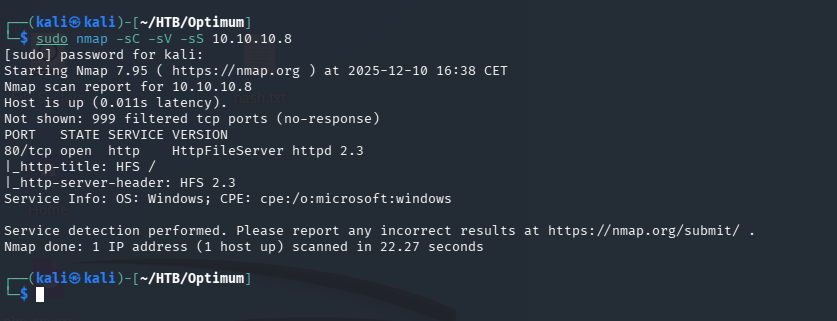
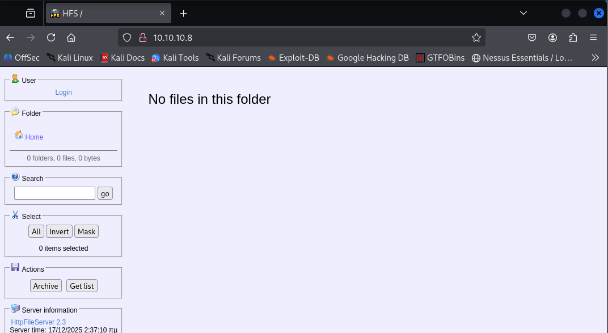
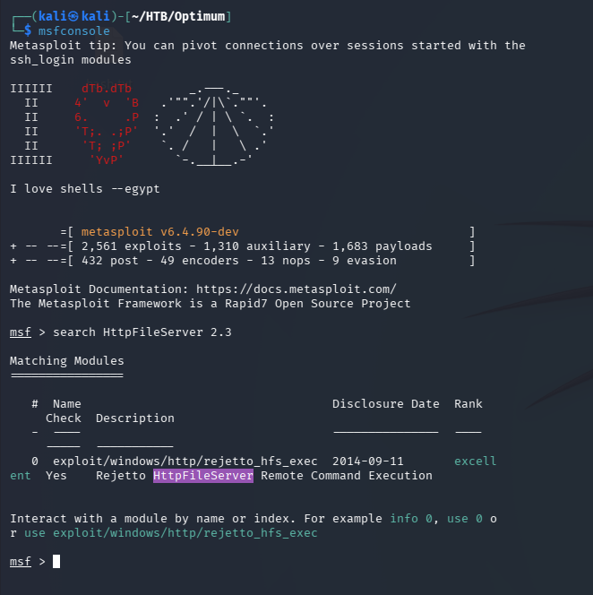
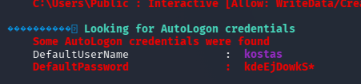
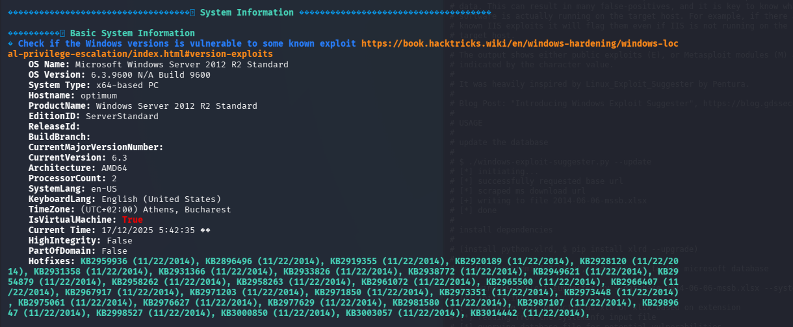
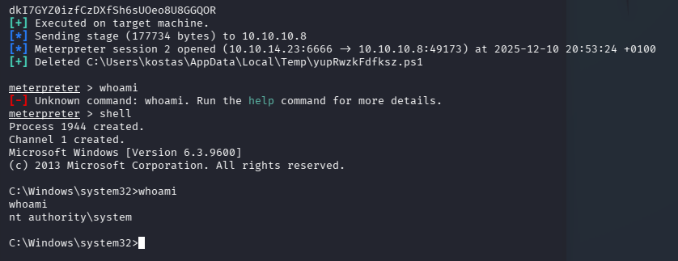

# Optimum — Hack The Box

<p align="left">
  
</p>

| | |
|---|---|
| **Platform** | Hack The Box |
| **Difficulty** | Easy |
| **OS** | Windows |
| **Status** | ✅ Retired |
| **Key techniques** | Version-based RCE, AutoLogon credential leak, Windows kernel exploit |

---

## TL;DR

Optimum is a lesson in why version banners matter: the only exposed
service is an outdated file-server product with a public remote code
execution exploit, giving an immediate foothold. From there, WinPEAS
flags both leftover AutoLogon credentials and an unpatched kernel — the
kernel exploit is the fast path straight to `NT AUTHORITY\SYSTEM`.

---

## Recon

```bash
nmap -sC -sV -sS 10.10.10.8
```



A single open port: 80, running **HttpFileServer (HFS)**:



With only one service exposed, the version banner *is* the attack
surface. HFS 2.3 has a well-documented remote code execution
vulnerability.

---

## Exploitation

```
msfconsole
search HttpFileServer 2.3
```



A matching module exists for this exact version
(`exploit/windows/http/rejetto_hfs_exec`). Set the target/payload/`LHOST`
options and ran it — a Meterpreter session landed directly, no chained
steps required. Got access as the local user `kostas`, user flag
retrieved.

---

## Privilege Escalation

Uploaded WinPEAS to surface anything obviously exploitable rather than
manually walking every possible Windows privesc vector:

```
upload winpeas.exe C:\Windows\Temp\winpeas.exe
winpeas.exe
```

First finding: leftover **AutoLogon credentials** for `kostas` sitting in
the registry:



Second: a known-vulnerable, **unpatched Windows kernel version** flagged
directly against exploit-suggester references:



With the exact kernel identified, the matching Metasploit local exploit
module was the fastest path to SYSTEM:

```
use exploit/windows/local/<matching_kernel_exploit>
set SESSION <id>
run
```

Migrated the resulting session to a more stable process to avoid losing
access if the exploited process crashed, then dropped to a standard
shell to confirm:

```
migrate -N <stable_process>
shell
whoami
```



Obtained `NT AUTHORITY\SYSTEM`, root flag retrieved from the
Administrator's desktop.

---

## Lessons Learned

- A single exposed service means the version banner *is* the whole
  attack surface — checking it against known exploits before trying
  anything else paid off immediately here.
- Automated privesc scanners earn their keep on patch-gap boxes. When the
  vulnerability is "this kernel build is old," a scanner finds it far
  faster than manual enumeration built for misconfigurations.
- Kernel exploits carry stability risk — migrating to a stable process
  right after a successful kernel-level exploit is worth doing
  immediately.

---

## Remediation

- Retire or patch legacy file-sharing utilities (like HFS) — software
  that's "just for internal file sharing" still needs the same patch
  cadence as anything internet-facing.
- Keep Windows kernel patches current; a scanner finding an exploitable
  kernel build is a patch-management failure, not a novel attack.
- Never configure AutoLogon with a plaintext password in the registry.

---

## Tools used

- `nmap`
- Metasploit (`rejetto_hfs_exec`, local kernel exploit)
- WinPEAS

---

**See also:** [Windows privilege escalation methodology](../../methodology/windows-privesc.md)

---

**Machine:** [Hack The Box — Optimum](https://www.hackthebox.com/machines/optimum)
