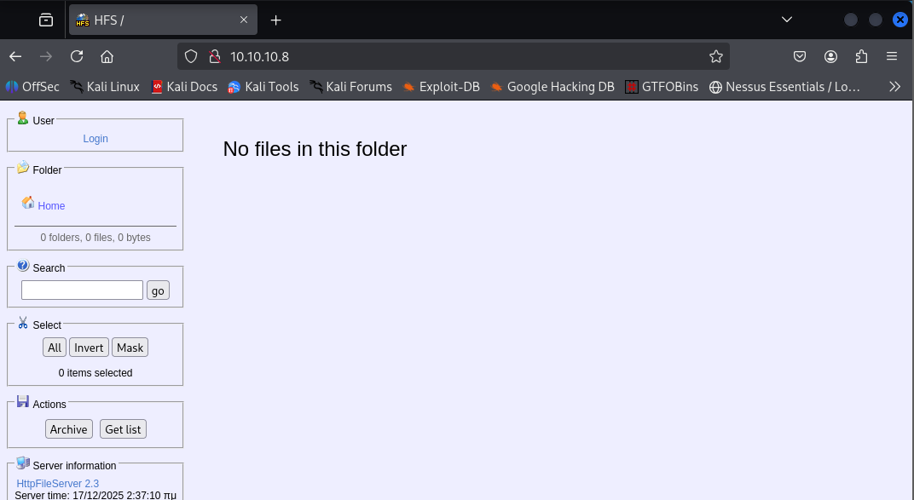
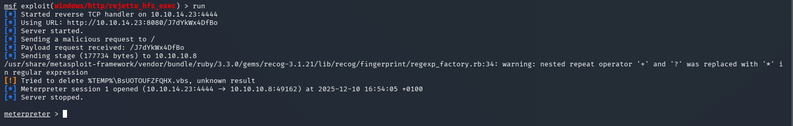
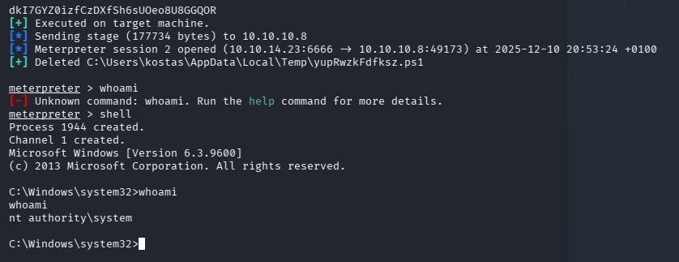

# Optimum — Hack The Box

| | |
|---|---|
| **Platform** | Hack The Box |
| **Difficulty** | Easy |
| **OS** | Windows |
| **Status** | ✅ Retired |
| **Key techniques** | Version-based RCE, Windows kernel exploit |

---

## TL;DR

Optimum is a lesson in why version banners matter: the only exposed service
is an outdated file-server product with a publicly known remote code
execution vulnerability, giving an immediate foothold. From there, an
automated privilege-escalation scan flags a specific unpatched kernel
vulnerability, which is exploited directly to reach `NT AUTHORITY\SYSTEM`.

---

## Recon & Enumeration

```bash
nmap -sC -sV -sS 10.10.10.8
```


A single open port: 80, running **HttpFileServer (HFS) 2.3**. With only one
service exposed, the version banner *is* the attack surface — the first move
is always to check a version number against known exploits before trying
anything else, and HFS 2.3 has a well-documented RCE.



---

## Foothold / Initial Access

```
msfconsole
search HttpFileServer 2.3
```

A matching Metasploit module exists for this exact version. Configured the
module's options (target, payload, `LHOST`) and ran it — the exploit lands a
Meterpreter session directly, with no chained steps required. This is about
as direct as a foothold gets, which is precisely why unpatched, outdated file
servers are such a common finding in real assessments: a single missed
version bump on infrastructure most people forget exists (an old file-sharing
utility) is a full remote shell.



Session came back as the local user `kostas`, user flag retrieved.

---

## Privilege Escalation

Rather than manually enumerate every possible Windows privesc vector,
uploaded and ran an automated scanner (`winPEAS`) to surface anything
obviously exploitable — this is efficient specifically because Optimum's
privesc path isn't a misconfiguration to reason about, it's a **missing
patch** to identify:

```
upload winpeas.exe C:\Windows\Temp\winpeas.exe
winpeas.exe
```

The scan flagged a **known-vulnerable, unpatched Windows kernel version** —
exactly the kind of finding that shows up in red once you know to look for
it, but is easy to miss scrolling through a wall of manual `systeminfo`
output.

With the exact kernel version identified, the corresponding Metasploit local
exploit module was the fastest path to `SYSTEM`:

```
use exploit/windows/local/<matching_kernel_exploit>
set SESSION <id>
run
```

Migrated the resulting session to a more stable process to avoid losing
access if the exploited process crashed:

```
migrate -N <stable_process>
```



Obtained `NT AUTHORITY\SYSTEM`, root flag retrieved from the Administrator's
desktop.

---

## Lessons Learned

- **A single exposed service means the version banner *is* the whole attack
  surface.** Checking it against known exploits before trying anything else
  paid off immediately here.
- **Automated privesc scanners earn their keep on patch-gap boxes.** When the
  vulnerability is "this kernel build is old," a scanner finds it far faster
  than manual enumeration built for misconfigurations.
- **Kernel exploits carry stability risk** — migrating to a stable process
  after a successful kernel-level exploit is worth doing immediately, before
  that risk catches up with the session.

---

## Remediation

- Retire or patch legacy file-sharing utilities (like HFS) — software that's
  "just for internal file sharing" still needs the same patch cadence as
  anything internet-facing.
- Keep Windows kernel patches current; a scanner finding an exploitable
  kernel build is a patch-management failure, not a novel attack.
- Segment or firewall single-purpose utility servers so that a compromise of
  one exposed service doesn't translate directly into full host takeover.

---

**Machine:** [Hack The Box — Optimum](https://www.hackthebox.com/machines/optimum)
