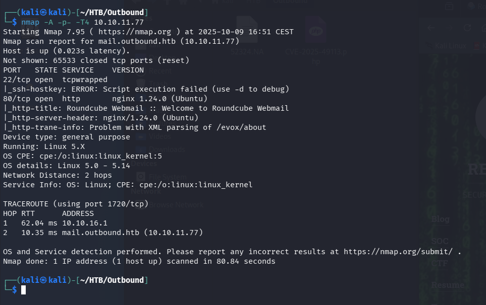
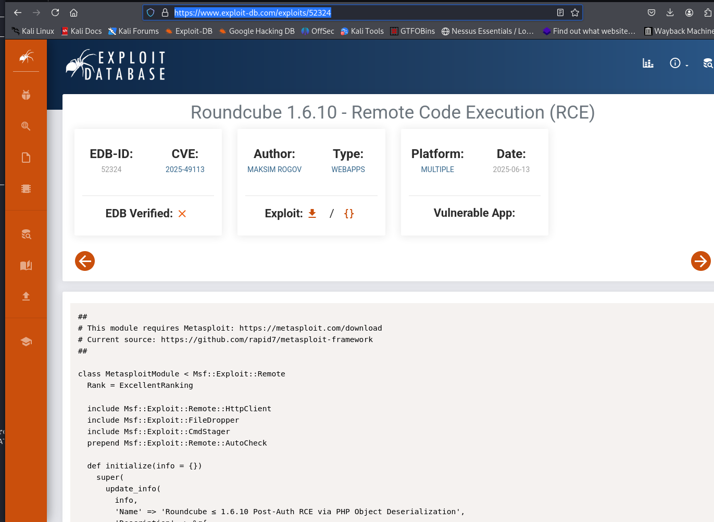
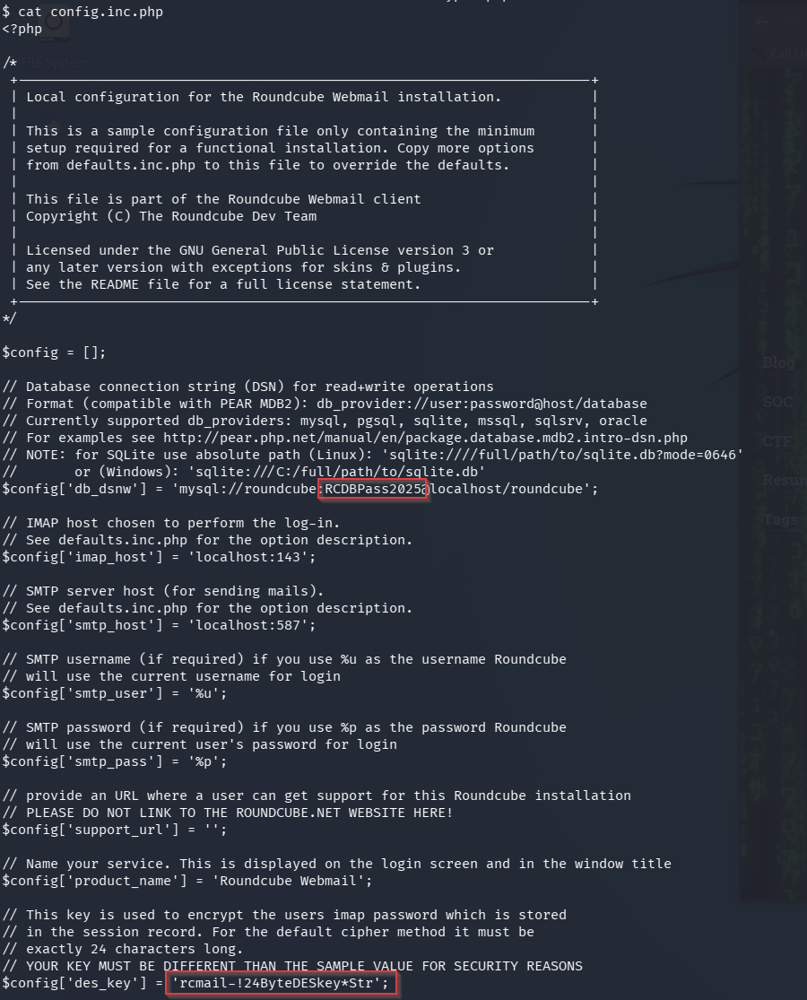

# Outbound — Hack The Box

<p align="left">
  
</p>

| | |
|---|---|
| **Platform** | Hack The Box |
| **Difficulty** | Easy |
| **OS** | Linux |
| **Status** | ✅ Retired |
| **Key techniques** | Roundcube unauthenticated RCE (CVE-2025-49113), session/Triple-DES decryption, `sudo` misconfiguration (CVE-2025-27591) |

---

## TL;DR

Outbound is a multi-stage credential chain hidden behind a single webmail
RCE. Exploiting a critical Roundcube vulnerability gives a low-privileged
shell and access to the mail application's own database, where a session
table holds a Triple-DES-encrypted credential — decryptable using a key
that's sitting in the same configuration file. The decrypted password opens
a mailbox containing a *second* password in plain text, which reaches SSH.
Root is a very recent local privilege escalation in a systems-monitoring
tool.

---

## Recon & Enumeration

```bash
nmap -A -p- -T4 10.10.11.77
```



SSH and HTTP only. The web app was **Roundcube webmail**, and logging in with
provided starting credentials (`tyler`) confirmed the version: **1.6.10**.

---

## Foothold / Initial Access



That version is vulnerable to **CVE-2025-49113**, a critical unauthenticated
RCE in Roundcube. A matching Metasploit module made exploitation
straightforward:

```
msf > search roundcube
use <matching-module>
set username tyler
set password <PASSWORD>
set rhosts 10.10.11.77
run
```

This landed a shell as `www-data` — not yet the user flag, but a foothold
into the application's own files.



Roundcube's `config.inc.php` held both a
MySQL credential and a `des_key` value — the encryption key Roundcube itself
uses to protect stored IMAP session credentials with Triple-DES.

Querying the `session` table with the recovered MySQL credentials exposed a
base64-encoded, Triple-DES-encrypted blob per session — and decoding one
revealed a username, `jacob`, alongside the encrypted password:

```bash
mysql -u roundcube -p roundcube -e "SHOW COLUMNS FROM session;"
```

Since the `des_key` was already known from the config file, decrypting the
session value was a matter of splitting the decoded bytes correctly — the
first eight bytes serve as the IV, the rest is ciphertext — and running a
standard Triple-DES decryption. That recovered `jacob`'s webmail password.

Logging into Roundcube as `jacob` revealed an email titled *"Important
Update"* containing a **second, separate password** meant for SSH:

```bash
ssh jacob@10.10.11.77
```

User flag retrieved.

---

## Privilege Escalation

`sudo -l` as `jacob` showed a single passwordless command:
`/usr/bin/below` — a Linux resource-monitoring tool. A quick search
identified **CVE-2025-27591**, a very recently disclosed local privilege
escalation: when `below` is run under `sudo`, it can log errors into a
world-writable directory (`/var/log/below`). Symlinking a log path in that
directory to a sensitive target — like `/etc/passwd` — lets a low-privileged
user coerce `below`'s root-level logging into overwriting arbitrary files:

```bash
# following the public CVE-2025-27591 technique: symlink the below log path
# to /etc/passwd, then trigger sudo below to write a root-privileged entry
```

Using the published technique to add a new root-equivalent local account
gave a root shell and the root flag.

---

## Lessons Learned

- **A configuration file's encryption key is often stored right next to the
  data it protects.** `des_key` sitting in the same file that also held
  database credentials meant "encrypted" here didn't mean "safe" once the
  file itself was readable.
- **A password recovered from one system is worth checking against every
  other credential store on the box** — the webmail password unlocked an
  email that contained an entirely separate SSH password.
- **`sudo -l` output naming an unusual, specific binary is worth an
  immediate CVE search** — `below` isn't a common household name, but it had
  a very fresh, fully public privilege escalation at the time this box was
  built.

---

## Remediation

- Patch Roundcube immediately; CVE-2025-49113 is a critical unauthenticated
  RCE with public exploit code.
- Never store an encryption key in the same file/location as the data it's
  meant to protect — separate secrets management is the point.
- Patch monitoring tools like `below` with the same urgency as user-facing
  software, and avoid granting passwordless `sudo` rights to any binary that
  writes logs, since log paths are a common privilege-escalation surface.

---

## Tools used

- `nmap`
- Metasploit (Roundcube CVE-2025-49113)
- `mysql`
- CVE-2025-27591 PoC

---

**See also:** [Linux privilege escalation methodology](../../methodology/linux-privesc.md)

---

**Machine:** [Hack The Box — Outbound](https://www.hackthebox.com/machines/outbound)

**Live version:** [read this write-up on my blog](https://debasjan.github.io/writeups/outbound/)
