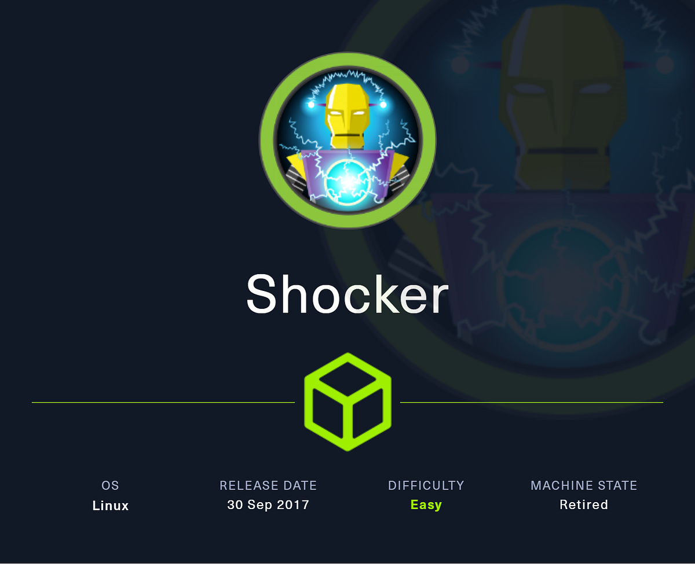
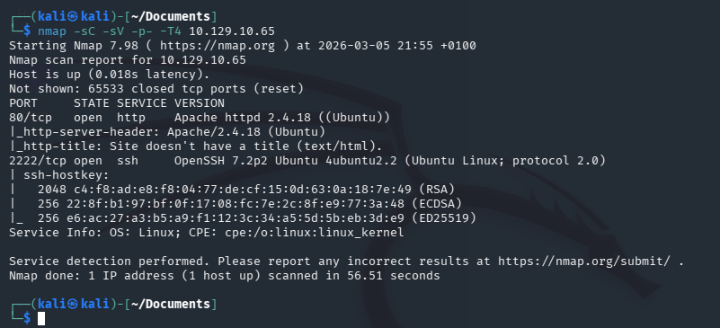
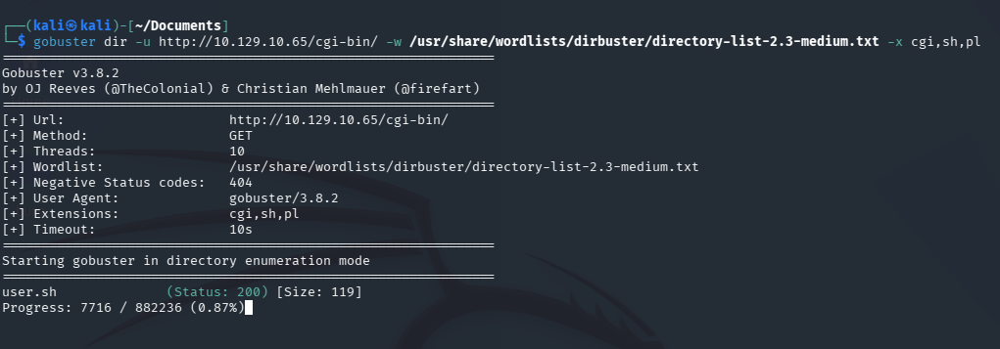
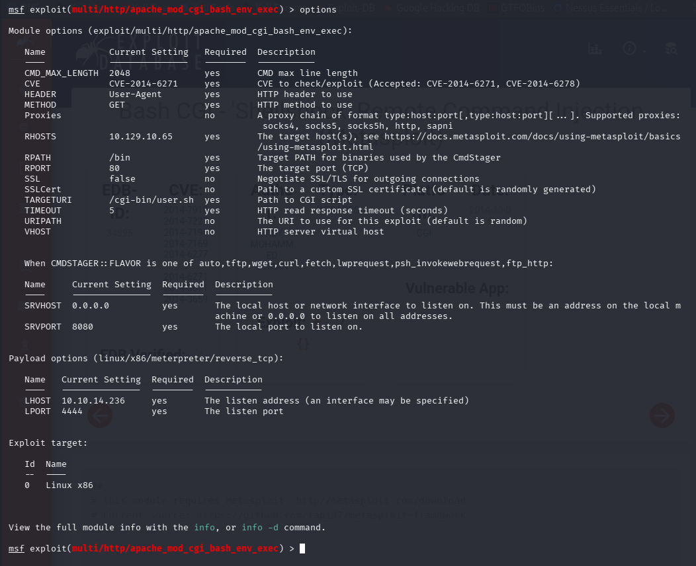
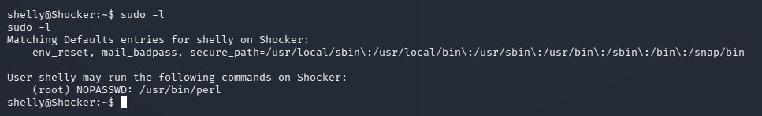

# Shocker — Hack The Box



| | |
|---|---|
| **Platform** | Hack The Box |
| **Difficulty** | Easy |
| **OS** | Linux |
| **Status** | ✅ Retired |
| **Key techniques** | Shellshock (CVE-2014-6271), GTFOBins `sudo perl` |

---

## TL;DR

Shocker is a compact demonstration of Shellshock, one of the most widespread
web vulnerabilities of the last decade — a `bash`-parsing bug that turned
almost any CGI script into remote code execution. A single vulnerable CGI
script is enough for a foothold, and root follows from a `sudo` rule around
Perl that GTFOBins turns directly into a shell.

---

## Recon & Enumeration

```bash
nmap -sC -sV -p- -T4 10.129.10.65
```



An unusual SSH port (2222) and HTTP (80). Directory and extension-aware
fuzzing against the web root found a `/cgi-bin/` directory and, inside it, a
script named `user.sh`:

```bash
gobuster dir -u http://10.129.10.65 -w <wordlist> -x sh,cgi,pl
```



A `.sh` script directly reachable via `/cgi-bin/` is close to a signature for
**Shellshock** (CVE-2014-6271) — a bug in how older `bash` versions parse
function definitions passed through environment variables, which Apache's
`mod_cgi` exposes to any HTTP header an attacker controls.

---

## Foothold / Initial Access



A matching Metasploit module targets exactly this pattern:

```
use exploit/multi/http/apache_mod_cgi_bash_env_exec
set RHOST 10.129.10.65
set TARGETURI /cgi-bin/user.sh
run
```

This landed a shell as `shelly` directly, with the user flag reachable
immediately at `/home/shelly/user.txt`.

---

## Privilege Escalation



`sudo -l` showed `shelly` could run `/usr/bin/perl` with no password. Perl
has a well-documented GTFOBins entry for exactly this scenario — a language
interpreter with unrestricted `sudo` access can simply be told to spawn a
shell instead of running a script:

```bash
sudo perl -e 'exec "/bin/sh"'
```

Root shell obtained, root flag retrieved.

---

## Lessons Learned

- **A `.sh`/`.cgi`/`.pl` file reachable directly under `/cgi-bin/` is worth
  checking for Shellshock specifically**, even years after its disclosure —
  legacy CGI deployments still turn up regularly.
- **`sudo` access to any general-purpose language interpreter (Perl, Python,
  Ruby, etc.) is a root shell**, not a narrow scripting permission — GTFOBins
  documents the exact one-liner for nearly every interpreter.
- **Vulnerability classes outlive their disclosure date** — Shellshock is
  over a decade old, but the underlying lesson (environment-variable input
  reaching a shell interpreter unsanitized) still applies to modern software.

---

## Remediation

- Patch `bash` to a version unaffected by Shellshock; this should be a
  baseline check on any Linux host still running CGI.
- Retire `mod_cgi`/CGI-based scripting in favor of modern application
  frameworks that don't pass raw environment variables to a shell.
- Never grant `sudo` access to a general-purpose interpreter without
  restricting exactly which script it may execute (and ensuring that script
  isn't itself writable by the granted user).

---

## Tools used

- `nmap`, `gobuster`
- Metasploit (`apache_mod_cgi_bash_env_exec`)
- `sudo`, `perl`

---

**See also:** [Linux privilege escalation methodology](../../methodology/linux-privesc.md)

---

**Machine:** [Hack The Box — Shocker](https://www.hackthebox.com/machines/shocker)
