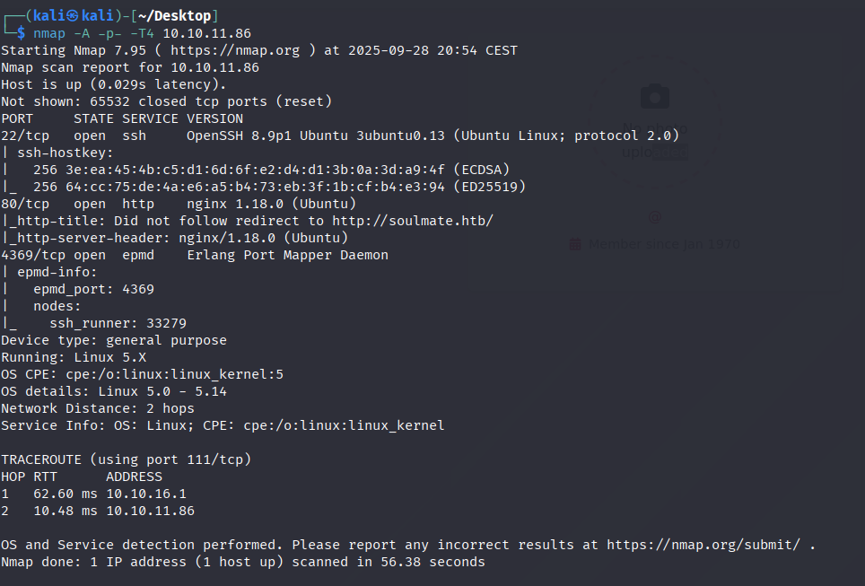
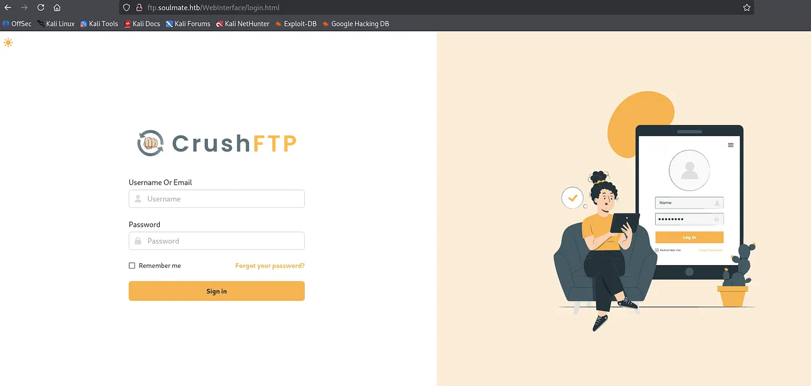
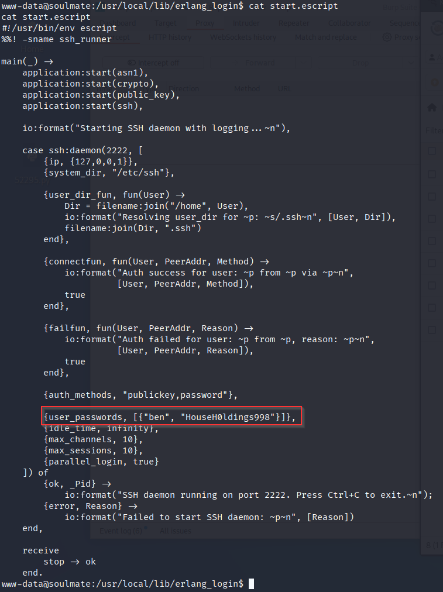

# Soulmate — Hack The Box

| | |
|---|---|
| **Platform** | Hack The Box |
| **Difficulty** | Easy |
| **OS** | Linux |
| **Status** | ✅ Retired |
| **Key techniques** | Virtual-host discovery, CrushFTP auth bypass (CVE-2025-31161), Erlang/BEAM shell abuse |

---

## TL;DR

Soulmate hides its real attack surface behind a subdomain that only shows up
under vhost fuzzing. That subdomain runs CrushFTP, vulnerable to a very
recent authentication-bypass CVE that lets an attacker create their own
account outright. From there, a file upload gives a web shell, and local
enumeration turns up credentials for a service tied to Erlang — whose
interactive shell, once reached, executes arbitrary OS commands directly as
root.

---

## Recon & Enumeration

```bash
nmap -A -p- -T4 10.10.11.86
```



SSH, HTTP, and port 4369 — the **Erlang Port Mapper Daemon (epmd)**, an
unusual and specific signal that some component of this box runs on the
Erlang/BEAM VM (used by RabbitMQ, CouchDB, and similar systems). The main
website offered nothing directly useful, and a directory scan found only a
blocked `/assets` path — so I moved to virtual-host discovery instead of
digging deeper into the same site:

```bash
ffuf -u http://10.10.11.86 -H "Host: FUZZ.soulmate.htb" -w <subdomains-wordlist> -fw 4
```

This revealed `ftp.soulmate.htb` — a subdomain invisible from the main site
entirely, hosting a **CrushFTP** login page.

 The page source leaked the exact
version: `11.W.657`.

---

## Foothold / Initial Access

That version is affected by **CVE-2025-31161**, a CrushFTP authentication
bypass disclosed only shortly before this box's release — a public PoC
allows creating a temporary account without any existing credentials:

```bash
python3 exploit.py --target ftp.soulmate.htb --exploit --new-user admin --password '<PASSWORD>' --port 80
```

Logging in with the newly created account, the **User Manager** panel showed
upload rights could be self-granted. Enabling upload on the account and
dropping a PHP web shell, then triggering it directly:

```bash
curl http://soulmate.htb/shell.php
```

gave a reverse shell as `www-data`. Since nothing obvious stood out
immediately, I ran `linpeas.sh` to widen the search — and it flagged a script
tied to the Erlang service spotted in the initial scan, containing hardcoded
credentials for a system user, `ben`:



```bash
ssh ben@soulmate.htb
```

User flag retrieved.

---

## Privilege Escalation

The same script that leaked `ben`'s credentials also referenced a local
service listening on port 2222 tied to the same account. Connecting to it
locally didn't give a normal shell — it dropped directly into an **Erlang
interactive shell**:

```
ben@soulmate:~$ ssh ben@localhost -p 2222
Eshell V15.2.5 (press Ctrl+G to abort, type help(). for help)
(ssh_runner@soulmate)1>
```

Erlang's `os:cmd/1` function executes an arbitrary OS command and returns its
output as a string — meaning this "SSH session" was actually a fully
privileged code-execution primitive, not a restricted application shell:

```erlang
(ssh_runner@soulmate)1> os:cmd("id").
"uid=0(root) gid=0(root) groups=0(root)\n"
```

The Erlang runtime backing this service was running as root. Reading the
flag directly through the same primitive:

```erlang
(ssh_runner@soulmate)2> os:cmd("cat /root/root.txt").
```

---

## Lessons Learned

- **Vhost fuzzing can reveal an entire second application invisible from the
  main site** — the real vulnerability here was never reachable without it.
- **`epmd` (port 4369) is a strong, specific fingerprint for Erlang/BEAM
  workloads** — recognizing it early would have flagged the eventual escape
  route much sooner.
- **A restricted-looking custom shell built on a general-purpose language
  runtime (Erlang, Lua, etc.) needs to be checked for that language's own
  "run a command" primitive** — `os:cmd/1` turned what looked like a
  service-specific admin shell into unrestricted command execution.

---

## Remediation

- Don't rely on subdomain obscurity as access control — any DNS name pointed
  at the same host is reachable by anyone who finds it, including via
  brute-force fuzzing.
- Patch CrushFTP promptly; authentication-bypass CVEs are typically weaponized
  within days of disclosure.
- Never expose a raw language-runtime shell (Erlang, Python, Lua) as an
  administrative interface — if a restricted shell is required, it must
  explicitly disable or sandbox arbitrary code execution primitives.

---

**Machine:** [Hack The Box — Soulmate](https://www.hackthebox.com/machines/soulmate)
