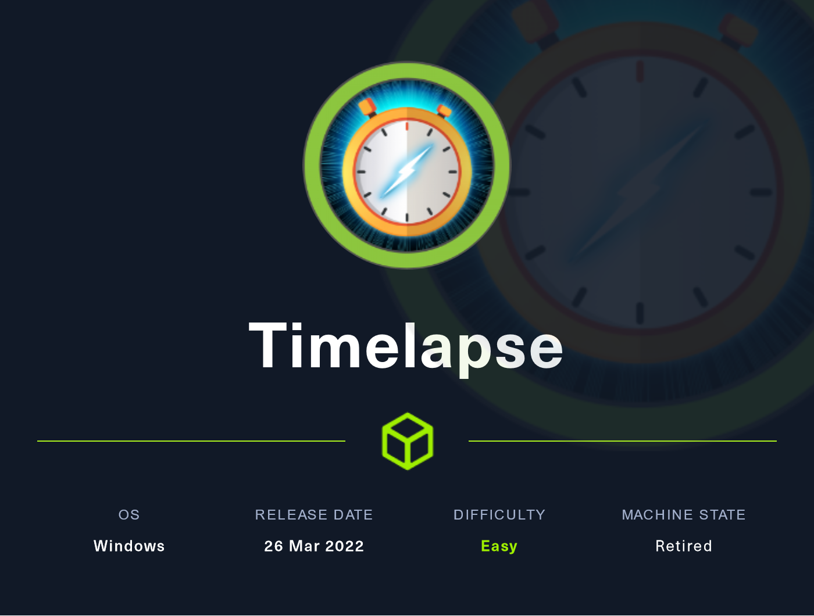
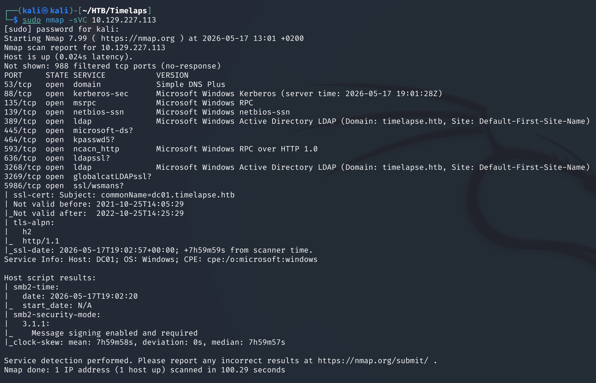
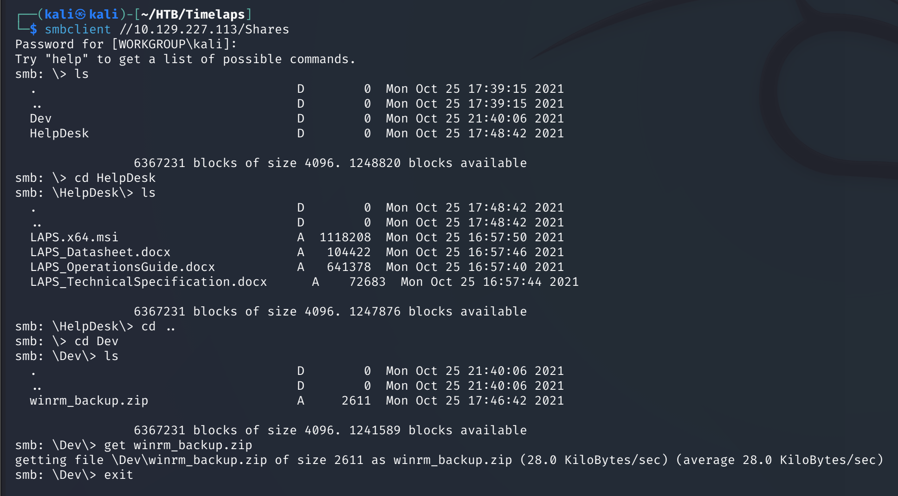
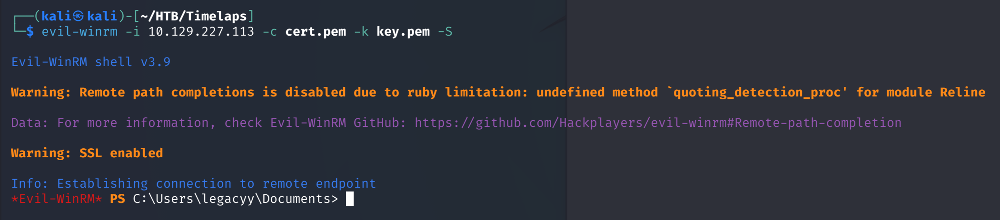
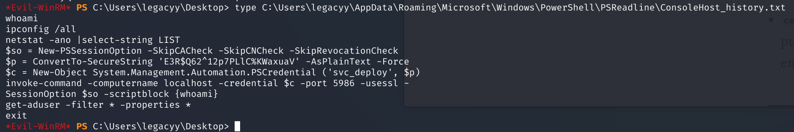
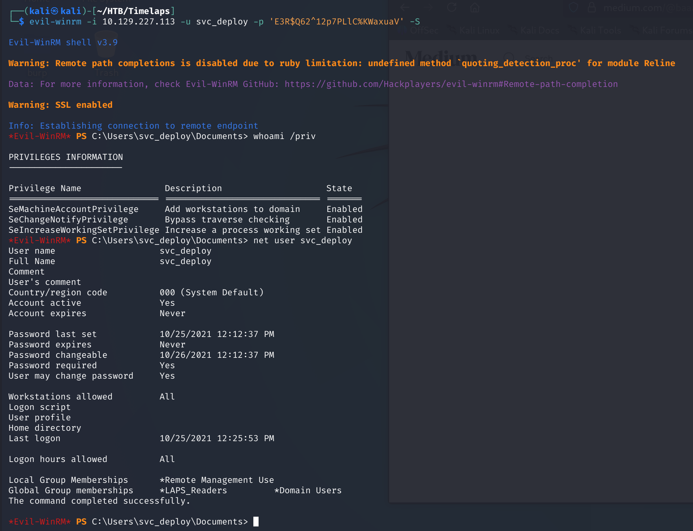
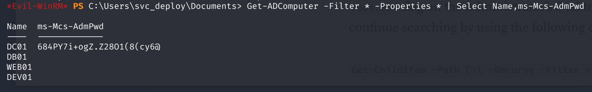

# Timelapse — Hack The Box

<p align="center">
  
</p>

| | |
|---|---|
| **Platform** | Hack The Box |
| **Difficulty** | Easy |
| **OS** | Windows (Active Directory) |
| **Status** | ✅ Retired |
| **Key techniques** | Offline archive/PFX cracking, certificate-based WinRM auth, PowerShell history leak, LAPS abuse |

---

## TL;DR

Timelapse chains three layers of "encrypted, but crackable" data: a
password-protected ZIP, a password-protected PFX certificate bundle
inside it, and finally a PowerShell history file leaking plaintext
credentials once inside. The last account belongs to a group with LAPS
read rights, which directly hands over the local Administrator password
for the domain controller.

---

## Recon

```bash
sudo nmap -sVC 10.129.227.113
```



An AD host with SMB open. Checked for anonymous access:

```bash
smbclient -L //10.129.227.113
```

A `Shares` folder was reachable, and inside it a `winrm_backup.zip` — a
name that's basically an invitation, since a backup of WinRM
configuration almost always means certificate or credential material.



---

## Foothold / Initial Access

The ZIP was password-protected. Rather than guess, extracted a crackable
hash from the archive itself and let `john` do the guessing:

```bash
zip2john winrm_backup.zip > winrm.hash
john winrm.hash -wordlist:/usr/share/wordlists/rockyou.txt
```

Inside was `legacyy_dev_auth.pfx` — a PKCS#12 bundle, also
password-protected. Same approach:

```bash
pfx2john legacyy_dev_auth.pfx > pfx.hash
john pfx.hash -wordlist:/usr/share/wordlists/rockyou.txt
```

With the PFX password recovered, extracted the certificate and private
key it contained:

```bash
openssl pkcs12 -in legacyy_dev_auth.pfx -nokeys -out cert.pem
openssl pkcs12 -in legacyy_dev_auth.pfx -nocerts -out key.pem -nodes
```

A client certificate plus its private key is a direct WinRM
authentication method — no password needed at all once you have both
halves:

```bash
evil-winrm -i 10.129.227.113 -c cert.pem -k key.pem -S
```



Shell landed as `legacyy`, and the user flag was on the desktop.

---

## Privilege Escalation

### PowerShell history leak

A recurring Windows artifact worth checking on every foothold: PowerShell
command history.

```powershell
type C:\Users\legacyy\AppData\Roaming\Microsoft\Windows\PowerShell\PSReadline\ConsoleHost_history.txt
```



The history contained a full `PSCredential` construction for a
`svc_deploy` account, password included in plaintext.

### LAPS abuse

Connected as `svc_deploy` and checked what that account could do:

```bash
evil-winrm -i 10.129.227.113 -u svc_deploy -p '<RECOVERED_PASSWORD>' -S
```

```powershell
whoami /priv
net user svc_deploy
```



`svc_deploy` is a member of a custom **`LAPS_Readers`** group. LAPS
(Local Administrator Password Solution) exists so that every machine's
local admin password is randomized and stored centrally in AD, readable
only by authorized accounts. Being in a group explicitly granted LAPS
read rights means the domain controller's local Administrator password
is available for the taking:

```powershell
Get-ADComputer -Identity <DC-HOSTNAME> -Properties ms-Mcs-AdmPwd
```



That password gave a WinRM session as Administrator and the root flag.

---

## Lessons Learned

- A password-protected archive is not the end of the road — `zip2john`
  and `pfx2john` turn "I'd need the password" into "I need a wordlist,"
  which is a much easier problem.
- A certificate + private key pair authenticates like a credential — once
  extracted from a PFX, there's no password to guess at all for WinRM.
- PowerShell history is a recurring credential leak across multiple boxes
  in this portfolio — it's worth checking as a reflex on every Windows
  foothold, not just when nothing else works.
- LAPS read rights are effectively local-admin-on-every-managed-host —
  membership in a LAPS reader group deserves the same scrutiny as any
  other privileged group.

---

## Remediation

- Don't store credential material (PFX bundles, backup ZIPs) on
  network-reachable shares, even password-protected — assume any password
  can eventually be cracked offline.
- Clear or disable PowerShell history/transcription on hosts where
  credentials are ever typed, and avoid typing plaintext passwords into a
  live session at all.
- Restrict LAPS-reader group membership tightly and audit it on the same
  cadence as Domain Admins.

---

## Tools used

- `nmap`
- `smbclient`
- `zip2john`, `pfx2john`, `john`
- `openssl`
- `evil-winrm`

---

**See also:** [Active Directory methodology](../../methodology/active-directory.md)

---

**Machine:** [Hack The Box — Timelapse](https://www.hackthebox.com/machines/timelapse)
