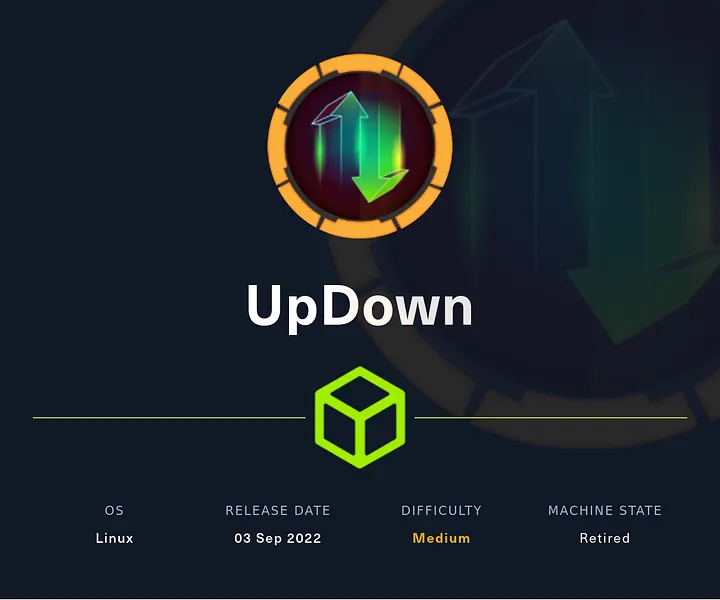
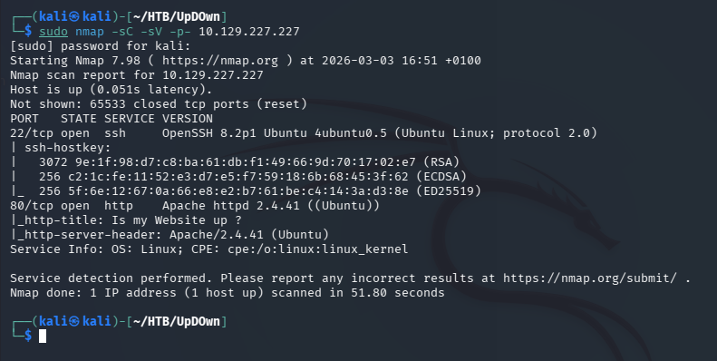
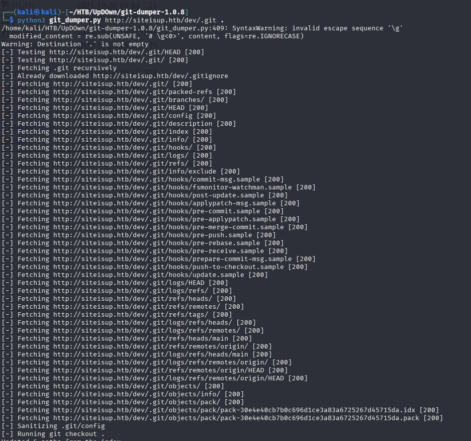
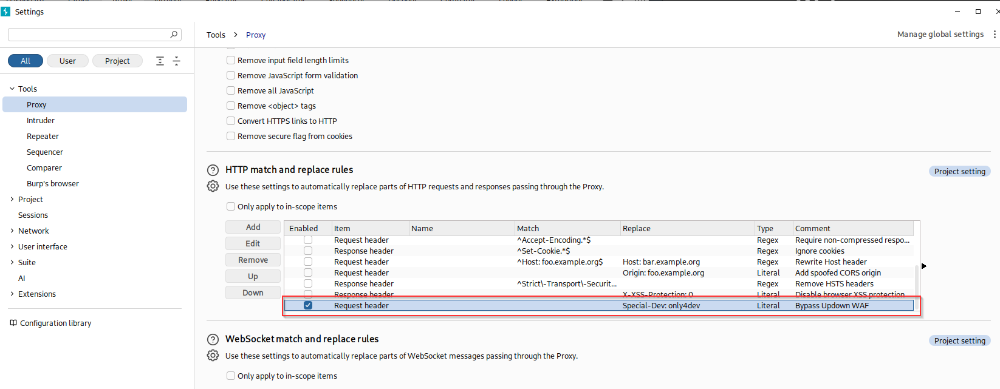
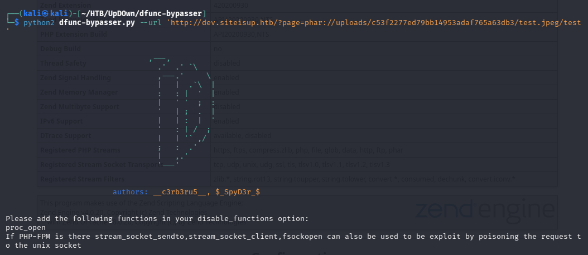

# UpDown — Hack The Box



| | |
|---|---|
| **Platform** | Hack The Box |
| **Difficulty** | Medium |
| **OS** | Linux |
| **Status** | ✅ Retired |
| **Key techniques** | Exposed `.git` directory, hidden-header WAF bypass, `phar://` extension-filter bypass, disabled-function bypass, SUID Python2 `input()` injection |

---

## TL;DR

UpDown is the deepest chain in this batch: an exposed `.git` directory leaks
source code for a hidden developer subdomain gated behind a secret HTTP
header. Once inside, an upload filter blocks known dangerous extensions but
not `.phar`, and the PHP `phar://` wrapper turns a renamed archive into
executable code anyway. With most dangerous PHP functions disabled, a
function-discovery tool finds one that still works. From there, a SUID
Python 2 script — vulnerable to `input()` behaving like `eval()` — provides
the pivot to a second user, and a `sudo` rule around `easy_install` finishes
the job.

---

## Recon & Enumeration

```bash
nmap -sC -sV -p- 10.129.227.227
```



SSH and HTTP. The web app checked whether a given site was "up," and named a
domain in its footer — added to `/etc/hosts`. Virtual-host fuzzing found a
second subdomain:

```bash
ffuf -u http://siteisup.htb -H "Host: FUZZ.siteisup.htb" -w <subdomains-wordlist> -fs 1131
```

`dev.siteisup.htb` came back with a `403` — reachable, but blocked. Directory
brute-forcing against the *main* site (not the blocked subdomain) turned up
an exposed **`.git`** directory:

```bash
gobuster dir -u http://siteisup.htb/dev -w <wordlist>
```



A reachable `.git` folder means the entire repository history can be pulled
down with a tool like `git-dumper` — effectively the full source code,
including anything a developer ever committed and later "removed."

---

## Foothold / Initial Access

Dumping the repository and reading `.htaccess` revealed the actual gate on
the dev subdomain: a required custom header, `Special-Dev: only4dev`.



Adding that header to every request unlocked the subdomain entirely — the
`403` had never been a real access control, just a header check.

The dev site's `index.php` used PHP's `include()` on a user-supplied
parameter — a classic Local File Inclusion / Remote Code Execution shape —
with a blacklist blocking extensions like `.php` and `.py`. The blacklist
didn't cover **`.phar`**, PHP's own archive format for bundling code. Renaming
a phar archive with a `.jpeg` extension (since `.zip` was separately
blacklisted) still let PHP interpret its contents through the `phar://`
wrapper once uploaded:

```
http://dev.siteisup.htb/?page=phar://uploads/<hash>/test.jpeg/test
```

This confirmed arbitrary PHP execution — but the PHP info page revealed
`system()`, `shell_exec()`, and `popen()` were all disabled, closing off the
obvious reverse-shell functions. Rather than trying each disabled function by
hand, **dfunc-bypasser** automated checking which "dangerous" functions were
still actually enabled — flagging `proc_open` as available, a less commonly
disabled function that works the same way `popen` does for spawning
processes.



Wrapping a reverse-shell payload with `proc_open`, packaging it the
same `.phar`-as-`.jpeg` way, and triggering it through the wrapper gave a
shell as `www-data`.

---

## Privilege Escalation

Enumerating the filesystem found a SUID binary, `siteisup`, alongside its
Python source. The script used Python 2's `input()` function to read a URL —
and `input()` in Python 2 evaluates its input as a Python expression (unlike
`raw_input()`), meaning it behaves like `eval()` on anything typed at it:

```python
__import__('os').system('/bin/bash')
```

Running the SUID binary and supplying that as the "URL" executed it in the
context of the file's owner, `developer` — landing a shell as that user and
exposing their private SSH key for a more stable foothold. User flag
retrieved.

`sudo -l` as `developer` showed passwordless access to `easy_install` — a
Python packaging tool with a documented GTFOBins entry, since installing an
arbitrary package can run arbitrary setup code:

```bash
sudo easy_install <malicious-package>
```

Root shell obtained, root flag retrieved.

---

## Lessons Learned

- **An exposed `.git` directory is effectively a full source-code leak** —
  it revealed both the hidden subdomain's code and the exact header needed to
  bypass its access control.
- **Extension blacklists need to account for every format a language runtime
  can execute**, not just the obvious ones — `.phar` doing exactly what
  `.php` does was the whole bypass here.
- **A disabled-function list is not a complete lockdown** — automated
  discovery (dfunc-bypasser) found a working alternative in seconds where
  manual guessing could have taken much longer.
- **Python 2's `input()` is functionally `eval()`** — any SUID/privileged
  script still using it on Python 2 is a code-execution vulnerability, not
  just bad practice.

---

## Remediation

- Never deploy a `.git` directory to a publicly reachable web root; `.git`
  should be excluded at the web-server config level, not just `.gitignore`d.
- Treat "hidden via custom header" as obscurity, not access control — pair it
  with real authentication if the subdomain is meant to be restricted.
- Blacklist-based upload/extension filtering should be replaced with
  allow-lists; `phar`, `phtml`, and similar executable formats are routinely
  missed.
- Migrate any SUID script off Python 2, and never use `input()` (Python 2) on
  untrusted data — use `raw_input()` and explicit parsing instead.

---

## Tools used

- `nmap`, `ffuf`, `gobuster`
- `git-dumper`
- Burp Suite
- dfunc-bypasser
- `sudo`, `easy_install`

---

**See also:** [Linux privilege escalation methodology](../../methodology/linux-privesc.md)

---

**Machine:** [Hack The Box — UpDown](https://www.hackthebox.com/machines/updown)
