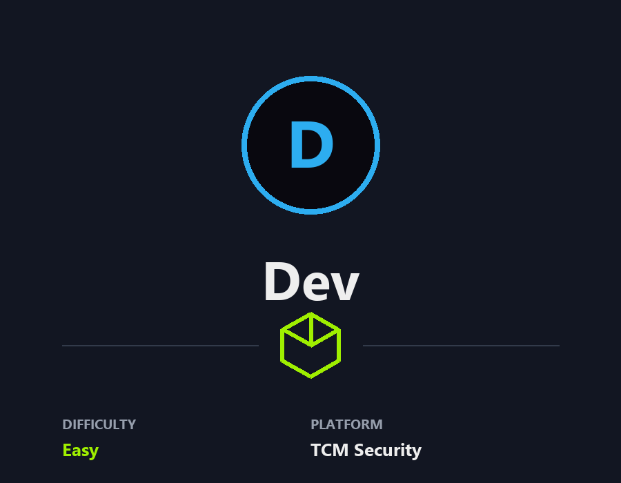

# Dev

<p align="left">
  
</p>

We're working on gaining root access to a machine called Dev from TCM Security. It's not widely available or discussed elsewhere, making it a great starting point for beginners in penetration testing.

## Check network integration

We need to login on the machine:

- Login: root
- Password: tcm

No we need to setup DHCP

```bash
dhclient
ip a
```

Check the ip adres of the target machine

No we can run nmap scan on vulnerable machine

## Nmap

Use following command to scan the target IP address.

```bash
nmap -A -T4 -p- 192.168.100.129
```

- nmap initiates scan.
- -A enables OS detection, version detection, script scanning, and traceroute. It's an aggressive scan by combining several advanced features.
- -T4 sets the timing template to "4", which is more aggressive and faster than the default.
- -p- specifies that Nmap should scan all 65535 TCP ports on the target host. This is useful for discovering open ports across the entire range.
- 192.168.100.129 is the target IP address for the scan.

## Analyzing Scan Results:

- Ports:
	- 80: HTTP - Apache httpd 2.4.38 (Debian)
		- Bolt - Installation error
	- 2049: NFS - 3-4 (RPC #100003)
	- 8080: HTTP - Apache httpd 2.4.38 (Debian)

## Port 80

I have runned gobuster on port 80 to see any direcortys on the website

Command:

```bash
gobuster dir -u http://192.168.100.129:80 -w /usr/share/wordlists/dirbuster/directory-list-2.3-medium.txt
```

#### Let's check /server-status:

#### Let's check /extensions:

#### Check /vendor:

#### Index /src:

#### Check index /app:

Let's look what is in the config folder:

We can see some of .yaml config's.

I found possible password in the config.yml file.

Let's try to open /app/database:

Unlucky nothing.

## Port 8080

I'm gonna run Fuzz scan on port 8080 to see if we can get more dictionaries on this site

Command:
```bash
ffuf -w /usr/share/wordlists/dirbuster/directory-list-2.3-medium.txt:FUZZ -u http://192.168.100.129:8080/FUZZ
```

Here we can se an extra dictionarie and that is a /dev

Let's go to this dictionary

We can look around, but nothing interesting.

What is a common vulnerability with webpages that we can exploit within the URL?

Google is our go-to. Whenever we learn about a new service or program we should be slapping it into google and adding the word exploit or vulnerability on the end. In this case it appears Boltwire 6.03 has a Local File Inclusion vulnerability.

We currently don’t know the version of Boltwire being used, but we can try the LFI and see. Below is the URL we use in the browser, for this to work you must be an authenticated user, which means you need to make an account.

LFI it is a method of using the website to navigate through the host server, normal practise it to make it so that these types of URLs are sanitised. However, if not, we can use directory traversal (../) to move back to root, and then go into etc/passwd to be given the list of users.

We gonna paste this into our link:

- index.php?p=action.search&action=../../../../../../../etc/passwd
    

If you go through the list you will find a username at the bottom jeanpaul, that will be a username we make note of.

## Port 2049

Let's check what is in the NFS (Network File Share)

Command:
```bash
showmount -e 192.168.100.129
```

Firts i'm going to make a directory for mount

I'm gonna now mount this to directory on my attack machine

- - t we need to set the type. It is nfs
- Then target ip adres with the file we want to mount
- As last directory where we want to set the file

Let's go now to this directory:

```bash
cd /mnt/Dev
ls
```

Let's try to unzip this file

Unfortunely we need a password to unzip this file

We gonna try to crack this file and see if we can maybe get in there

Command:
```bash
fcrackzip -v -u -D -p /usr/share/wordlists/rockyou.txt save.zip
```

- - v for verbose, we want to have verbosity here and see all the output
- - u means unzipping the files
- - D We gonna using a dictionary attack
- - p We gonna using a file in order to attack
- Wordlist rockyou.txt

Let's try now to open this file

Let's see what is in the id_rsa

We get a private key in here

Let's see what is in the txt file

## SSH

We now have an RSA key, which is a commonly used form of Asymmetric encryption for SSH (public/private key), so let’s try it out!

You will need to attempt this in the same directory as the id_rsa key, as that will be used.

We know a username jeanpaul from the LFI vulnerability and the note.txt was signed by jp so we will try ssh with him.

```bash
ssh -i id_rsa jeanpaul@192.168.100.129
```

Looking back at our notes we have I_love_java from the config file. Using that we get in.

We are in!

We are now in the machine via ssh, running whoami confirms we are jeanpaul and not yet root. We can also see if we have sudo by using the command sudo -l which will show us when (or if ) we can use sudo.

We can run sudo zip witout the password

We want now to abuse that feature and be able to escalate into root

Go to website:

[GTFOBins](https://gtfobins.github.io/)

Great websie for escalations. We are going to select suda and scrolling down for zip.

Here is how we use sudo as a zip in order to get a root privilages

Copy this commands

We are now root!

Sudo runs as elevated, we droped into a shell
---

**Live version:** [read this write-up on my blog](https://debasjan.github.io/writeups/tcm-dev/)
