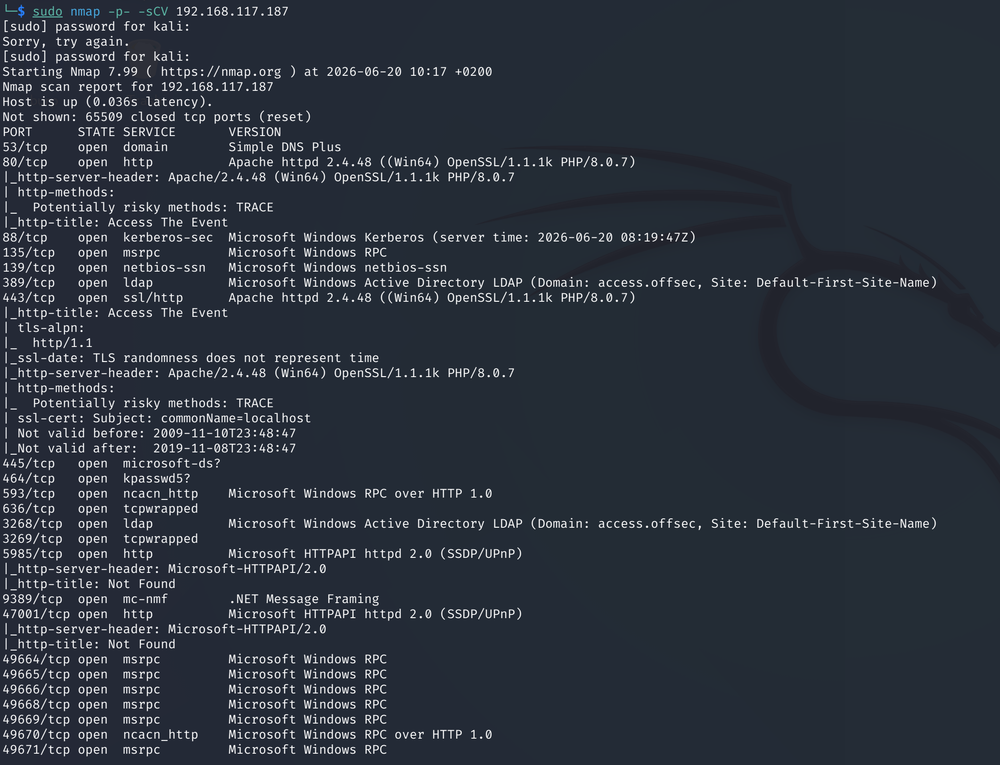
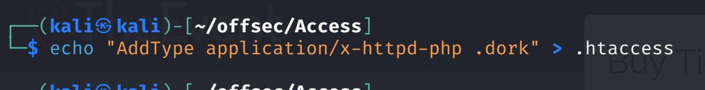
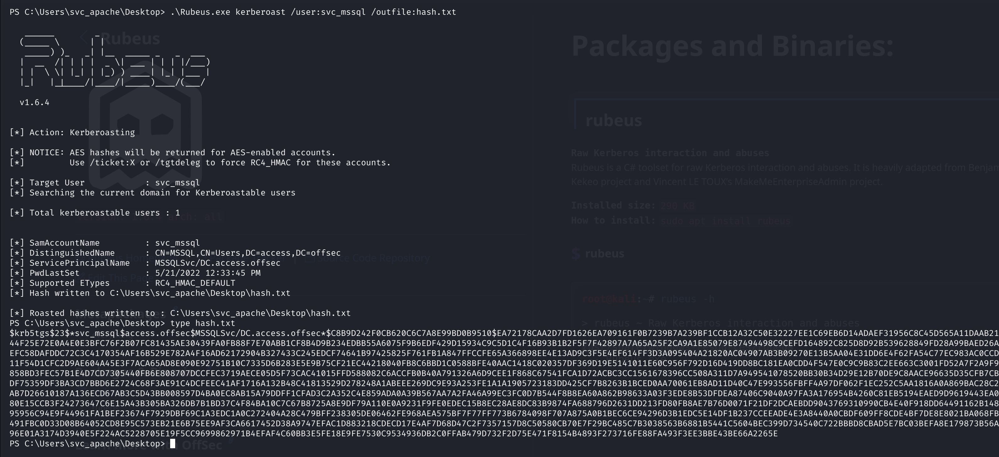

# Access — Proving Grounds

| | |
|---|---|
| **Platform** | Proving Grounds (Practice) |
| **Difficulty** | Easy |
| **OS** | Windows |
| **Status** | ✅ Practice machine, no overlap with the OSCP exam pool |
| **Key techniques** | Upload filter bypass via `.htaccess`, SPN enumeration with PowerView, Kerberoasting |

---

## TL;DR

Access is a Windows box where a file-upload form blocks the `.php` extension
but not `.htaccess` — re-registering a harmless-looking extension as
executable PHP through an uploaded `.htaccess` sidesteps the filter entirely.
From the resulting low-privilege shell, enumerating Active Directory service
accounts with PowerView turns up a Kerberoastable SPN, and cracking that
ticket hands over the next account directly.

---

## Recon & Enumeration

```bash
sudo nmap -p- -sCV <TARGET_IP>
```



A web application accepting file uploads was the standout service.

---

## Foothold / Initial Access

The upload form rejected `.php` outright, but did no filtering on
`.htaccess`. Uploading a custom `.htaccess` that re-maps an arbitrary
extension to the PHP handler —

```
AddType application/x-httpd-php .dork
```



— means any file with that new extension executes as PHP regardless of what
the upload filter blocked. Renaming a standard PHP web shell (Ivan Sincek's)
to the new extension and uploading both files got it past the filter
untouched. Brute-forcing the upload directory with `gobuster` located where
the files landed, and browsing to the renamed shell triggered code execution
and a reverse shell.

Checking privileges on landing showed the service account had nothing
useful directly (`whoami /priv` came back empty). Since this was a domain
box, the next move was AD enumeration rather than local privesc: downloading
**PowerView** onto the target and querying for Service Principal Names
turned up a SQL service account with an SPN set — a **Kerberoastable**
account.

---

## Privilege Escalation

Uploading **Rubeus** to request and export the Kerberos ticket for the SQL
service account's SPN produced a crackable hash offline:

```
Rubeus.exe kerberoast /user:svc_mssql /outfile:hash.txt
```

```bash
hashcat -m 13100 hash.txt /usr/share/wordlists/rockyou.txt
```



The hash cracked against `rockyou.txt`, handing over valid credentials for
`svc_mssql`.

---

## Lessons Learned

- **Extension filters that only block one extension are trivially bypassed**
  by uploading a config file (`.htaccess`) that maps a *different*, allowed
  extension to the same interpreter.
- On a domain-joined box, a dead end in local privesc is a cue to pivot to
  **AD enumeration** — PowerView's SPN query is a fast, low-noise first step.
- Any service account with an SPN set is a Kerberoasting candidate the
  moment any authenticated (or in this case, code-execution) foothold
  exists — no admin rights are needed to request the ticket.

---

## Remediation

- Validate uploads by content/MIME type, not extension, and block
  `.htaccess`/web-server config files from user-writable upload directories.
- Use strong, random passwords for service accounts, or move to Group
  Managed Service Accounts (gMSA) to make offline cracking infeasible.
- Restrict SPN registration and monitor for Kerberoasting activity (a burst
  of TGS requests for accounts with SPNs).

---

**Machine:** [Proving Grounds — Access](https://portal.offsec.com/labs/play)
