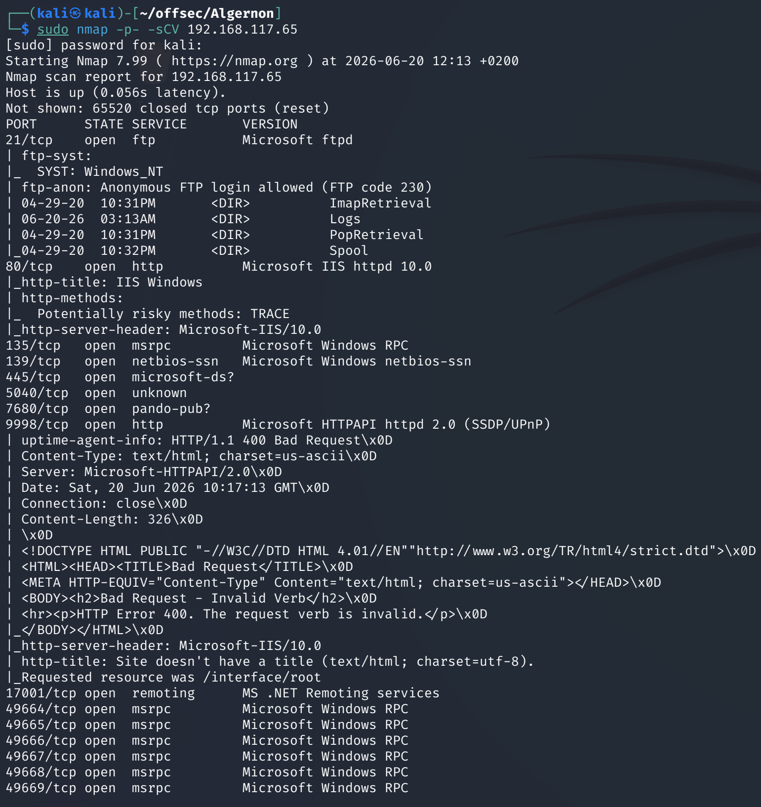
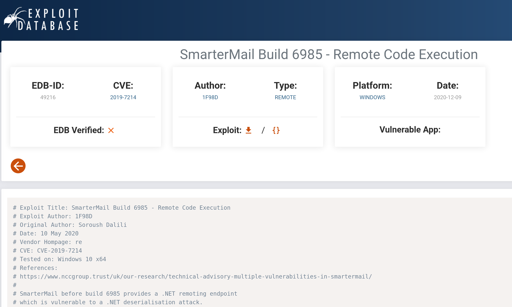
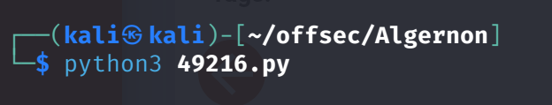

# Algernon — Proving Grounds

| | |
|---|---|
| **Platform** | Proving Grounds (Practice) |
| **Difficulty** | Easy |
| **OS** | Windows |
| **Status** | ✅ Practice machine, no overlap with the OSCP exam pool |
| **Key techniques** | Version-fingerprinting via source, public pre-auth RCE (SmarterMail) |

---

## TL;DR

Algernon runs an outdated build of SmarterMail's webmail login page, and the
version is disclosed straight in the page source. That build has a public,
unauthenticated remote code execution exploit — no chaining, no privilege
escalation puzzle, just identify the version and run the matching exploit
for a direct `NT AUTHORITY\SYSTEM` shell.

---

## Recon & Enumeration

```bash
sudo nmap -p- -sCV <TARGET_IP>
```



Port 9998 served a SmarterMail login page. Viewing the page source
disclosed the exact build number, which turned out to be older than the
build the exploit targets (older builds inherit the same unpatched flaw).

---

## Foothold / Initial Access



Searching for the disclosed build number surfaced a public remote code
execution exploit for SmarterMail (pre-authentication, no login required):

```bash
searchsploit smartermail
searchsploit -m windows/remote/49216.py
```

After swapping in the target IP and a listener IP/port in the exploit
script, running it delivered command execution directly as
`NT AUTHORITY\SYSTEM` — no separate privilege escalation stage needed:

```bash
python3 49216.py
nc -lvnp 4444
```



---

## Lessons Learned

- **Version numbers in page source or login banners are free
  reconnaissance** — always check before assuming a version needs deeper
  fingerprinting.
- Not every box has a separate privesc phase: some public exploits land
  directly at the highest privilege level the vulnerable service runs as,
  which for a mail server bound to no dedicated service account is often
  SYSTEM outright.
- A build number just below a patched version is a strong signal to check
  for exploit-db/Metasploit coverage before trying anything more
  complicated.

---

## Remediation

- Patch SmarterMail to a version past the disclosed RCE, and keep mail
  server software on a patch cadence given its internet-facing exposure.
- Suppress version banners/build numbers from unauthenticated pages where
  possible.
- Run mail services under a dedicated, minimally-privileged service account
  rather than allowing them to execute as SYSTEM.

---

**Machine:** [Proving Grounds — Algernon](https://portal.offsec.com/labs/play)
