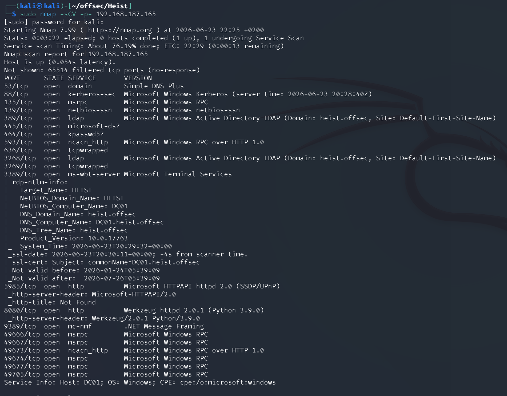
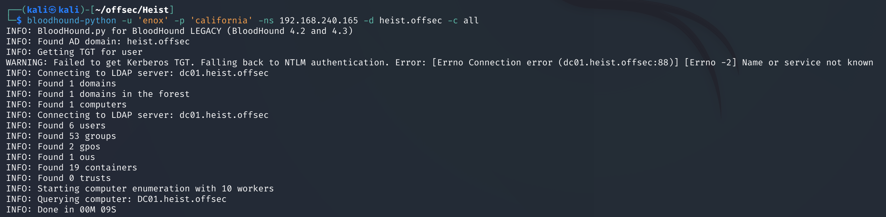
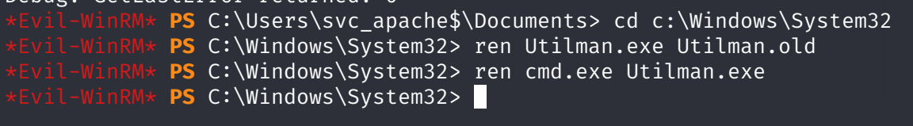

# Heist — Proving Grounds

| | |
|---|---|
| **Platform** | Proving Grounds (Practice) |
| **Difficulty** | Medium |
| **OS** | Windows (Active Directory) |
| **Status** | ✅ Practice machine, no overlap with the OSCP exam pool |
| **Key techniques** | SSRF-triggered NTLM capture (Responder), BloodHound-guided GMSA password read, `SeRestorePrivilege` abuse (Utilman binary swap) |

---

## TL;DR

Heist's web app on port 8080 can be coerced into making an outbound request
to an attacker-controlled listener, which is enough to capture an NTLMv2
handshake with Responder and crack it offline. That gets an initial WinRM
login, and BloodHound maps a path from there to a service account's
**GMSA** password — readable because the low-priv user's group is allowed
to retrieve it. The service account's own privileges then grant
`SeRestorePrivilege`, abused by overwriting Utilman's binary with `cmd.exe`
and triggering it through the RDP login screen for a SYSTEM shell.

---

## Recon & Enumeration

```bash
sudo nmap -sCV -p- <TARGET_IP>
```



A web application on port 8080 stood out as the entry point to probe.

---

## Foothold / Initial Access

Testing the web app's request-handling behavior with a local Python HTTP
server confirmed it would make outbound requests when fed a
attacker-controlled URL — a Server-Side Request Forgery. Rather than reading
data through it, the SSRF was pointed at Responder listening for SMB/HTTP
auth attempts, which captured a valid NTLMv2 handshake for a domain account.

Cracking that hash offline with John recovered the plaintext password, which
worked directly for a WinRM login (`evil-winrm`). User flag retrieved.

---

## Privilege Escalation

With a foothold on a domain-joined box, the next step was collecting AD
relationship data with BloodHound (`bloodhound-python`), then reviewing the
compromised user's outbound object control in the resulting graph.

 The user
was a member of a **"web admins"** group, which in turn had permission to
read the **GMSA (Group Managed Service Account) password** for a service
account — GMSA passwords are normally rotated and inaccessible, but any
principal explicitly authorized to retrieve them can read the current value
directly from AD.

Using a GMSA password reader tool uploaded to the target extracted the
service account's current password hash:

```
GMSAPasswordReader.exe --accountname svc_apache
```

Validating the hash against WinRM with `netexec` confirmed it authenticated
successfully ("Pwn3d!"), and logging in with `evil-winrm` using that hash
gave a shell as the service account.

A script referencing `SeRestorePrivilege` was found in that account's
documents, matching a privilege the account actually held. `SeRestorePrivilege`
allows overwriting arbitrary files regardless of normal ACLs (it's meant for
restore operations, which need to write anywhere) — the classic abuse is
replacing an accessibility binary invokable from the *login screen itself*
(Utilman, sticky keys, etc.) with `cmd.exe`:

```
cd C:\windows\system32
ren utilman.exe utilman.old
ren cmd.exe utilman.exe
```



Connecting over RDP and triggering the accessibility shortcut at the login
screen (before any authentication) launched the renamed binary — a
`cmd.exe` running as `NT AUTHORITY\SYSTEM`, since the login screen process
itself runs at that level. Root flag retrieved.

---

## Lessons Learned

- **SSRF doesn't need to leak data to be useful** — coercing an outbound
  connection to an attacker-controlled listener is enough to capture
  authentication material with Responder.
- **BloodHound after any AD foothold, always** — the path from a low-priv
  user to a GMSA-readable service account wasn't visible from ACLs alone
  without the graph.
- **`SeRestorePrivilege` is a full-system-write primitive** — swapping any
  login-screen-invokable accessibility binary for `cmd.exe` turns it into an
  unauthenticated SYSTEM shell the moment RDP reaches the login prompt.

---

## Remediation

- Validate and restrict any server-side URL-fetching feature to an
  allow-list of internal, expected hosts to prevent SSRF-driven credential
  capture.
- Restrict which groups can read GMSA passwords to the minimum necessary,
  and audit `ReadGMSAPassword`-equivalent rights regularly.
- Restrict `SeRestorePrivilege` to genuinely trusted backup/restore
  operators, and monitor for modifications to accessibility binaries in
  `System32`.

---

**Machine:** [Proving Grounds — Heist](https://portal.offsec.com/labs/play)
